# agent-digest: Visual Deep Dive

Concentrated diagrams for [.github/workflows/agent-digest.yml](../workflows/agent-digest.yml). Companion to [WORKFLOW_ARCHITECTURE.md](WORKFLOW_ARCHITECTURE.md) and [AGENT_RUN_DEEP_DIVE.md](AGENT_RUN_DEEP_DIVE.md).

This workflow turns a week of GitHub activity and agent logs into an HTML email that lands in maintainer inboxes every Monday morning. Two steps: Claude writes the body, bash sends it through Microsoft Graph.

Minimum prose. Maximum diagrams.

## Navigate

- [1. The whole picture](#1-the-whole-picture)
- [2. Triggers](#2-triggers)
- [3. The two-step DAG](#3-the-two-step-dag)
- [4. Step-by-step lifecycle](#4-step-by-step-lifecycle)
- [5. Data sources Claude reads](#5-data-sources-claude-reads)
- [6. The digest section structure](#6-the-digest-section-structure)
- [7. External calls](#7-external-calls)
- [8. The Azure OAuth dance](#8-the-azure-oauth-dance)
- [9. The Microsoft Graph sendMail payload shape](#9-the-microsoft-graph-sendmail-payload-shape)
- [10. Output cascade](#10-output-cascade)
- [11. State machine](#11-state-machine)
- [12. Failure modes](#12-failure-modes)
- [13. Quick reference card](#13-quick-reference-card)

---

## 1. The whole picture

How [agent-digest.yml](../workflows/agent-digest.yml) sits between GitHub data, Claude inference, and Microsoft Graph email delivery.

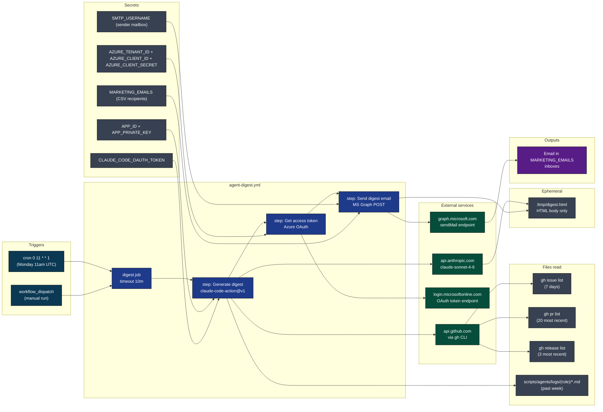

[Back to top](#navigate)

---

## 2. Triggers

Two ways the digest fires. One on the clock, one on demand.

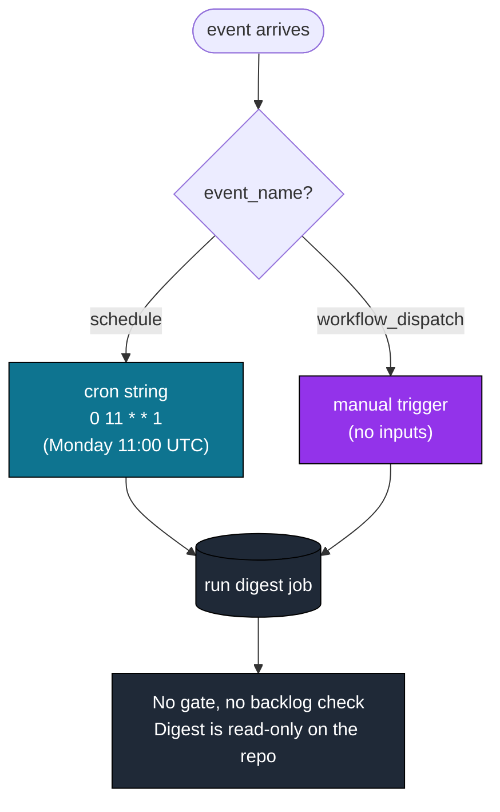

Why no gate: this workflow reads GitHub data and agent logs, writes a single ephemeral file, then sends an email. It produces zero PRs, zero issues, zero commits. There is nothing to back up.

[Back to top](#navigate)

---

## 3. The two-step DAG

One job, three sequential steps after token mint and checkout. Claude generates, bash sends.

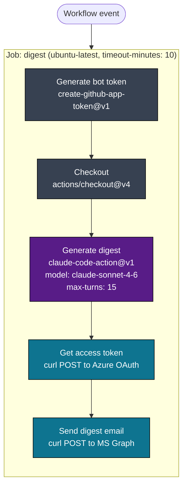

Step 3 writes `/tmp/digest.html`. Step 5 reads it. The handoff is a file on the runner, not an output variable.

No `if: always()` on later steps. If Claude fails to produce `/tmp/digest.html`, the email step still runs but curls a missing file and the API call fails. That is acceptable: no partial digest is better than a misleading one.

[Back to top](#navigate)

---

## 4. Step-by-step lifecycle

One run from event to delivered email. Three external services chained.

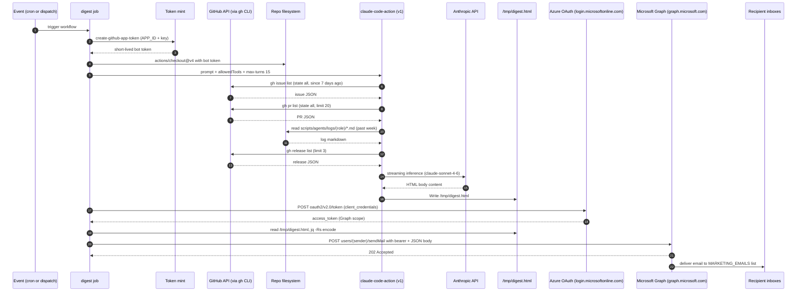

Source: [.github/workflows/agent-digest.yml](../workflows/agent-digest.yml) lines 19-102.

[Back to top](#navigate)

---

## 5. Data sources Claude reads

Four data wells. Each one answers a different question in the digest.

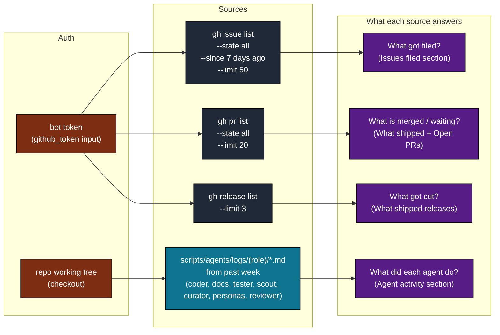

The log files are committed markdown, not artifacts. They survive past the 90-day artifact retention so the digest can read them indefinitely. See [WORKFLOW_ARCHITECTURE.md Appendix C item 3](WORKFLOW_ARCHITECTURE.md) for why logs are git-tracked.

[Back to top](#navigate)

---

## 6. The digest section structure

The prompt mandates five sections. Each maps to one or more data sources.

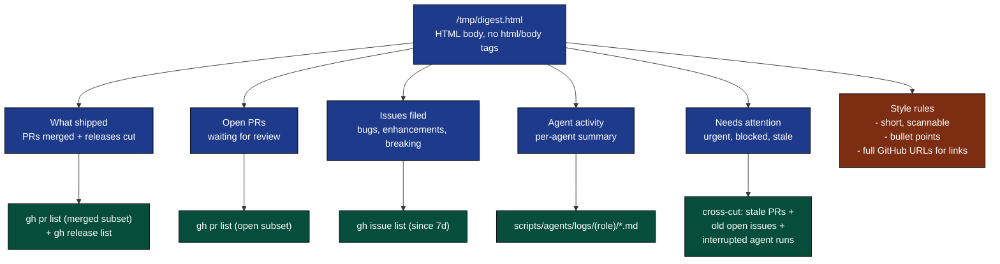

Why HTML body only (no html/body wrapper): Microsoft Graph wraps the content as a complete MIME message itself. Sending a full HTML document inside that would nest two documents and many mail clients render that incorrectly.

[Back to top](#navigate)

---

## 7. External calls

Three different external services, three different credentials, three different reasons.

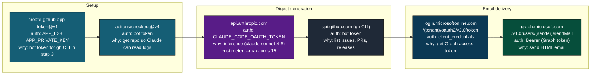

Tool allowlist passed to `claude-code-action@v1`:

```
--allowedTools "Bash,Read,Glob,Grep,Write"
--max-turns 15
--model claude-sonnet-4-6
```

Notice the differences from `agent-run.yml`:

| Property | agent-run | agent-digest |
|----------|-----------|--------------|
| Model | claude-opus-4-6 | claude-sonnet-4-6 |
| Max turns | 50 | 15 |
| Tools | Bash, Read, Write, Edit, Glob, Grep, WebFetch, WebSearch | Bash, Read, Glob, Grep, Write |
| Edit allowed? | yes | no |
| Web allowed? | yes | no |

Sonnet is cheaper, the work is summarization not invention, and 15 turns is plenty for read-fetch-write. No Edit because Claude writes one fresh file. No Web because all data is local or via gh CLI.

[Back to top](#navigate)

---

## 8. The Azure OAuth dance

Client credentials grant. No user, no consent prompt, no refresh token. Designed for headless service-to-service.

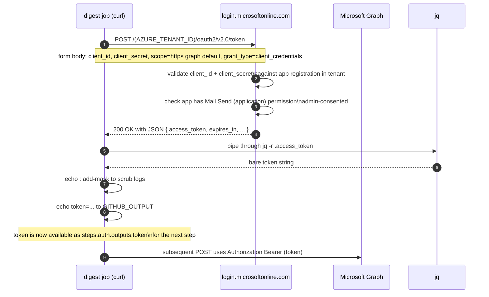

The `::add-mask::` workflow command tells Actions to scrub any future occurrence of the token from logs. Without it the next step's curl could echo the bearer header into the workflow log.

Scope `https://graph.microsoft.com/.default` means "all permissions the app registration was granted." Concretely that should be `Mail.Send` (application). Anything more is over-privileged.

[Back to top](#navigate)

---

## 9. The Microsoft Graph sendMail payload shape

How the HTML body and recipient list get marshalled into the Graph request.

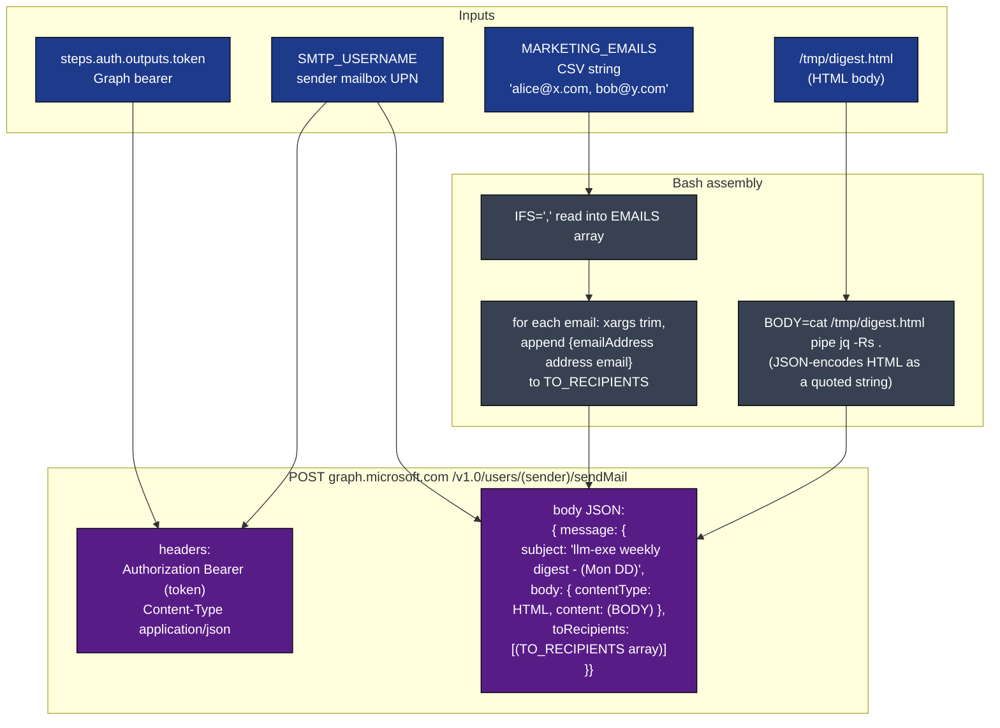

Why `jq -Rs .` on the body: `-R` reads raw input (no JSON parsing), `-s` slurps the whole file into one string, `.` echoes it. Net effect: the entire HTML file becomes a single JSON-quoted string with all quotes, backslashes, and newlines properly escaped. Without this, any double-quote in the HTML would break the outer JSON.

Why `xargs` to trim each email: bash splits the CSV on commas but leaves leading and trailing whitespace. `echo "$email" | xargs` strips it. Without this, `"  bob@y.com"` becomes a recipient with a literal leading space and Graph rejects it.

The `toRecipients` field is an array, not a string. Each element is an object: `{"emailAddress": {"address": "user@example.com"}}`. The bash loop builds the comma-joined inner content, then `[${TO_RECIPIENTS}]` wraps it as a JSON array.

[Back to top](#navigate)

---

## 10. Output cascade

What the digest produces and where it ends up.

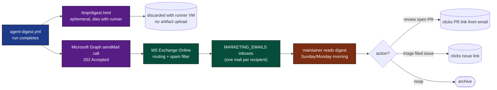

Unlike `agent-run.yml`, this workflow writes nothing to git. The only persistent artifact is the email itself, sitting in recipient mailboxes. There is no log of what the digest contained beyond what each recipient keeps.

If you want the digest history, archive the inbox. The workflow does not.

[Back to top](#navigate)

---

## 11. State machine

A single digest run as a finite state machine.

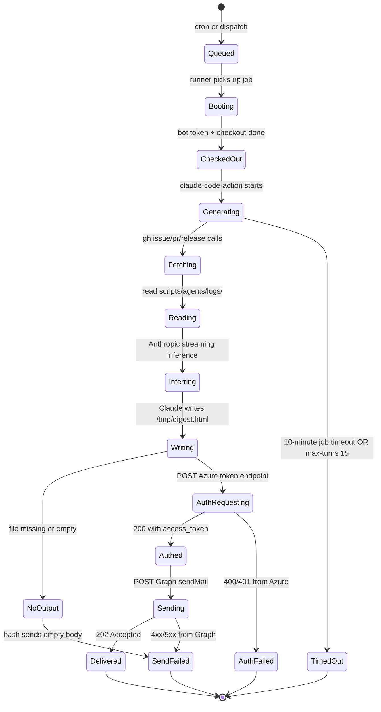

No `if: always()` clock-out step, no committed log. A failed run leaves no trace in the repo. Failures are visible only in the GitHub Actions run history.

[Back to top](#navigate)

---

## 12. Failure modes

Where the digest can break and what to do about each.

```mermaid
flowchart TB
    classDef fail fill:#7c2d12,color:#fff,stroke:#000
    classDef effect fill:#374151,color:#fff,stroke:#000
    classDef fix fill:#064e3b,color:#fff,stroke:#000

    F1["Bot token mint fails\nAPP_ID or APP_PRIVATE_KEY wrong"]:::fail
    F1 --> F1E["job fails at step 1\nno email sent"]:::effect
    F1E --> F1X["rotate App key, re-add secret"]:::fix

    F2["Claude action hits --max-turns 15"]:::fail
    F2 --> F2E["may write incomplete /tmp/digest.html\nor not write it at all"]:::effect
    F2E --> F2X["increase max-turns, or simplify prompt\nMS Graph step still runs and may send partial body"]:::fix

    F3["Job exceeds 10-minute timeout"]:::fail
    F3 --> F3E["runner kills the digest step\nlater steps may not run"]:::effect
    F3E --> F3X["dispatch manually after fix\nor wait for next Monday"]:::fix

    F4["Anthropic API outage"]:::fail
    F4 --> F4E["claude-code-action returns error\nno /tmp/digest.html written"]:::effect
    F4E --> F4X["Microsoft Graph step curls a missing file\nsendMail call fails, no email"]:::fix

    F5["Azure token call returns 401\n(bad client_secret or tenant)"]:::fail
    F5 --> F5E["jq parses null access_token\nbearer is the string 'null'\nGraph rejects with 401"]:::effect
    F5E --> F5X["rotate AZURE_CLIENT_SECRET\nverify AZURE_TENANT_ID"]:::fix

    F6["Graph sendMail returns 403\n(app missing Mail.Send permission)"]:::fail
    F6 --> F6E["email never delivered\nno user-visible error"]:::effect
    F6E --> F6X["grant Mail.Send application permission\nin Azure portal, admin-consent"]:::fix

    F7["SMTP_USERNAME mailbox does not exist"]:::fail
    F7 --> F7E["Graph returns 404 on the user path"]:::effect
    F7E --> F7X["set SMTP_USERNAME to a valid licensed mailbox UPN"]:::fix

    F8["MARKETING_EMAILS empty or malformed"]:::fail
    F8 --> F8E["toRecipients array is empty or contains junk\nGraph returns 400"]:::effect
    F8E --> F8X["set MARKETING_EMAILS to comma-separated valid addresses"]:::fix

    F9["Recipient inbox bounces"]:::fail
    F9 --> F9E["Graph still 202s the request\nbounce goes to SMTP_USERNAME"]:::effect
    F9E --> F9X["maintainer prunes bad address from MARKETING_EMAILS"]:::fix
```

The most insidious failure is F5: Azure returns a JSON error body and `jq -r .access_token` outputs the string `null`. The bearer header literally reads `Authorization: Bearer null` and Graph rejects with 401. Watch for this in run logs.

[Back to top](#navigate)

---

## 13. Quick reference card

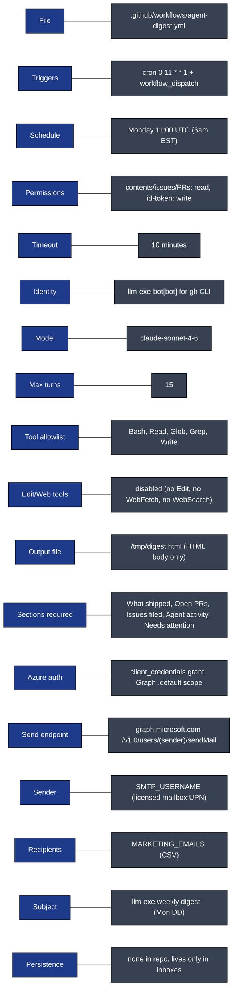

Direct links:

- Workflow file: [.github/workflows/agent-digest.yml](../workflows/agent-digest.yml)
- Companion deep dive: [AGENT_RUN_DEEP_DIVE.md](AGENT_RUN_DEEP_DIVE.md)
- Log directory (digest source): [scripts/agents/logs/](../../scripts/agents/logs/)
- Full architecture doc: [WORKFLOW_ARCHITECTURE.md](WORKFLOW_ARCHITECTURE.md)
- Microsoft Graph sendMail reference: https://learn.microsoft.com/en-us/graph/api/user-sendmail
- Azure client credentials flow: https://learn.microsoft.com/en-us/entra/identity-platform/v2-oauth2-client-creds-grant-flow

[Back to top](#navigate)
