# agent-review-pr: Visual Deep Dive

Concentrated diagrams for [.github/workflows/agent-review-pr.yml](../workflows/agent-review-pr.yml), the bot-PR review gate. Companion to [WORKFLOW_ARCHITECTURE.md](WORKFLOW_ARCHITECTURE.md).

Minimum prose. Maximum diagrams.

## Navigate

- [1. The whole picture](#1-the-whole-picture)
- [2. Triggers and the agent/* filter](#2-triggers-and-the-agent-filter)
- [3. The one-job DAG](#3-the-one-job-dag)
- [4. Step-by-step lifecycle](#4-step-by-step-lifecycle)
- [5. Anatomy of the review prompt](#5-anatomy-of-the-review-prompt)
- [6. Filesystem reads](#6-filesystem-reads)
- [7. External calls](#7-external-calls)
- [8. The verdict tree](#8-the-verdict-tree)
- [9. Output cascade](#9-output-cascade)
- [10. State machine](#10-state-machine)
- [11. Failure modes](#11-failure-modes)
- [12. Quick reference card](#12-quick-reference-card)

---

## 1. The whole picture

How [agent-review-pr.yml](../workflows/agent-review-pr.yml) sits between bot output and the maintainer.

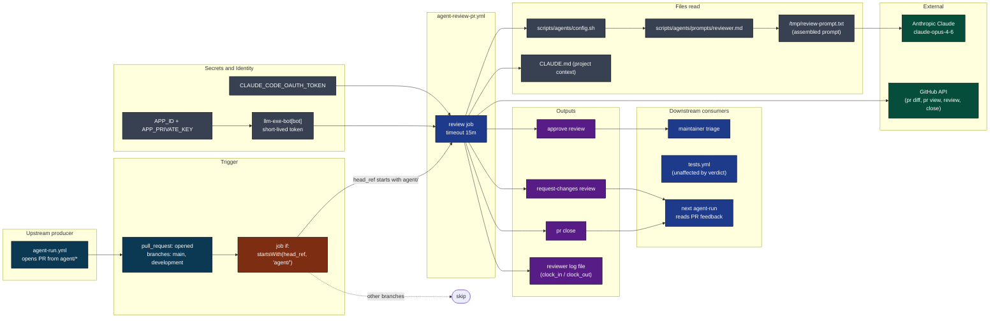

[Back to top](#navigate)

---

## 2. Triggers and the agent/* filter

One trigger. One job-level filter. Anything that fails the filter is invisible to billing.

```mermaid
flowchart TB
    classDef trig fill:#0e7490,color:#fff,stroke:#000
    classDef gate fill:#7c2d12,color:#fff,stroke:#000
    classDef out fill:#1f2937,color:#fff,stroke:#000

    start([pull_request event])
    start --> typ{action == 'opened'?}
    typ -->|no| nop1([no workflow run])
    typ -->|yes| brn{base branch in (main, development)?}
    brn -->|no| nop2([no workflow run])
    brn -->|yes| job[[workflow starts]]

    job --> filt{head_ref starts with 'agent/'?}
    filt -->|no| skipJob[(job evaluated to false\nshows as skipped\nno billable minutes)]:::gate
    filt -->|yes| run[(review job runs)]:::out
```

Source: [.github/workflows/agent-review-pr.yml](../workflows/agent-review-pr.yml) lines 3-6 (trigger) and 16 (job-level if).

Why the filter is on the job rather than the workflow: it lets human PRs into the same branches without ever spending a runner minute, while keeping a single workflow definition.

[Back to top](#navigate)

---

## 3. The one-job DAG

One job. Six steps. Linear.

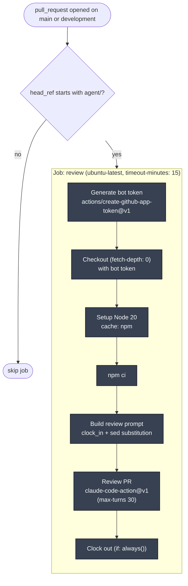

No concurrency group defined. Two PRs opened simultaneously fan out into two parallel review runs. The 15-minute timeout caps cost at roughly half an agent-run.

[Back to top](#navigate)

---

## 4. Step-by-step lifecycle

One review run from PR open to verdict.

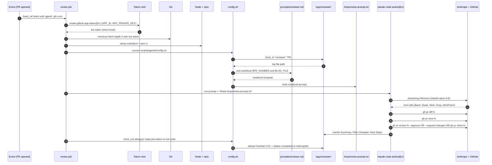

Source: [.github/workflows/agent-review-pr.yml](../workflows/agent-review-pr.yml) lines 14-71.

[Back to top](#navigate)

---

## 5. Anatomy of the review prompt

Two layers concatenated into `/tmp/review-prompt.txt`. Simpler than agent-run.yml because there is no prior context.

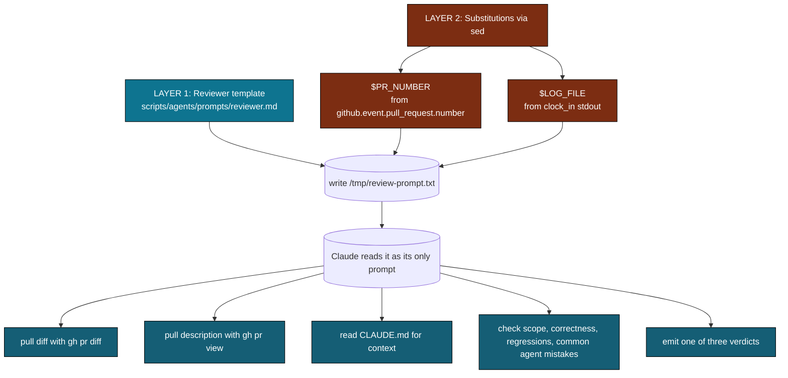

What the prompt explicitly tells the reviewer to check:

| Concern | Why it matters |
|---------|----------------|
| Scope drift | docs agent must not touch src/, tester must not fix bugs |
| Correctness | the change does what it claims |
| Regressions | broken patterns or sloppy mistakes |
| Test quality | tests test behavior, not implementation noise |
| Doc accuracy | docs match the current API |
| Padding | formatting-only churn dressed up as work |
| Placeholders | TODO comments left behind |

[Back to top](#navigate)

---

## 6. Filesystem reads

Reviewer's tool allowlist is read-only by design. Color: blue is read, purple is read plus write to log.

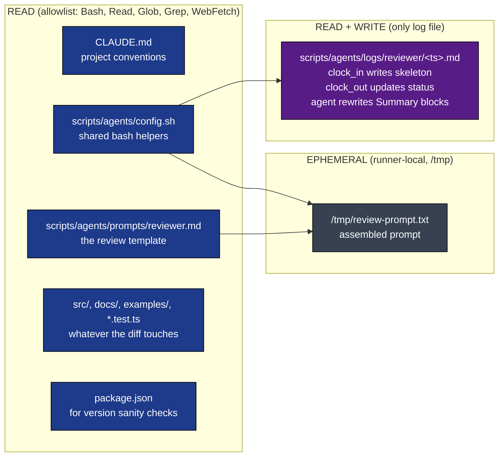

Notice what's missing: no `Write`, no `Edit` in the allowlist. The reviewer cannot modify source, tests, or docs. It can only emit GitHub side effects via the `gh` CLI through `Bash`, plus log file updates the action handles via its own GitHub identity.

Source: [.github/workflows/agent-review-pr.yml](../workflows/agent-review-pr.yml) line 62.

[Back to top](#navigate)

---

## 7. External calls

Who is contacted, with what credential, why.

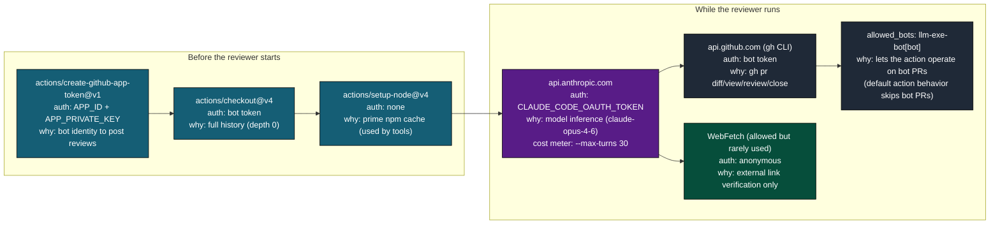

Tool allowlist passed to `claude-code-action@v1`:

```
--allowedTools "Bash,Read,Glob,Grep,WebFetch"
--max-turns 30
--model claude-opus-4-6
```

The `allowed_bots: "llm-exe-bot[bot]"` input is the load-bearing piece: by default the action refuses to run on PRs authored by bots. This explicit allowlist lets it review the very PRs `agent-run.yml` produces.

[Back to top](#navigate)

---

## 8. The verdict tree

Three outcomes. The prompt tells the model exactly which `gh` command to run for each.

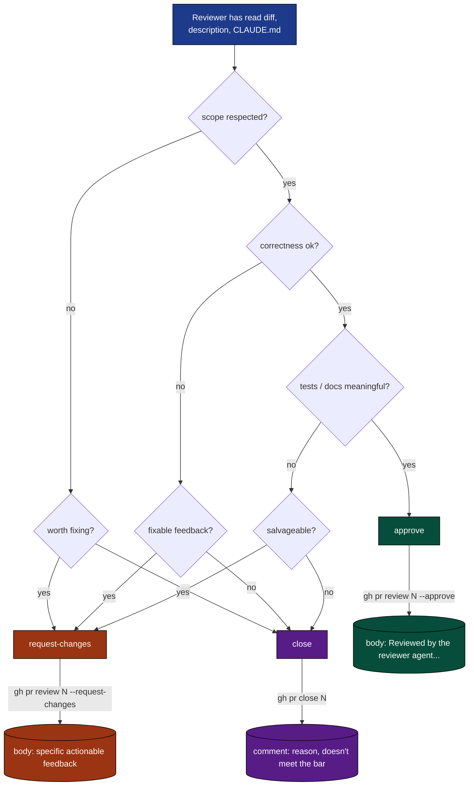

Source: [scripts/agents/prompts/reviewer.md](../../scripts/agents/prompts/reviewer.md) lines 30-43.

The prompt explicitly forbids vague "consider improving" feedback. Request-changes bodies must say exactly what to fix.

[Back to top](#navigate)

---

## 9. Output cascade

What each verdict triggers downstream.

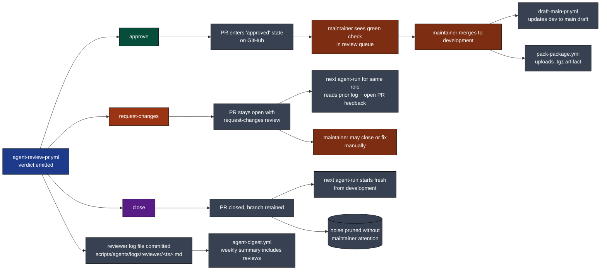

The close verdict is the asymmetric value of this workflow: it discards low-quality bot output before a human ever sees it, which is the entire point of having an automated reviewer.

[Back to top](#navigate)

---

## 10. State machine

A single review run as a finite state machine.

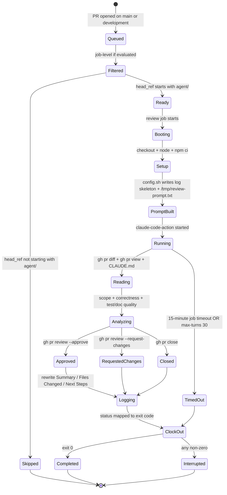

`if: always()` on the clock-out step means even `TimedOut` and `Interrupted` paths stamp a finish time. The reviewer log file is never left in `running` state.

[Back to top](#navigate)

---

## 11. Failure modes

Where things break, what happens, what to do.

```mermaid
flowchart TB
    classDef fail fill:#7c2d12,color:#fff,stroke:#000
    classDef effect fill:#374151,color:#fff,stroke:#000
    classDef fix fill:#064e3b,color:#fff,stroke:#000

    F1["Human opens PR from agent/* branch"]:::fail
    F1 --> F1E["filter still matches, reviewer runs\non a human PR"]:::effect
    F1E --> F1X["rename branch off agent/* prefix\nor accept the review as bonus signal"]:::fix

    F2["Bot token mint fails\nAPP_ID or APP_PRIVATE_KEY wrong"]:::fail
    F2 --> F2E["job fails at token step\nno log file written"]:::effect
    F2X["rotate App key, re-add secret"]:::fix
    F2E --> F2X

    F3["npm ci fails"]:::fail
    F3 --> F3E["job fails before reviewer starts"]:::effect
    F3X["check package-lock alignment"]:::fix
    F3E --> F3X

    F4["Claude hits --max-turns 30"]:::fail
    F4 --> F4E["reviewer returns whatever it has\nmay leave PR without a verdict"]:::effect
    F4X["maintainer reviews manually\nor re-runs the workflow"]:::fix
    F4E --> F4X

    F5["Job exceeds 15-minute timeout"]:::fail
    F5 --> F5E["runner kills the step\nclock_out still runs (if: always())\nstatus=interrupted in log"]:::effect
    F5X["re-run workflow on PR\nor maintainer reviews manually"]:::fix
    F5E --> F5X

    F6["Reviewer is wrong (false approve)"]:::fail
    F6 --> F6E["bad PR gets green check\nstill blocked by branch protection"]:::effect
    F6X["maintainer is final gate\nbranch protections require human merge"]:::fix
    F6E --> F6X

    F7["Reviewer is wrong (false close)"]:::fail
    F7 --> F7E["good PR gets closed\nbranch still on origin"]:::effect
    F7X["maintainer reopens manually\nor next agent-run resumes from log"]:::fix
    F7E --> F7X

    F8["allowed_bots input missing"]:::fail
    F8 --> F8E["claude-code-action refuses to act\non bot-authored PR"]:::effect
    F8X["keep allowed_bots: llm-exe-bot[bot]\nin yaml line 58"]:::fix
    F8E --> F8X

    F9["Anthropic API outage"]:::fail
    F9 --> F9E["claude-code-action returns error\nclock_out marks interrupted"]:::effect
    F9X["re-run workflow when API recovers"]:::fix
    F9E --> F9X
```

Critical asymmetry: a wrong approval is cheap because branch protection still requires human merge. A wrong close is more annoying but the branch persists on origin, so nothing is lost.

[Back to top](#navigate)

---

## 12. Quick reference card

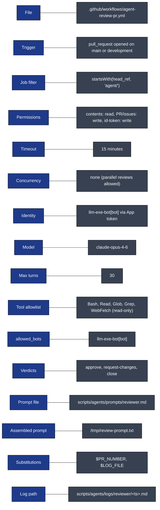

Direct links:

- Workflow file: [.github/workflows/agent-review-pr.yml](../workflows/agent-review-pr.yml)
- Upstream producer: [agent-run.yml](../workflows/agent-run.yml) and [coder-run.yml](../workflows/coder-run.yml)
- Reviewer prompt: [scripts/agents/prompts/reviewer.md](../../scripts/agents/prompts/reviewer.md)
- Shared helpers: [scripts/agents/config.sh](../../scripts/agents/config.sh)
- Companion deep dive: [AGENT_RUN_DEEP_DIVE.md](AGENT_RUN_DEEP_DIVE.md)
- Full architecture doc: [WORKFLOW_ARCHITECTURE.md](WORKFLOW_ARCHITECTURE.md)

[Back to top](#navigate)
