# Agent Run: Visual Deep Dive

Concentrated diagrams for [.github/workflows/agent-run.yml](../workflows/agent-run.yml) and the sibling workflows it depends on. Companion to [WORKFLOW_ARCHITECTURE.md](WORKFLOW_ARCHITECTURE.md).

Minimum prose. Maximum diagrams.

## Navigate

- [1. The whole picture](#1-the-whole-picture)
- [2. Triggers and what each one does](#2-triggers-and-what-each-one-does)
- [3. Inputs and how they shape the run](#3-inputs-and-how-they-shape-the-run)
- [4. The two-job DAG](#4-the-two-job-dag)
- [5. Step-by-step lifecycle](#5-step-by-step-lifecycle)
- [6. Anatomy of the prompt](#6-anatomy-of-the-prompt)
- [7. Filesystem reads and writes](#7-filesystem-reads-and-writes)
- [8. External calls](#8-external-calls)
- [9. Per-agent path differences](#9-per-agent-path-differences)
- [10. Output cascade](#10-output-cascade)
- [11. The state machine](#11-the-state-machine)
- [12. Failure modes](#12-failure-modes)
- [13. Quick reference card](#13-quick-reference-card)

---

## 1. The whole picture

How [agent-run.yml](../workflows/agent-run.yml) plugs into everything.

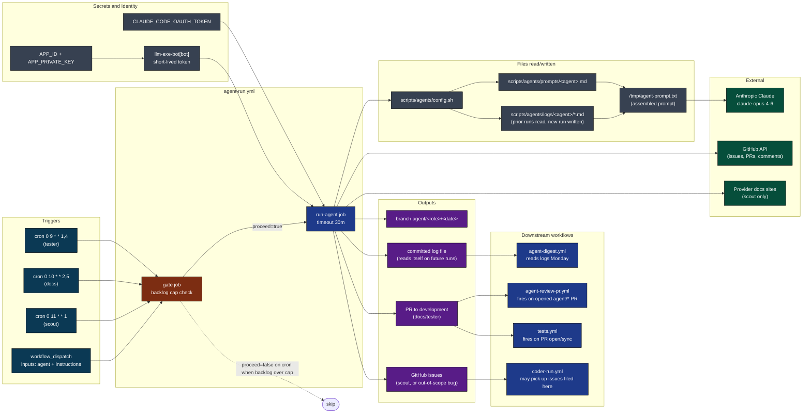

[Back to top](#navigate)

---

## 2. Triggers and what each one does

Four entry points. Each routes to a different agent and behavior.

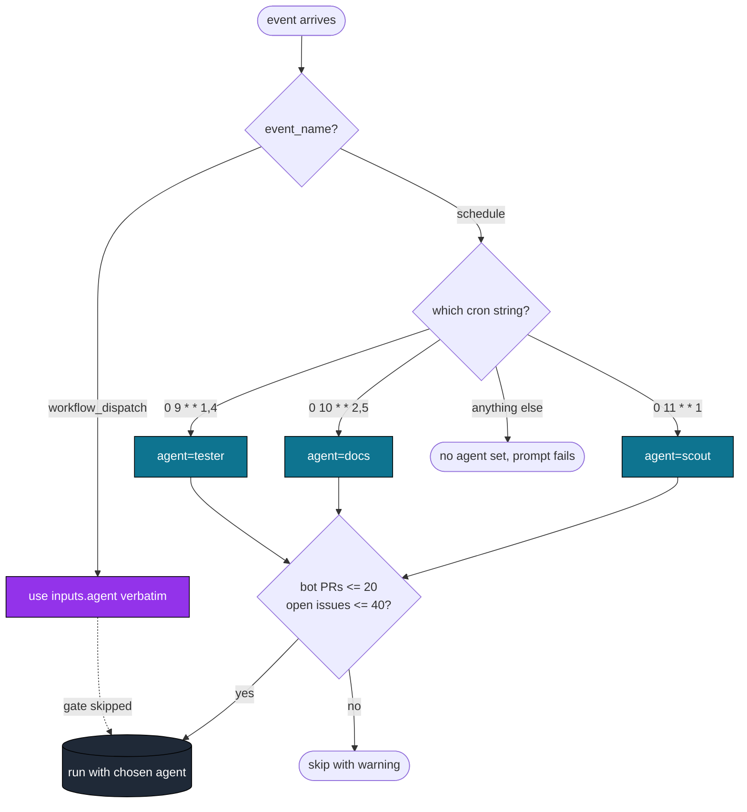

Source: [.github/workflows/agent-run.yml](../workflows/agent-run.yml) lines 19-23 (cron map), 102-110 (cron-to-agent dispatch), 46-66 (gate).

[Back to top](#navigate)

---

## 3. Inputs and how they shape the run

Two dispatch inputs. Two derived inputs. Each one changes one specific thing.

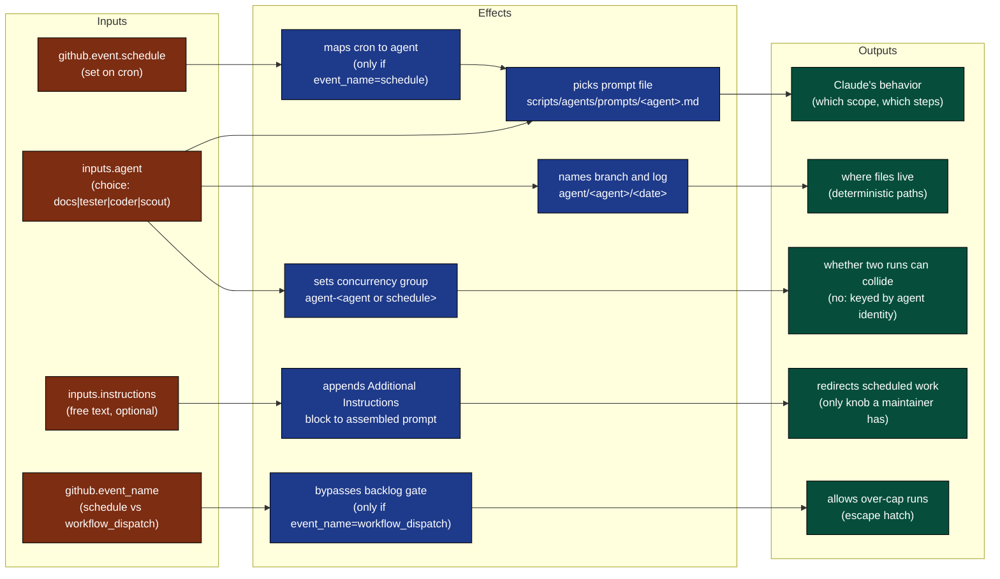

[Back to top](#navigate)

---

## 4. The two-job DAG

Job graph with timeouts and gating.

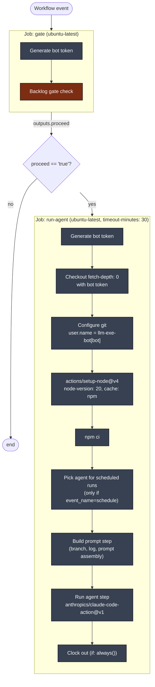

Concurrency group is `agent-${{ github.event.inputs.agent || github.event.schedule }}` with `cancel-in-progress: false`. Two runs of the same agent queue; two different agents run in parallel.

[Back to top](#navigate)

---

## 5. Step-by-step lifecycle

One run from event to clock-out, with every file touched.

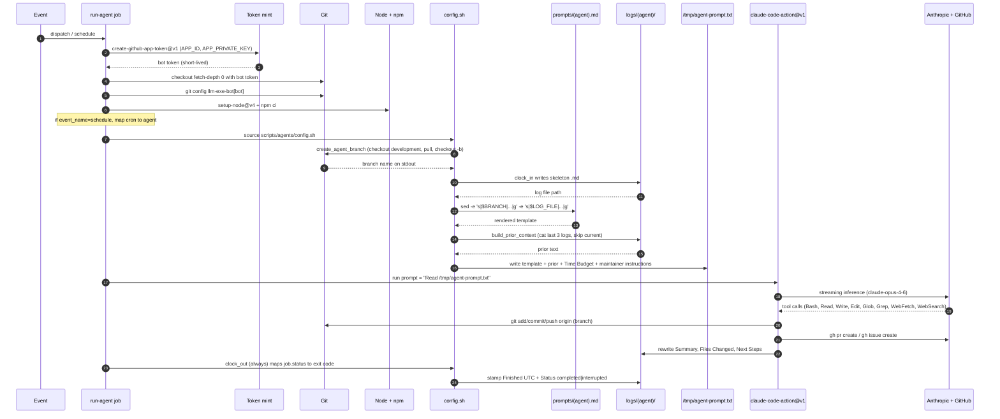

Source: [.github/workflows/agent-run.yml](../workflows/agent-run.yml) lines 74-171.

[Back to top](#navigate)

---

## 6. Anatomy of the prompt

Four layers concatenated into `/tmp/agent-prompt.txt`. This is what Claude actually reads.

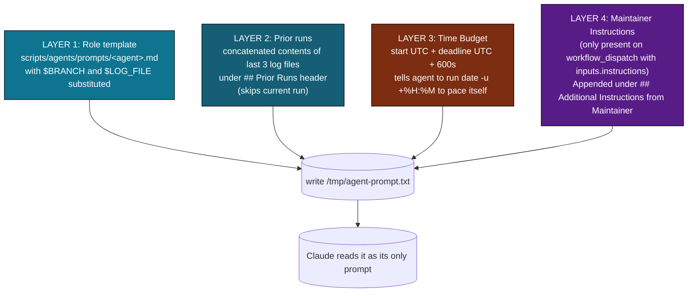

Each layer answers one question:

| Layer | Question it answers |
|-------|---------------------|
| 1. Role template | "Who am I, what's in scope, what are the steps?" |
| 2. Prior runs | "What did I do last time, what's still pending?" |
| 3. Time Budget | "How long do I have?" |
| 4. Maintainer notes | "Anything special this run?" |

[Back to top](#navigate)

---

## 7. Filesystem reads and writes

Color: blue is read, orange is write, purple is both. Why each one exists.

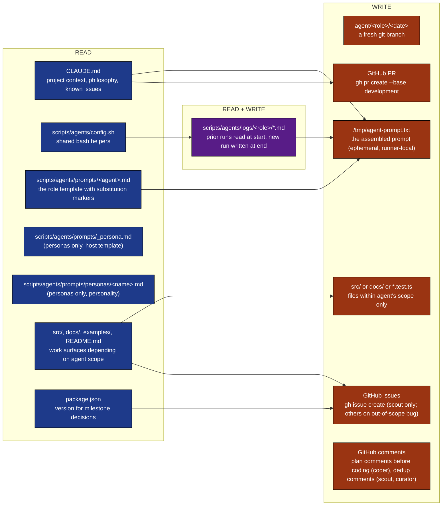

Why logs are committed: see [WORKFLOW_ARCHITECTURE.md Appendix C item 3](WORKFLOW_ARCHITECTURE.md). They are the only durable cross-run memory.

[Back to top](#navigate)

---

## 8. External calls

Who is contacted, with what credential, why.

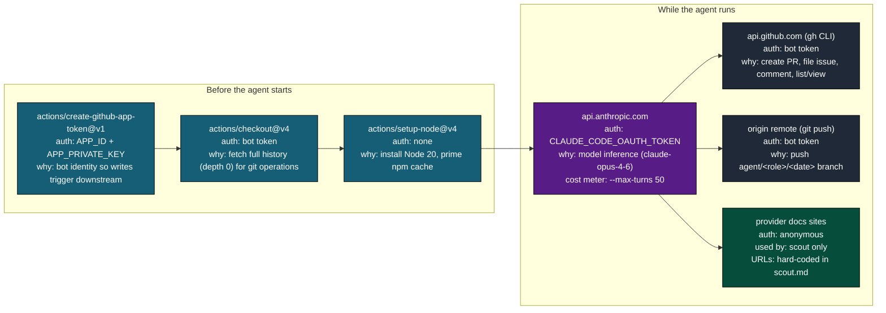

Tool allowlist passed to `claude-code-action@v1`:

```
--allowedTools "Bash,Read,Write,Edit,Glob,Grep,WebFetch,WebSearch"
--max-turns 50
--model claude-opus-4-6
```

The action enforces the allowlist. Anything not listed cannot be called.

[Back to top](#navigate)

---

## 9. Per-agent path differences

One workflow, four agents, four paths.

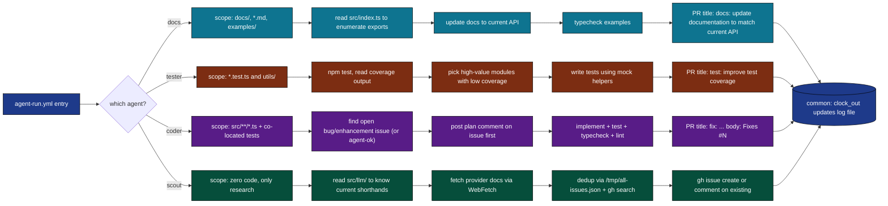

Why coder is scheduled separately in [coder-run.yml](../workflows/coder-run.yml) instead of here: the coder needs a matrix over multiple issues; this workflow is single-job. See [WORKFLOW_ARCHITECTURE.md section 9.2](WORKFLOW_ARCHITECTURE.md).

[Back to top](#navigate)

---

## 10. Output cascade

What this workflow produces and who eats it.

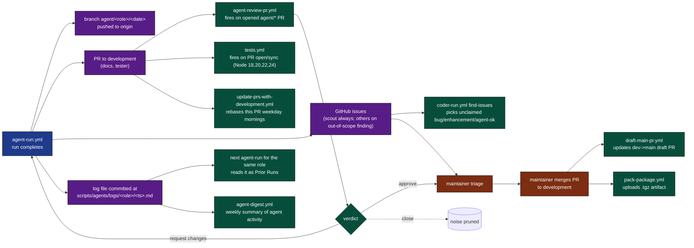

Why `agent-review-pr.yml` only fires for branches starting with `agent/`: see job-level `if: startsWith(github.head_ref, 'agent/')` in [agent-review-pr.yml](../workflows/agent-review-pr.yml) line 16.

Why the digest can read logs that came from this workflow: logs are committed to git, not stored as artifacts. They survive past the 90-day artifact retention.

[Back to top](#navigate)

---

## 11. The state machine

A single run as a finite state machine.

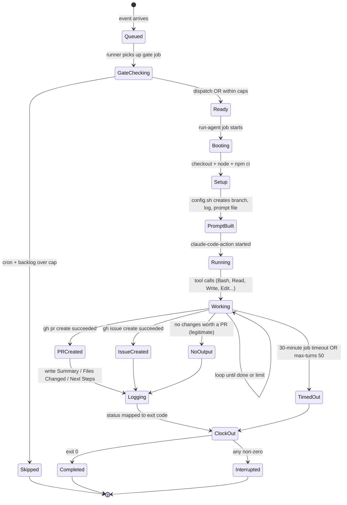

`if: always()` on the clock-out step means even `TimedOut` and `Interrupted` paths stamp a finish time and update status. The log file is never left in `running` state.

[Back to top](#navigate)

---

## 12. Failure modes

Where things break, what happens, what to do.

```mermaid
flowchart TB
    classDef fail fill:#7c2d12,color:#fff,stroke:#000
    classDef effect fill:#374151,color:#fff,stroke:#000
    classDef fix fill:#064e3b,color:#fff,stroke:#000

    F1["Backlog over cap\n(cron path only)"]:::fail
    F1 --> F1E["gate sets proceed=false\nrun-agent skipped"]:::effect
    F1E --> F1X["maintainer drains queue\nor uses dispatch to bypass"]:::fix

    F2["Bot token mint fails\nAPP_ID or APP_PRIVATE_KEY wrong"]:::fail
    F2 --> F2E["job fails at token step\nno log file written"]:::effect
    F2X["rotate App key, re-add secret"]:::fix
    F2E --> F2X

    F3["npm ci fails"]:::fail
    F3 --> F3E["job fails before agent starts"]:::effect
    F3X["check package-lock alignment"]:::fix
    F3E --> F3X

    F4["Claude action hits --max-turns 50"]:::fail
    F4 --> F4E["agent returns whatever it has\nmay be partial PR"]:::effect
    F4X["reviewer agent will request changes\nor maintainer closes; next run retries"]:::fix
    F4E --> F4X

    F5["Job exceeds 30-minute timeout"]:::fail
    F5 --> F5E["runner kills the step\nclock_out still runs (if: always())\nstatus=interrupted in log"]:::effect
    F5X["next run reads interrupted log under Prior Runs\nresumes work"]:::fix
    F5E --> F5X

    F6["Agent goes out of scope\n(e.g. docs touches src/)"]:::fail
    F6 --> F6E["PR opens but fails review\nagent-review-pr.yml --request-changes or close"]:::effect
    F6X["prompt enforces scope at top\nreviewer enforces at bottom"]:::fix
    F6E --> F6X

    F7["No issues to fix\n(coder)"]:::fail
    F7 --> F7E["find-issues job emits count=0\nrun-coder matrix skipped"]:::effect
    F7X["expected behavior, not a failure"]:::fix
    F7E --> F7X

    F8["Anthropic API outage"]:::fail
    F8 --> F8E["claude-code-action returns error\nclock_out marks interrupted"]:::effect
    F8X["wait, manual dispatch later\nor next cron picks up"]:::fix
    F8E --> F8X

    F9["Two cron runs of same agent overlap"]:::fail
    F9 --> F9E["concurrency group agent-&lt;name&gt; queues second\ncancel-in-progress: false"]:::effect
    F9X["intentional: serialize same agent"]:::fix
    F9E --> F9X
```

[Back to top](#navigate)

---

## 13. Quick reference card

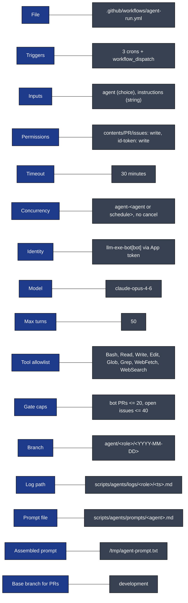

Direct links:

- Workflow file: [.github/workflows/agent-run.yml](../workflows/agent-run.yml)
- Companion workflows: [coder-run.yml](../workflows/coder-run.yml), [personas-run.yml](../workflows/personas-run.yml), [agent-review-pr.yml](../workflows/agent-review-pr.yml)
- Shared helpers: [scripts/agents/config.sh](../../scripts/agents/config.sh)
- Prompts: [docs.md](../../scripts/agents/prompts/docs.md), [tester.md](../../scripts/agents/prompts/tester.md), [coder.md](../../scripts/agents/prompts/coder.md), [scout.md](../../scripts/agents/prompts/scout.md)
- Local runner: [scripts/maintain.sh](../../scripts/maintain.sh)
- Full architecture doc: [WORKFLOW_ARCHITECTURE.md](WORKFLOW_ARCHITECTURE.md)

[Back to top](#navigate)
