# auto-merge-main-pr: Visual Deep Dive

Concentrated diagrams for [.github/workflows/auto-merge-main-pr.yml](../workflows/auto-merge-main-pr.yml) and the sibling workflows it depends on. Companion to [WORKFLOW_ARCHITECTURE.md](WORKFLOW_ARCHITECTURE.md).

Minimum prose. Maximum diagrams.

## Navigate

- [1. The whole picture](#1-the-whole-picture)
- [2. Triggers and what each one does](#2-triggers-and-what-each-one-does)
- [3. Run condition decision tree](#3-run-condition-decision-tree)
- [4. The one-job DAG](#4-the-one-job-dag)
- [5. Step-by-step lifecycle](#5-step-by-step-lifecycle)
- [6. The check-polling loop](#6-the-check-polling-loop)
- [7. The check evaluation](#7-the-check-evaluation)
- [8. External calls](#8-external-calls)
- [9. Output cascade](#9-output-cascade)
- [10. Why --admin](#10-why---admin)
- [11. The state machine](#11-the-state-machine)
- [12. Failure modes](#12-failure-modes)
- [13. Quick reference card](#13-quick-reference-card)

---

## 1. The whole picture

How [auto-merge-main-pr.yml](../workflows/auto-merge-main-pr.yml) plugs into the release rails.

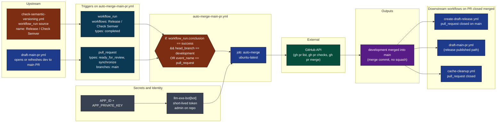

Source: [.github/workflows/auto-merge-main-pr.yml](../workflows/auto-merge-main-pr.yml) lines 3 to 30.

[Back to top](#navigate)

---

## 2. Triggers and what each one does

Two entry points, two routing paths, both converge on the same job.

```mermaid
flowchart TB
    classDef wr fill:#0e7490,color:#fff,stroke:#000
    classDef pr fill:#9333ea,color:#fff,stroke:#000
    classDef gate fill:#7c2d12,color:#fff,stroke:#000
    classDef out fill:#1f2937,color:#fff,stroke:#000

    start([event arrives])
    start --> ev{event_name?}

    ev -->|workflow_run| wrPath["fired by completion of\nRelease / Check Semver"]:::wr
    ev -->|pull_request| prPath["ready_for_review OR synchronize\non branches: main"]:::pr

    wrPath --> wrChk{conclusion == success\nAND head_branch == development?}:::gate
    wrChk -->|yes| go[(run job: auto-merge)]:::out
    wrChk -->|no| skip([job skipped silently])

    prPath --> prChk{event_name == pull_request?\n(always true on this path)}:::gate
    prChk -->|yes| go
```

Why two triggers exist:

| Trigger | What it catches |
|---------|-----------------|
| `workflow_run` on Release / Check Semver | The semver gate just passed on a `development` to `main` PR. Time to merge. |
| `pull_request` ready_for_review on `main` | A draft dev to main PR flipped to ready. Or new commits arrived on `development`. Re-evaluate. |

The `workflow_run` trigger needs the secondary `head_branch == 'development'` guard because the semver workflow itself fires on any PR targeting `main`, but auto-merge should only fire for the dev to main PR.

[Back to top](#navigate)

---

## 3. Run condition decision tree

The job-level `if` expression on line 30 is the single gate. Both event types pass through it.

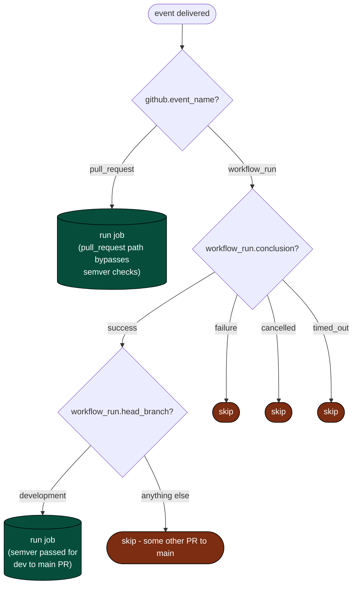

Raw expression for reference:

```
github.event.workflow_run.conclusion == 'success'
  && github.event.workflow_run.head_branch == 'development'
  || github.event_name == 'pull_request'
```

Operator precedence: `&&` binds tighter than `||`, so this reads as `(A && B) || C`. A `pull_request` event always satisfies `C` and runs the job regardless of any workflow_run context.

[Back to top](#navigate)

---

## 4. The one-job DAG

Single job, six steps, sequential.

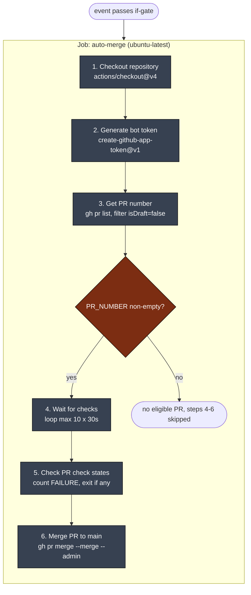

Concurrency group is `${{ github.workflow }}-${{ github.ref }}` with `cancel-in-progress: true`. A new `synchronize` event on the same ref cancels the in-flight run.

Permissions granted at workflow scope:

| Permission | Why |
|------------|-----|
| `id-token: write` | OIDC for the bot token mint |
| `checks: write` | Write status back if needed |
| `contents: write` | Merge the PR (writes to `main`) |
| `pull-requests: write` | `gh pr merge` API |
| `actions: write` | Cancel sibling runs via concurrency |

[Back to top](#navigate)

---

## 5. Step-by-step lifecycle

One run from event to merge, sequence view.

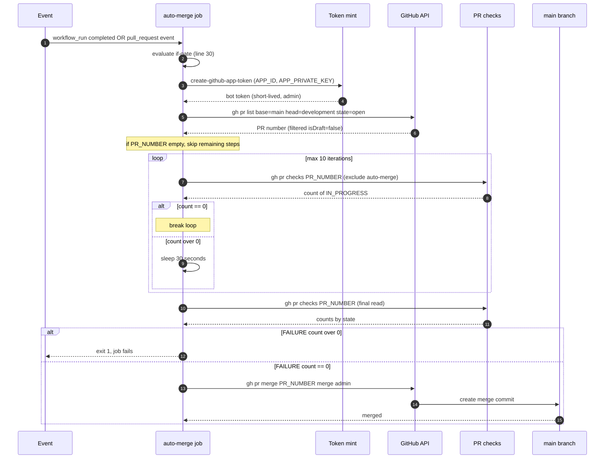

Source: [.github/workflows/auto-merge-main-pr.yml](../workflows/auto-merge-main-pr.yml) lines 32 to 100.

[Back to top](#navigate)

---

## 6. The check-polling loop

Five-minute ceiling on waiting for sibling checks.

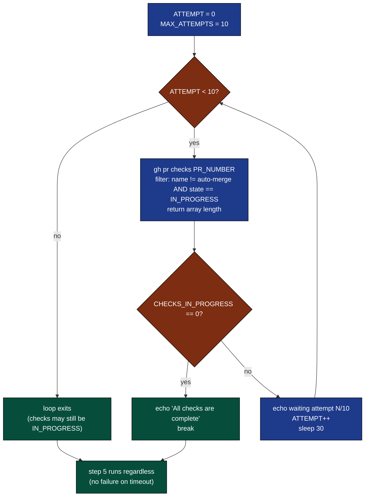

Time math:

| Attempts | Wall clock |
|----------|------------|
| 1 success (no sleep) | ~5s (one API call) |
| 10 attempts, all over zero | 10 polls + 10 sleeps of 30s = 5 minutes |
| Worst case | ~5 minutes 5 seconds then step 5 fires |

Critical: the filter `name != "auto-merge"` is what prevents infinite loop. Without it, the workflow polls its own in-progress run forever (until the 6-hour GitHub Actions ceiling).

The loop does NOT fail if it times out. It just exits and lets step 5 evaluate whatever state the checks are in. Step 5 will likely see no FAILURE (long-running checks are still IN_PROGRESS, not FAILURE), so the merge proceeds. This is a known soft spot, see Failure modes.

[Back to top](#navigate)

---

## 7. The check evaluation

After the polling loop, evaluate the final state. Three counts, one gate.

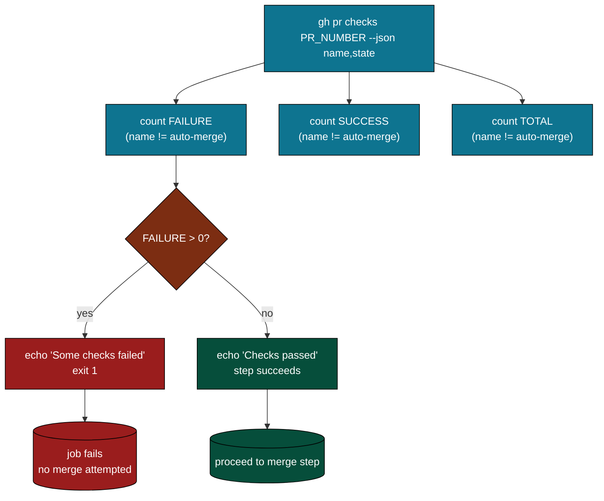

What this catches and what it misses:

| State | Counted as FAILURE? | Blocks merge? |
|-------|--------------------|----|
| `SUCCESS` | no | no |
| `FAILURE` | yes | yes, exit 1 |
| `IN_PROGRESS` (timed out from loop) | no | no, merge proceeds |
| `CANCELLED` | no | no |
| `SKIPPED` | no | no |
| `PENDING` | no | no |
| `NEUTRAL` | no | no |

The check is strictly negative: "are any checks definitively failing?" not "did everything pass?". A required check that never reported still lets the merge through. Branch protection on `main` is the second line of defense, but the bot bypasses it via `--admin` (see section 10).

[Back to top](#navigate)

---

## 8. External calls

Every network call this workflow makes, with credential and purpose.

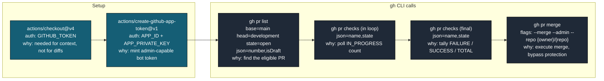

All `gh` calls use the bot token via `GH_TOKEN` and `GITHUB_TOKEN` env vars. The bot is granted admin via the GitHub App installation, which is what makes `--admin` viable.

[Back to top](#navigate)

---

## 9. Output cascade

What merging produces, and who eats it.

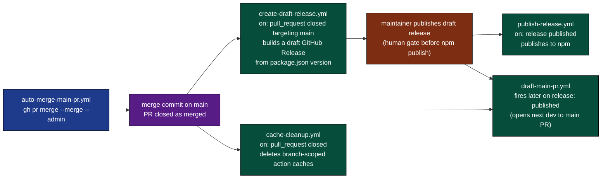

Why the merge cascade is split across multiple workflows: each downstream listens on a different event (`pull_request closed`, `release published`), and decoupling lets a maintainer interrupt the chain at the release step. The human still ships, the bot just gets the bits there.

[Back to top](#navigate)

---

## 10. Why --admin

Branch protection on `main` requires reviews and passing checks. The bot bypasses both. Here is why that is acceptable.

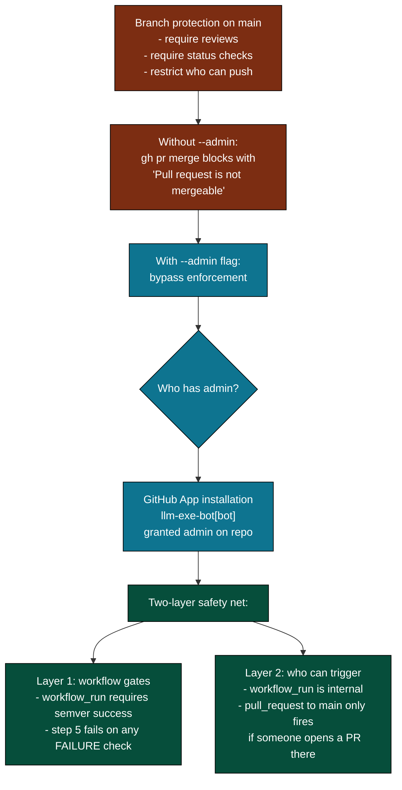

The risk shape:

- Risk of bypassing reviews: low. A human still opens the dev to main PR (or the bot opens a draft for human review). The auto-merge only happens after explicit `ready_for_review`.
- Risk of bypassing checks: medium. Step 5 only catches `FAILURE`, not stuck `IN_PROGRESS` checks. See Failure modes.

[Back to top](#navigate)

---

## 11. The state machine

A single run as a finite state machine.

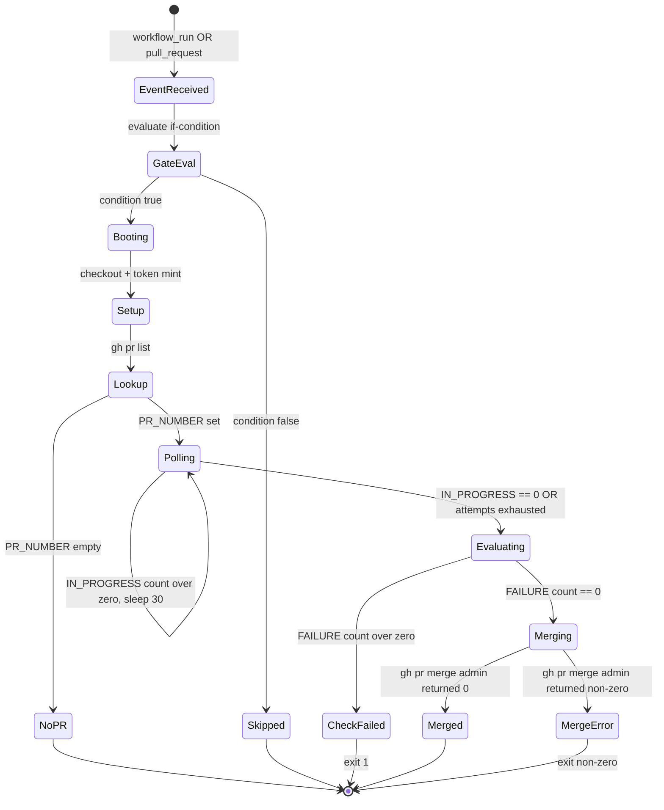

Note that `Polling` to `Evaluating` happens either way (success or attempt exhaustion). The polling step does not fail on timeout, it just yields control. `Evaluating` is the single gate.

[Back to top](#navigate)

---

## 12. Failure modes

Where things break, what happens, what to do.

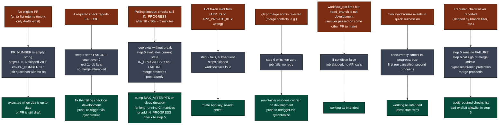

[Back to top](#navigate)

---

## 13. Quick reference card

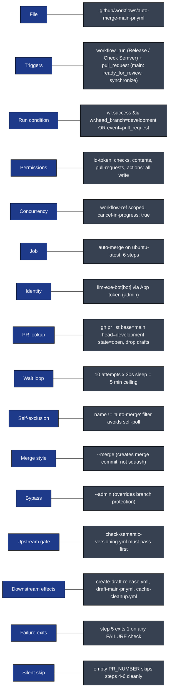

Direct links:

- Workflow file: [.github/workflows/auto-merge-main-pr.yml](../workflows/auto-merge-main-pr.yml)
- Upstream gate: [check-semantic-versioning.yml](../workflows/check-semantic-versioning.yml)
- PR opener: [draft-main-pr.yml](../workflows/draft-main-pr.yml)
- Downstream consumers: [create-draft-release.yml](../workflows/create-draft-release.yml), [cache-cleanup.yml](../workflows/cache-cleanup.yml), [publish-release.yml](../workflows/publish-release.yml)
- Full architecture doc: [WORKFLOW_ARCHITECTURE.md](WORKFLOW_ARCHITECTURE.md)

[Back to top](#navigate)
