# bot-respond: Visual Deep Dive

Concentrated diagrams for [.github/workflows/bot-respond.yml](../workflows/bot-respond.yml). Companion to [WORKFLOW_ARCHITECTURE.md](WORKFLOW_ARCHITECTURE.md) and [AGENT_RUN_DEEP_DIVE.md](AGENT_RUN_DEEP_DIVE.md).

This is the interactive surface. A maintainer types `@llm-exe-bot` in a comment, this workflow wakes up, and the bot either answers in line or pushes a commit to the existing PR branch. No new branches. No new PRs.

Minimum prose. Maximum diagrams.

## Navigate

- [1. The whole picture](#1-the-whole-picture)
- [2. Triggers and the three-part filter](#2-triggers-and-the-three-part-filter)
- [3. The one-job DAG](#3-the-one-job-dag)
- [4. Step-by-step lifecycle](#4-step-by-step-lifecycle)
- [5. The three modes](#5-the-three-modes)
- [6. Anatomy of the inline prompt](#6-anatomy-of-the-inline-prompt)
- [7. Filesystem reads and writes](#7-filesystem-reads-and-writes)
- [8. External calls](#8-external-calls)
- [9. Rules and guardrails](#9-rules-and-guardrails)
- [10. Output cascade](#10-output-cascade)
- [11. State machine](#11-state-machine)
- [12. Failure modes](#12-failure-modes)
- [13. Quick reference card](#13-quick-reference-card)

---

## 1. The whole picture

How [bot-respond.yml](../workflows/bot-respond.yml) plugs into the comment surface.

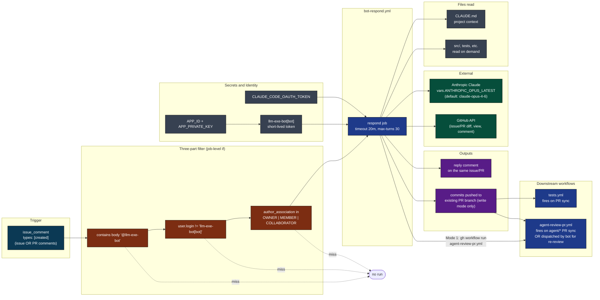

[Back to top](#navigate)

---

## 2. Triggers and the three-part filter

One trigger. One AND-gate of three predicates. All three must hold or the job is skipped before any step runs.

```mermaid
flowchart TB
    classDef ev fill:#0e7490,color:#fff,stroke:#000
    classDef chk fill:#7c2d12,color:#fff,stroke:#000
    classDef pass fill:#064e3b,color:#fff,stroke:#000
    classDef drop fill:#1f2937,color:#fff,stroke:#000

    start([issue_comment created])
    start --> ev[event.comment present]:::ev
    ev --> q1{body contains\n'@llm-exe-bot' ?}:::chk
    q1 -->|no| d1([drop: not addressed]):::drop
    q1 -->|yes| q2{user.login !=\n'llm-exe-bot[bot]' ?}:::chk
    q2 -->|no| d2([drop: bot's own comment\nprevents self-loop]):::drop
    q2 -->|yes| q3{author_association in\nOWNER, MEMBER, COLLABORATOR ?}:::chk
    q3 -->|no| d3([drop: untrusted commenter\nblocks trolls and randoms]):::drop
    q3 -->|yes| run([respond job runs]):::pass
```

Source: [.github/workflows/bot-respond.yml](../workflows/bot-respond.yml) lines 14-22.

Why three predicates instead of one:

| Predicate | Defends against |
|-----------|-----------------|
| body contains `@llm-exe-bot` | Random chatter waking the bot |
| user.login != bot itself | Infinite self-reply loops (the bot's own posts trigger the same event) |
| author_association allowlist | Untrusted strangers summoning a write-capable agent |

[Back to top](#navigate)

---

## 3. The one-job DAG

Single linear job. No gate job, no matrix, no fan-out. The three-part filter does all the gating.

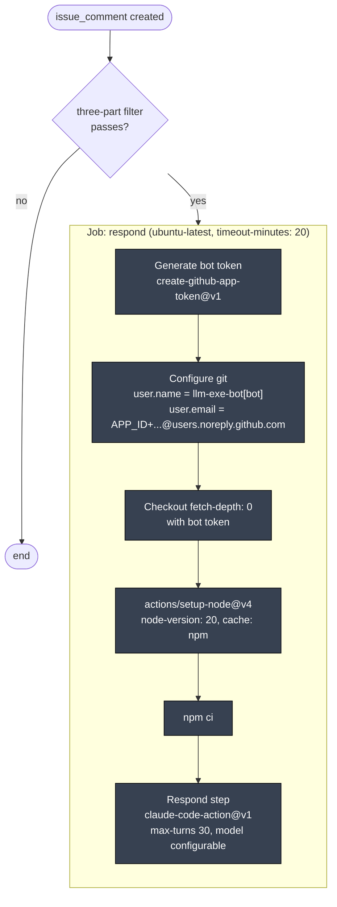

No concurrency group declared. Two simultaneous `@llm-exe-bot` mentions in different threads run in parallel. Two in the same thread also run in parallel; the bot relies on each comment carrying its own context.

[Back to top](#navigate)

---

## 4. Step-by-step lifecycle

One mention from event to reply. Both modes share the boot; they diverge inside the action.

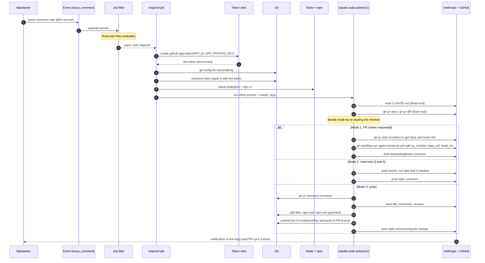

Source: [.github/workflows/bot-respond.yml](../workflows/bot-respond.yml) lines 26-114.

[Back to top](#navigate)

---

## 5. The three modes

The bot decides between three modes based on the verbatim wording of the mention. Ambiguous wording forces a clarification reply.

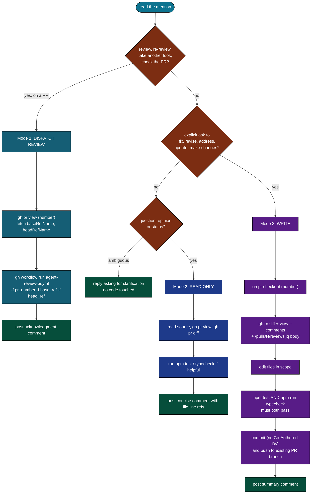

Key invariants: write mode never creates a new branch or a new PR. The bot always pushes to the existing PR branch. If there is no PR branch in context, write mode cannot proceed and the bot must ask for clarification. Review dispatch (Mode 1) delegates to `agent-review-pr.yml` via `gh workflow run` rather than doing an inline review.

[Back to top](#navigate)

---

## 6. Anatomy of the inline prompt

There is no separate prompt file like the maintenance agents have. The full instruction is baked into the workflow yml as `with.prompt`. This makes the contract auditable in one place: change the behavior by editing one file.

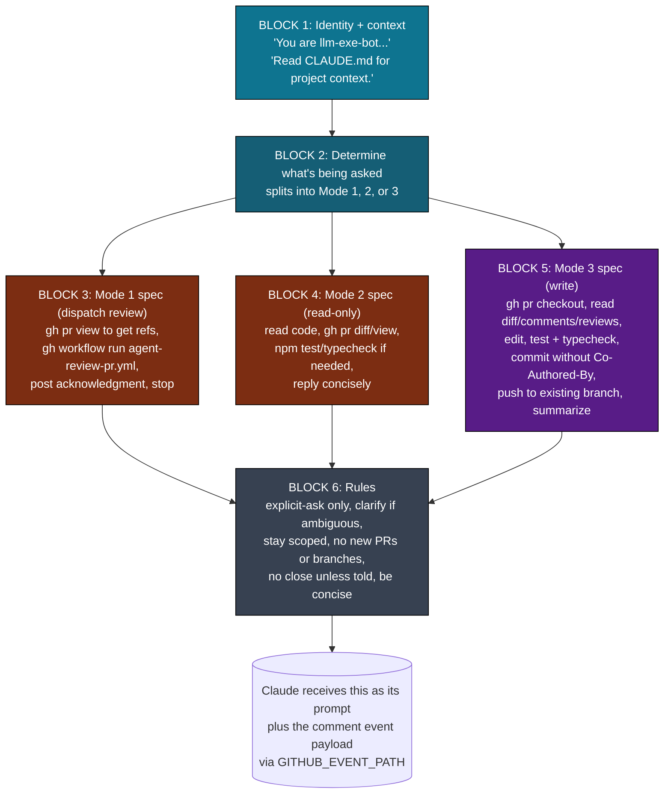

Each block answers one question:

| Block | Question it answers |
|-------|---------------------|
| 1. Identity | "Who am I and where do I get context?" |
| 2. Determine | "Which of the three modes applies?" |
| 3. Mode 1 spec | "How do I dispatch a review pipeline?" |
| 4. Mode 2 spec | "How do I answer without touching code?" |
| 5. Mode 3 spec | "How do I revise without breaking PR conventions?" |
| 6. Rules | "What am I forbidden from doing?" |

[Back to top](#navigate)

---

## 7. Filesystem reads and writes

Blue is read, orange is write, purple is both. The footprint is intentionally small.

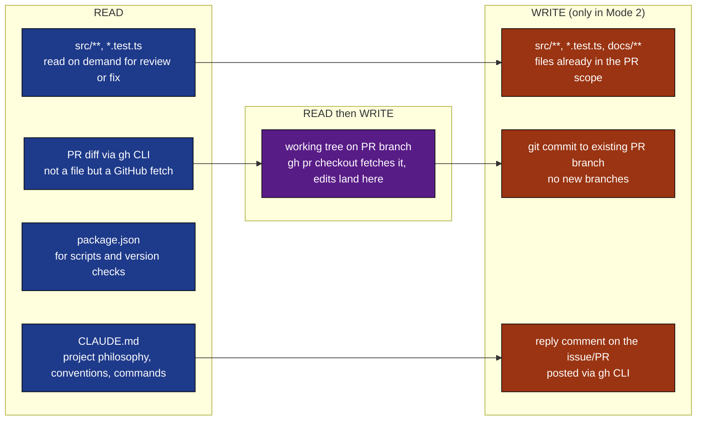

What is deliberately NOT touched:

- `scripts/agents/logs/**` (this is not a maintenance agent run; nothing to log)
- new branches under `agent/...` (not its job)
- the `development` or `main` branch (commits go to the existing PR branch only)

[Back to top](#navigate)

---

## 8. External calls

Who is contacted, with what credential, why.

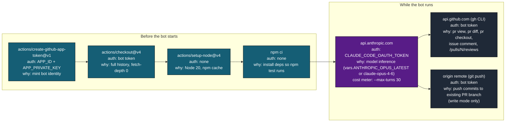

Tool allowlist passed to `claude-code-action@v1`:

```
--allowedTools "Bash,Read,Write,Edit,Glob,Grep,WebFetch,WebSearch"
--max-turns 30
--model ${{ vars.ANTHROPIC_OPUS_LATEST || 'claude-opus-4-6' }}
```

Same allowlist as `agent-run.yml`, lower turn budget (30 vs 50) because conversational replies should be tight.

[Back to top](#navigate)

---

## 9. Rules and guardrails

The prompt enumerates six hard rules. Visual checklist of what the bot may and may not do.

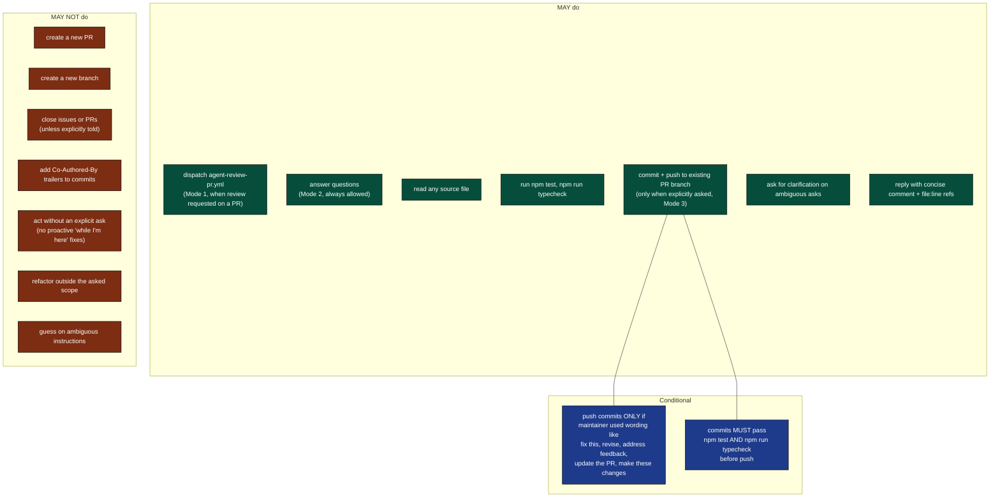

Source: [.github/workflows/bot-respond.yml](../workflows/bot-respond.yml) lines 103-109 plus the mode bodies above.

[Back to top](#navigate)

---

## 10. Output cascade

What the bot produces and who eats it.

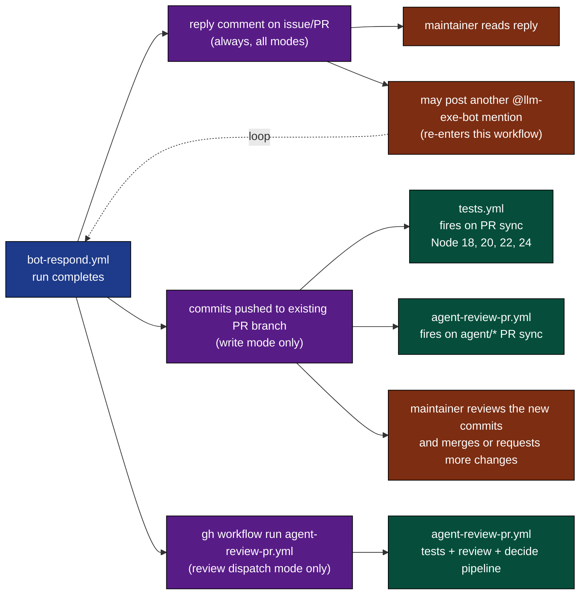

Note the loop: a maintainer can keep iterating with the bot in the same PR thread. Each mention is an independent event; the bot rereads PR state each time.

[Back to top](#navigate)

---

## 11. State machine

A single mention as a finite state machine.

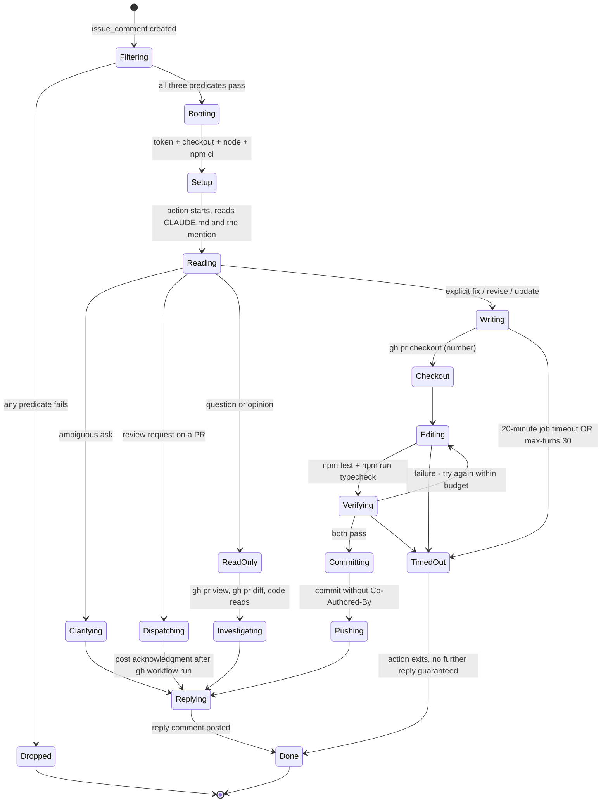

There is no clock-out step like `agent-run.yml`. If the action is killed mid-flight, the only externally visible signs are: no reply comment, and possibly partial commits if the kill happened between push and reply.

[Back to top](#navigate)

---

## 12. Failure modes

Where things break, what happens, what to do.

```mermaid
flowchart TB
    classDef fail fill:#7c2d12,color:#fff,stroke:#000
    classDef effect fill:#374151,color:#fff,stroke:#000
    classDef fix fill:#064e3b,color:#fff,stroke:#000

    F1["Troll or stranger\ncomments '@llm-exe-bot do X'"]:::fail
    F1 --> F1E["author_association check fails\njob skipped before any step\nno reply, no compute spent"]:::effect
    F1E --> F1X["working as designed\nupgrade contributor to COLLABORATOR\nif legitimate"]:::fix

    F2["Bot's own comment\ncontains '@llm-exe-bot'"]:::fail
    F2 --> F2E["user.login check fails\nself-loop prevented"]:::effect
    F2E --> F2X["working as designed"]:::fix

    F3["Bot token mint fails\nAPP_ID or APP_PRIVATE_KEY wrong"]:::fail
    F3 --> F3E["job fails at token step\nno reply posted"]:::effect
    F3E --> F3X["rotate App key, re-add secret"]:::fix

    F4["npm ci fails"]:::fail
    F4 --> F4E["job fails before action starts\nno reply, maintainer sees red X on the comment workflow"]:::effect
    F4E --> F4X["check package-lock alignment"]:::fix

    F5["Action hits --max-turns 30"]:::fail
    F5 --> F5E["bot returns whatever it has\nmay be partial work in write mode"]:::effect
    F5E --> F5X["re-mention to continue\nor break ask into smaller pieces"]:::fix

    F6["Job exceeds 20-minute timeout"]:::fail
    F6 --> F6E["runner kills the step\nno guaranteed reply\npossible partial push if kill landed after commit"]:::effect
    F6E --> F6X["maintainer re-mentions\nor inspects PR branch for partial state"]:::fix

    F7["Write mode requested\nwhen there is no PR context\n(plain issue, no associated PR)"]:::fail
    F7 --> F7E["bot has no branch to push to\nrules forbid creating one"]:::effect
    F7E --> F7X["bot replies asking for clarification\nor maintainer opens PR first"]:::fix

    F8["npm test or typecheck fails\nafter bot's edits"]:::fail
    F8 --> F8E["rules forbid pushing\nbot must iterate within turn budget"]:::effect
    F8E --> F8X["if turns run out, bot replies with\nwhat failed and stops short of push"]:::fix

    F9["Two simultaneous mentions\nin the same PR thread"]:::fail
    F9 --> F9E["no concurrency group declared\nboth jobs run in parallel\nrace on git push possible"]:::effect
    F9E --> F9X["maintainer avoids stacking asks\nor accepts last-write-wins on the branch"]:::fix

    F10["Anthropic API outage"]:::fail
    F10 --> F10E["action errors out\nno reply posted"]:::effect
    F10E --> F10X["wait and re-mention"]:::fix
```

[Back to top](#navigate)

---

## 13. Quick reference card

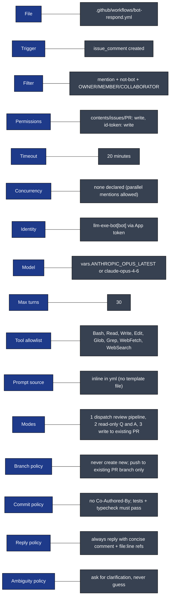

Direct links:

- Workflow file: [.github/workflows/bot-respond.yml](../workflows/bot-respond.yml)
- Project context the bot reads: [CLAUDE.md](../../CLAUDE.md)
- Sibling deep dive: [AGENT_RUN_DEEP_DIVE.md](AGENT_RUN_DEEP_DIVE.md)
- Full architecture doc: [WORKFLOW_ARCHITECTURE.md](WORKFLOW_ARCHITECTURE.md)

[Back to top](#navigate)
