# cache-cleanup: Visual Deep Dive

Concentrated diagrams for [.github/workflows/cache-cleanup.yml](../workflows/cache-cleanup.yml). Companion to [WORKFLOW_ARCHITECTURE.md](WORKFLOW_ARCHITECTURE.md).

This workflow prunes GitHub Actions cache entries that belong to short-lived refs (closed PRs, published tags, ad-hoc branches) so cache storage stays under quota without evicting the hot caches on the default development branch.

Minimum prose. Maximum diagrams.

## Navigate

- [1. The whole picture](#1-the-whole-picture)
- [2. Triggers and what each one cleans](#2-triggers-and-what-each-one-cleans)
- [3. Inputs](#3-inputs)
- [4. The one-job DAG with steps](#4-the-one-job-dag-with-steps)
- [5. Step-by-step lifecycle](#5-step-by-step-lifecycle)
- [6. The ref resolution logic](#6-the-ref-resolution-logic)
- [7. The cache deletion loop](#7-the-cache-deletion-loop)
- [8. External calls](#8-external-calls)
- [9. Output](#9-output)
- [10. Why development is excluded](#10-why-development-is-excluded)
- [11. Failure modes](#11-failure-modes)
- [12. Quick reference card](#12-quick-reference-card)

---

## 1. The whole picture

How [cache-cleanup.yml](../workflows/cache-cleanup.yml) sits between GitHub events and the Actions cache store.

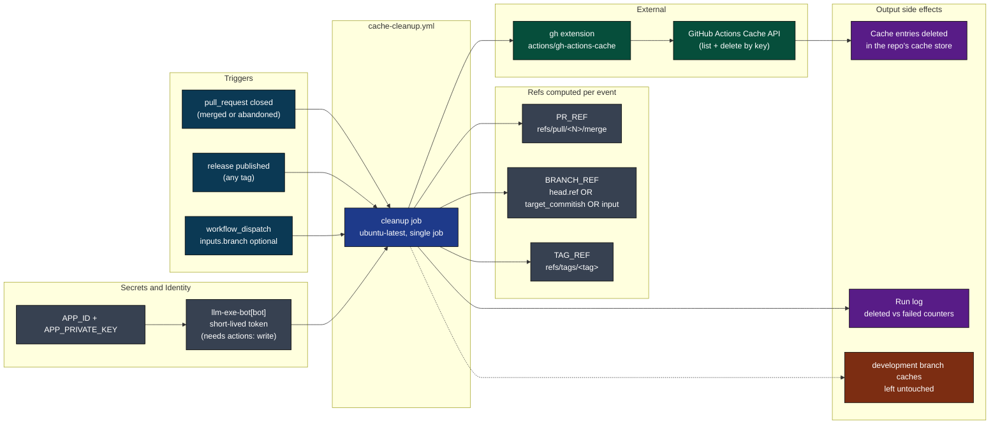

[Back to top](#navigate)

---

## 2. Triggers and what each one cleans

Three entry points. Each one resolves a different combination of refs to scrub.

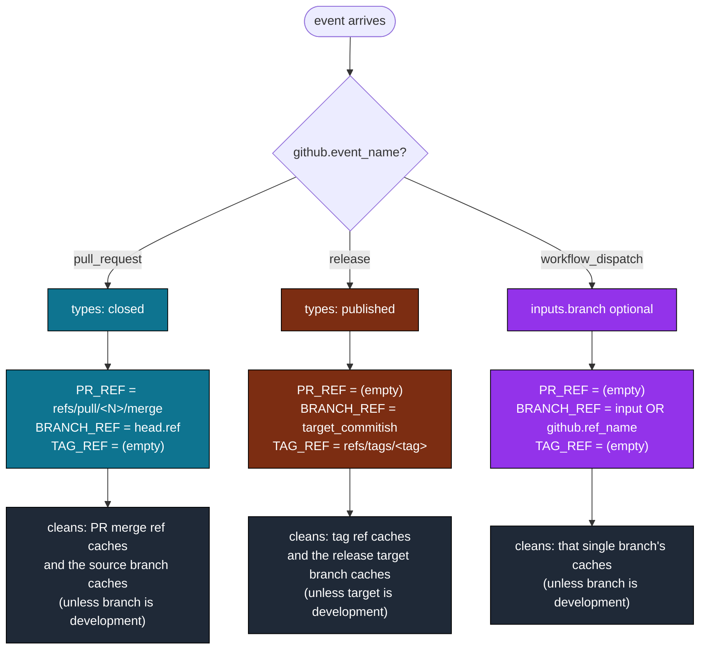

Source: [.github/workflows/cache-cleanup.yml](../workflows/cache-cleanup.yml) lines 3-15 (triggers) and lines 39-66 (ref resolution).

[Back to top](#navigate)

---

## 3. Inputs

Only one input, only on `workflow_dispatch`. Everything else is derived from event context.

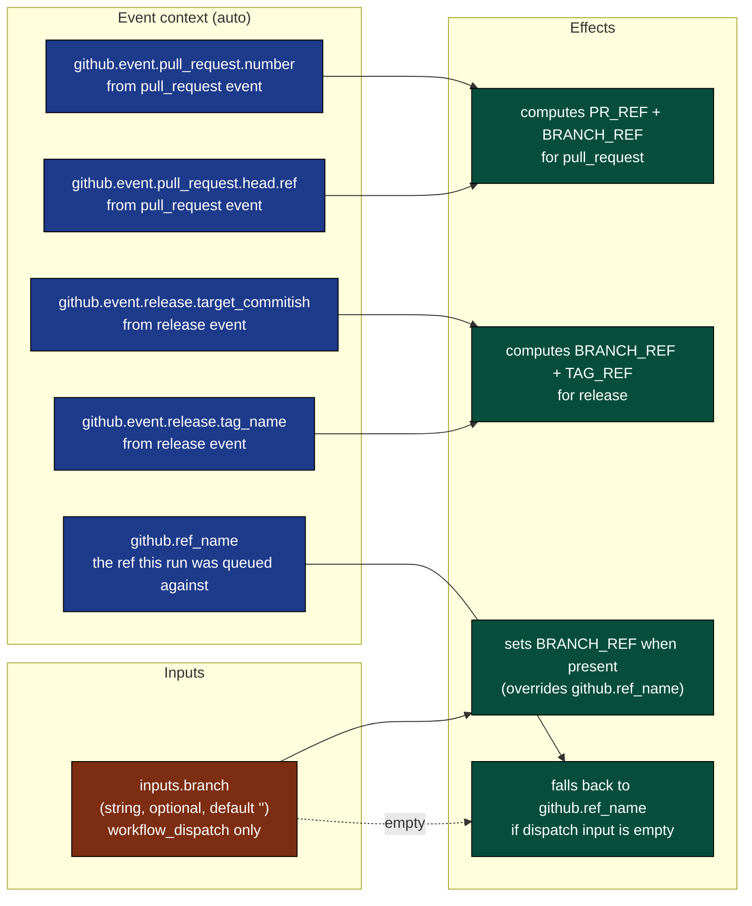

The one knob is escape-hatch only: a maintainer can dispatch the workflow and target any branch by name, which is useful for cleaning up after an abandoned feature branch that never went through a PR close.

[Back to top](#navigate)

---

## 4. The one-job DAG with steps

Single job, four steps, top-to-bottom.

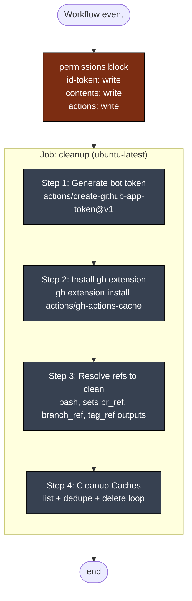

No matrix, no fan-out, no concurrency group. One run per event. Why `actions: write` is required: deleting cache entries via `gh actions-cache delete` writes to the Actions store. Without it, `gh` returns 403.

[Back to top](#navigate)

---

## 5. Step-by-step lifecycle

One run from event to last log line, with every ref and external call.

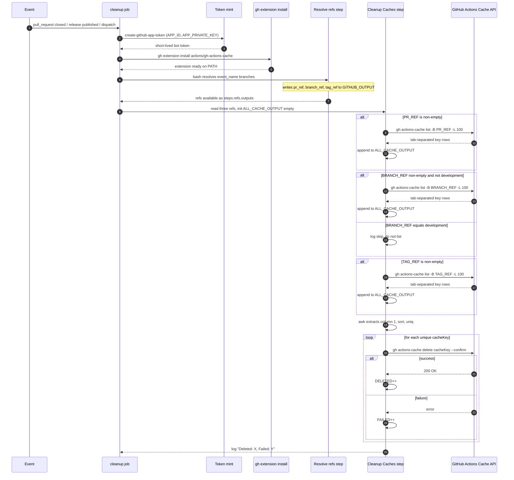

Source: [.github/workflows/cache-cleanup.yml](../workflows/cache-cleanup.yml) lines 22-144.

[Back to top](#navigate)

---

## 6. The ref resolution logic

The Resolve refs step is a three-way branch on `github.event_name`. Each branch sets a different subset of `PR_REF`, `BRANCH_REF`, `TAG_REF`. Anything left unset stays empty and gets skipped downstream.

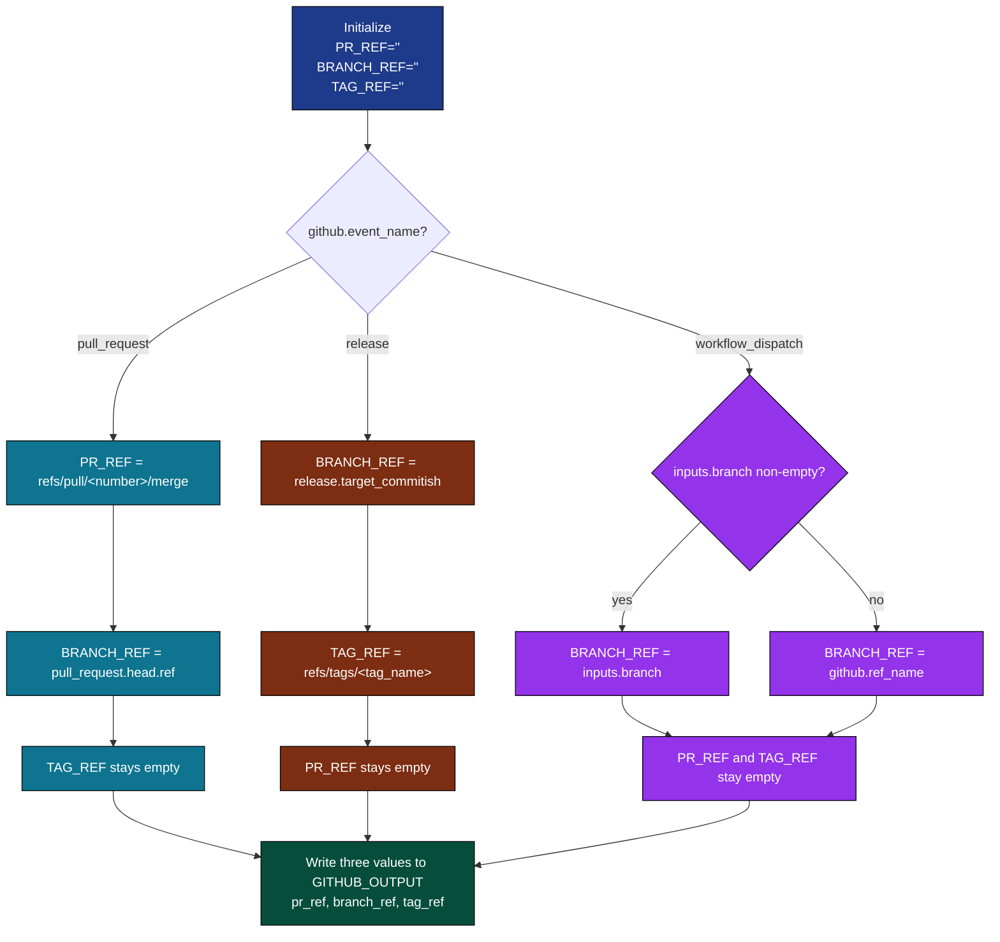

The next step reads back those outputs from `steps.refs.outputs.*`. An empty string short-circuits the corresponding list call.

[Back to top](#navigate)

---

## 7. The cache deletion loop

Listing is per ref. Deletion is global across all collected keys, after dedupe.

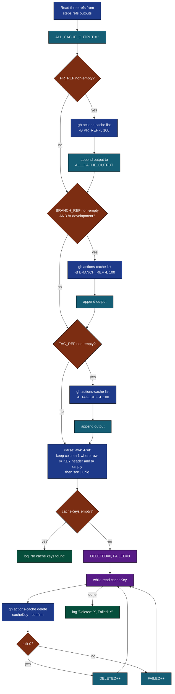

Why dedupe with `sort | uniq`: when a PR head ref overlaps with the merge ref (or the branch is also the release target), the same key can appear twice in `ALL_CACHE_OUTPUT`. `gh actions-cache delete` on a key that no longer exists counts as a failure, so dedup keeps the FAILED counter clean.

Why `-L 100`: that is the page size, not the total. Caches beyond 100 per ref on a single sweep will not be picked up until the next event for the same ref. The PR-close path is event-driven and rare per ref, so 100 is enough in practice.

[Back to top](#navigate)

---

## 8. External calls

Four outbound interactions. All authenticated with the bot token.

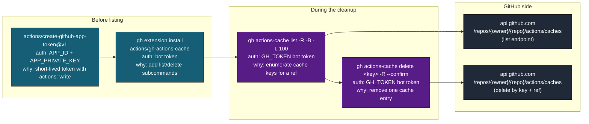

The action token (`GITHUB_TOKEN`) is overridden by the bot token via env on both setup and cleanup steps. Both `GH_TOKEN` (used by `gh`) and `GITHUB_TOKEN` (used by some extensions internally) point at the same minted token to avoid auth ambiguity.

[Back to top](#navigate)

---

## 9. Output

This workflow produces no files, no PRs, no issues, no artifacts. Side effects are entirely on the GitHub Actions cache store, plus log output.

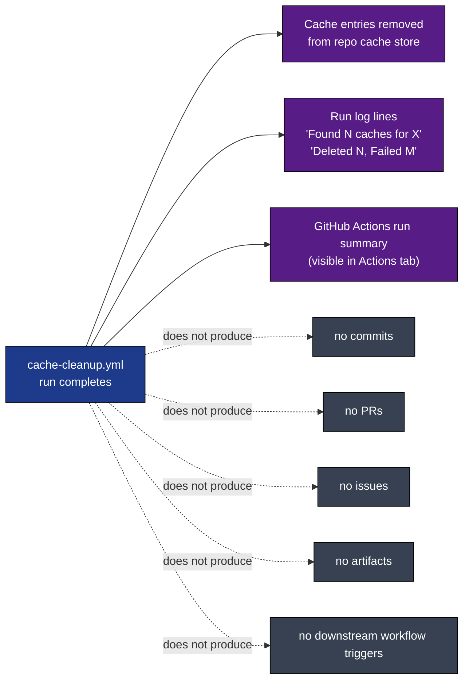

The only observable signal that the workflow ran is the per-ref `Found N caches` and the final `Deleted X, Failed Y` lines in the run log. No notification, no comment, no badge.

[Back to top](#navigate)

---

## 10. Why development is excluded

`development` is the default branch. It is also the base for every agent PR and the source of the hot cache for `npm ci` across the whole repo. Dropping that cache forces every subsequent CI run to do a cold `npm ci`, which is the single most expensive step in the test workflow.

```mermaid
flowchart TB
    classDef hot fill:#7c2d12,color:#fff,stroke:#000
    classDef cold fill:#1e3a8a,color:#fff,stroke:#000
    classDef bad fill:#581c87,color:#fff,stroke:#000
    classDef good fill:#064e3b,color:#fff,stroke:#000

    subgraph Without["If development were NOT excluded"]
        W1["PR closes against development"]:::cold
        W1 --> W2["cleanup lists development caches"]:::cold
        W2 --> W3["deletes node_modules cache for development"]:::bad
        W3 --> W4["next tests.yml run on development\nor any PR rebased on it"]:::bad
        W4 --> W5["cold npm ci on Node 18, 20, 22, 24\nfour matrix legs, multi-minute penalty per leg"]:::bad
    end

    subgraph With["With the explicit skip"]
        Y1["BRANCH_REF resolves to development"]:::cold
        Y1 --> Y2{branch == development?}
        Y2 -->|yes| Y3["log skip, do not list, do not delete"]:::good
        Y3 --> Y4["hot cache preserved"]:::good
        Y4 --> Y5["tests.yml on next PR stays warm\nnpm ci hits cache"]:::good
    end
```

The check is at line 91 and 100-102 of [.github/workflows/cache-cleanup.yml](../workflows/cache-cleanup.yml). It is a string compare, not a glob, so `development` is the only protected name. A future rename of the default branch would need this line updated.

PR-close events still clean the PR's own head branch caches, even if that head branch was `development` (which is structurally impossible since you cannot open a PR from development to itself in the normal flow). Tag refs and PR merge refs are never protected because their caches are inherently throwaway.

[Back to top](#navigate)

---

## 11. Failure modes

What can go wrong and what the workflow does about it.

```mermaid
flowchart TB
    classDef fail fill:#7c2d12,color:#fff,stroke:#000
    classDef effect fill:#374151,color:#fff,stroke:#000
    classDef fix fill:#064e3b,color:#fff,stroke:#000

    F1["Bot token mint fails\nAPP_ID or APP_PRIVATE_KEY rotated"]:::fail
    F1 --> F1E["job fails at step 1\nno cache deletion happens"]:::effect
    F1E --> F1X["rotate app key, re-add secret"]:::fix

    F2["gh extension install fails\nnetwork or GitHub outage"]:::fail
    F2 --> F2E["job fails at step 2\nno list/delete possible"]:::effect
    F2E --> F2X["re-run workflow, transient"]:::fix

    F3["gh actions-cache list fails for one ref"]:::fail
    F3 --> F3E["error logged, other refs still tried\nALL_CACHE_OUTPUT just misses that ref's keys"]:::effect
    F3E --> F3X["caches age out naturally\nor next event for same ref retries"]:::fix

    F4["gh actions-cache delete fails for one key\n(already deleted, race with another job)"]:::fail
    F4 --> F4E["FAILED counter increments\nloop continues to next key"]:::effect
    F4E --> F4X["expected on duplicate keys post-dedupe edge cases\nor concurrent cleanup"]:::fix

    F5["Ref has more than 100 caches\n(busy long-lived branch)"]:::fail
    F5 --> F5E["only first 100 listed\nothers survive this run"]:::effect
    F5X["next close/release/dispatch for same ref\npicks up another 100, eventually drains"]:::fix
    F5E --> F5X

    F6["BRANCH_REF accidentally resolves to development\n(maintainer dispatch with branch=development)"]:::fail
    F6 --> F6E["skip branch fires, no deletion\nlogs 'Skipping cache cleanup for this branch'"]:::effect
    F6E --> F6X["intentional protection, not a bug"]:::fix

    F7["Workflow lacks actions: write permission\n(e.g. settings change)"]:::fail
    F7 --> F7E["every delete returns 403\nFAILED equals TOTAL"]:::effect
    F7E --> F7X["restore permissions block at top of file"]:::fix

    F8["github.event.pull_request.head.ref empty\n(weird fork edge case)"]:::fail
    F8 --> F8E["BRANCH_REF empty, branch list step skipped\nonly PR_REF caches cleaned"]:::effect
    F8E --> F8X["acceptable, PR merge ref is the bulk anyway"]:::fix

    F9["release.target_commitish is a commit SHA\nnot a branch name"]:::fail
    F9 --> F9E["gh actions-cache list -B &lt;sha&gt;\nlikely returns zero keys"]:::effect
    F9E --> F9X["tag ref still gets cleaned\nbranch caches stay until next event"]:::fix
```

Listing failures are non-fatal by design: the `if prCacheKeysOutput=...; then ... else ... fi` pattern logs and continues. Delete failures are also non-fatal: the loop carries on and reports counts at the end.

[Back to top](#navigate)

---

## 12. Quick reference card

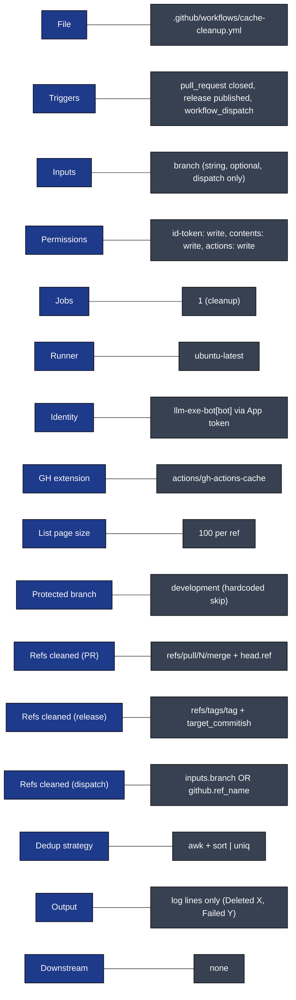

Direct links:

- Workflow file: [.github/workflows/cache-cleanup.yml](../workflows/cache-cleanup.yml)
- gh extension docs: [actions/gh-actions-cache](https://github.com/actions/gh-actions-cache)
- Full architecture doc: [WORKFLOW_ARCHITECTURE.md](WORKFLOW_ARCHITECTURE.md)

[Back to top](#navigate)
