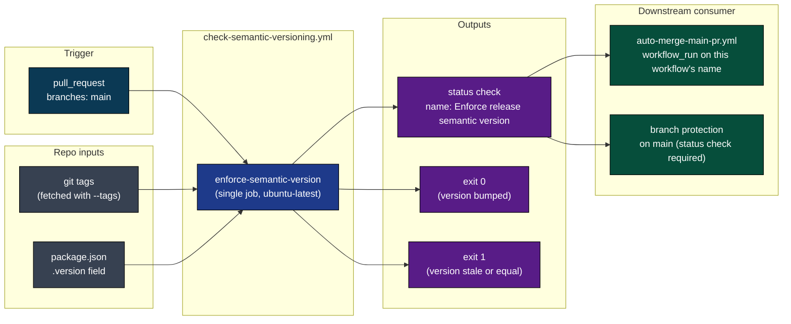
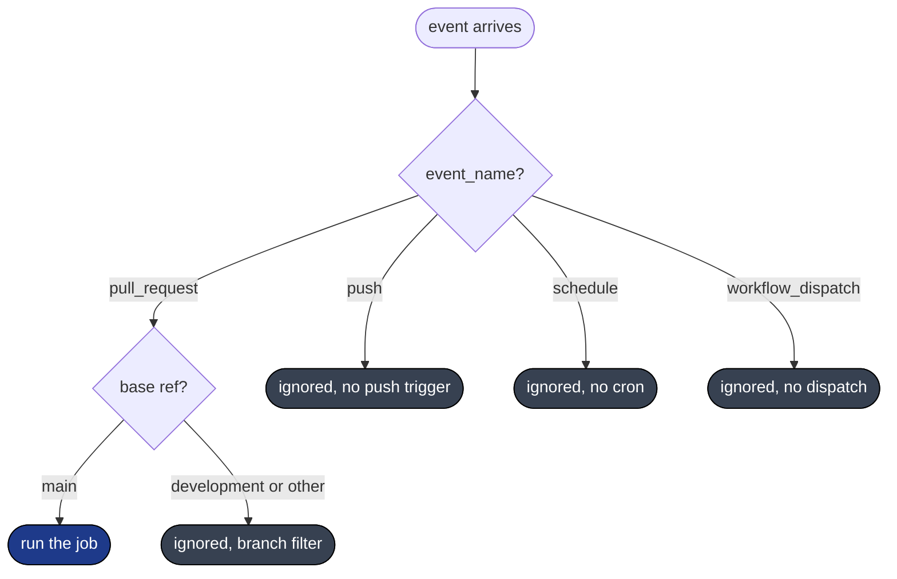
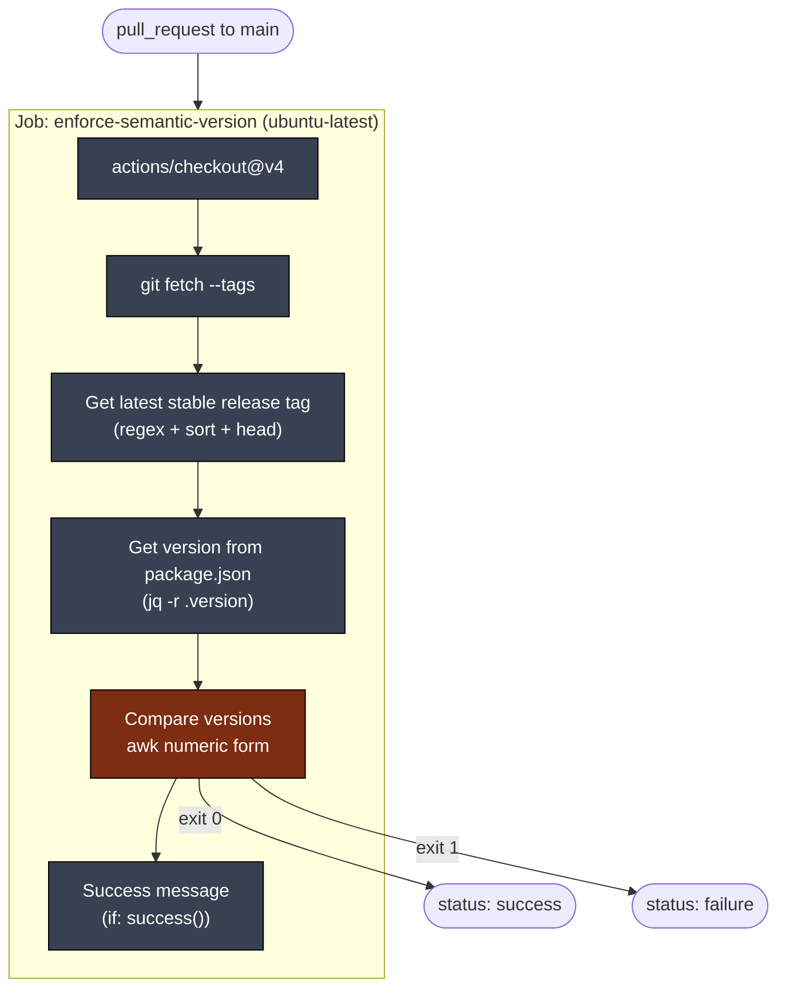
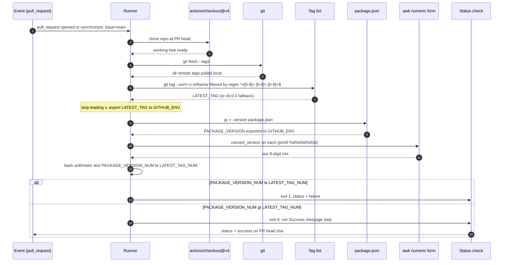
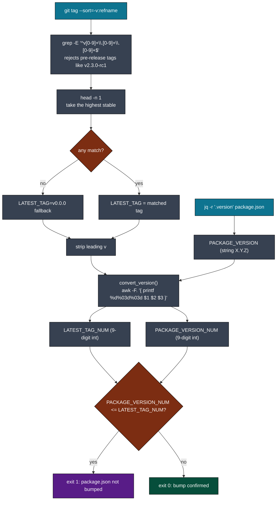
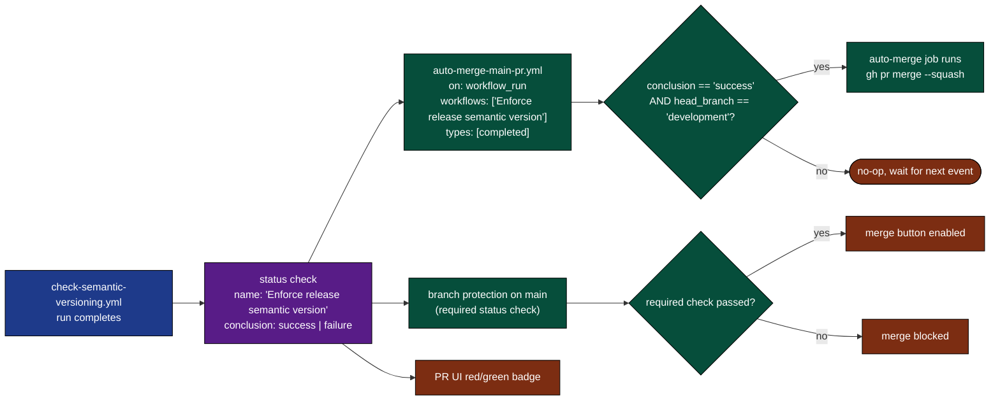
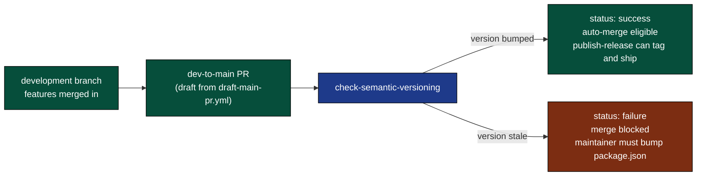
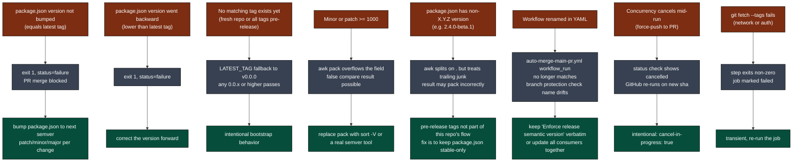
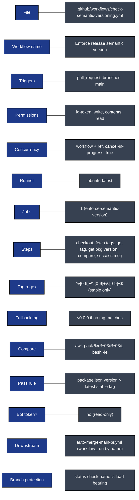

# check-semantic-versioning: Visual Deep Dive

Concentrated diagrams for [.github/workflows/check-semantic-versioning.yml](../workflows/check-semantic-versioning.yml). The workflow itself is one job and six steps, but its **status check** is a hard gate inside the release pipeline. Companion to [WORKFLOW_ARCHITECTURE.md](WORKFLOW_ARCHITECTURE.md).

Minimum prose. Maximum diagrams.

## Navigate

- [1. The whole picture](#1-the-whole-picture)
- [2. Triggers](#2-triggers)
- [3. The one-job DAG](#3-the-one-job-dag)
- [4. Step-by-step lifecycle](#4-step-by-step-lifecycle)
- [5. The version comparison algorithm](#5-the-version-comparison-algorithm)
- [6. Output cascade](#6-output-cascade)
- [7. Why this exists](#7-why-this-exists)
- [8. Failure modes](#8-failure-modes)
- [9. Quick reference card](#9-quick-reference-card)

---

## 1. The whole picture

A tiny workflow with an outsized role. It guards every PR that targets `main`, and its **completion event** is what wakes up [auto-merge-main-pr.yml](../workflows/auto-merge-main-pr.yml).



The string `Enforce release semantic version` (the `name:` at the top of the YAML) is **the contract**. Both `auto-merge-main-pr.yml` (via `workflow_run.workflows`) and any branch protection rule on `main` reference that exact string. Renaming the workflow breaks the release pipeline silently.

[Back to top](#navigate)

---

## 2. Triggers

One trigger. No cron, no dispatch, no push. The workflow only exists in the context of an open PR aiming at `main`.



Concurrency: `${{ github.workflow }}-${{ github.ref }}` with `cancel-in-progress: true`. Force-pushes to a PR cancel the in-flight check and start a fresh one. Two different PRs run in parallel (different `github.ref`).

Permissions: `id-token: write`, `contents: read`. No bot token. No write scopes. The job only reads the repo and reports a status.

[Back to top](#navigate)

---

## 3. The one-job DAG



No matrix. No artifacts. No cache. No external network calls beyond the checkout itself. Total runtime is a few seconds on a warm runner.

[Back to top](#navigate)

---

## 4. Step-by-step lifecycle

One run, end to end, with every input and output noted.



Source: [.github/workflows/check-semantic-versioning.yml](../workflows/check-semantic-versioning.yml) lines 16-62.

[Back to top](#navigate)

---

## 5. The version comparison algorithm

The heart of the workflow. Three transformations: regex parse, numeric pack, integer compare.



Worked example with `LATEST_TAG=v2.3.7` and `package.json` at `2.4.0`:

| Step | LATEST | PACKAGE |
|------|--------|---------|
| Raw string | `2.3.7` | `2.4.0` |
| `awk -F. '{ printf("%d%03d%03d", $1,$2,$3); }'` | `2003007` | `2004000` |
| Bash compare `PACKAGE_VERSION_NUM -le LATEST_TAG_NUM` | `2004000 -le 2003007` is false | proceed, exit 0 |

Why pack into `%d%03d%03d`? Bash's `[ a -le b ]` is integer-only; it cannot compare `2.4.0` and `2.3.7` as strings. The pack collapses three components into one monotonically increasing integer for the minor/patch range `0..999`.

**Bounds**: minor or patch above 999 would overflow into the next slot and produce wrong answers. At current release cadence this is hypothetical, but it is a real ceiling baked into the algorithm.

**Pre-release exclusion**: the regex `^v[0-9]+\.[0-9]+\.[0-9]+$` is anchored at both ends, so tags like `v2.4.0-rc1` or `v2.4.0+build.5` are filtered out. Only stable releases set the floor.

[Back to top](#navigate)

---

## 6. Output cascade

The job emits a single observable thing: a status check named `Enforce release semantic version` on the PR head SHA. Two consumers care.



The coupling is **by name string**, not by file path or workflow ID. `auto-merge-main-pr.yml` declares:

```yaml
on:
  workflow_run:
    workflows:
      - "Enforce release semantic version"
    types:
      - completed
```

Change line 1 of `check-semantic-versioning.yml` (`name: Enforce release semantic version`) and the auto-merge trigger goes silent without any GitHub-side error.

[Back to top](#navigate)

---

## 7. Why this exists

Release discipline at the merge boundary. The repo follows semver and publishes from `main`. If `package.json` is not bumped before the dev-to-main merge, the next publish either fails (npm rejects republish of an existing version) or silently overwrites a published version. Both are bad.



The check is **cheap, fast, and deterministic**. It is also the only place in the pipeline that enforces a version bump. Without it, the rest of the release machinery (`publish-release.yml`, `create-draft-release.yml`, `pack-package.yml`) would still run, but on a duplicate version.

[Back to top](#navigate)

---

## 8. Failure modes

Small workflow, small failure surface. But every failure here blocks a release.



[Back to top](#navigate)

---

## 9. Quick reference card



Direct links:

- Workflow file: [.github/workflows/check-semantic-versioning.yml](../workflows/check-semantic-versioning.yml)
- Downstream consumer: [.github/workflows/auto-merge-main-pr.yml](../workflows/auto-merge-main-pr.yml)
- Release siblings: [draft-main-pr.yml](../workflows/draft-main-pr.yml), [create-draft-release.yml](../workflows/create-draft-release.yml), [publish-release.yml](../workflows/publish-release.yml)
- Full architecture doc: [WORKFLOW_ARCHITECTURE.md](WORKFLOW_ARCHITECTURE.md)

[Back to top](#navigate)
