# coder-run: Visual Deep Dive

Concentrated diagrams for [.github/workflows/coder-run.yml](../workflows/coder-run.yml) and the issue-selection logic that drives it. Companion to [WORKFLOW_ARCHITECTURE.md](WORKFLOW_ARCHITECTURE.md).

Minimum prose. Maximum diagrams.

## Navigate

- [1. The whole picture](#1-the-whole-picture)
- [2. Triggers and what each one does](#2-triggers-and-what-each-one-does)
- [3. The three-job DAG](#3-the-three-job-dag)
- [4. Step-by-step lifecycle](#4-step-by-step-lifecycle)
- [5. Filesystem reads and writes](#5-filesystem-reads-and-writes)
- [6. External calls](#6-external-calls)
- [7. The issue selection algorithm](#7-the-issue-selection-algorithm)
- [8. Output cascade](#8-output-cascade)
- [9. The state machine](#9-the-state-machine)
- [10. Failure modes](#10-failure-modes)
- [11. How it differs from agent-run.yml](#11-how-it-differs-from-agent-runyml)
- [12. Quick reference card](#12-quick-reference-card)

---

## 1. The whole picture

How [coder-run.yml](../workflows/coder-run.yml) plugs into everything.

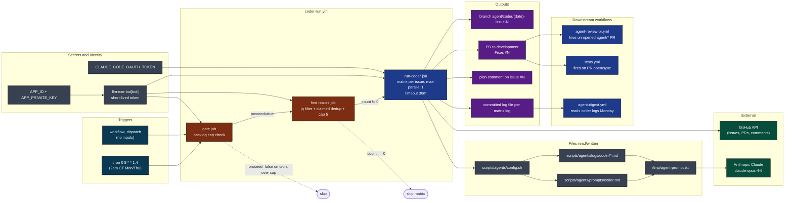

[Back to top](#navigate)

---

## 2. Triggers and what each one does

Two entry points. Both run the same agent (coder), but the gate behaves differently.

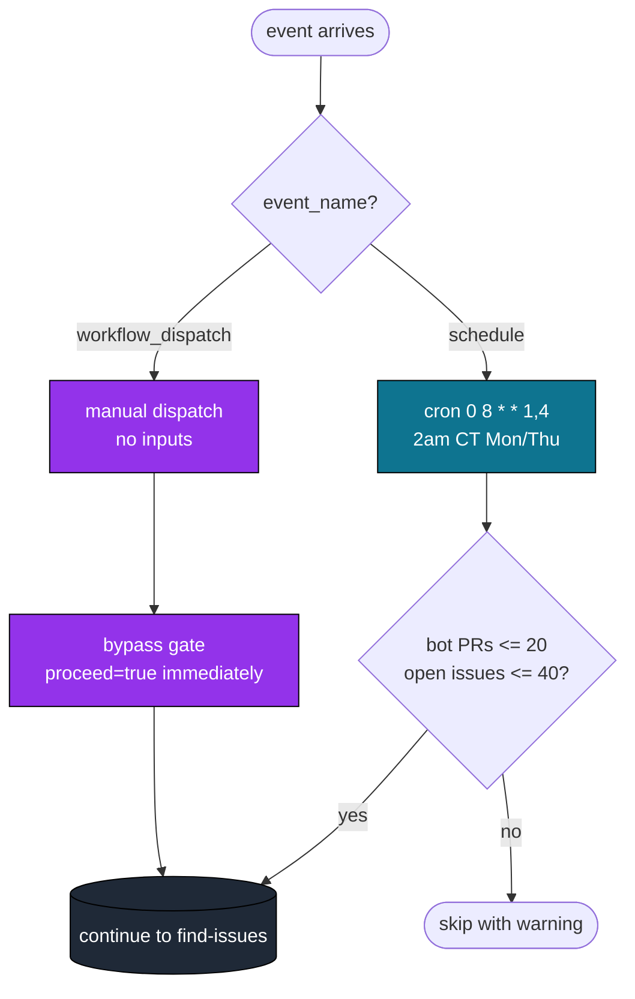

Source: [.github/workflows/coder-run.yml](../workflows/coder-run.yml) lines 3-7 (triggers), 26-46 (gate logic).

Unlike [agent-run.yml](../workflows/agent-run.yml), there is no `inputs.agent` or `inputs.instructions`. The agent is always `coder` and the work surface is always GitHub issues. No knobs.

[Back to top](#navigate)

---

## 3. The three-job DAG

Job graph with gating, fan-out, and serialization.

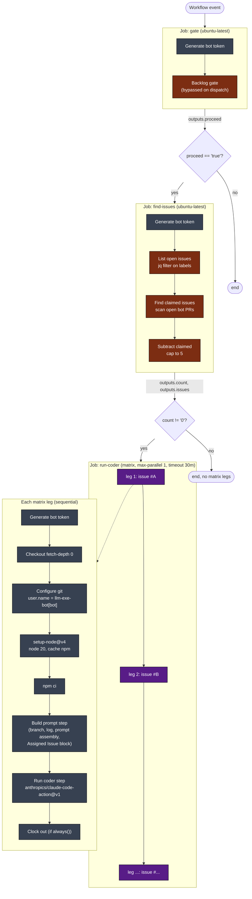

`max-parallel: 1` is load-bearing: `create_agent_branch` in [config.sh](../../scripts/agents/config.sh) does `git checkout development; git pull; git checkout -b ...`. Two legs racing on the same runner shape would step on each other's working tree and branch state. Branch creation is not concurrency-safe by design.

There is no top-level `concurrency:` block, so two scheduled or dispatched runs of `coder-run.yml` can overlap. Within one run, the matrix serializes itself.

[Back to top](#navigate)

---

## 4. Step-by-step lifecycle

One matrix leg from gate to clock-out. The gate and find-issues jobs run once per workflow; the leg below runs once per selected issue.

```mermaid
sequenceDiagram
    autonumber
    participant E as Event
    participant GT as gate job
    participant FI as find-issues job
    participant J as run-coder leg
    participant TK as Token mint
    participant G as Git
    participant N as Node + npm
    participant C as config.sh
    participant P as prompts/coder.md
    participant L as logs/coder/
    participant TMP as /tmp/agent-prompt.txt
    participant CCA as claude-code-action@v1
    participant API as Anthropic + GitHub

    E->>GT: dispatch or cron
    GT->>TK: create-github-app-token@v1
    TK-->>GT: bot token
    GT->>API: gh pr list (bot author) + gh issue list
    API-->>GT: counts
    Note over GT: dispatch bypasses; cron enforces caps
    GT-->>FI: outputs.proceed=true

    FI->>TK: create-github-app-token@v1
    TK-->>FI: bot token
    FI->>API: gh issue list open --json number,labels
    API-->>FI: issues with labels
    Note over FI: jq filter for bug|enhancement|agent-ok\nminus breaking|needs-discussion|on-hold
    FI->>API: gh pr list open author=bot --json title,body
    API-->>FI: open bot PRs
    Note over FI: grep closes|fixes|resolves #N\nextract claimed issue numbers
    Note over FI: subtract claimed, cap to 5
    FI-->>J: outputs.issues (JSON array), outputs.count

    loop per matrix leg (max-parallel 1)
        J->>TK: create-github-app-token@v1
        TK-->>J: bot token
        J->>G: checkout fetch-depth 0 with bot token
        J->>G: git config llm-exe-bot[bot]
        J->>N: setup-node@v4 + npm ci
        J->>C: source scripts/agents/config.sh
        C->>G: create_agent_branch coder issue-N\n(checkout development, pull, checkout -b)
        G-->>C: agent/coder/(date)-issue-N
        C->>L: clock_in writes skeleton .md
        L-->>C: log file path
        C->>P: sed substitute BRANCH and LOG_FILE
        P-->>C: rendered template
        C->>L: build_prior_context (last 3 coder logs)
        L-->>C: prior text
        C->>TMP: write template + prior + Time Budget + Assigned Issue
        J->>CCA: prompt = "Read /tmp/agent-prompt.txt"
        CCA->>API: streaming inference (claude-opus-4-6)
        API-->>CCA: tool calls
        CCA->>API: gh issue view N (per Assigned Issue block)
        CCA->>API: gh issue comment N (plan)
        CCA->>G: git add/commit/push origin (branch)
        CCA->>API: gh pr create --base development
        CCA->>L: rewrite Summary, Files Changed, Next Steps
        J->>C: clock_out (if always) maps job.status to exit code
        C->>L: stamp Finished UTC + Status
    end
```

Source: [.github/workflows/coder-run.yml](../workflows/coder-run.yml) lines 14-177.

[Back to top](#navigate)

---

## 5. Filesystem reads and writes

Color: blue is read, orange is write, purple is both.

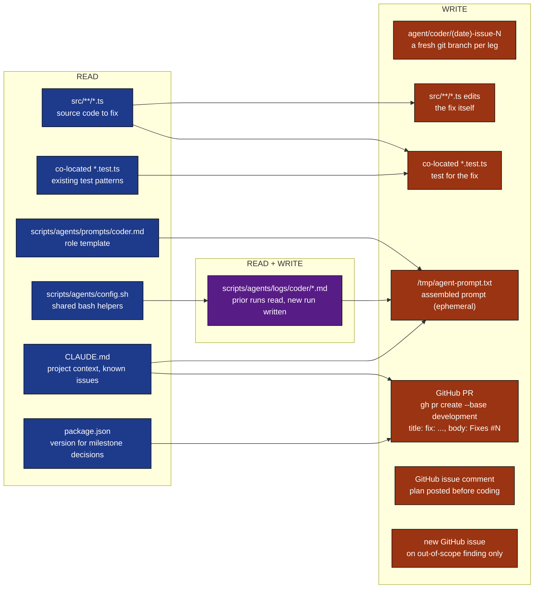

Prompt layers in `/tmp/agent-prompt.txt` are concatenated in this order:

| Layer | Source | Purpose |
|-------|--------|---------|
| 1. Role template | `scripts/agents/prompts/coder.md` with `$BRANCH` and `$LOG_FILE` substituted | scope, steps, pacing |
| 2. Prior runs | last 3 files under `scripts/agents/logs/coder/*.md` (skips current) | cross-run memory |
| 3. Time Budget | start UTC + deadline UTC (+600s) | self-pacing instruction |
| 4. Assigned Issue | `gh issue view ${{ matrix.issue }}` instruction | locks the leg to one issue |

Layer 4 is unique to this workflow. [agent-run.yml](../workflows/agent-run.yml) has an "Additional Instructions from Maintainer" layer in the same slot; here it is replaced by a hard issue assignment.

[Back to top](#navigate)

---

## 6. External calls

Who is contacted, with what credential, why.

```mermaid
flowchart LR
    classDef pre fill:#155e75,color:#fff,stroke:#000
    classDef llm fill:#581c87,color:#fff,stroke:#000
    classDef gh fill:#1f2937,color:#fff,stroke:#000

    subgraph Pre["Before the agent starts (gate + find-issues + leg setup)"]
        c1["create-github-app-token@v1 (x3)\nauth: APP_ID + APP_PRIVATE_KEY\nwhy: each job re-mints (tokens are job-scoped)"]:::pre
        c2["gh pr list / gh issue list (gate)\nauth: bot token\nwhy: backlog caps"]:::pre
        c3["gh issue list --json number,labels (find-issues)\nauth: bot token\nwhy: candidate set"]:::pre
        c4["gh pr list --author app/llm-exe-bot (find-issues)\nauth: bot token\nwhy: claimed detection"]:::pre
        c5["actions/checkout@v4 fetch-depth 0\nauth: bot token\nwhy: full history for branch ops"]:::pre
        c6["actions/setup-node@v4 + npm ci\nauth: none\nwhy: Node 20, prime npm cache"]:::pre
    end

    subgraph During["While the agent runs (per leg)"]
        d1["api.anthropic.com\nauth: CLAUDE_CODE_OAUTH_TOKEN\nwhy: claude-opus-4-6 inference\ncost meter: --max-turns 50"]:::llm
        d2["gh issue view N\nauth: bot token\nwhy: read assigned issue"]:::gh
        d3["gh issue comment N (plan)\nauth: bot token\nwhy: visible thinking before code"]:::gh
        d4["gh search issues (dedup)\nauth: bot token\nwhy: out-of-scope findings"]:::gh
        d5["git push origin (branch)\nauth: bot token\nwhy: push agent/coder/(date)-issue-N"]:::gh
        d6["gh pr create --base development\nauth: bot token\nwhy: PR with Fixes #N"]:::gh
    end

    c1 --> c2
    c2 --> c3
    c3 --> c4
    c4 --> c5
    c5 --> c6
    c6 --> d1
    d1 --> d2
    d2 --> d3
    d3 --> d5
    d3 --> d4
    d5 --> d6
```

Tool allowlist passed to `claude-code-action@v1`:

```
--allowedTools "Bash,Read,Write,Edit,Glob,Grep,WebFetch,WebSearch"
--max-turns 50
--model claude-opus-4-6
```

WebFetch and WebSearch are allowed but unused for the coder path. They are inherited from the shared tool allowlist convention.

[Back to top](#navigate)

---

## 7. The issue selection algorithm

The find-issues job is the brain of this workflow. It produces the matrix.

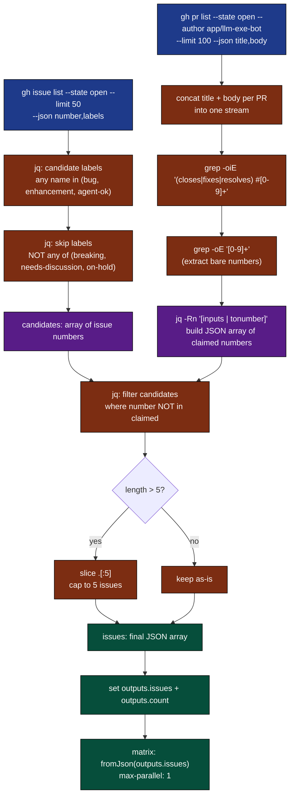

Step-by-step trace through the jq pipeline in [.github/workflows/coder-run.yml](../workflows/coder-run.yml) lines 67-90:

| Step | jq fragment | What it does |
|------|-------------|--------------|
| Candidate select | `select((.labels \| map(.name) \| any(. == "bug" or . == "enhancement" or . == "agent-ok")))` | issue must carry at least one allowed label |
| Skip filter | `and (.labels \| map(.name) \| any(. == "breaking" or . == "needs-discussion" or . == "on-hold") \| not)` | issue must not carry any blocking label |
| Project | `\| .number]` | reduce to issue number only |
| Claimed extract (shell) | `grep -oiE '(closes\|fixes\|resolves) #[0-9]+'` then `grep -oE '[0-9]+'` | pull issue refs from open bot PR title and body, case-insensitive |
| Claimed build (jq) | `jq -Rn '[inputs \| tonumber]'` | read whitespace-separated stdin lines into a JSON int array |
| Subtract | `[.[] \| select(. as $n \| $claimed \| index($n) \| not)]` | candidates minus claimed |
| Cap | `if length > 5 then .[:5] else . end` | hard ceiling of 5 matrix legs |

Why this dedup matters: without it, two consecutive Mon/Thu cron runs would both pick the same top issue, the second leg's `create_agent_branch` would race the first PR's branch, and reviewers would see duplicate PRs against `Fixes #N`.

Why the cap is 5: budget control. 5 legs at 30-minute timeout each is 2.5 hours of wall clock with `max-parallel: 1`. Anthropic costs are bounded by `--max-turns 50` per leg.

Edge cases handled:

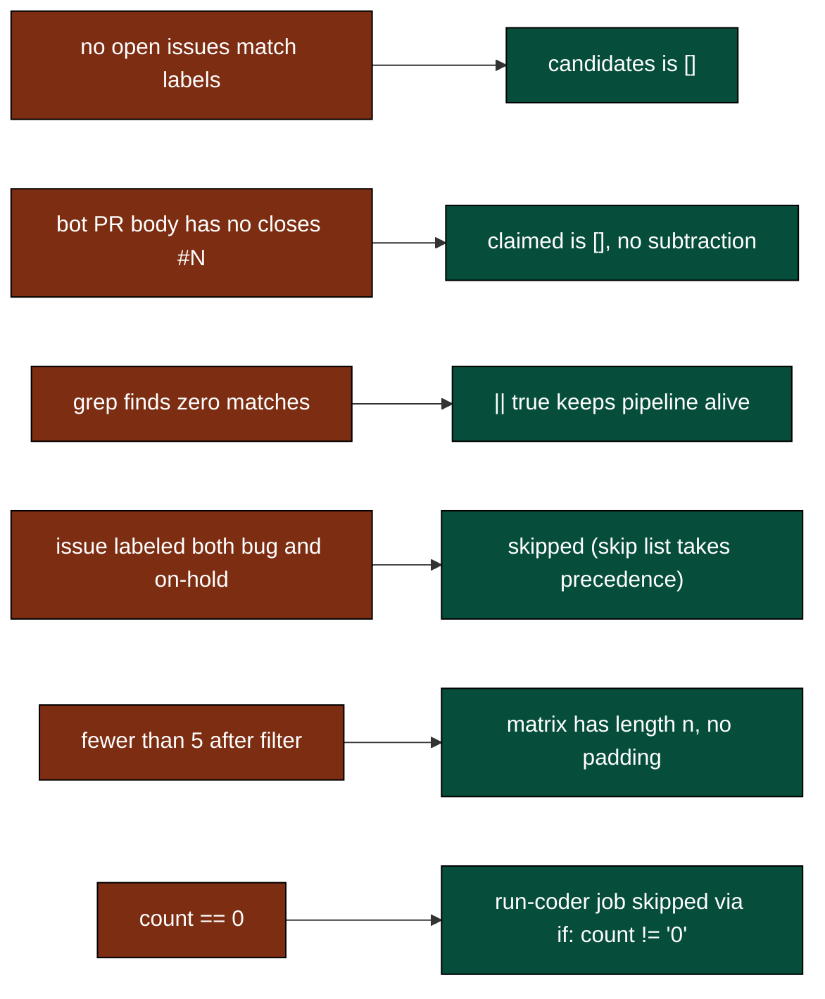

[Back to top](#navigate)

---

## 8. Output cascade

What this workflow produces and who eats it.

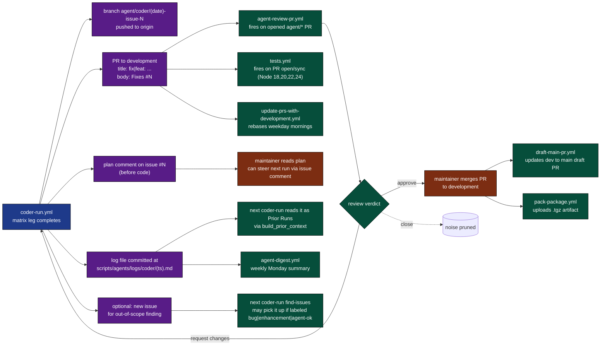

Closed-loop note: a coder PR that gets merged closes the issue it references. The next run's find-issues job will not see it (state=open filter). A coder PR that gets closed without merge frees the issue for the next run, since the "claimed" check only counts open bot PRs.

[Back to top](#navigate)

---

## 9. The state machine

One matrix leg as a finite state machine. The workflow itself is just gate then find-issues then a fan-out of these.

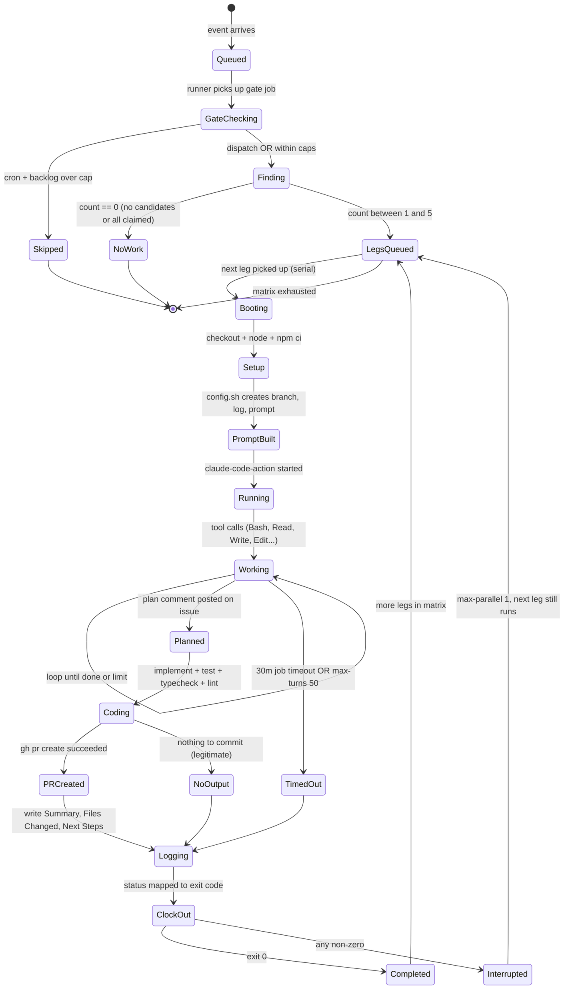

`max-parallel: 1` means a leg's failure does not cancel siblings. Each leg has its own branch, log, and prompt. The matrix continues until every issue has had its turn.

`if: always()` on the clock-out step means even `TimedOut` and `Interrupted` legs stamp a finish time and update status. No log is left in `running` state.

[Back to top](#navigate)

---

## 10. Failure modes

Where things break, what happens, what to do.

```mermaid
flowchart TB
    classDef fail fill:#7c2d12,color:#fff,stroke:#000
    classDef effect fill:#374151,color:#fff,stroke:#000
    classDef fix fill:#064e3b,color:#fff,stroke:#000

    F1["Backlog over cap (cron path)"]:::fail
    F1 --> F1E["gate sets proceed=false\nfind-issues and run-coder skipped"]:::effect
    F1E --> F1X["maintainer drains queue\nor uses dispatch to bypass"]:::fix

    F2["No matching issues"]:::fail
    F2 --> F2E["find-issues emits count=0\nrun-coder skipped via if guard"]:::effect
    F2X["expected behavior, not a failure"]:::fix
    F2E --> F2X

    F3["All matching issues already claimed"]:::fail
    F3 --> F3E["candidates non-empty but issues array empty after subtract\ncount=0, matrix skipped"]:::effect
    F3X["wait for review cycle to merge or close existing PRs"]:::fix
    F3E --> F3X

    F4["Bot token mint fails"]:::fail
    F4 --> F4E["one of three jobs fails at token step"]:::effect
    F4X["rotate App key, re-add secret"]:::fix
    F4E --> F4X

    F5["jq filter syntax error"]:::fail
    F5 --> F5E["find-issues step fails\nmatrix never starts"]:::effect
    F5X["test jq locally with cached issue dump"]:::fix
    F5E --> F5X

    F6["grep finds zero closes #N\nin bot PRs"]:::fail
    F6 --> F6E["|| true keeps pipeline alive\nclaimed is []"]:::effect
    F6X["intentional: empty claimed set is valid"]:::fix
    F6E --> F6X

    F7["npm ci fails in a leg"]:::fail
    F7 --> F7E["that leg fails before agent starts\nother legs continue (max-parallel 1, serial)"]:::effect
    F7X["check package-lock alignment on development"]:::fix
    F7E --> F7X

    F8["Claude hits --max-turns 50"]:::fail
    F8 --> F8E["leg returns whatever it has\nmay be partial PR or none"]:::effect
    F8X["reviewer requests changes or maintainer closes;\nnext run sees issue unclaimed and retries"]:::fix
    F8E --> F8X

    F9["Leg exceeds 30-minute timeout"]:::fail
    F9 --> F9E["runner kills step\nclock_out runs (if always())\nstatus=interrupted in log"]:::effect
    F9X["next coder-run reads interrupted log as Prior Runs"]:::fix
    F9E --> F9X

    F10["Agent goes out of scope\n(touches docs/ or examples/)"]:::fail
    F10 --> F10E["PR opens but fails review\nagent-review-pr.yml requests changes or closes"]:::effect
    F10X["prompt enforces scope at top\nreviewer enforces at bottom"]:::fix
    F10E --> F10X

    F11["Two scheduled coder-run instances overlap"]:::fail
    F11 --> F11E["no concurrency group at workflow level\nboth runs may pick same issues if claimed set\nis stale between gate and matrix"]:::effect
    F11X["cron cadence (Mon/Thu 2am CT) makes overlap unlikely;\nclaimed dedup is best-effort, not transactional"]:::fix
    F11E --> F11X

    F12["Anthropic API outage"]:::fail
    F12 --> F12E["claude-code-action returns error\nclock_out marks interrupted"]:::effect
    F12X["wait or dispatch manually later"]:::fix
    F12E --> F12X
```

[Back to top](#navigate)

---

## 11. How it differs from agent-run.yml

Same shared helpers, same tool allowlist, very different shape. The split is intentional.

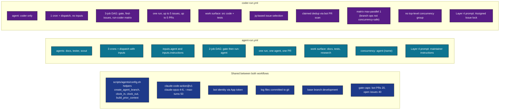

Why coder is split out instead of folded into agent-run.yml:

| Concern | agent-run.yml fits | coder-run.yml needed |
|---------|--------------------|----------------------|
| Single work unit per run | docs sweeps a tree, tester writes tests against coverage gaps, scout files issues | each PR closes one issue, not a sweep |
| Fan-out | not needed | matrix over multiple issues per run |
| Work discovery | hard-coded scope in prompt | dynamic issue list from GitHub API |
| Dedup | not applicable | claimed-issue check prevents duplicate PRs |
| Per-leg branch | one branch per run | one branch per matrix leg, named `(date)-issue-N` |

If the coder were squeezed into agent-run.yml, the matrix would either not exist (one issue per run, painfully slow) or duplicate every other agent's job shape (matrix-of-one, awkward).

[Back to top](#navigate)

---

## 12. Quick reference card

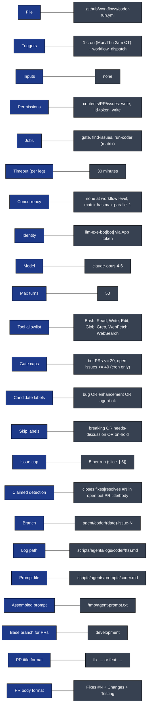

Direct links:

- Workflow file: [.github/workflows/coder-run.yml](../workflows/coder-run.yml)
- Companion workflows: [agent-run.yml](../workflows/agent-run.yml), [personas-run.yml](../workflows/personas-run.yml), [agent-review-pr.yml](../workflows/agent-review-pr.yml)
- Shared helpers: [scripts/agents/config.sh](../../scripts/agents/config.sh)
- Prompt: [coder.md](../../scripts/agents/prompts/coder.md)
- Local runner: [scripts/maintain.sh](../../scripts/maintain.sh)
- Full architecture doc: [WORKFLOW_ARCHITECTURE.md](WORKFLOW_ARCHITECTURE.md)
- Sibling deep-dive: [AGENT_RUN_DEEP_DIVE.md](AGENT_RUN_DEEP_DIVE.md)

[Back to top](#navigate)
