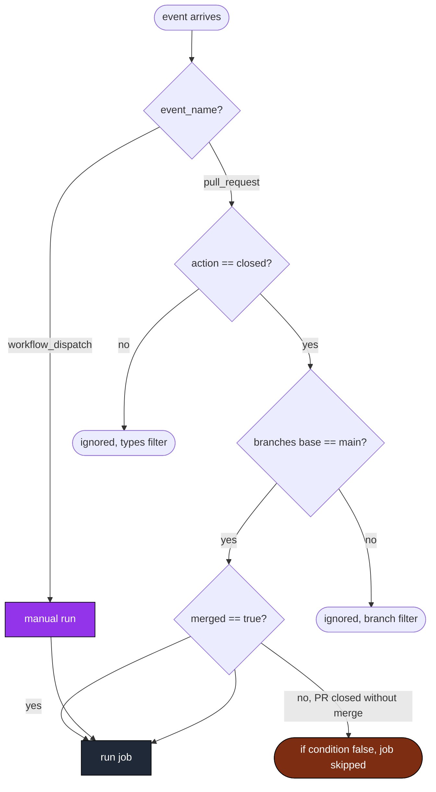
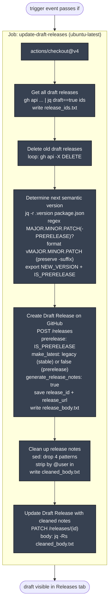
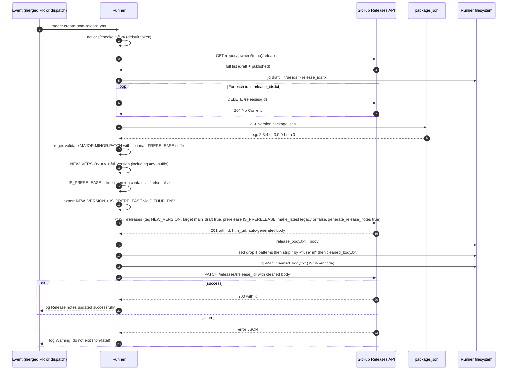
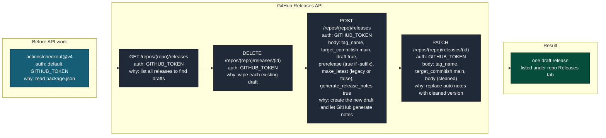
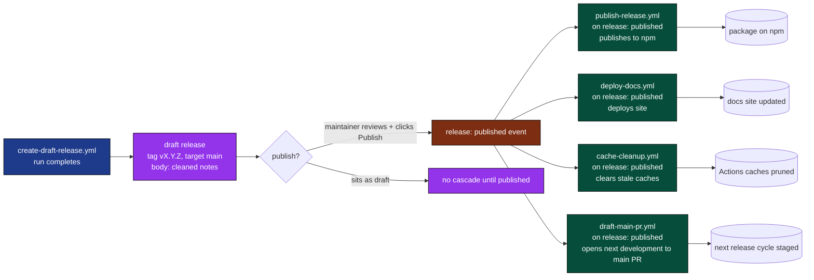
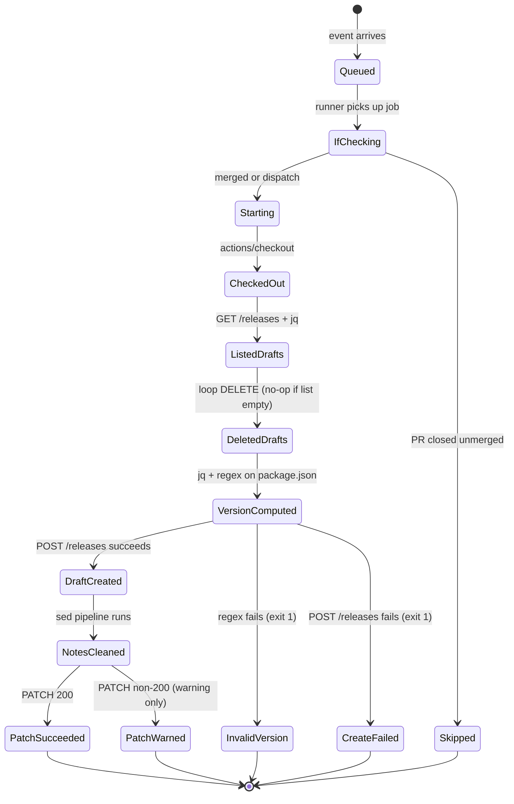
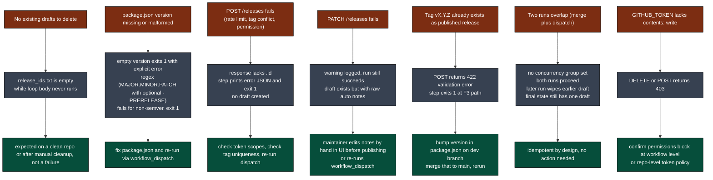
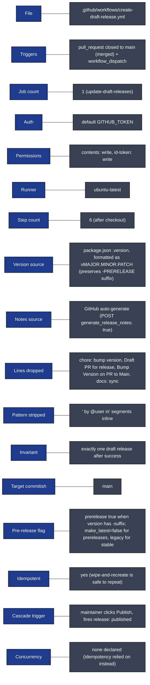

# create-draft-release: Visual Deep Dive

Concentrated diagrams for [.github/workflows/create-draft-release.yml](../workflows/create-draft-release.yml) and the surrounding release pipeline it slots into. Companion to [WORKFLOW_ARCHITECTURE.md](WORKFLOW_ARCHITECTURE.md).

Minimum prose. Maximum diagrams.

## Navigate

- [1. The whole picture](#1-the-whole-picture)
- [2. Triggers](#2-triggers)
- [3. The one-job DAG](#3-the-one-job-dag)
- [4. Step-by-step lifecycle](#4-step-by-step-lifecycle)
- [5. The draft-wipe and recreate pattern](#5-the-draft-wipe-and-recreate-pattern)
- [6. The release notes cleaning rules](#6-the-release-notes-cleaning-rules)
- [7. External calls](#7-external-calls)
- [8. Output cascade](#8-output-cascade)
- [9. State machine](#9-state-machine)
- [10. Failure modes](#10-failure-modes)
- [11. Quick reference card](#11-quick-reference-card)

---

## 1. The whole picture

How [create-draft-release.yml](../workflows/create-draft-release.yml) sits inside the release pipeline.

```mermaid
flowchart LR
    classDef trig fill:#0b3954,color:#fff,stroke:#000
    classDef job fill:#1e3a8a,color:#fff,stroke:#000
    classDef ext fill:#064e3b,color:#fff,stroke:#000
    classDef file fill:#374151,color:#fff,stroke:#000
    classDef out fill:#581c87,color:#fff,stroke:#000
    classDef human fill:#7c2d12,color:#fff,stroke:#000

    subgraph T["Triggers"]
        t1["pull_request closed\non branch main\n(must be merged)"]:::trig
        t2["workflow_dispatch\n(manual)"]:::trig
    end

    subgraph A["create-draft-release.yml"]
        J["update-draft-releases job\nubuntu-latest"]:::job
    end

    subgraph S["Auth"]
        s1["GITHUB_TOKEN\n(default, scoped to repo)"]:::file
    end

    subgraph F["Files touched"]
        f1["package.json\nread .version with jq"]:::file
        f2["release_ids.txt\ntmp: list of draft ids"]:::file
        f3["release_body.txt\ntmp: GitHub auto notes"]:::file
        f4["cleaned_body.txt\ntmp: post-sed notes"]:::file
    end

    subgraph X["GitHub Releases API"]
        x1["GET /releases\nfilter draft==true"]:::ext
        x2["DELETE /releases/&lt;id&gt;"]:::ext
        x3["POST /releases\ngenerate_release_notes: true"]:::ext
        x4["PATCH /releases/&lt;id&gt;\nbody: cleaned"]:::ext
    end

    subgraph O["Outputs"]
        o1["one draft release\ntag vMAJOR.MINOR.PATCH (optionally -PRERELEASE)\ntarget main\nprerelease flag set when version has -suffix"]:::out
    end

    subgraph H["Human gate"]
        h1["maintainer reviews\nedits notes if needed\nclicks Publish"]:::human
    end

    subgraph D["Downstream (on publish)"]
        d1["publish-release.yml\nfires on release: published"]:::job
        d2["deploy-docs.yml"]:::job
        d3["cache-cleanup.yml"]:::job
        d4["draft-main-pr.yml\nopens next dev to main PR"]:::job
    end

    t1 --> J
    t2 --> J
    s1 --> J
    J --> x1 --> f2
    f2 --> x2
    J --> f1
    f1 --> x3 --> f3
    f3 --> f4
    f4 --> x4 --> o1
    o1 --> h1
    h1 -->|publish| d1
    h1 -->|publish| d2
    h1 -->|publish| d3
    h1 -->|publish| d4
```



[Back to top](#navigate)

---

## 2. Triggers

Two entry points. Both gated by a job-level `if` that requires a merged PR or a manual run.



Source: [.github/workflows/create-draft-release.yml](../workflows/create-draft-release.yml) lines 3-9 (event filters) and line 22 (job-level `if`).

The `pull_request: closed` event fires on both merged and abandoned PRs. The `if: github.event.pull_request.merged == true || github.event_name == 'workflow_dispatch'` is what blocks the abandoned case.

[Back to top](#navigate)

---

## 3. The one-job DAG

Six steps in a single job. No matrix, no parallelism, no fan-out.



Steps share state through files on the runner (`release_ids.txt`, `release_body.txt`, `cleaned_body.txt`), `$GITHUB_ENV` (`NEW_VERSION`), and `$GITHUB_OUTPUT` (`release_id`, `release_url`).

[Back to top](#navigate)

---

## 4. Step-by-step lifecycle

One run from trigger to PATCH, with every API call and file write.



Source: [.github/workflows/create-draft-release.yml](../workflows/create-draft-release.yml) lines 24-113.

[Back to top](#navigate)

---

## 5. The draft-wipe and recreate pattern

Why we delete every existing draft before creating a new one instead of editing in place.

```mermaid
flowchart TB
    classDef bad fill:#7c2d12,color:#fff,stroke:#000
    classDef good fill:#064e3b,color:#fff,stroke:#000
    classDef neutral fill:#374151,color:#fff,stroke:#000

    start([new merge to main lands])
    start --> Q{update in place or wipe and recreate?}

    Q -->|update in place| U1["find existing draft by tag"]:::neutral
    U1 --> U2["tag may not match new version"]:::bad
    U2 --> U3["release notes are stale, must be regenerated anyway"]:::bad
    U3 --> U4["risk of multiple drafts piling up over time"]:::bad
    U4 --> U5["complexity: which draft is the live one?"]:::bad

    Q -->|wipe and recreate (chosen)| W1["GET /releases, filter draft==true"]:::good
    W1 --> W2["DELETE every draft id"]:::good
    W2 --> W3["state is now: zero drafts"]:::good
    W3 --> W4["POST /releases with fresh tag + auto notes"]:::good
    W4 --> W5["invariant: exactly one draft exists"]:::good
    W5 --> W6["each merge resets the slate"]:::good
```

The pattern guarantees the **one-draft invariant**: after every successful run, exactly one draft release exists and it reflects the current `package.json` version plus every commit since the last published tag.

[Back to top](#navigate)

---

## 6. The release notes cleaning rules

GitHub's auto-generated notes include automation noise we never want shipped to users. Five sed rules clean them.

```mermaid
flowchart TB
    classDef in fill:#0e7490,color:#fff,stroke:#000
    classDef drop fill:#7c2d12,color:#fff,stroke:#000
    classDef strip fill:#9a3412,color:#fff,stroke:#000
    classDef out fill:#064e3b,color:#fff,stroke:#000

    A["release_body.txt\n(raw auto-generated notes from POST response)"]:::in

    A --> R1{line matches\n'chore: bump version'\n(case insensitive)?}
    R1 -->|yes| D1["DROP entire line"]:::drop
    R1 -->|no| R2

    R2{line matches\n'Draft PR for release'\n(case insensitive)?}
    R2 -->|yes| D2["DROP entire line"]:::drop
    R2 -->|no| R3

    R3{line matches\n'Bump Version on PR to Main'\n(case insensitive)?}
    R3 -->|yes| D3["DROP entire line"]:::drop
    R3 -->|no| R4

    R4{line matches\n'docs: sync'\n(case insensitive)?}
    R4 -->|yes| D4["DROP entire line"]:::drop
    R4 -->|no| K[KEEP line]

    K --> S{line contains\n' by @username in '?}
    S -->|yes| S1["STRIP the ' by @user in' segment\n(leaves PR link intact)"]:::strip
    S -->|no| S2[leave line unchanged]

    D1 --> Z[(cleaned_body.txt)]:::out
    D2 --> Z
    D3 --> Z
    D4 --> Z
    S1 --> Z
    S2 --> Z
```

The actual sed pipeline:

```
sed '/chore: bump version/Id; /Draft PR for release/Id; /Bump Version on PR to Main/Id; /docs: sync/Id' release_body.txt \
  | sed -E 's/ by @[^ ]+ in/ /g'
```

The `I` flag on each pattern makes the match case-insensitive. The `d` action deletes the matching line. The second sed strips contributor attribution for what amounts to bot PRs that exist purely to manage versioning.

[Back to top](#navigate)

---

## 7. External calls

Every network call, with credential and reason.



Auth note: the workflow uses the default `GITHUB_TOKEN` (not the App bot). Default token is enough because:

- `contents: write` permission is granted at workflow level (line 13).
- The default token can create and modify releases on the same repo.
- No downstream workflow needs to fire here, so the "bot token to trigger cascade" reason does not apply.

The cascade fires later when the **human** publishes the draft.

[Back to top](#navigate)

---

## 8. Output cascade

The draft sits idle until a human clicks publish. Publishing is what unlocks the chain.



The draft is the **commit point**. Everything before it is automatic and reversible (delete the draft, re-run). Everything after the human clicks publish is permanent.

[Back to top](#navigate)

---

## 9. State machine

A single run as a finite state machine.



Note the asymmetry: `POST` failure exits the run, but `PATCH` failure only logs a warning. The reasoning is in the next section.

[Back to top](#navigate)

---

## 10. Failure modes

Where things break, what happens, what to do.



The PATCH-is-non-fatal choice is deliberate: a draft with unclean notes is still useful (maintainer can edit in the UI), while a missing draft is not. Better to ship the draft than block on cosmetics.

[Back to top](#navigate)

---

## 11. Quick reference card



Direct links:

- Workflow file: [.github/workflows/create-draft-release.yml](../workflows/create-draft-release.yml)
- Downstream on publish: [publish-release.yml](../workflows/publish-release.yml), [deploy-docs.yml](../workflows/deploy-docs.yml), [cache-cleanup.yml](../workflows/cache-cleanup.yml), [draft-main-pr.yml](../workflows/draft-main-pr.yml)
- Version source: [package.json](../../package.json)
- Full architecture doc: [WORKFLOW_ARCHITECTURE.md](WORKFLOW_ARCHITECTURE.md)

[Back to top](#navigate)
