# deploy-docs: Visual Deep Dive

Concentrated diagrams for [.github/workflows/deploy-docs.yml](../workflows/deploy-docs.yml). This workflow ships the VitePress site to S3 behind CloudFront, using a versioned-folder origin-rotation pattern so the live URL never changes during a release.

Minimum prose. Maximum diagrams.

## Navigate

- [1. The whole picture](#1-the-whole-picture)
- [2. Triggers and branch guards](#2-triggers-and-branch-guards)
- [3. The two-job DAG](#3-the-two-job-dag)
- [4. Step-by-step lifecycle](#4-step-by-step-lifecycle)
- [5. The PACKAGE_ID convention](#5-the-package_id-convention)
- [6. The OIDC federation handshake](#6-the-oidc-federation-handshake)
- [7. The CloudFront origin-rotation pattern](#7-the-cloudfront-origin-rotation-pattern)
- [8. External calls](#8-external-calls)
- [9. Why versioned S3 folders + origin rotation](#9-why-versioned-s3-folders--origin-rotation)
- [10. Output cascade](#10-output-cascade)
- [11. The state machine](#11-the-state-machine)
- [12. Failure modes](#12-failure-modes)
- [13. Quick reference card](#13-quick-reference-card)

---

## 1. The whole picture

How [deploy-docs.yml](../workflows/deploy-docs.yml) plugs into GitHub identity, AWS IAM/STS, S3, and CloudFront.

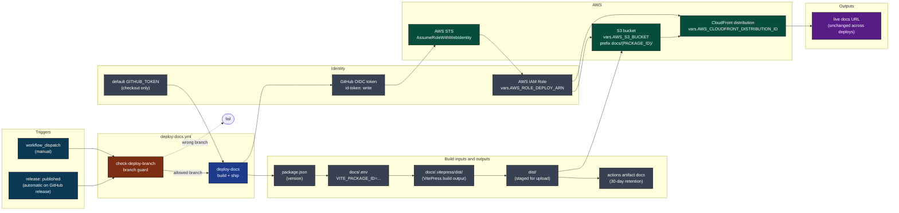

[Back to top](#navigate)

---

## 2. Triggers and branch guards

Two entry points. Each carries a different branch contract enforced by `check-deploy-branch`.

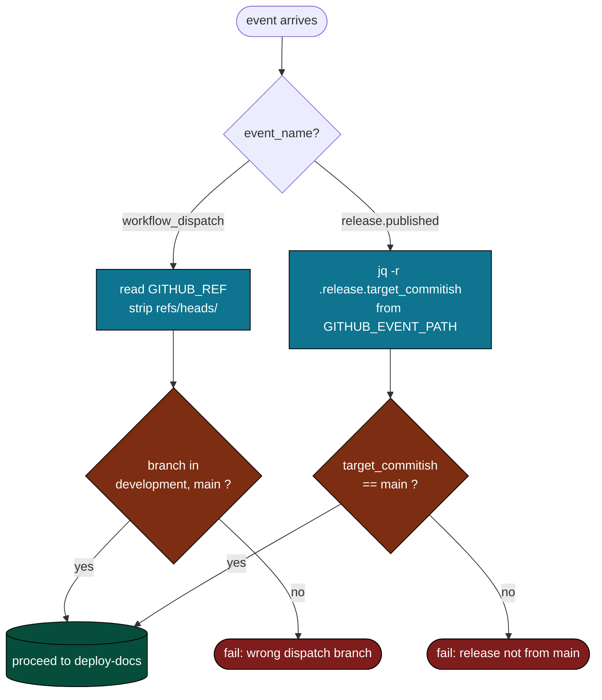

Source: [.github/workflows/deploy-docs.yml](../workflows/deploy-docs.yml) lines 14-34.

[Back to top](#navigate)

---

## 3. The two-job DAG

A guard job and the real work, wired with `needs:`.

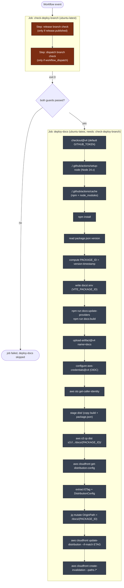

The deploy-docs job also re-evaluates `if: github.event_name == 'workflow_dispatch' || github.event_name == 'release'` as belt-and-suspenders.

[Back to top](#navigate)

---

## 4. Step-by-step lifecycle

One end-to-end run, from event to invalidation.

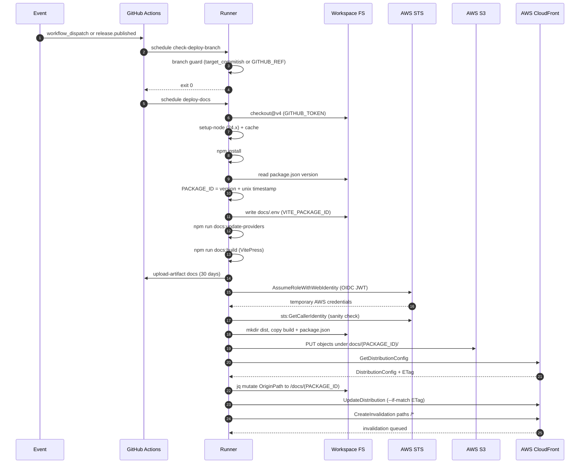

Source: [.github/workflows/deploy-docs.yml](../workflows/deploy-docs.yml) lines 36-141.

[Back to top](#navigate)

---

## 5. The PACKAGE_ID convention

`PACKAGE_ID` is the keystone. Same string lands in three places: the build env, the S3 prefix, and the CloudFront origin path.

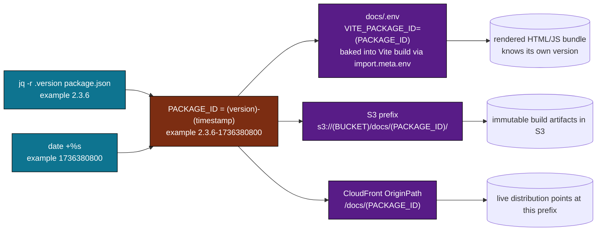

The timestamp suffix means two deploys of the same `package.json` version still get distinct prefixes. Old prefixes stay in S3 as a rollback inventory.

[Back to top](#navigate)

---

## 6. The OIDC federation handshake

No long-lived AWS keys live in GitHub. The job mints a short-lived JWT, STS verifies it against the configured trust policy, and returns temporary credentials.

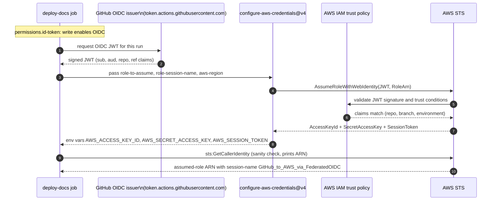

If the trust policy on `vars.AWS_ROLE_DEPLOY_ARN` does not match the repo, branch, or session-name claims, `AssumeRoleWithWebIdentity` fails and every subsequent AWS call returns `AccessDenied`.

[Back to top](#navigate)

---

## 7. The CloudFront origin-rotation pattern

The live URL never changes. What changes is which S3 prefix CloudFront treats as origin root. The mutation goes through read-modify-write with an ETag guard.

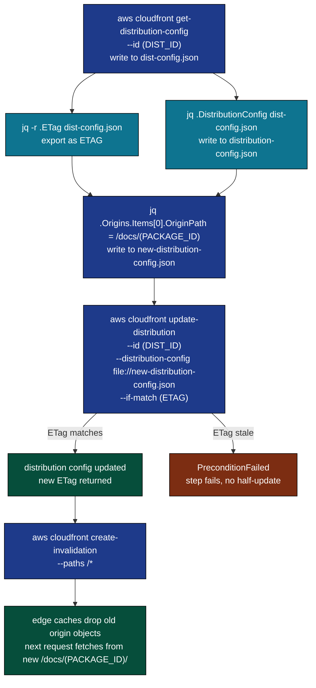

The `--if-match` ETag is the optimistic-lock. If anything else mutated the distribution between `get` and `update`, the workflow fails loudly rather than clobbering.

[Back to top](#navigate)

---

## 8. External calls

Who is contacted, with what credential, why.

```mermaid
flowchart LR
    classDef pre fill:#155e75,color:#fff,stroke:#000
    classDef build fill:#1e3a8a,color:#fff,stroke:#000
    classDef aws fill:#064e3b,color:#fff,stroke:#000
    classDef art fill:#581c87,color:#fff,stroke:#000

    subgraph Pre["Before AWS"]
        c1["actions/checkout@v4\nauth: default GITHUB_TOKEN\nwhy: clone repo at the dispatched ref"]:::pre
        c2["./.github/actions/setup-node\nauth: none\nwhy: install Node 24.x + npm registry"]:::pre
        c3["./.github/actions/cache\nauth: none\nwhy: warm ~/.npm and node_modules"]:::pre
        c4["npm registry\nauth: anonymous\nwhy: npm install"]:::build
    end

    subgraph Build["Build"]
        b1["npm run docs:update-providers\nupdates provider metadata in docs"]:::build
        b2["npm run docs:build\nVitePress build to docs/.vitepress/dist"]:::build
        b3["actions/upload-artifact@v4\nname: docs, 30-day retention"]:::art
    end

    subgraph AWS["AWS plane"]
        a1["AWS STS\nauth: OIDC JWT\nwhy: AssumeRoleWithWebIdentity"]:::aws
        a2["AWS IAM (trust policy)\nauth: none (read by STS)\nwhy: validate repo/branch claims"]:::aws
        a3["AWS S3\nauth: temporary creds\nwhy: PUT docs/(PACKAGE_ID)/*"]:::aws
        a4["AWS CloudFront\nauth: temporary creds\nwhy: GET/UPDATE config, create invalidation"]:::aws
    end

    c1 --> c2 --> c3 --> c4 --> b1 --> b2 --> b3
    b3 --> a1
    a1 --> a2 --> a3
    a2 --> a4
```

Variables and secrets used:

| Reference | Type | Used by |
|-----------|------|---------|
| `vars.AWS_ROLE_DEPLOY_ARN` | repo/org variable | configure-aws-credentials role-to-assume |
| `vars.AWS_REGION` | repo/org variable | configure-aws-credentials aws-region |
| `vars.AWS_S3_BUCKET` | repo/org variable | S3 cp destination |
| `vars.AWS_CLOUDFRONT_DISTRIBUTION_ID` | repo/org variable | cloudfront get/update/invalidate |
| `GITHUB_TOKEN` (default) | per-job token | checkout |
| OIDC JWT | per-job token | STS AssumeRoleWithWebIdentity |

No long-lived AWS access key is configured. Rotation is implicit: every job mints fresh creds.

[Back to top](#navigate)

---

## 9. Why versioned S3 folders + origin rotation

Two design choices that look like complexity but bought specific properties.

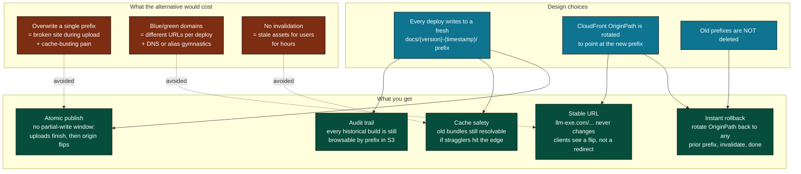

[Back to top](#navigate)

---

## 10. Output cascade

What this workflow produces and who consumes it.

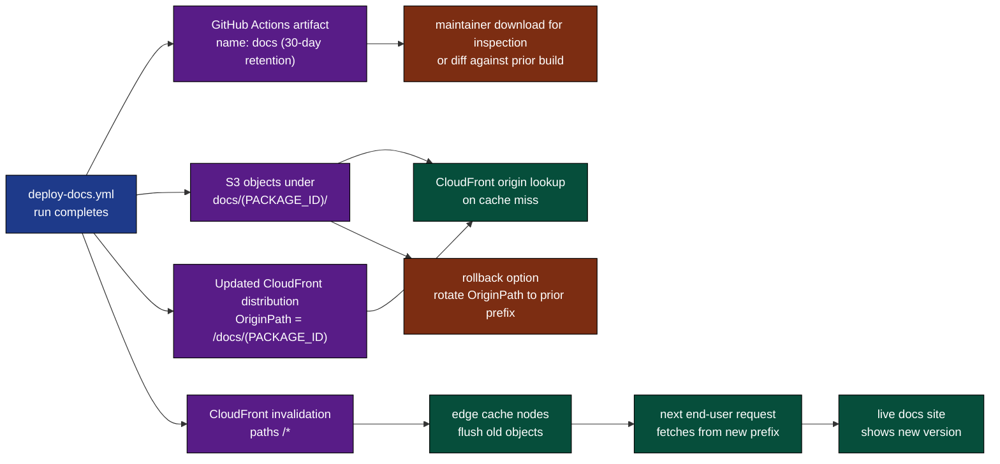

The artifact upload is a safety net. The real publish is the S3 PUT plus the CloudFront flip.

[Back to top](#navigate)

---

## 11. The state machine

A single deploy as a finite state machine.

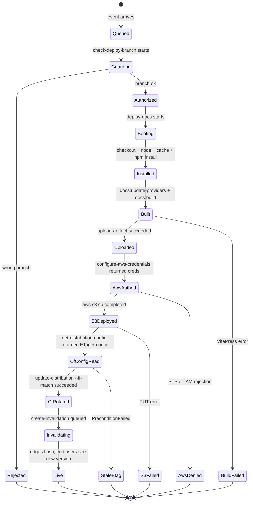

The S3 PUT is the point of no easy return: once new objects exist under the new prefix, the only forward path is to either flip CloudFront or leave the new prefix as cold inventory.

[Back to top](#navigate)

---

## 12. Failure modes

Where things break, what happens, what to do.

```mermaid
flowchart TB
    classDef fail fill:#7c2d12,color:#fff,stroke:#000
    classDef effect fill:#374151,color:#fff,stroke:#000
    classDef fix fill:#064e3b,color:#fff,stroke:#000

    F1["Wrong branch\n(release not from main, or dispatch\nfrom branch other than dev/main)"]:::fail
    F1 --> F1E["check-deploy-branch exits 1\ndeploy-docs never runs"]:::effect
    F1F["create release from main\nor dispatch from development/main"]:::fix
    F1E --> F1F

    F2["OIDC denied\ntrust policy claim mismatch"]:::fail
    F2 --> F2E["AssumeRoleWithWebIdentity fails\nall AWS steps return AccessDenied"]:::effect
    F2F["check role trust policy:\nrepo, branch, session-name claims"]:::fix
    F2E --> F2F

    F3["S3 write fails\n(missing s3:PutObject or bucket policy)"]:::fail
    F3 --> F3E["aws s3 cp returns non-zero\nstep fails before CloudFront touched"]:::effect
    F3F["grant role s3:PutObject on\narn:aws:s3:::(BUCKET)/docs/*"]:::fix
    F3E --> F3F

    F4["VitePress build fails\n(broken docs/, missing partial)"]:::fail
    F4 --> F4E["npm run docs:build exits non-zero\nno artifact uploaded, no S3 PUT"]:::effect
    F4F["fix docs source, rerun"]:::fix
    F4E --> F4F

    F5["CloudFront update fails\nstale ETag (PreconditionFailed)"]:::fail
    F5 --> F5E["update-distribution rejected\nS3 has new prefix but live origin still old\nno invalidation issued"]:::effect
    F5F["re-run the workflow\nget-config returns fresh ETag"]:::fix
    F5E --> F5F

    F6["Missing CloudFront permission"]:::fail
    F6 --> F6E["get-distribution-config or update returns AccessDenied"]:::effect
    F6F["grant role cloudfront:GetDistributionConfig,\ncloudfront:UpdateDistribution,\ncloudfront:CreateInvalidation"]:::fix
    F6E --> F6F

    F7["docs/.env not written\n(VITE_PACKAGE_ID missing)"]:::fail
    F7 --> F7E["build runs but bundle has no PACKAGE_ID\nclient-side version display blank"]:::effect
    F7F["check docs/.env step\nand env: PACKAGE_ID forwarding"]:::fix
    F7E --> F7F

    F8["Invalidation queued but slow"]:::fail
    F8 --> F8E["users may see prior version\nfor a few minutes at edge"]:::effect
    F8F["expected, not a failure\ntypical propagation under 5 minutes"]:::fix
    F8E --> F8F
```

The dangerous failure is F5: S3 has the new build but CloudFront still points at the old origin. The fix is idempotent (rerun gets a fresh ETag and rotates), but the deploy is in a half-state until then.

[Back to top](#navigate)

---

## 13. Quick reference card

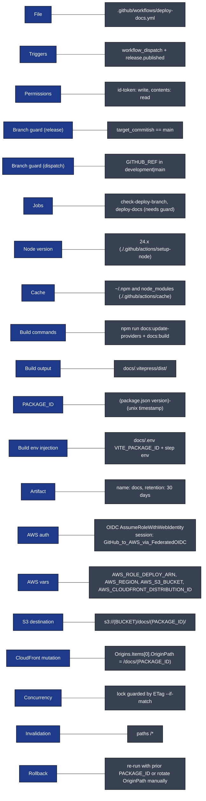

Direct links:

- Workflow file: [.github/workflows/deploy-docs.yml](../workflows/deploy-docs.yml)
- Composite actions: [setup-node](../actions/setup-node/action.yml), [cache](../actions/cache/action.yml)
- Build scripts: `docs:update-providers`, `docs:build`, `predocs:build` in [package.json](../../package.json)
- VitePress source: [docs/](../../docs/)

[Back to top](#navigate)
