# docs-sync: Visual Deep Dive

Concentrated diagrams for [.github/workflows/docs-sync.yml](../workflows/docs-sync.yml). Companion to [WORKFLOW_ARCHITECTURE.md](WORKFLOW_ARCHITECTURE.md) and the template at [AGENT_RUN_DEEP_DIVE.md](AGENT_RUN_DEEP_DIVE.md).

Minimum prose. Maximum diagrams.

## Navigate

- [1. The whole picture](#1-the-whole-picture)
- [2. Triggers and what each one does](#2-triggers-and-what-each-one-does)
- [3. Loop prevention](#3-loop-prevention)
- [4. Inputs and how they shape the run](#4-inputs-and-how-they-shape-the-run)
- [5. The sync job steps](#5-the-sync-job-steps)
- [6. Step-by-step lifecycle](#6-step-by-step-lifecycle)
- [7. Diff detection logic](#7-diff-detection-logic)
- [8. File-to-doc routing](#8-file-to-doc-routing)
- [9. Anatomy of the prompt](#9-anatomy-of-the-prompt)
- [10. Filesystem reads and writes](#10-filesystem-reads-and-writes)
- [11. External calls](#11-external-calls)
- [12. Output cascade](#12-output-cascade)
- [13. The state machine](#13-the-state-machine)
- [14. Failure modes](#14-failure-modes)
- [15. Quick reference card](#15-quick-reference-card)
- [16. Security boundaries](#16-security-boundaries)

---

## 1. The whole picture

How [docs-sync.yml](../workflows/docs-sync.yml) plugs into the rest of the system.

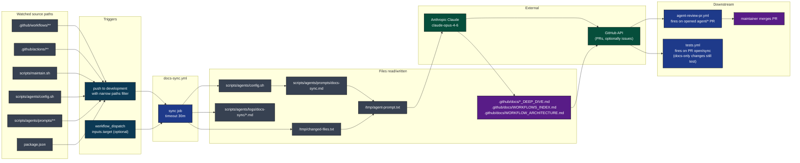

[Back to top](#navigate)

---

## 2. Triggers and what each one does

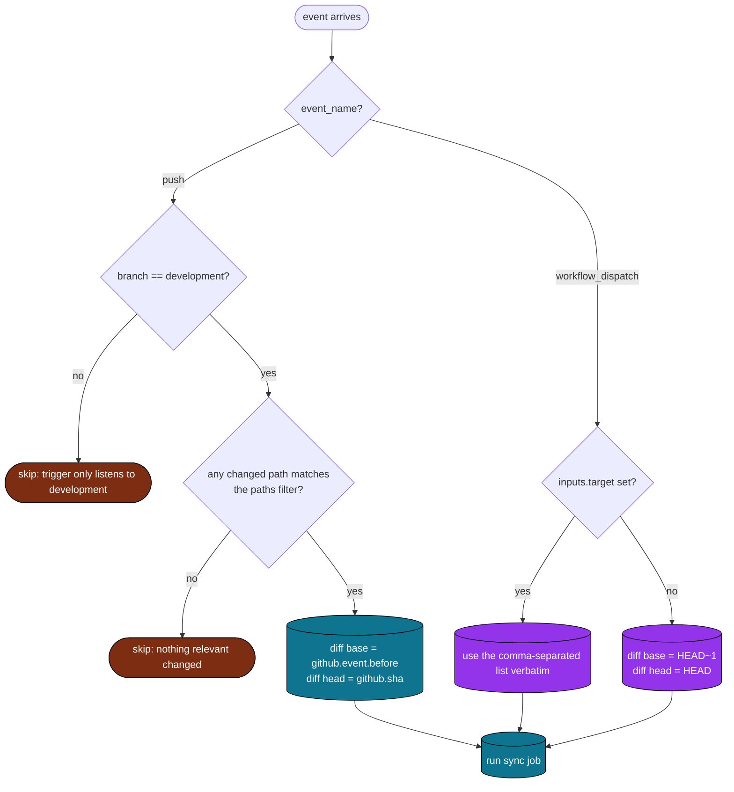

Source: [.github/workflows/docs-sync.yml](../workflows/docs-sync.yml) lines 12-29 (triggers + paths).

[Back to top](#navigate)

---

## 3. Loop prevention

This workflow is exposed to one specific failure mode: the bot's own output retriggering itself. The paths filter provides two independent guards.

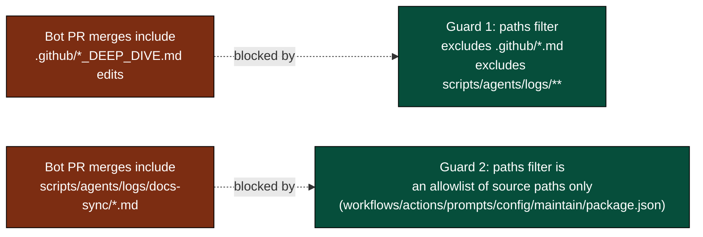

The path filter is an allowlist by intent, not a denylist. Adding `scripts/**` (broader) would silently re-include the log directory and break the system.

[Back to top](#navigate)

---

## 4. Inputs and how they shape the run

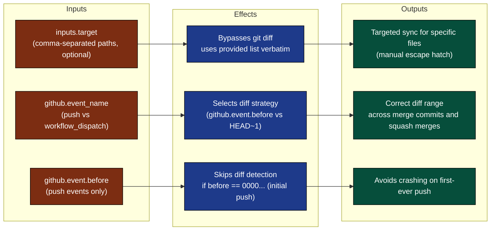

[Back to top](#navigate)

---

## 5. The sync job steps

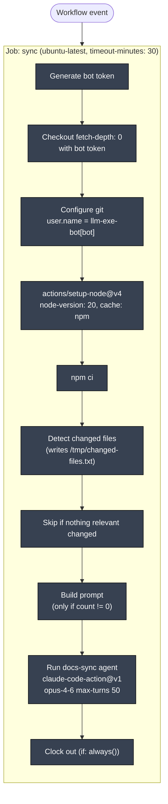

Concurrency group is `docs-sync` with `cancel-in-progress: false`. Two pushes in quick succession queue rather than cancel.

[Back to top](#navigate)

---

## 6. Step-by-step lifecycle

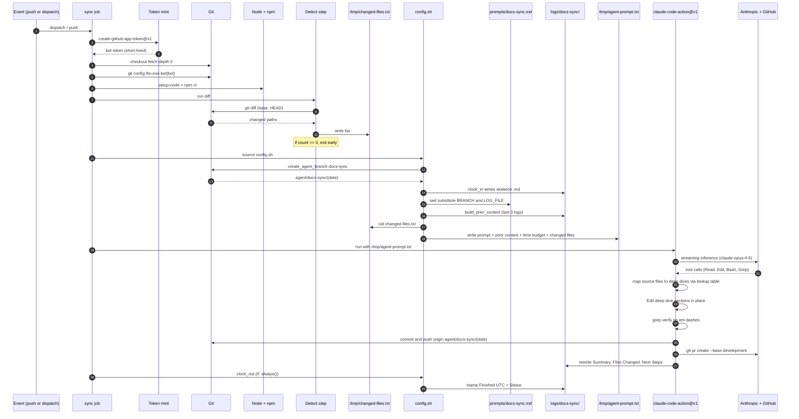

[Back to top](#navigate)

---

## 7. Diff detection logic

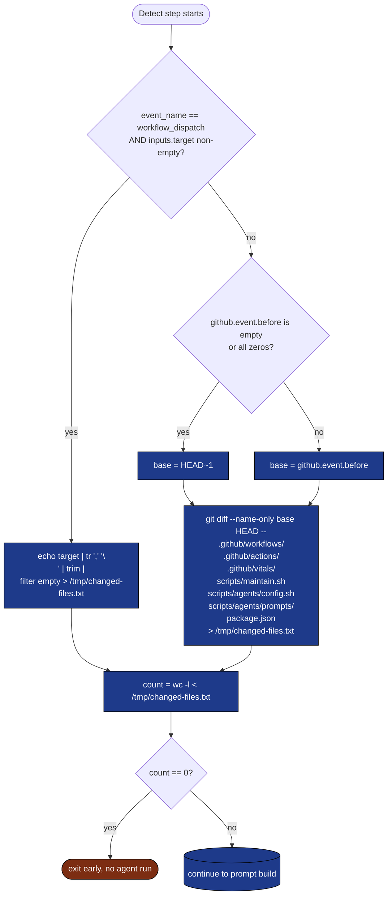

The pathspec on the diff is a defense-in-depth: even if a future maintainer broadens the trigger's `paths` filter, the diff itself stays narrow.

[Back to top](#navigate)

---

## 8. File-to-doc routing

This is the table the agent consults to decide what to update. It lives inside [scripts/agents/prompts/docs-sync.md](../../scripts/agents/prompts/docs-sync.md) so future edits do not require workflow changes.

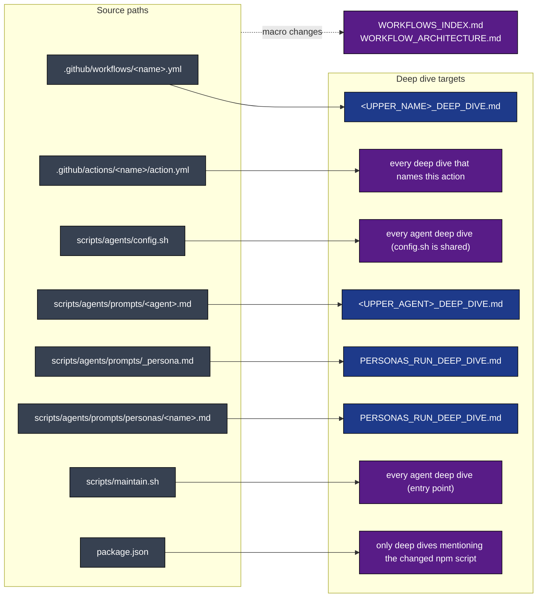

A workflow added or removed always cascades into [WORKFLOWS_INDEX.md](WORKFLOWS_INDEX.md) and [WORKFLOW_ARCHITECTURE.md](WORKFLOW_ARCHITECTURE.md).

[Back to top](#navigate)

---

## 9. Anatomy of the prompt

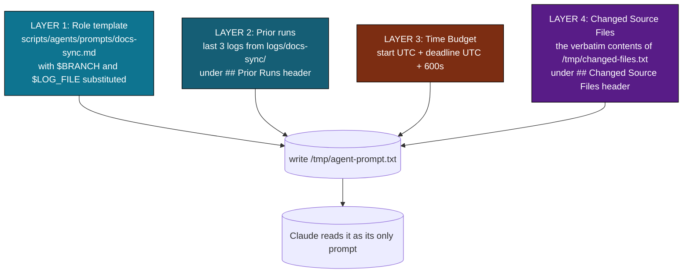

Unlike most agents, docs-sync always has a fourth layer (the diff list). It is the agent's primary input. Without it the agent has nothing to react to.

[Back to top](#navigate)

---

## 10. Filesystem reads and writes

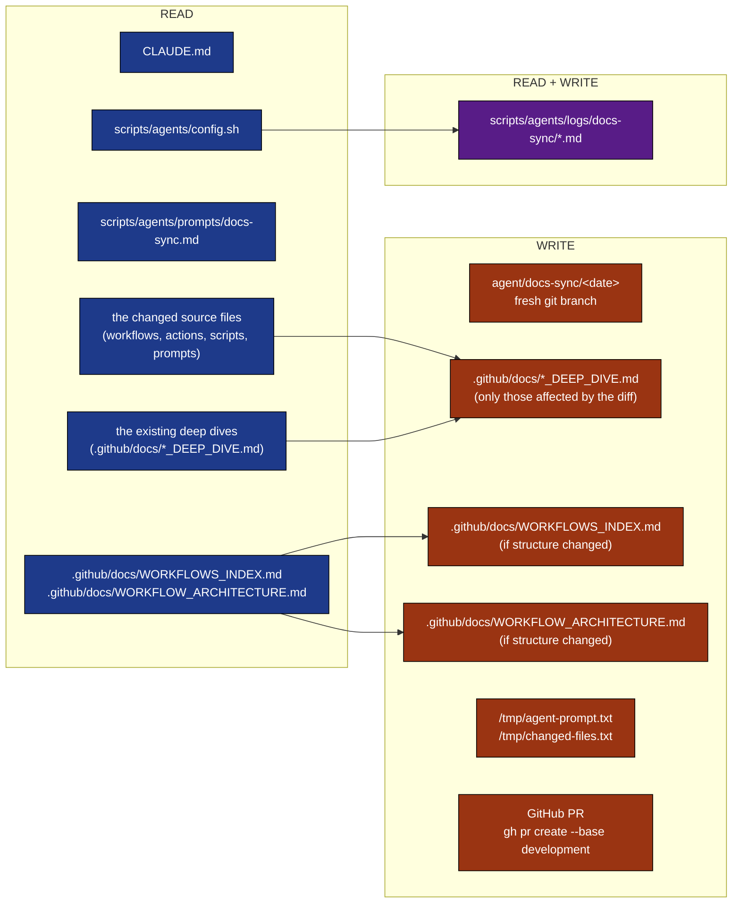

The agent must NEVER write under `.github/workflows/`, `.github/actions/`, or `scripts/`. The prompt enforces this; the reviewer agent will reject any PR that does.

[Back to top](#navigate)

---

## 11. External calls

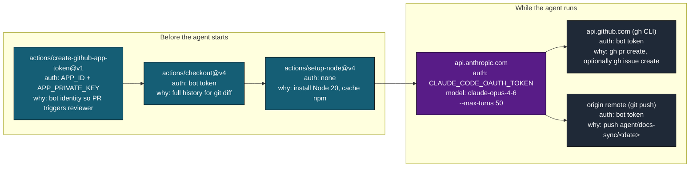

Tool allowlist: `Bash,Read,Write,Edit,Glob,Grep,WebFetch`. No `WebSearch` is needed; the agent only reads local files. `allowed_bots: "llm-exe-bot[bot]"` is passed to `claude-code-action` so the action operates on commits authored by the bot.

[Back to top](#navigate)

---

## 12. Output cascade

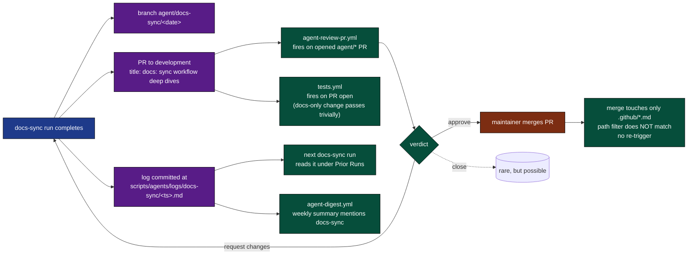

The "no re-trigger" terminus is intentional and load-bearing. See [section 3](#3-loop-prevention).

[Back to top](#navigate)

---

## 13. The state machine

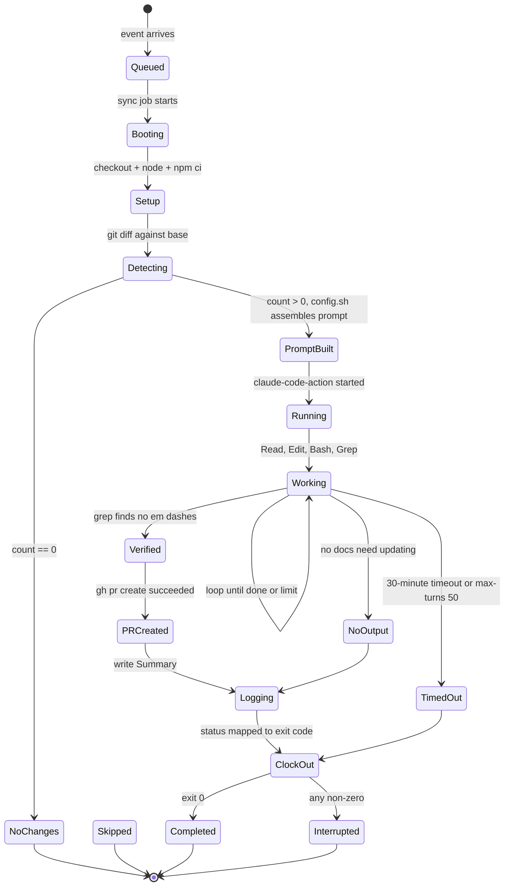

`if: always()` on the clock-out step means even `TimedOut` and `Interrupted` paths stamp a finish time. The log file is never left in `running` state.

[Back to top](#navigate)

---

## 14. Failure modes

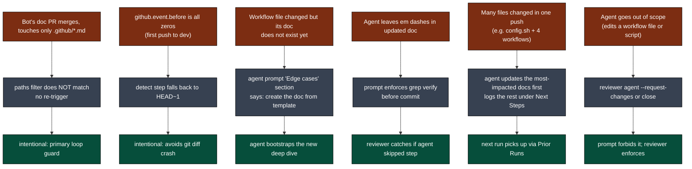

[Back to top](#navigate)

---

## 15. Quick reference card

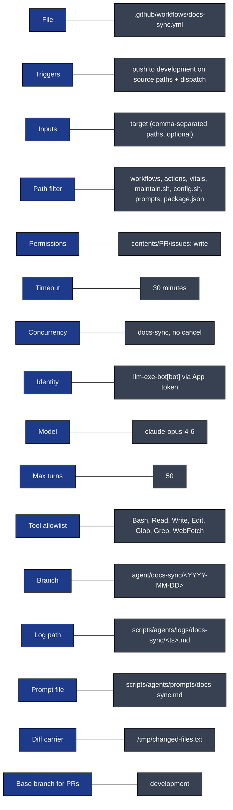

Direct links:

- Workflow file: [.github/workflows/docs-sync.yml](../workflows/docs-sync.yml)
- Prompt template: [scripts/agents/prompts/docs-sync.md](../../scripts/agents/prompts/docs-sync.md)
- Local runner: `./scripts/maintain.sh docs-sync` ([scripts/maintain.sh](../../scripts/maintain.sh))
- Log directory: [scripts/agents/logs/docs-sync/](../../scripts/agents/logs/docs-sync/)
- Companion docs: [WORKFLOWS_INDEX.md](WORKFLOWS_INDEX.md), [WORKFLOW_ARCHITECTURE.md](WORKFLOW_ARCHITECTURE.md), [AGENT_RUN_DEEP_DIVE.md](AGENT_RUN_DEEP_DIVE.md)

[Back to top](#navigate)

---

## 16. Security boundaries

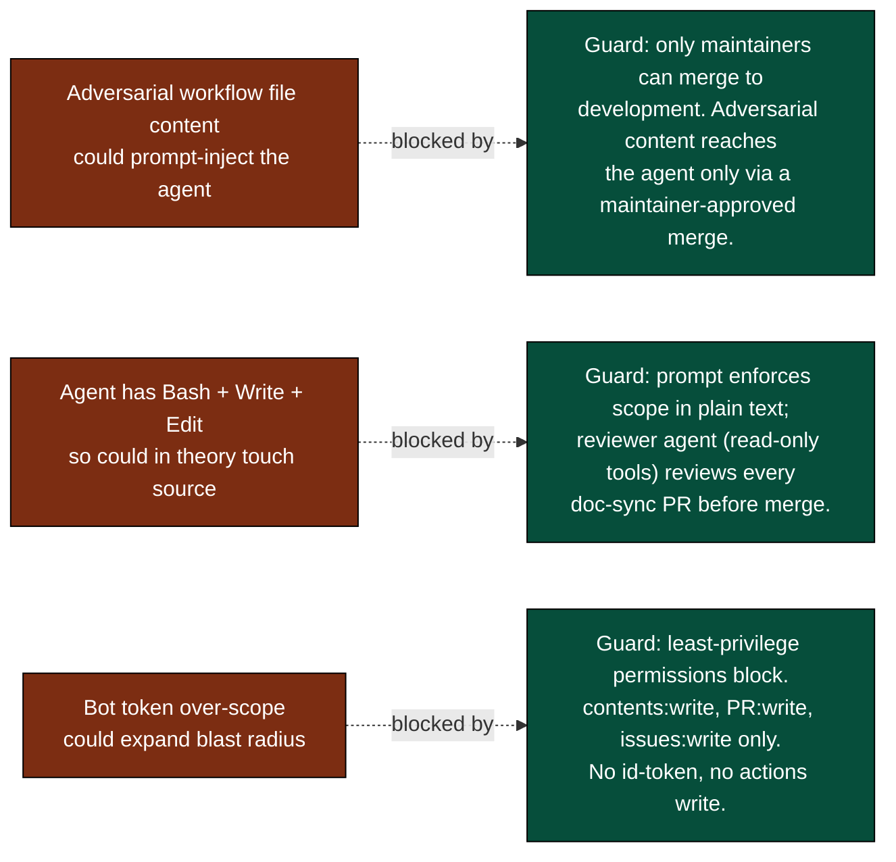

Defense in depth:

| Boundary | Mechanism |
|----------|-----------|
| Triggering | Only fires via `workflow_dispatch` (either manually or from `docs-sync-trigger.yml` on push to `development`). No direct PR or `issue_comment` triggers. Loop prevention is handled by the paths allowlist in the trigger workflow: see [section 3](#3-loop-prevention). |
| Scope | Prompt explicitly forbids touching `.github/workflows/`, `.github/actions/`, `scripts/`, `src/`, `docs/`, `package.json`. |
| Verification | Reviewer agent ([AGENT_REVIEW_PR_DEEP_DIVE.md](AGENT_REVIEW_PR_DEEP_DIVE.md)) reads every `agent/*` PR before merge. Its tool allowlist is read-only so it cannot be prompt-injected to make changes. |
| Token scope | App-minted token with `contents`, `pull-requests`, and `issues` write. No `id-token`, no `actions`, no admin. |
| Loop guards | See [section 3](#3-loop-prevention). |

[Back to top](#navigate)
