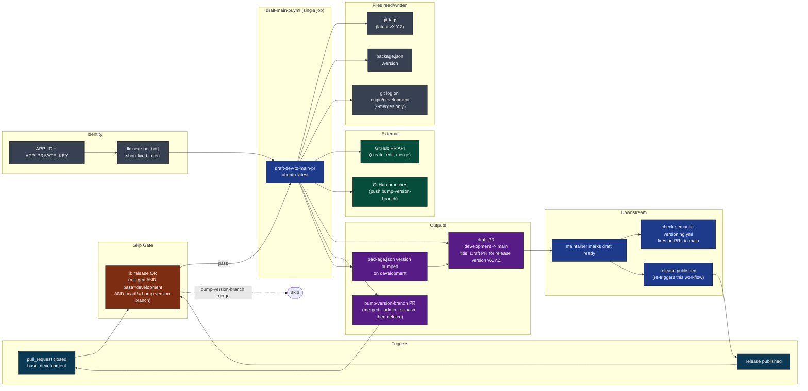
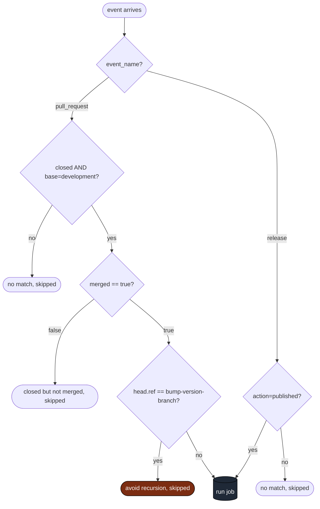
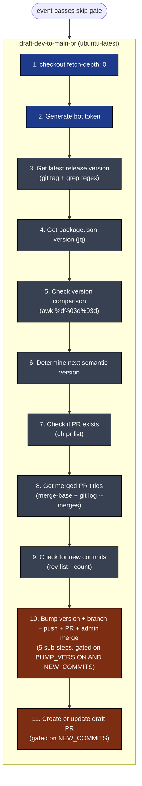
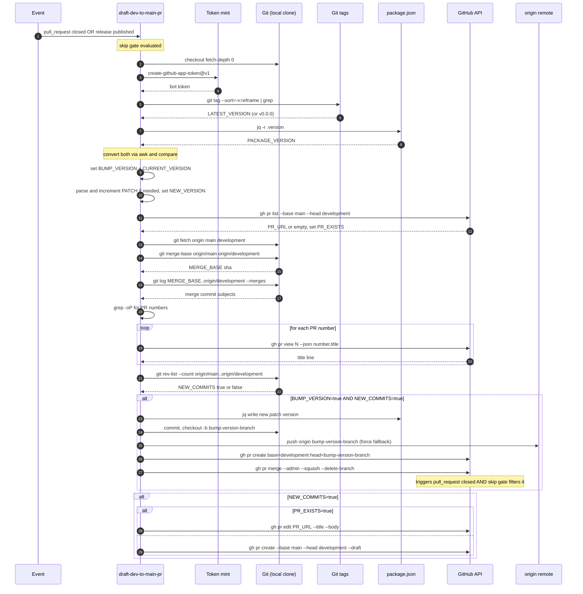
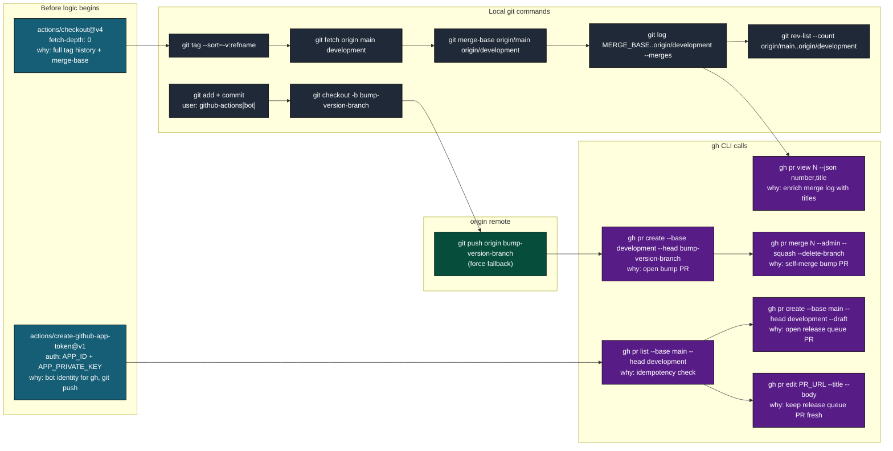
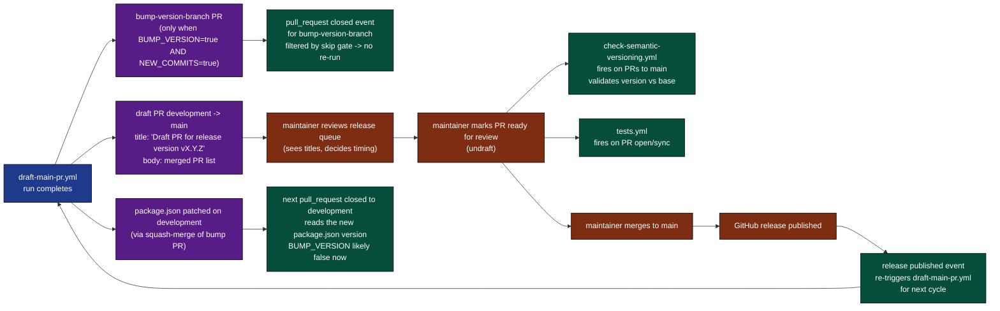
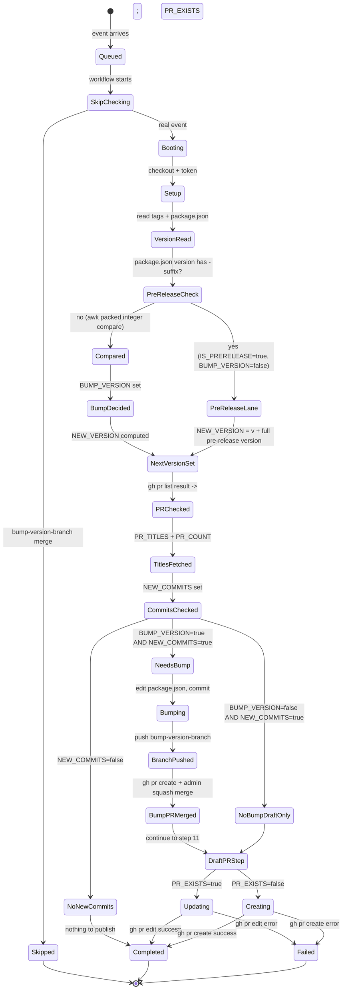
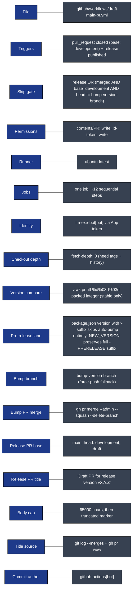

# draft-main-pr: Visual Deep Dive

Concentrated diagrams for [.github/workflows/draft-main-pr.yml](../workflows/draft-main-pr.yml) and the release-queue mechanics it implements. Companion to [WORKFLOW_ARCHITECTURE.md](WORKFLOW_ARCHITECTURE.md).

Minimum prose. Maximum diagrams.

## Navigate

- [1. The whole picture](#1-the-whole-picture)
- [2. Triggers](#2-triggers)
- [3. The one-job DAG](#3-the-one-job-dag)
- [4. Step-by-step lifecycle](#4-step-by-step-lifecycle)
- [5. The version comparison algorithm](#5-the-version-comparison-algorithm)
- [6. The patch-bump path](#6-the-patch-bump-path)
- [7. The PR title aggregation](#7-the-pr-title-aggregation)
- [8. The draft PR creation/update path](#8-the-draft-pr-creationupdate-path)
- [9. External calls](#9-external-calls)
- [10. Output cascade](#10-output-cascade)
- [11. The state machine](#11-the-state-machine)
- [12. Failure modes](#12-failure-modes)
- [13. Quick reference card](#13-quick-reference-card)

---

## 1. The whole picture

How [draft-main-pr.yml](../workflows/draft-main-pr.yml) plugs into the release pipeline.



[Back to top](#navigate)

---

## 2. Triggers

Two entry points. One skip gate to prevent recursion.



Source: [.github/workflows/draft-main-pr.yml](../workflows/draft-main-pr.yml) lines 3-11 (triggers), line 21 (skip gate).

Why the bump-version-branch exclusion exists: this workflow opens a PR from `bump-version-branch` to `development` and admin-merges it. That merge is itself a `pull_request closed to development` event, which would re-trigger the workflow infinitely. The `head.ref != 'bump-version-branch'` clause breaks the loop.

[Back to top](#navigate)

---

## 3. The one-job DAG

Single job, twelve sequential steps. No matrix, no parallelism.



There is no `if: always()` clock-out. If any step fails, the run halts and leaves state as-is. The next event re-runs the whole chain.

[Back to top](#navigate)

---

## 4. Step-by-step lifecycle

One run from event to draft PR, with every external touchpoint.



Source: [.github/workflows/draft-main-pr.yml](../workflows/draft-main-pr.yml) lines 23-297.

[Back to top](#navigate)

---

## 5. The version comparison algorithm

The awk `%d%03d%03d` trick packs `MAJOR.MINOR.PATCH` into a single comparable integer.

```mermaid
flowchart TB
    classDef in fill:#0e7490,color:#fff,stroke:#000
    classDef calc fill:#374151,color:#fff,stroke:#000
    classDef dec fill:#7c2d12,color:#fff,stroke:#000
    classDef out fill:#064e3b,color:#fff,stroke:#000

    A["git tag --sort=-v:refname\n| grep -E '^v[0-9]+\\.[0-9]+\\.[0-9]+$'\n| head -n 1"]:::in
    A --> A1{tag found?}
    A1 -->|no| A2["LATEST_VERSION = v0.0.0"]:::calc
    A1 -->|yes| A3["LATEST_VERSION = matched tag"]:::calc
    A2 --> A4["strip leading 'v'"]:::calc
    A3 --> A4

    B["jq -r .version &lt; package.json"]:::in
    B --> B1["PACKAGE_VERSION"]:::calc

    B1 --> PRE{PACKAGE_VERSION\ncontains '-'?\n(pre-release suffix)}:::dec
    PRE -->|yes| PR1["IS_PRERELEASE=true\nBUMP_VERSION=false\nCURRENT_VERSION=PACKAGE_VERSION\nNEW_VERSION = v + full version (with -suffix)\nskip rest of compare"]:::out
    PRE -->|no| CV2["awk -F. '{ printf %d%03d%03d, $1,$2,$3 }'\non PACKAGE_VERSION"]:::calc

    A4 --> CV1["awk -F. '{ printf %d%03d%03d, $1,$2,$3 }'\non LATEST_VERSION"]:::calc

    CV1 --> EX1["LATEST_VERSION_NUM\nexample: 2.13.4 -&gt; 2013004"]:::calc
    CV2 --> EX2["PACKAGE_VERSION_NUM\nexample: 2.13.4 -&gt; 2013004"]:::calc

    EX1 --> D{PACKAGE_VERSION_NUM\n&lt;=\nLATEST_VERSION_NUM?}:::dec
    EX2 --> D

    D -->|yes| O1["BUMP_VERSION=true\nCURRENT_VERSION=LATEST_VERSION\n(package didn't lead, must bump)"]:::out
    D -->|no| O2["BUMP_VERSION=false\nCURRENT_VERSION=PACKAGE_VERSION\n(package already ahead, use it)"]:::out

    O1 --> N1["parse CURRENT_VERSION via regex\nPATCH = PATCH + 1\nNEW_VERSION = vMAJOR.MINOR.PATCH"]:::calc
    O2 --> N2["parse CURRENT_VERSION via regex\nPATCH unchanged\nNEW_VERSION = vMAJOR.MINOR.PATCH"]:::calc
```

The pre-release branch is the maintainer's manual lane: when `package.json` declares a `-beta.X` / `-rc.X` / `-alpha.X` version, the workflow never auto-bumps and never enters the patch-increment path. The maintainer drives `beta.0 -> beta.1 -> ... -> final` by hand. The draft PR title still updates with the current pre-release version.

Why `%03d` zero-padding works: `1.9.0` becomes `1009000`, `1.10.0` becomes `1010000`. Without padding, lexical string comparison would put `1.10.0` before `1.9.0`. With three-digit zero-padding, integer comparison is correct for any `MINOR` or `PATCH` under 1000.

Limits: any segment at or above 1000 overflows into the next field and breaks ordering. For `llm-exe` this is fine. The awk compare is only used for stable releases; pre-releases short-circuit before it ever runs.

Source: lines 54-117 (including pre-release short-circuit at lines 60-67 and 96-100).

[Back to top](#navigate)

---

## 6. The patch-bump path

When the workflow self-bumps `package.json` on `development`, and how the resulting merge does not re-trigger an infinite loop.

```mermaid
flowchart TB
    classDef cond fill:#7c2d12,color:#fff,stroke:#000
    classDef step fill:#374151,color:#fff,stroke:#000
    classDef out fill:#064e3b,color:#fff,stroke:#000
    classDef skip fill:#1e3a8a,color:#fff,stroke:#000

    A([step 10 starts])
    A --> G1{BUMP_VERSION == true\nAND\nNEW_COMMITS == true?}:::cond
    G1 -->|no (skipped on pre-release or already-ahead version)| OUT1([all 5 sub-steps skipped]):::skip
    G1 -->|yes| S1["re-read latest tag\nparse MAJOR/MINOR/PATCH\nPATCH = PATCH + 1\nNEW_VERSION = MAJOR.MINOR.PATCH (no v)"]:::step
    S1 --> S2["jq write package.json\ngit config github-actions[bot]\ngit add + commit\n'chore: bump version number on PR to main'"]:::step
    S2 --> S3["git checkout -b bump-version-branch\n(or checkout if already exists)\ngit pull origin bump-version-branch || true"]:::step
    S3 --> S4["git push origin bump-version-branch\n|| git push --force"]:::step
    S4 --> S5["gh pr create\n--base development\n--head bump-version-branch\ntitle: 'Bump Version on PR to Main'"]:::step
    S5 --> S6["gh pr merge N\n--admin --squash --delete-branch"]:::step
    S6 --> EV[("emits pull_request closed event\nbase=development\nhead=bump-version-branch")]:::out
    EV --> SK{skip gate filter}:::cond
    SK -->|head.ref == bump-version-branch| OUT2([workflow run skipped]):::skip
    SK -.->|hypothetical re-run| LOOP([infinite loop])
```

Recursion control: step 11 (the draft PR step) runs on the same execution as step 10, so the version bump and the draft PR title are kept consistent within one run. The bump-version-branch merge that follows is filtered by the skip gate at line 21, so it does not start a second run that would race the first.

Source: lines 187-249 (the 5 bump sub-steps), line 21 (skip gate).

[Back to top](#navigate)

---

## 7. The PR title aggregation

How merged PRs since the last release are discovered and rendered into the draft PR body.

```mermaid
flowchart TB
    classDef in fill:#0e7490,color:#fff,stroke:#000
    classDef calc fill:#374151,color:#fff,stroke:#000
    classDef gh fill:#1f2937,color:#fff,stroke:#000
    classDef out fill:#064e3b,color:#fff,stroke:#000

    F1["git fetch origin main development"]:::in
    F1 --> F1a{fetch ok?}
    F1a -->|no| ERR([exit 1])
    F1a -->|yes| MB["git merge-base origin/main origin/development"]:::calc
    MB --> MBO["MERGE_BASE = common ancestor sha"]:::calc

    MBO --> LG["git log MERGE_BASE..origin/development\n--merges --pretty=format:'%s'"]:::calc
    LG --> LGO["merge commit subjects\nlike 'Merge pull request #501 from ...'"]:::calc

    LGO --> GR["grep -oP 'Merge pull request #\\K[0-9]+'\n|| true"]:::calc
    GR --> GRO["PR_NUMBERS\n(newline-separated, may be empty)"]:::calc

    GRO --> LOOP{for each pr_num}
    LOOP -->|pr_num non-empty| GH1["gh pr view pr_num\n--json number,title\n--jq '\"- #(.number): (.title)\"'"]:::gh
    GH1 -->|success| APP["append line + literal \\n to PR_TITLES"]:::calc
    GH1 -->|fail| WARN["log warning, skip this number"]:::calc
    APP --> LOOP
    WARN --> LOOP
    LOOP -->|done| CT["PR_COUNT = grep -c '^- #'\non PR_TITLES (or 0)"]:::calc

    CT --> EXP1["export PR_TITLES heredoc to GITHUB_ENV"]:::out
    CT --> EXP2["export PR_COUNT to GITHUB_ENV"]:::out
```

Notes on robustness:

- `|| true` after `grep -oP` ensures an empty merge log does not fail the step under `set -e`.
- The PR-view loop swallows individual failures with `2>/dev/null` and a warning, so one missing PR (deleted, private, etc) does not poison the whole release body.
- `PR_TITLES` is always exported, even if empty, to prevent unbound variable errors in step 11.

Squash-merged PRs without the literal `Merge pull request #N` subject are missed by the grep. The `llm-exe` repo currently uses merge commits for PR integration, so this works in practice.

Source: lines 115-166.

[Back to top](#navigate)

---

## 8. The draft PR creation/update path

Idempotent: the workflow either creates the draft PR or updates the existing one.

```mermaid
flowchart TB
    classDef in fill:#0e7490,color:#fff,stroke:#000
    classDef calc fill:#374151,color:#fff,stroke:#000
    classDef dec fill:#7c2d12,color:#fff,stroke:#000
    classDef gh fill:#1f2937,color:#fff,stroke:#000
    classDef out fill:#064e3b,color:#fff,stroke:#000

    A([step 11 starts])
    A --> G{NEW_COMMITS == true?}:::dec
    G -->|no| SK([skip the whole step])
    G -->|yes| B1{PR_COUNT &gt; 0?}:::dec
    B1 -->|yes| BODY1["PR_BODY =\n'## Changes in this release:\\n\\n'\n+ PR_TITLES\n+ '\\n\\nThis release includes N merged pull request(s)...'"]:::calc
    B1 -->|no| BODY2["PR_BODY =\n'## Changes in this release:\\n\\nThis release includes changes from the development branch.'"]:::calc

    BODY1 --> L{len(PR_BODY) &gt; 65000?}:::dec
    BODY2 --> L
    L -->|yes| TR["PR_BODY = PR_BODY[:65000]\n+ '\\n\\n... (truncated due to length)'"]:::calc
    L -->|no| KEEP["PR_BODY unchanged"]:::calc

    TR --> E{PR_EXISTS == true?}:::dec
    KEEP --> E

    E -->|yes| EDIT["gh pr edit PR_URL\n--title 'Draft PR for release version NEW_VERSION'\n--body PR_BODY"]:::gh
    E -->|no| CREATE["gh pr create\n--base main --head development\n--title 'Draft PR for release version NEW_VERSION'\n--body PR_BODY\n--draft"]:::gh

    EDIT --> EOK{exit 0?}
    CREATE --> COK{exit 0?}
    EOK -->|no| ERR1([exit 1])
    EOK -->|yes| OUT([draft PR up to date]):::out
    COK -->|no| ERR2([exit 1])
    COK -->|yes| OUT
```

The 65k character cap exists because GitHub PR bodies have a hard limit and very large bodies can intermittently fail with truncation errors. The cap sits below that limit with margin for the trailing "truncated" note.

Source: lines 251-297.

[Back to top](#navigate)

---

## 9. External calls

Who is contacted, with what credential, why.



All `gh` calls export both `GH_TOKEN` and `GITHUB_TOKEN` from the bot token output. The bot identity is what makes the resulting PRs and commits eligible to trigger downstream workflows (the default `GITHUB_TOKEN` would silently skip recursive triggers).

[Back to top](#navigate)

---

## 10. Output cascade

What this workflow produces and who consumes it.



The draft PR is the release queue. Every merge to `development` and every published release refreshes its title and body, so the maintainer always sees a current view of what is in flight.

Why the cascade does not cycle uncontrollably: the bump-version-branch event is filtered at the skip gate, and the only events that re-enter the workflow are real merges to development or human-published releases.

[Back to top](#navigate)

---

## 11. The state machine

One run as a finite state machine across all branches of logic.



There is no clock-out step. A failure inside the bump path leaves `bump-version-branch` partly pushed but no bump PR open, or an open bump PR un-merged. The next event re-enters the chain and re-discovers state via `gh pr list` and `git checkout -b ... || git checkout ...`.

[Back to top](#navigate)

---

## 12. Failure modes

Where things break, what happens, what to do.

```mermaid
flowchart TB
    classDef fail fill:#7c2d12,color:#fff,stroke:#000
    classDef effect fill:#374151,color:#fff,stroke:#000
    classDef fix fill:#064e3b,color:#fff,stroke:#000

    F1["No tags exist yet"]:::fail
    F1 --> F1E["LATEST_VERSION defaults to v0.0.0\nfirst release lands as v0.0.1"]:::effect
    F1E --> F1X["expected behavior on a new repo"]:::fix

    F2["Squash-merged PRs to development\n(no 'Merge pull request #N' subject)"]:::fail
    F2 --> F2E["grep -oP misses them\nbody omits those titles\nPR_COUNT undercounts"]:::effect
    F2X["repo policy is merge commits;\nif switched to squash, the grep must be rewritten\nto parse another source (eg gh pr list --search merged-into:development)"]:::fix
    F2E --> F2X

    F3["No new commits between branches\n(NEW_COMMITS=false)"]:::fail
    F3 --> F3E["bump step skipped\ndraft PR step skipped\nrun ends clean"]:::effect
    F3X["expected behavior, not a failure"]:::fix
    F3E --> F3X

    F4["PR body exceeds 65000 chars\n(huge release window)"]:::fail
    F4 --> F4E["truncation kicks in\nbody clipped + '... (truncated due to length)'"]:::effect
    F4X["maintainer scrolls release in GitHub UI\nor cuts smaller releases more often"]:::fix
    F4E --> F4X

    F5["gh pr view fails for one PR number\n(deleted, permissions)"]:::fail
    F5 --> F5E["warning logged, that line skipped\nother PR titles still appear"]:::effect
    F5X["intentional graceful degradation"]:::fix
    F5E --> F5X

    F6["git fetch fails\n(network)"]:::fail
    F6 --> F6E["step 8 exits 1\nrest of run aborts\nno draft PR update this round"]:::effect
    F6X["next event retries\nidempotent so no cleanup needed"]:::fix
    F6E --> F6X

    F7["Bump PR creation conflict\n(branch already exists with stale state)"]:::fail
    F7 --> F7E["push falls back to --force\nthen gh pr create may fail if PR already open\nand admin merge looks up by --head filter"]:::effect
    F7X["close stale bump-version-branch PR manually\nand re-run"]:::fix
    F7E --> F7X

    F8["Package version already ahead\n(BUMP_VERSION=false)"]:::fail
    F8 --> F8E["bump path entirely skipped\ndraft PR still updated\nuses package.json version as NEW_VERSION"]:::effect
    F8X["intentional: lets a maintainer hand-bump for minor/major\nworkflow respects it"]:::fix
    F8E --> F8X

    F8b["Pre-release version in package.json\n(e.g. 3.0.0-beta.0)"]:::fail
    F8b --> F8bE["IS_PRERELEASE=true, BUMP_VERSION=false\nbump path skipped entirely\nNEW_VERSION preserves the full -suffix\ndraft PR title shows the pre-release version"]:::effect
    F8bX["intentional: maintainer drives beta.0 -> beta.1 -> ... -> final manually\nworkflow respects every hand-set pre-release version"]:::fix
    F8bE --> F8bX

    F9["Skip gate misses an edge case\n(bot identity rename, branch rename)"]:::fail
    F9 --> F9E["bump merge re-triggers workflow\ninfinite loop possible"]:::effect
    F9X["audit line 21 condition\nany change to bump-version-branch name\nmust update the gate"]:::fix
    F9E --> F9X

    F10["Bot token mint fails\n(APP_ID rotation lag)"]:::fail
    F10 --> F10E["all gh + git push steps fail\nrun aborts at first gh call"]:::effect
    F10X["rotate App key, re-add secret"]:::fix
    F10E --> F10X
```



[Back to top](#navigate)

---

## 13. Quick reference card



Direct links:

- Workflow file: [.github/workflows/draft-main-pr.yml](../workflows/draft-main-pr.yml)
- Related workflows: [check-semantic-versioning.yml](../workflows/check-semantic-versioning.yml), [pack-package.yml](../workflows/pack-package.yml), [tests.yml](../workflows/tests.yml)
- Full architecture doc: [WORKFLOW_ARCHITECTURE.md](WORKFLOW_ARCHITECTURE.md)
- Companion deep dive: [AGENT_RUN_DEEP_DIVE.md](AGENT_RUN_DEEP_DIVE.md)

[Back to top](#navigate)
