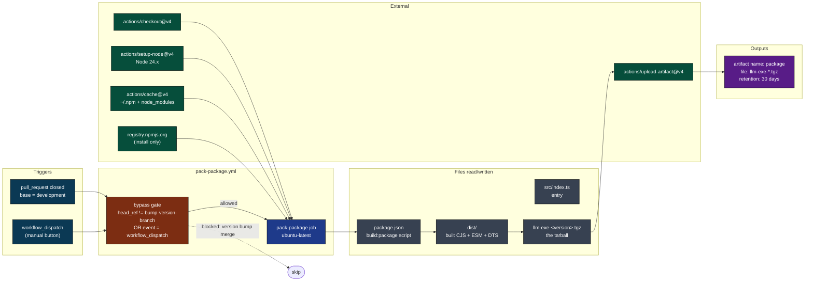
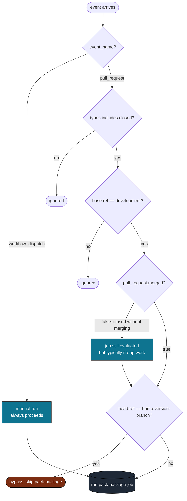
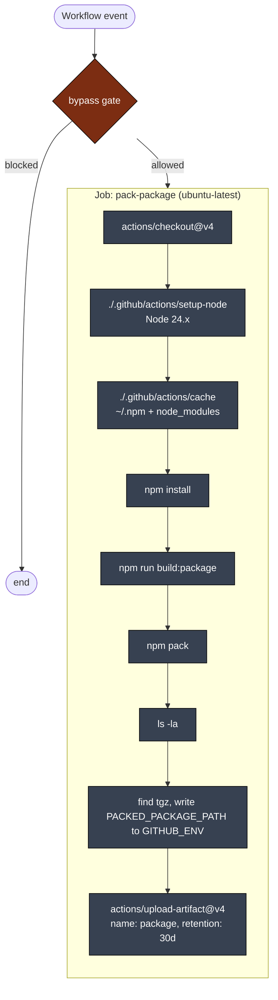
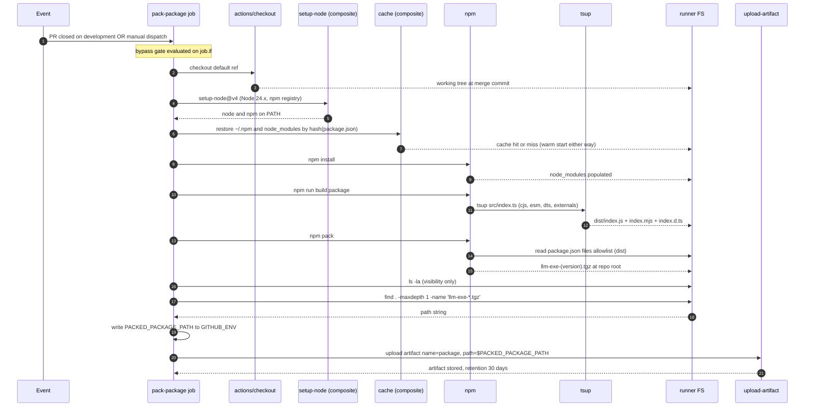
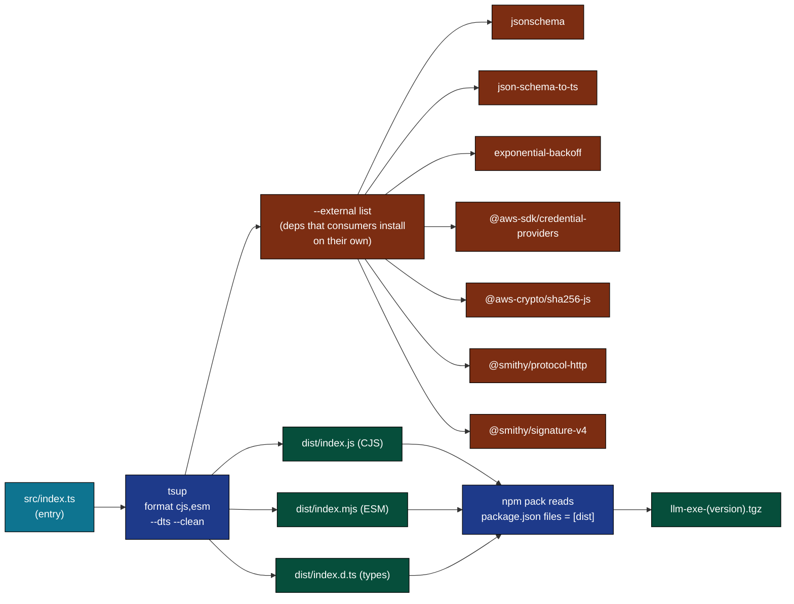
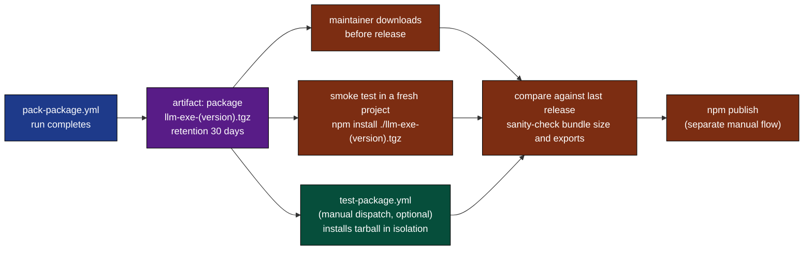
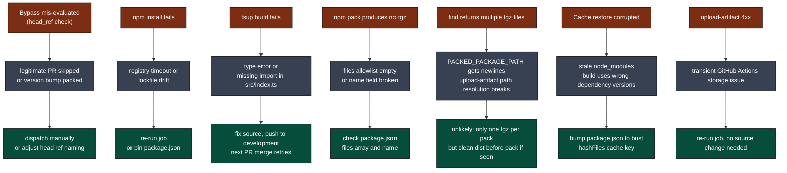
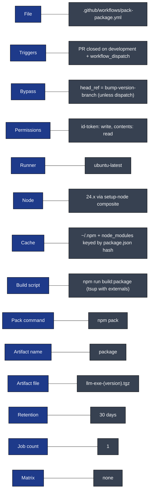

# pack-package: Visual Deep Dive

Concentrated diagrams for [.github/workflows/pack-package.yml](../workflows/pack-package.yml). Companion to [WORKFLOW_ARCHITECTURE.md](WORKFLOW_ARCHITECTURE.md).

This workflow is the regression-safety net. Every PR merged to `development` produces a packed tarball you can pull down and inspect before anything ships to npm. Minimum prose. Maximum diagrams.

## Navigate

- [1. The whole picture](#1-the-whole-picture)
- [2. Triggers](#2-triggers)
- [3. The one-job DAG](#3-the-one-job-dag)
- [4. Step-by-step lifecycle](#4-step-by-step-lifecycle)
- [5. The build:package flow](#5-the-buildpackage-flow)
- [6. Output cascade](#6-output-cascade)
- [7. Failure modes](#7-failure-modes)
- [8. Quick reference card](#8-quick-reference-card)

---

## 1. The whole picture

How [pack-package.yml](../workflows/pack-package.yml) fits into the merge lifecycle.

[Back to top](#navigate)

---

## 2. Triggers

Two entry points. One bypass condition.

The bypass exists because version-bump PRs (auto-generated by the release flow) merge a `package.json` version change without source changes. Packing again at that moment is redundant. The `workflow_dispatch` escape hatch always wins.

Source: [.github/workflows/pack-package.yml](../workflows/pack-package.yml) lines 3-11 (triggers), line 19 (bypass).

[Back to top](#navigate)

---

## 3. The one-job DAG

Single linear job. No matrix, no fan-out.

Permissions are deliberately narrow: `id-token: write` and `contents: read`. No PR writes, no issue writes. This job reads code and emits a tarball. Nothing else.

[Back to top](#navigate)

---

## 4. Step-by-step lifecycle

One run from event to uploaded artifact.

Source: [.github/workflows/pack-package.yml](../workflows/pack-package.yml) lines 22-53.

[Back to top](#navigate)

---

## 5. The build:package flow

What `npm run build:package` actually does and why it differs from `build:ci`.

Why externals matter: the AWS and smithy modules are large optional adapters. Bundling them would bloat the tarball and force every consumer to ship Bedrock support even if they only use OpenAI. Marking them external keeps the package thin and lets consumers install only what they need.

| Script | Where it runs | Difference |
|--------|---------------|------------|
| `build:ci` | tests workflow | No externals declared. Used for typechecking the bundle in CI. |
| `build:package` | pack-package workflow | Externals declared. Used to produce the publishable tarball. |

Source: [package.json](../../package.json) lines 44-46.

[Back to top](#navigate)

---

## 6. Output cascade

What this workflow produces and who eats it.

Why the artifact has a 30-day retention instead of the GitHub default 90: 30 days covers a normal release cadence comfortably, keeps storage tidy, and forces stale tarballs to expire rather than accumulating across hundreds of merges.

Why this is not auto-consumed downstream: publishing to npm requires deliberate human approval. The tarball is evidence, not action. The maintainer decides when to ship.

[Back to top](#navigate)

---

## 7. Failure modes

Where this workflow can break and what falls out.

Note that the cache action references `matrix.node-version` in its key (see [actions/cache/action.yml](../actions/cache/action.yml) line 10). This workflow has no matrix, so that part of the key is empty. Caching still works because the OS prefix and `hashFiles('**/package.json')` make the key unique enough. It is a minor wart, not a bug.

[Back to top](#navigate)

---

## 8. Quick reference card

Direct links:

- Workflow file: [.github/workflows/pack-package.yml](../workflows/pack-package.yml)
- Composite actions: [setup-node](../actions/setup-node/action.yml), [cache](../actions/cache/action.yml)
- Build script: [package.json](../../package.json) `build:package`
- Full architecture doc: [WORKFLOW_ARCHITECTURE.md](WORKFLOW_ARCHITECTURE.md)

[Back to top](#navigate)
