# personas-run: Visual Deep Dive

Concentrated diagrams for [.github/workflows/personas-run.yml](../workflows/personas-run.yml) and the curator pipeline it feeds. Companion to [WORKFLOW_ARCHITECTURE.md](WORKFLOW_ARCHITECTURE.md).

Minimum prose. Maximum diagrams.

## Navigate

- [1. The whole picture](#1-the-whole-picture)
- [2. Triggers and what each one does](#2-triggers-and-what-each-one-does)
- [3. Inputs (count choice)](#3-inputs-count-choice)
- [4. The four-job DAG](#4-the-four-job-dag)
- [5. Step-by-step lifecycle](#5-step-by-step-lifecycle)
- [6. The persona-to-curator pipeline](#6-the-persona-to-curator-pipeline)
- [7. Filesystem reads and writes](#7-filesystem-reads-and-writes)
- [8. External calls](#8-external-calls)
- [9. Output cascade](#9-output-cascade)
- [10. State machine](#10-state-machine)
- [11. Failure modes](#11-failure-modes)
- [12. Quick reference card](#12-quick-reference-card)

---

## 1. The whole picture

How [personas-run.yml](../workflows/personas-run.yml) plugs into everything.

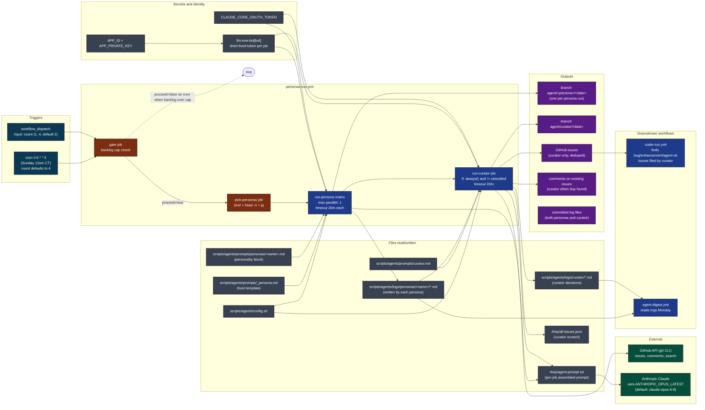

[Back to top](#navigate)

---

## 2. Triggers and what each one does

Two entry points. Both run the same DAG. The only knob is `count`.

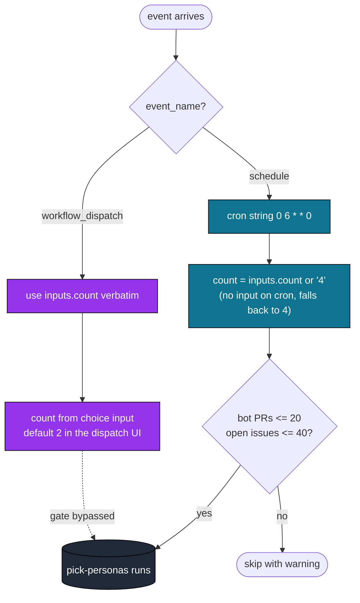

Source: [.github/workflows/personas-run.yml](../workflows/personas-run.yml) lines 3-16 (triggers), 41-56 (gate), 65-70 (pick).

[Back to top](#navigate)

---

## 3. Inputs (count choice)

One input. One derived effect. The matrix size is everything.

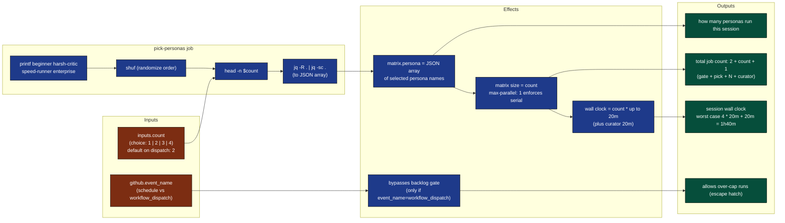

Default behavior: on dispatch the UI shows count=2; on the Sunday cron the input is absent so the `|| '4'` fallback fires and all four personas run before the curator.

[Back to top](#navigate)

---

## 4. The four-job DAG

Job graph with dependencies, conditions, and timeouts.

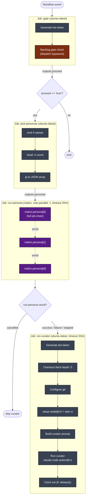

Key conditions:

| Job | `if` expression | Effect |
|-----|-----------------|--------|
| pick-personas | `needs.gate.outputs.proceed == 'true'` | Skip when gated |
| run-persona | `needs.gate.outputs.proceed == 'true'` | Skip when gated |
| run-curator | `always() && needs.gate.outputs.proceed == 'true' && needs.run-persona.result != 'cancelled'` | Run even when some personas fail; only skip if the whole matrix was cancelled |

The curator running on partial persona failures is intentional: one persona timing out should not throw away the others' findings.

[Back to top](#navigate)

---

## 5. Step-by-step lifecycle

One full session from event to curator clock-out. Each matrix slot reruns steps 3-9 in sequence (max-parallel: 1).

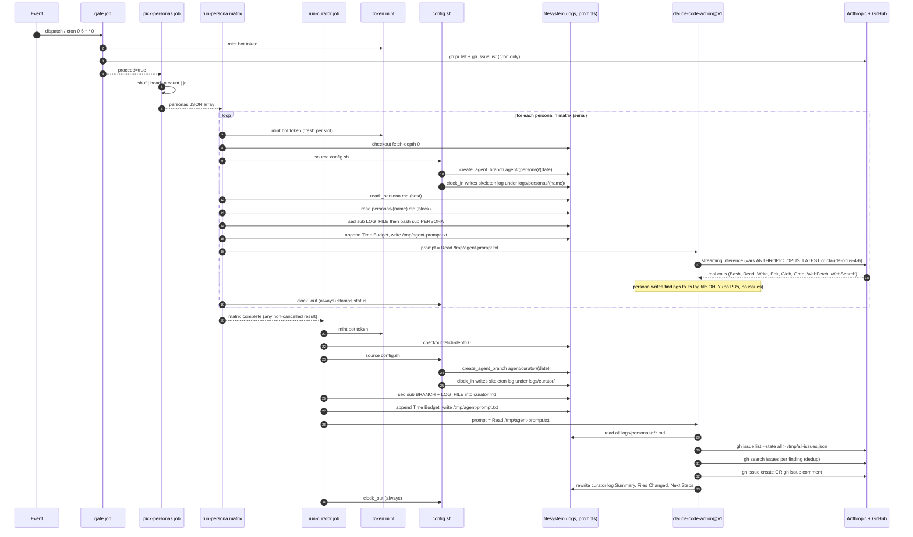

Source: [.github/workflows/personas-run.yml](../workflows/personas-run.yml) lines 72-155 (run-persona), 157-229 (run-curator).

[Back to top](#navigate)

---

## 6. The persona-to-curator pipeline

The whole point of this workflow: personas observe and log, curator promotes and dedups.

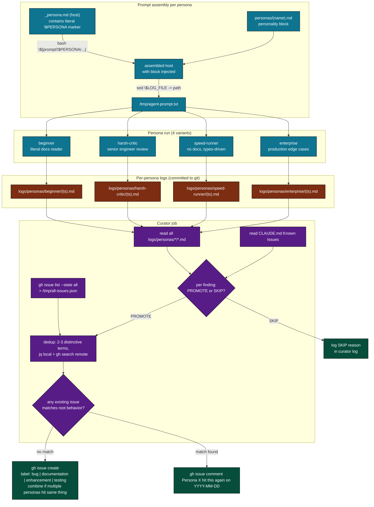

Finding fields each persona must write per item (from [_persona.md](../../scripts/agents/prompts/_persona.md)):

| Field | Required content |
|-------|------------------|
| What you tried | Specific action |
| What happened | Actual result |
| What you expected | Only if different from actual |
| Severity | genuine-bug, confusing, rough-edge, or suggestion |
| File/line | If applicable |

Curator's bar for PROMOTE (from [curator.md](../../scripts/agents/prompts/curator.md)): "Would a maintainer thank me for this issue, or roll their eyes?"

[Back to top](#navigate)

---

## 7. Filesystem reads and writes

Color: blue is read, orange is write, purple is both.

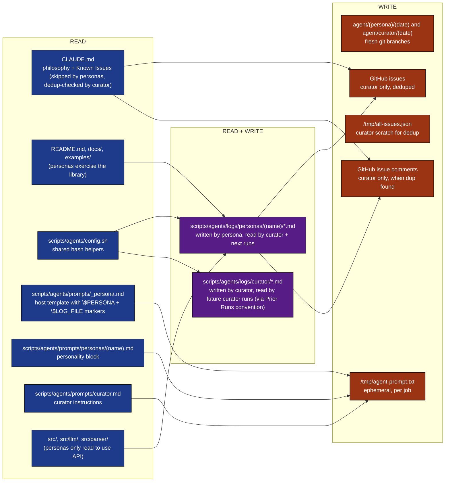

Critical: personas do not touch `src/` for writes. They read source to use the library, then write findings only to their log file. The host template at [_persona.md](../../scripts/agents/prompts/_persona.md) line 28 enforces this: "Do not file GitHub issues. Do not create PRs. Do not modify source code."

[Back to top](#navigate)

---

## 8. External calls

Who is contacted, with what credential, why.

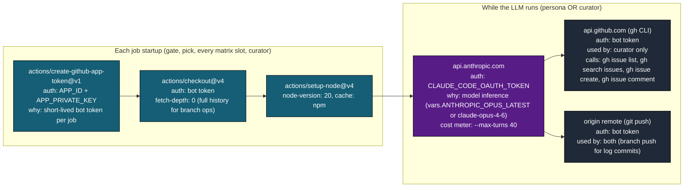

Tool allowlist passed to `claude-code-action@v1` (identical for persona and curator):

```
--allowedTools "Bash,Read,Write,Edit,Glob,Grep,WebFetch,WebSearch"
--max-turns 40
--model ${{ vars.ANTHROPIC_OPUS_LATEST || 'claude-opus-4-6' }}
```

Note the lower `--max-turns 40` here vs `50` in [agent-run.yml](../workflows/agent-run.yml): personas and curator do less coordination work per session than the docs/tester/scout agents.

[Back to top](#navigate)

---

## 9. Output cascade

What this workflow produces and who eats it.

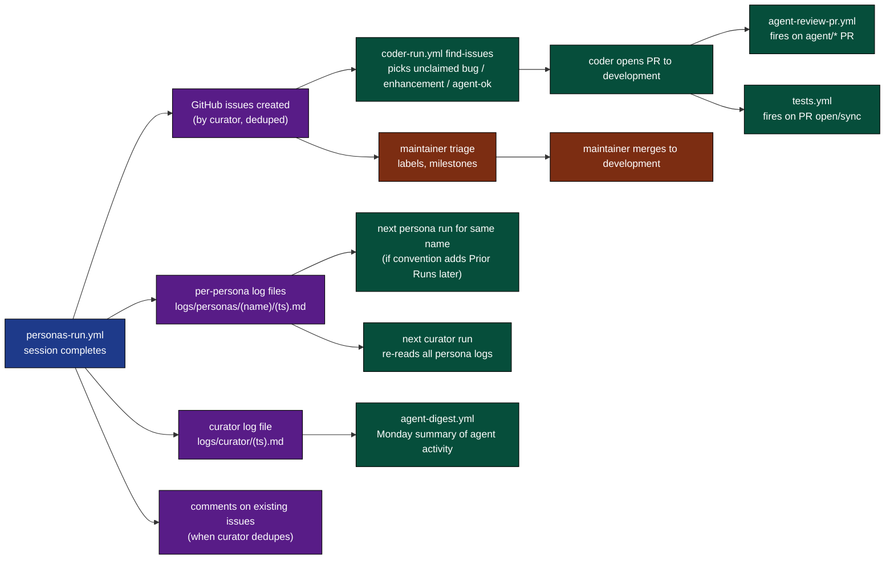

Why personas do not file issues directly: every persona is a biased observer by design (the beginner over-reports, the harsh-critic over-criticizes). The curator is the single quality gate that turns four biased streams into one signal stream. See [curator.md](../../scripts/agents/prompts/curator.md) section "Your bar for PROMOTE".

Why curator log lives separately from persona logs: the digest workflow can count personas-vs-curator activity independently, and the curator's dedup decisions are auditable from one place.

[Back to top](#navigate)

---

## 10. State machine

A single session as a finite state machine. Note the curator path runs even on partial persona failure.

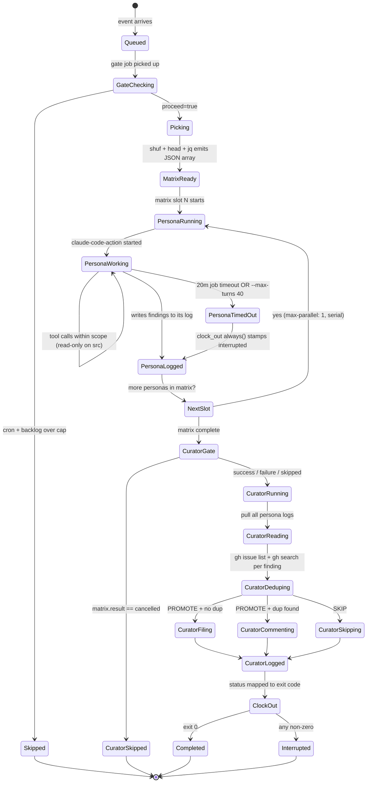

`if: always()` on every clock-out step means even interrupted personas and an interrupted curator stamp a finish time. No log file is ever left in `running`.

[Back to top](#navigate)

---

## 11. Failure modes

Where things break, what happens, what to do.

```mermaid
flowchart TB
    classDef fail fill:#7c2d12,color:#fff,stroke:#000
    classDef effect fill:#374151,color:#fff,stroke:#000
    classDef fix fill:#064e3b,color:#fff,stroke:#000

    F1["Backlog over cap (cron only)"]:::fail
    F1 --> F1E["gate sets proceed=false\nall downstream jobs skip"]:::effect
    F1E --> F1X["drain queue OR dispatch manually (bypasses gate)"]:::fix

    F2["pick-personas shuf empty (impossible, but guarded)"]:::fail
    F2 --> F2E["matrix would be empty\nrun-persona job effectively skipped"]:::effect
    F2X["printf list is hard-coded with 4 names, will not fail"]:::fix
    F2E --> F2X

    F3["One persona hits 20m timeout"]:::fail
    F3 --> F3E["that slot marked interrupted\nclock_out stamps log\nnext slot still runs (max-parallel: 1, but failure does not cancel)"]:::effect
    F3X["curator still reads partial log\ntreat as one less finding source"]:::fix
    F3E --> F3X

    F4["All personas fail"]:::fail
    F4 --> F4E["run-persona.result = failure\ncurator still runs (always() + != cancelled)"]:::effect
    F4X["curator reads logs/personas/*/*.md anyway\nemits empty session log"]:::fix
    F4E --> F4X

    F5["Matrix cancelled by user / GH"]:::fail
    F5 --> F5E["run-persona.result = cancelled\ncurator skipped (the only path that skips it)"]:::effect
    F5X["no harm done; next cron picks up next Sunday"]:::fix
    F5E --> F5X

    F6["Persona files an issue anyway (against host rules)"]:::fail
    F6 --> F6E["unwanted issue lands on backlog"]:::effect
    F6X["host prompt at _persona.md line 4 + line 28 forbids\nclose issue, log violation"]:::fix
    F6E --> F6X

    F7["Curator skips dedup procedure"]:::fail
    F7 --> F7E["duplicate issues filed"]:::effect
    F7X["curator.md step 5 is auditable: log queries\nmaintainer reviews log if dup slips"]:::fix
    F7E --> F7X

    F8["Anthropic API outage mid-session"]:::fail
    F8 --> F8E["affected job returns error\nclock_out marks interrupted\nremaining jobs still attempt"]:::effect
    F8X["next cron retries; manual dispatch available"]:::fix
    F8E --> F8X

    F9["Two sessions overlap"]:::fail
    F9 --> F9E["no concurrency group declared at workflow level\nGitHub runs both\nbranch names collide on same date"]:::effect
    F9X["create_agent_branch fails on second run (branch exists)\nfirst session wins, second's clock_in still writes a new ts-named log"]:::fix
    F9E --> F9X
```

Unlike [agent-run.yml](../workflows/agent-run.yml), this workflow declares no `concurrency:` group. Overlapping runs are theoretically possible (manual dispatch during cron). The same-day branch collision in `create_agent_branch` is the de facto guard.

[Back to top](#navigate)

---

## 12. Quick reference card

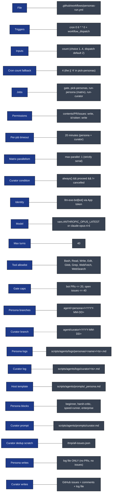

Direct links:

- Workflow file: [.github/workflows/personas-run.yml](../workflows/personas-run.yml)
- Companion workflows: [agent-run.yml](../workflows/agent-run.yml), [coder-run.yml](../workflows/coder-run.yml), [agent-review-pr.yml](../workflows/agent-review-pr.yml)
- Shared helpers: [scripts/agents/config.sh](../../scripts/agents/config.sh)
- Host template: [scripts/agents/prompts/_persona.md](../../scripts/agents/prompts/_persona.md)
- Persona blocks: [beginner.md](../../scripts/agents/prompts/personas/beginner.md), [harsh-critic.md](../../scripts/agents/prompts/personas/harsh-critic.md), [speed-runner.md](../../scripts/agents/prompts/personas/speed-runner.md), [enterprise.md](../../scripts/agents/prompts/personas/enterprise.md)
- Curator prompt: [scripts/agents/prompts/curator.md](../../scripts/agents/prompts/curator.md)
- Full architecture doc: [WORKFLOW_ARCHITECTURE.md](WORKFLOW_ARCHITECTURE.md)

[Back to top](#navigate)
