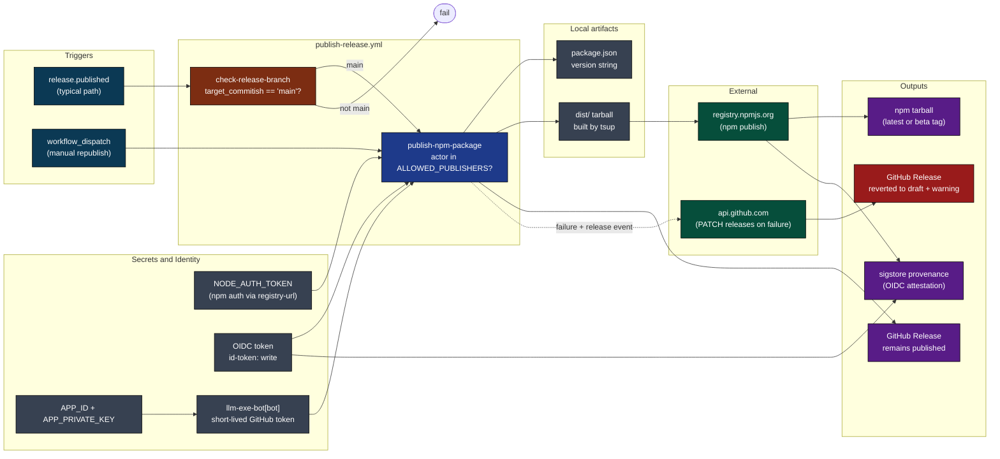
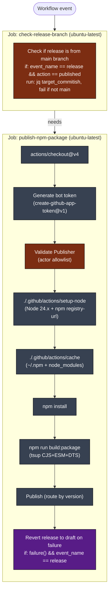
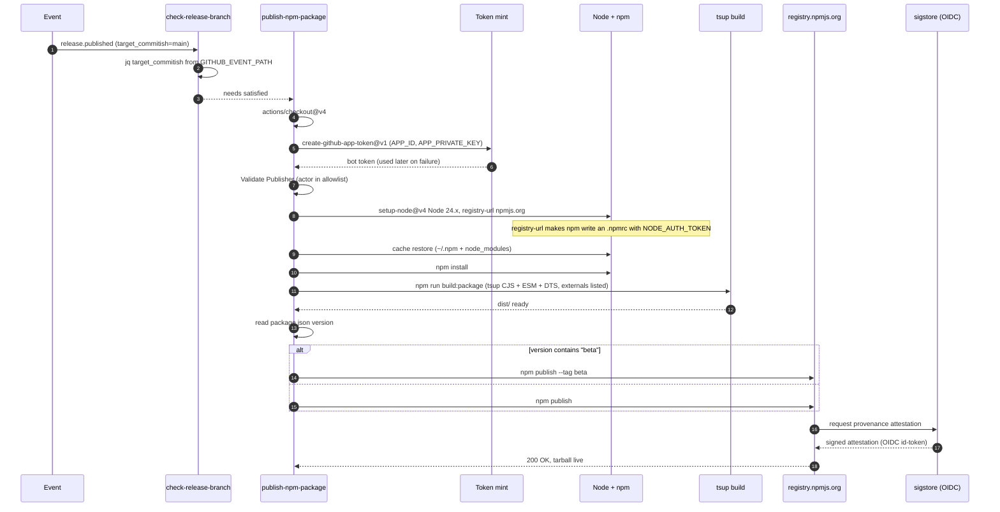
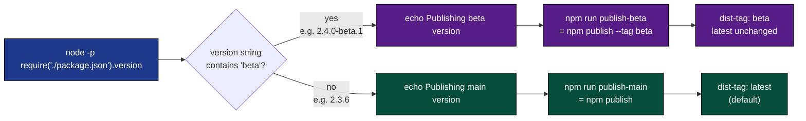
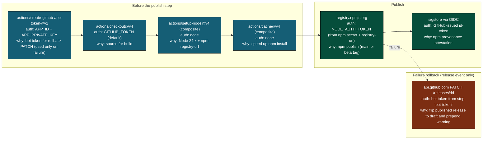
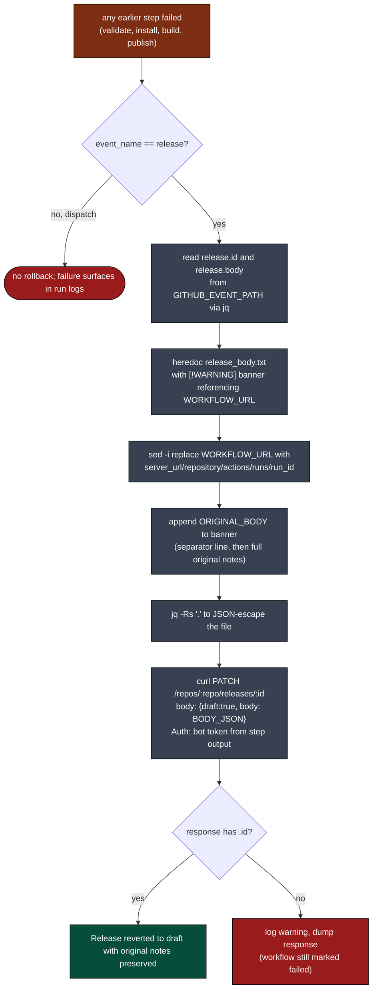
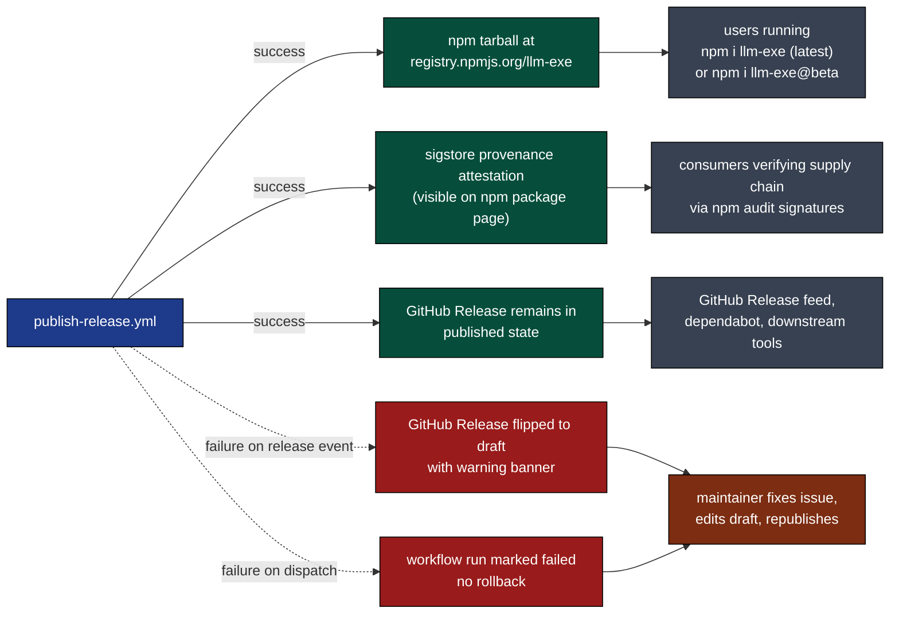
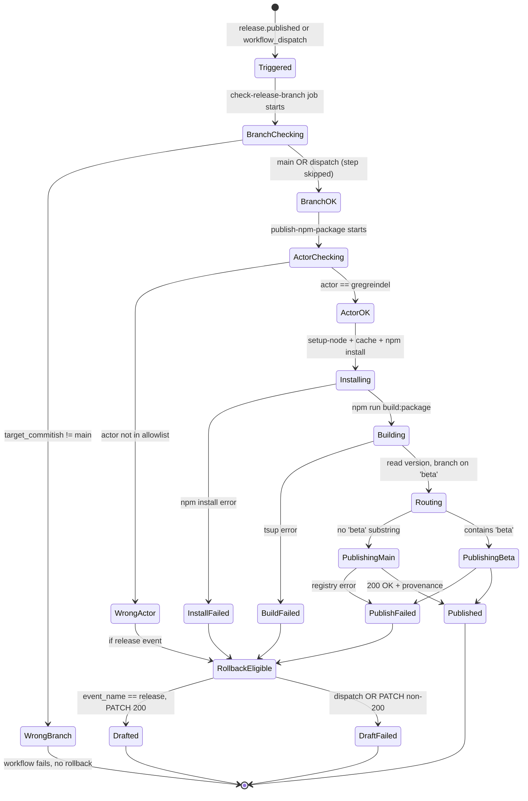
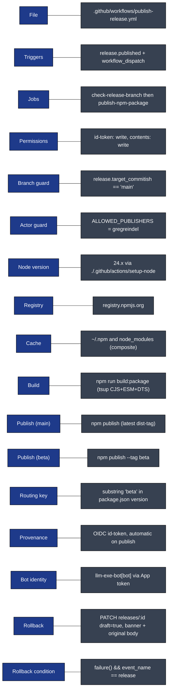

# publish-release: Visual Deep Dive

Concentrated diagrams for [.github/workflows/publish-release.yml](../workflows/publish-release.yml) and the composite actions it leans on. Companion to [WORKFLOW_ARCHITECTURE.md](WORKFLOW_ARCHITECTURE.md).

Minimum prose. Maximum diagrams.

## Navigate

- [1. The whole picture](#1-the-whole-picture)
- [2. Triggers](#2-triggers)
- [3. The two-job DAG](#3-the-two-job-dag)
- [4. The two-layer guard](#4-the-two-layer-guard)
- [5. Step-by-step lifecycle](#5-step-by-step-lifecycle)
- [6. Version routing](#6-version-routing)
- [7. External calls](#7-external-calls)
- [8. The rollback path](#8-the-rollback-path)
- [9. Output cascade](#9-output-cascade)
- [10. State machine](#10-state-machine)
- [11. Failure modes](#11-failure-modes)
- [12. Quick reference card](#12-quick-reference-card)

---

## 1. The whole picture

How [publish-release.yml](../workflows/publish-release.yml) plugs into npm, GitHub Releases, and OIDC provenance, including the rollback edge.

[Back to top](#navigate)

---

## 2. Triggers

Two entry points. One is the normal automated path, the other is the manual escape hatch.

Source: [.github/workflows/publish-release.yml](../workflows/publish-release.yml) lines 3-8 (triggers), 18-25 (branch check).

Note on the manual path: the branch check step's `if` clause requires `github.event_name == 'release'`, so a `workflow_dispatch` run hits an effectively empty `check-release-branch` job that always succeeds. The actor allowlist (Section 4) is what stops unauthorized manual republishes.

[Back to top](#navigate)

---

## 3. The two-job DAG

`needs: check-release-branch` enforces sequential ordering. No concurrency group is declared, so two concurrent dispatch runs are theoretically possible but npm itself rejects duplicate versions.

[Back to top](#navigate)

---

## 4. The two-layer guard

Two independent gates. Both must pass.

Why two layers?

- Layer 1 stops accidental publishes from a feature branch tag. A release cut from `development` will fail before any code runs.
- Layer 2 stops the wrong human from triggering `workflow_dispatch` (which bypasses Layer 1).

Together they cover both the automated and manual entry points. Neither alone is sufficient.

Source: [publish-release.yml](../workflows/publish-release.yml) lines 18-25 (Layer 1), 42-50 (Layer 2).

[Back to top](#navigate)

---

## 5. Step-by-step lifecycle

One successful publish from event to npm registry.

Source: [publish-release.yml](../workflows/publish-release.yml) lines 32-74.

[Back to top](#navigate)

---

## 6. Version routing

The published package.json version string determines the npm dist-tag.

Source: [publish-release.yml](../workflows/publish-release.yml) lines 64-74. Scripts in [package.json](../../package.json) lines 56-57.

Why this matters: `npm publish` with no flag overwrites the `latest` dist-tag. Beta releases must use `--tag beta` so they do not become the default install for `npm i llm-exe`. The check is a plain substring match; a version like `2.3.6-beta.0` matches, while `2.3.6` does not.

[Back to top](#navigate)

---

## 7. External calls

Who is contacted, with what credential, why.

The npm token (used by `npm publish`) is configured by `setup-node@v4` consuming the `registry-url` and the `NODE_AUTH_TOKEN` env var. Provenance is automatic when both `id-token: write` is granted (top of file) and the registry supports it. The bot token from `create-github-app-token@v1` is only used by the rollback step.

[Back to top](#navigate)

---

## 8. The rollback path

Triggered only on the failure of a release-event run. Preserves the original body.

Source: [publish-release.yml](../workflows/publish-release.yml) lines 76-108.

Key invariants:

- Original release body is never lost. The banner is prepended; the original is appended verbatim from the event payload.
- The workflow URL is computed from `github.server_url`, `github.repository`, `github.run_id`. No magic strings.
- The PATCH uses the bot token (App identity) rather than `GITHUB_TOKEN`, which lets the change look like the bot acted rather than the GitHub Actions service account.
- `failure()` only fires for hard failures of earlier steps in the same job. A failure of `check-release-branch` short-circuits before `publish-npm-package` ever runs, so this rollback never executes for a wrong-branch release. That is intentional: a wrong-branch release should not be auto-drafted by this workflow.

[Back to top](#navigate)

---

## 9. Output cascade

What this workflow produces and who consumes it.

[Back to top](#navigate)

---

## 10. State machine

A single run as a finite state machine.

Failure of the publish step is the only path that produces a partial outcome (tarball pushed but provenance failed). npm's transactional semantics make this rare in practice.

[Back to top](#navigate)

---

## 11. Failure modes

```mermaid
flowchart TB
    classDef fail fill:#7c2d12,color:#fff,stroke:#000
    classDef effect fill:#374151,color:#fff,stroke:#000
    classDef fix fill:#064e3b,color:#fff,stroke:#000

    F1["Release cut from non-main branch\n(target_commitish != main)"]:::fail
    F1 --> F1E["check-release-branch exits 1\npublish-npm-package never starts\nno rollback fires"]:::effect
    F1E --> F1X["delete/edit the release,\nrecreate it targeting main,\nor merge to main first"]:::fix

    F2["workflow_dispatch by non-allowed actor"]:::fail
    F2 --> F2E["Validate Publisher step exits 1\nbefore install or build"]:::effect
    F2X["edit ALLOWED_PUBLISHERS in workflow\nor request the owner to publish"]:::fix
    F2E --> F2X

    F3["npm install fails\n(lockfile drift, registry down)"]:::fail
    F3 --> F3E["job fails before build\nrollback fires on release event"]:::effect
    F3X["fix package-lock alignment,\nthen rerun via dispatch"]:::fix
    F3E --> F3X

    F4["build:package fails\n(type error, tsup error)"]:::fail
    F4 --> F4E["job fails before publish\nrollback fires on release event"]:::effect
    F4X["fix code, cut a new release\nor rerun dispatch after fix"]:::fix
    F4E --> F4X

    F5["npm publish fails\n(version already exists, auth, network)"]:::fail
    F5 --> F5E["job fails at publish step\nrollback fires on release event\ntarball NOT live"]:::effect
    F5X["bump version, recreate release\n(npm versions are immutable)"]:::fix
    F5E --> F5X

    F6["OIDC provenance fails\nbut tarball already published"]:::fail
    F6 --> F6E["step exit non-zero,\nrollback flips release to draft,\nbut npm tarball is live"]:::effect
    F6X["unpublish within 72h or publish patch\nthat supersedes; investigate id-token perms"]:::fix
    F6E --> F6X

    F7["Rollback PATCH itself fails\n(bot token revoked, GitHub API down)"]:::fail
    F7 --> F7E["warning printed, response dumped\nrelease stays published\nworkflow still marked failed"]:::effect
    F7X["manually edit the release to draft\nadd warning banner by hand"]:::fix
    F7E --> F7X

    F8["Two simultaneous dispatch runs"]:::fail
    F8 --> F8E["no concurrency group;\nsecond run will fail at npm publish\n(version conflict)"]:::effect
    F8X["wait for first run,\nor add concurrency group if this recurs"]:::fix
    F8E --> F8X
```

[Back to top](#navigate)

---

## 12. Quick reference card

Direct links:

- Workflow file: [.github/workflows/publish-release.yml](../workflows/publish-release.yml)
- Composite actions: [actions/setup-node](../actions/setup-node/action.yml), [actions/cache](../actions/cache/action.yml)
- Publish scripts: [package.json](../../package.json) lines 56-57
- Build script: [package.json](../../package.json) line 46 (`build:package`)
- Full architecture doc: [WORKFLOW_ARCHITECTURE.md](WORKFLOW_ARCHITECTURE.md)

[Back to top](#navigate)
