# publish-release: Visual Deep Dive

Concentrated diagrams for [.github/workflows/publish-release.yml](../workflows/publish-release.yml) and the composite actions it leans on. Companion to [WORKFLOW_ARCHITECTURE.md](WORKFLOW_ARCHITECTURE.md).

Minimum prose. Maximum diagrams.

## Navigate

- [1. The whole picture](#1-the-whole-picture)
- [2. Triggers](#2-triggers)
- [3. The four-job DAG](#3-the-four-job-dag)
- [4. The two-layer guard](#4-the-two-layer-guard)
- [5. Step-by-step lifecycle](#5-step-by-step-lifecycle)
- [6. Version routing](#6-version-routing)
- [7. External calls](#7-external-calls)
- [8. The rollback path](#8-the-rollback-path)
- [9. Output cascade](#9-output-cascade)
- [10. State machine](#10-state-machine)
- [11. Failure modes](#11-failure-modes)
- [12. Quick reference card](#12-quick-reference-card)

---

## 1. The whole picture

How [publish-release.yml](../workflows/publish-release.yml) plugs into npm, GitHub Releases, and OIDC provenance, including the rollback edge.

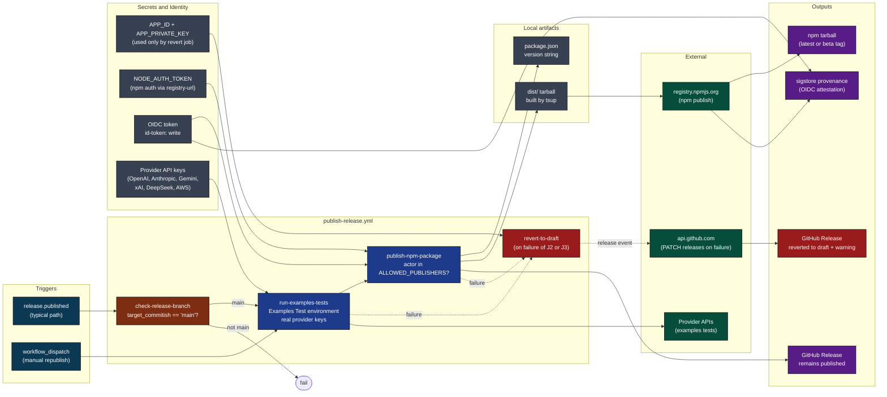

[Back to top](#navigate)

---

## 2. Triggers

Two entry points. One is the normal automated path, the other is the manual escape hatch.

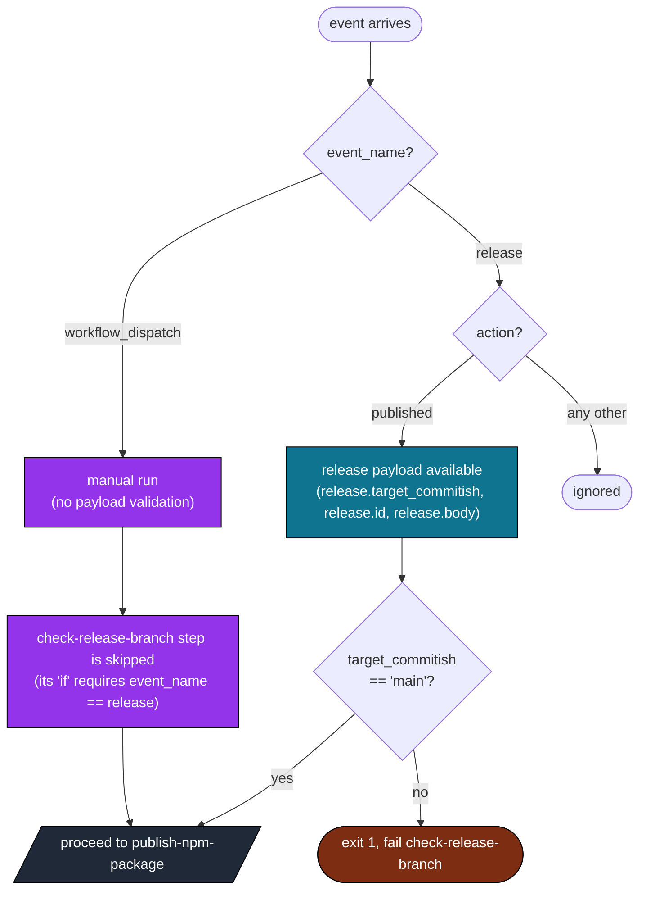

Source: [.github/workflows/publish-release.yml](../workflows/publish-release.yml) lines 3-8 (triggers), 18-26 (branch check).

Note on the manual path: the branch check step's `if` clause requires `github.event_name == 'release'`, so a `workflow_dispatch` run hits an effectively empty `check-release-branch` job that always succeeds. The actor allowlist (Section 4) is what stops unauthorized manual republishes.

[Back to top](#navigate)

---

## 3. The four-job DAG

```mermaid
flowchart TB
    classDef job fill:#1e3a8a,color:#fff,stroke:#000
    classDef step fill:#374151,color:#fff,stroke:#000
    classDef gate fill:#7c2d12,color:#fff,stroke:#000
    classDef cleanup fill:#581c87,color:#fff,stroke:#000

    start([Workflow event])
    start --> J1

    subgraph J1["Job: check-release-branch (ubuntu-latest)"]
        direction TB
        c1["Check if release is from main branch\nif: event_name == release && action == published\nrun: jq target_commitish, fail if not main"]:::gate
    end

    J1 -->|needs| J2

    subgraph J2["Job: run-examples-tests (ubuntu-latest, Examples Test env)"]
        direction TB
        e1["actions/checkout@v4"]:::step
        e2["setup-node@v4 Node 22.x"]:::step
        e3["./.github/actions/cache"]:::step
        e4["npm install"]:::step
        e5["npm run build:package && npm pack"]:::step
        e6["Extract tarball, replace dist/"]:::step
        e7["cd examples && npm install"]:::step
        e8["npm run test-examples\n(real provider keys)"]:::step
        e1 --> e2 --> e3 --> e4 --> e5 --> e6 --> e7 --> e8
    end

    J2 -->|needs| J3
    J1 -->|needs| J3

    subgraph J3["Job: publish-npm-package (ubuntu-latest)"]
        direction TB
        s1["actions/checkout@v4"]:::step
        s2["Validate Publisher\n(actor allowlist)"]:::gate
        s3["./.github/actions/setup-node\n(Node 24.x + npm registry-url)"]:::step
        s4["./.github/actions/cache\n(~/.npm + node_modules)"]:::step
        s5["npm install"]:::step
        s6["npm run build:package\n(tsup CJS+ESM+DTS)"]:::step
        s7["Publish (route by version)"]:::step
        s1 --> s2 --> s3 --> s4 --> s5 --> s6 --> s7
    end

    J2 -.->|needs| J4
    J3 -.->|needs| J4

    subgraph J4["Job: revert-to-draft (ubuntu-latest)"]
        direction TB
        r1["if: always() && release event &&\n(examples failed || publish failed)"]:::gate
        r2["Generate bot token\n(create-github-app-token@v1)"]:::step
        r3["Revert release to draft\n(PATCH with warning banner)"]:::cleanup
        r1 --> r2 --> r3
    end
```

The DAG has four jobs: `check-release-branch` gates `run-examples-tests`, which gates `publish-npm-package`. The `revert-to-draft` job depends on both `run-examples-tests` and `publish-npm-package` and only fires when either fails during a release event. No concurrency group is declared, so two concurrent dispatch runs are theoretically possible but npm itself rejects duplicate versions.

[Back to top](#navigate)

---

## 4. The two-layer guard

Two independent gates. Both must pass.

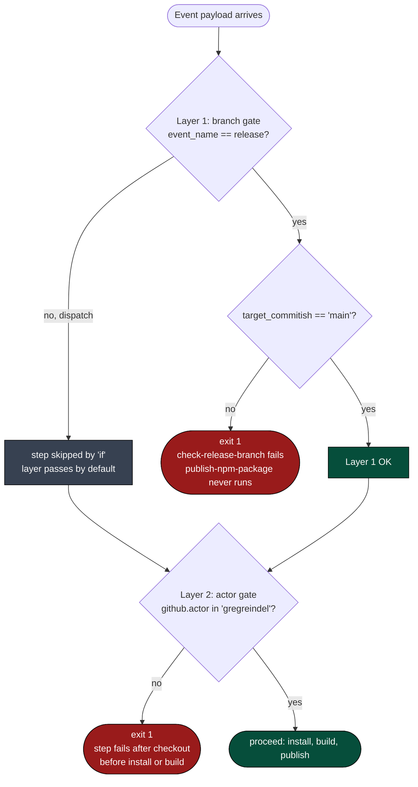

Why two layers?

- Layer 1 stops accidental publishes from a feature branch tag. A release cut from `development` will fail before any code runs.
- Layer 2 stops the wrong human from triggering `workflow_dispatch` (which bypasses Layer 1).

Together they cover both the automated and manual entry points. Neither alone is sufficient.

Source: [publish-release.yml](../workflows/publish-release.yml) lines 18-26 (Layer 1), 88-95 (Layer 2).

[Back to top](#navigate)

---

## 5. Step-by-step lifecycle

One successful publish from event to npm registry, including the examples tests gate.

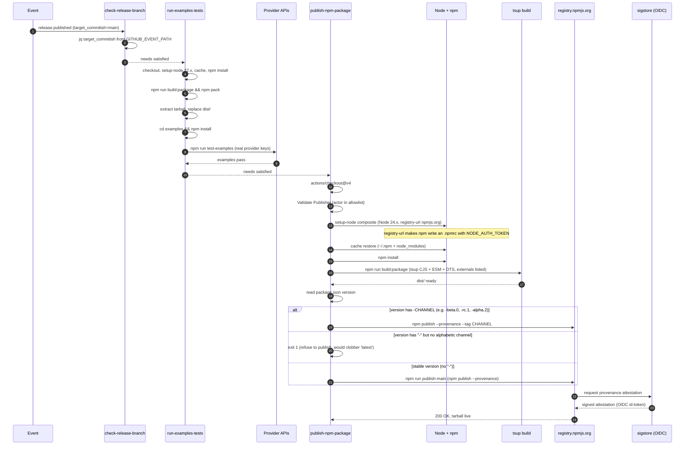

Source: [publish-release.yml](../workflows/publish-release.yml) lines 27-121.

[Back to top](#navigate)

---

## 6. Version routing

The published package.json version string determines the npm dist-tag. Any semver pre-release suffix (anything after a `-`) routes to a named dist-tag derived from the first alphabetic chunk.

```mermaid
flowchart LR
    classDef read fill:#1e3a8a,color:#fff,stroke:#000
    classDef dec fill:#7c2d12,color:#fff,stroke:#000
    classDef main fill:#064e3b,color:#fff,stroke:#000
    classDef pre fill:#581c87,color:#fff,stroke:#000
    classDef refuse fill:#991b1b,color:#fff,stroke:#000

    A["node -p require('./package.json').version"]:::read
    A --> D{version contains '-'?}

    D -->|no\ne.g. 2.3.6| M1["echo Publishing main version"]:::main
    M1 --> M2["npm run publish-main\n= npm publish --provenance"]:::main
    M2 --> M3["dist-tag: latest\n(default)"]:::main

    D -->|yes| C{regex -([a-zA-Z]+)\nmatches alphabetic channel?}
    C -->|yes\ne.g. -beta.0, -rc.1, -alpha.2| B1["TAG = first alphabetic chunk\n(beta, rc, alpha, ...)"]:::pre
    B1 --> B2["npm publish --provenance --tag $TAG\n(no package.json script)"]:::pre
    B2 --> B3["dist-tag: $TAG\nlatest unchanged"]:::pre

    C -->|no\ne.g. 3.0.0-1234 with no letters| R1["exit 1\n'pre-release has no alphabetic channel'"]:::refuse
    R1 --> R2["refuse to publish\n(would silently clobber 'latest')"]:::refuse
```

Source: [publish-release.yml](../workflows/publish-release.yml) lines 110-131. Stable script in [package.json](../../package.json).

Why this matters: `npm publish --provenance` with no `--tag` flag overwrites the `latest` dist-tag. Any pre-release must use `--tag CHANNEL` so it does not become the default install for `npm i llm-exe`. The workflow infers the channel from the version: `3.0.0-beta.0` -> `beta`, `3.0.0-rc.1` -> `rc`, `3.0.0-alpha.2` -> `alpha`. A version with a `-` but no alphabetic channel (e.g. `3.0.0-1234`) is refused outright rather than risk publishing to `latest`. All publish paths pass `--provenance` to request OIDC-based supply-chain attestation (errors if the environment lacks `id-token: write`).

[Back to top](#navigate)

---

## 7. External calls

Who is contacted, with what credential, why.

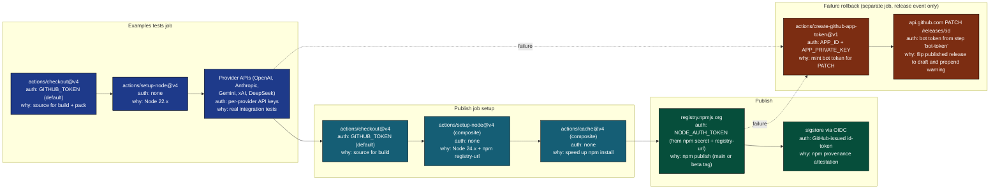

The npm token (used by `npm publish`) is configured by the setup-node composite action consuming the `registry-url` and the `NODE_AUTH_TOKEN` env var. Provenance is explicitly requested via the `--provenance` flag in both publish scripts; this requires `id-token: write` (granted at the top of the file) and will fail if the OIDC token cannot be issued. The bot token from `create-github-app-token@v1` is minted only in the `revert-to-draft` job and only used by the rollback step.

[Back to top](#navigate)

---

## 8. The rollback path

The `revert-to-draft` job is a dedicated rollback job that runs after both `run-examples-tests` and `publish-npm-package` complete (in any state). Preserves the original release body.

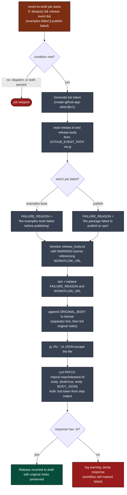

Source: [publish-release.yml](../workflows/publish-release.yml) lines 123-177.

Key invariants:

- Original release body is never lost. The banner is prepended; the original is appended verbatim from the event payload.
- The warning banner includes a specific failure reason: examples tests or npm publish, so the maintainer knows which step to investigate.
- The workflow URL is computed from `github.server_url`, `github.repository`, `github.run_id`. No magic strings.
- The PATCH uses the bot token (App identity) rather than `GITHUB_TOKEN`, which lets the change look like the bot acted rather than the GitHub Actions service account.
- The job uses `always()` combined with explicit `needs.*.result == 'failure'` checks to ensure it runs even when upstream jobs fail. A failure of `check-release-branch` short-circuits before examples or publish ever run, so the rollback never executes for a wrong-branch release. That is intentional: a wrong-branch release should not be auto-drafted by this workflow.

[Back to top](#navigate)

---

## 9. Output cascade

What this workflow produces and who consumes it.

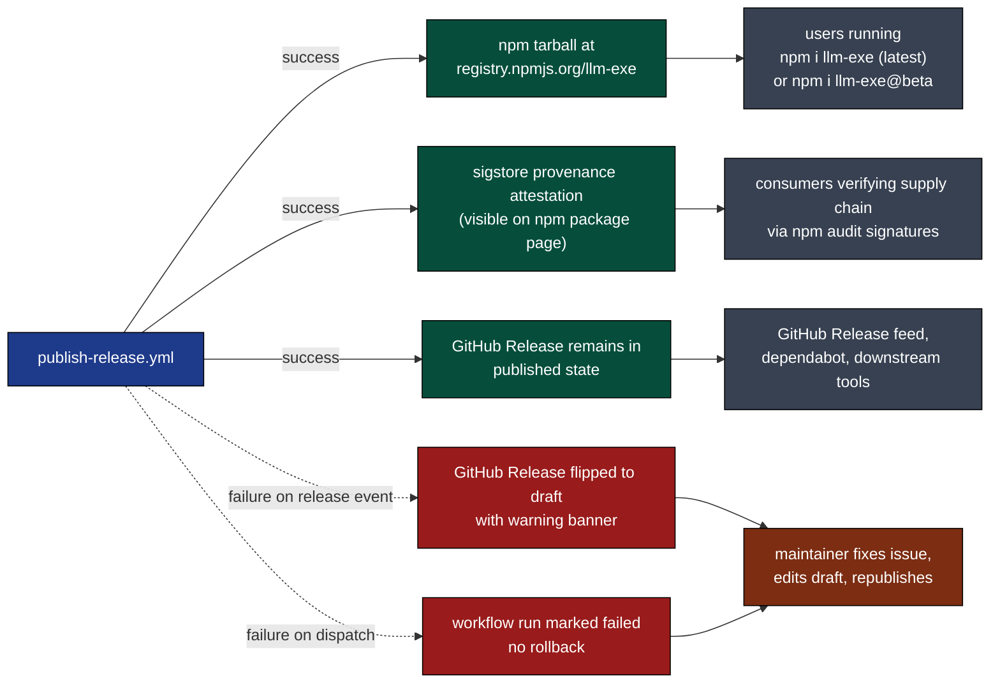

[Back to top](#navigate)

---

## 10. State machine

A single run as a finite state machine.

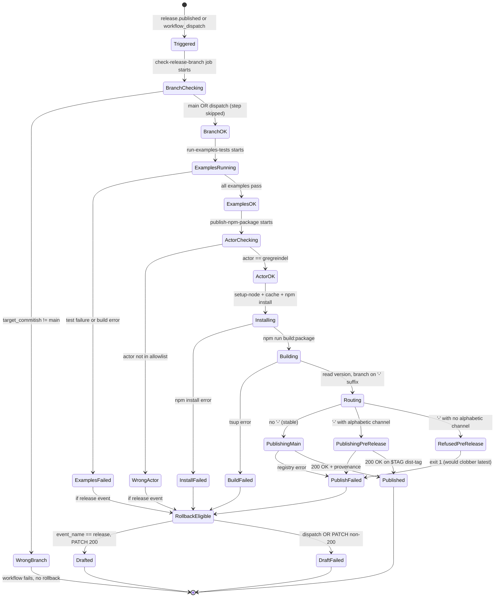

Failure of the publish step is the only path that produces a partial outcome (tarball pushed but provenance failed). npm's transactional semantics make this rare in practice. Examples test failures are caught before any npm publish attempt.

[Back to top](#navigate)

---

## 11. Failure modes

```mermaid
flowchart TB
    classDef fail fill:#7c2d12,color:#fff,stroke:#000
    classDef effect fill:#374151,color:#fff,stroke:#000
    classDef fix fill:#064e3b,color:#fff,stroke:#000

    F1["Release cut from non-main branch\n(target_commitish != main)"]:::fail
    F1 --> F1E["check-release-branch exits 1\ndownstream jobs never start\nno rollback fires"]:::effect
    F1E --> F1X["delete/edit the release,\nrecreate it targeting main,\nor merge to main first"]:::fix

    F1b["Examples tests fail\n(provider error, test assertion, build error)"]:::fail
    F1b --> F1bE["run-examples-tests fails\npublish-npm-package never starts\nrollback fires on release event"]:::effect
    F1bE --> F1bX["check provider keys and examples,\nfix and rerun via dispatch"]:::fix

    F2["workflow_dispatch by non-allowed actor"]:::fail
    F2 --> F2E["Validate Publisher step exits 1\nbefore install or build"]:::effect
    F2X["edit ALLOWED_PUBLISHERS in workflow\nor request the owner to publish"]:::fix
    F2E --> F2X

    F3["npm install fails\n(lockfile drift, registry down)"]:::fail
    F3 --> F3E["job fails before build\nrollback fires on release event"]:::effect
    F3X["fix package-lock alignment,\nthen rerun via dispatch"]:::fix
    F3E --> F3X

    F4["build:package fails\n(type error, tsup error)"]:::fail
    F4 --> F4E["job fails before publish\nrollback fires on release event"]:::effect
    F4X["fix code, cut a new release\nor rerun dispatch after fix"]:::fix
    F4E --> F4X

    F5["npm publish fails\n(version already exists, auth, network)"]:::fail
    F5 --> F5E["job fails at publish step\nrollback fires on release event\ntarball NOT live"]:::effect
    F5X["bump version, recreate release\n(npm versions are immutable)"]:::fix
    F5E --> F5X

    F5b["Pre-release version with no alphabetic channel\n(e.g. 3.0.0-1234)"]:::fail
    F5b --> F5bE["publish step exits 1 before npm is called\nrollback fires on release event\ntarball NOT live"]:::effect
    F5bX["use a named channel (-beta.X, -rc.X, -alpha.X)\nrecut release after fixing package.json"]:::fix
    F5bE --> F5bX

    F6["OIDC provenance fails\nbut tarball already published"]:::fail
    F6 --> F6E["step exit non-zero,\nrollback flips release to draft,\nbut npm tarball is live"]:::effect
    F6X["unpublish within 72h or publish patch\nthat supersedes; investigate id-token perms"]:::fix
    F6E --> F6X

    F7["Rollback PATCH itself fails\n(bot token revoked, GitHub API down)"]:::fail
    F7 --> F7E["warning printed, response dumped\nrelease stays published\nworkflow still marked failed"]:::effect
    F7X["manually edit the release to draft\nadd warning banner by hand"]:::fix
    F7E --> F7X

    F8["Two simultaneous dispatch runs"]:::fail
    F8 --> F8E["no concurrency group;\nsecond run will fail at npm publish\n(version conflict)"]:::effect
    F8X["wait for first run,\nor add concurrency group if this recurs"]:::fix
    F8E --> F8X
```

[Back to top](#navigate)

---

## 12. Quick reference card

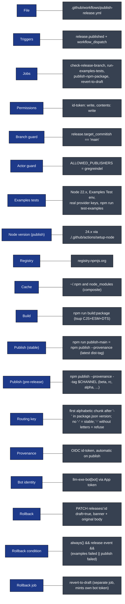

Direct links:

- Workflow file: [.github/workflows/publish-release.yml](../workflows/publish-release.yml)
- Composite actions: [actions/setup-node](../actions/setup-node/action.yml), [actions/cache](../actions/cache/action.yml)
- Publish scripts: [package.json](../../package.json) lines 56-57
- Build script: [package.json](../../package.json) line 46 (`build:package`)
- Full architecture doc: [WORKFLOW_ARCHITECTURE.md](WORKFLOW_ARCHITECTURE.md)

[Back to top](#navigate)
