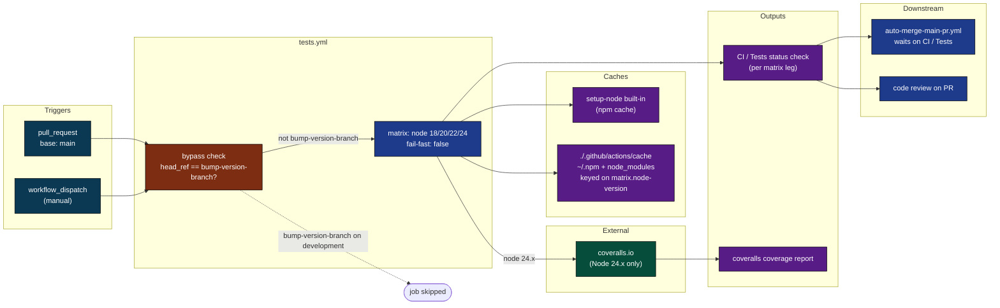
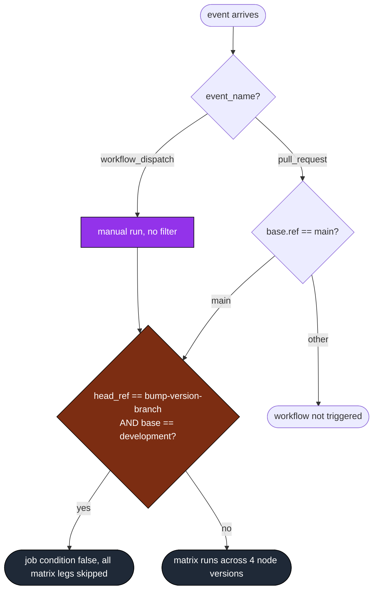
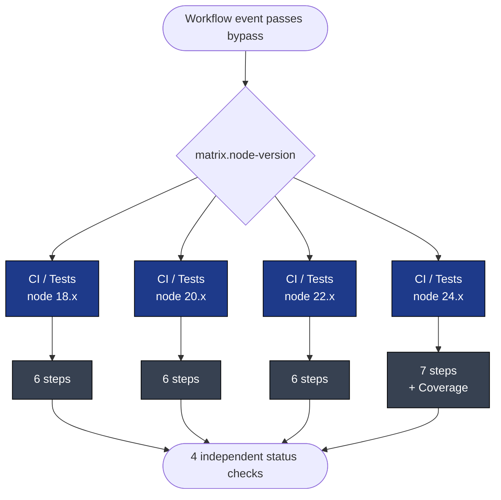
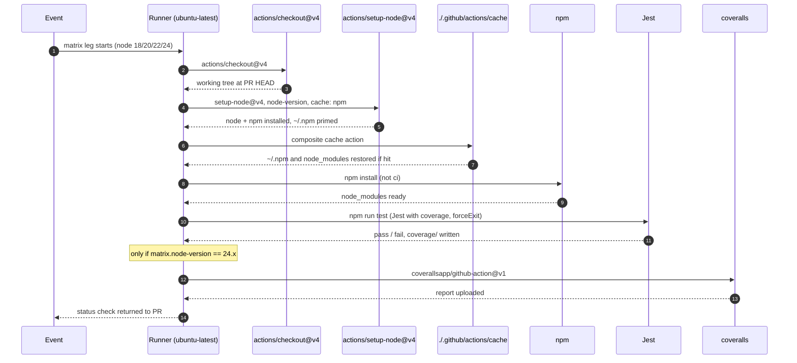
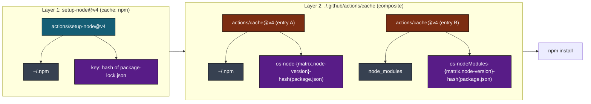
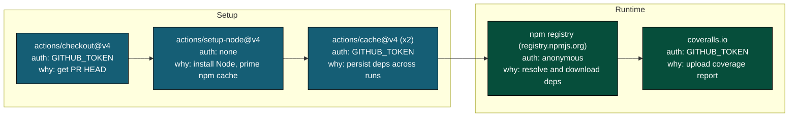
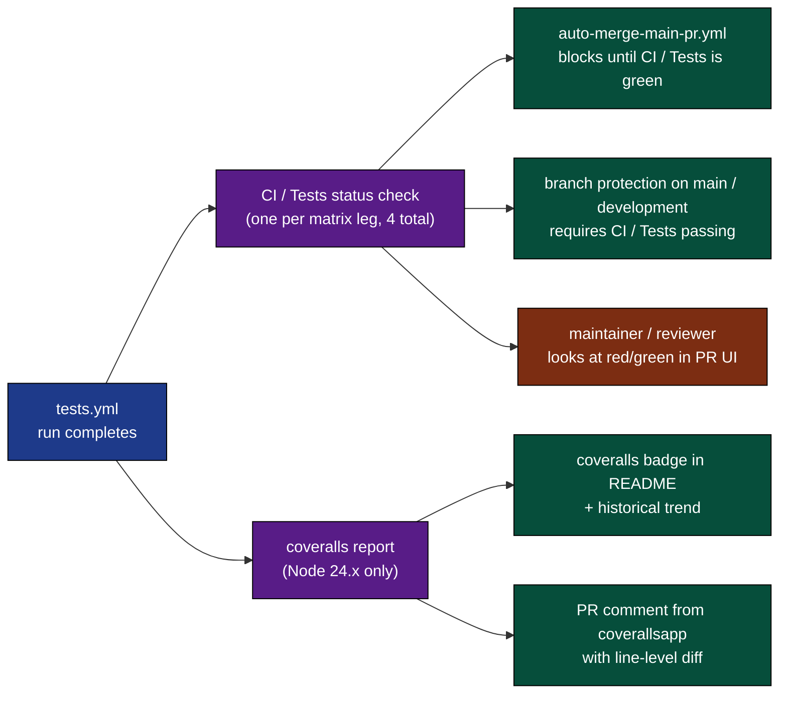
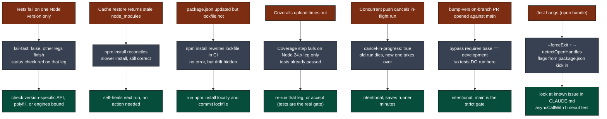
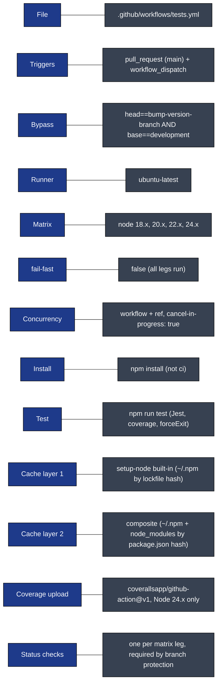

# tests: Visual Deep Dive

Concentrated diagrams for [.github/workflows/tests.yml](../workflows/tests.yml). Companion to [WORKFLOW_ARCHITECTURE.md](WORKFLOW_ARCHITECTURE.md).

Short workflow, but it gates every PR. Worth understanding.

## Navigate

- [1. The whole picture](#1-the-whole-picture)
- [2. Triggers](#2-triggers)
- [3. The matrix DAG](#3-the-matrix-dag)
- [4. Step-by-step lifecycle](#4-step-by-step-lifecycle)
- [5. The cache strategy](#5-the-cache-strategy)
- [6. External calls](#6-external-calls)
- [7. Output cascade](#7-output-cascade)
- [8. Failure modes](#8-failure-modes)
- [9. Quick reference card](#9-quick-reference-card)

---

## 1. The whole picture

How [tests.yml](../workflows/tests.yml) plugs into the rest of the system.

[Back to top](#navigate)

---

## 2. Triggers

Two entry points. Both go through one bypass gate.

The bypass exists so release version-bump PRs don't re-run the suite that already passed on the source branch. It checks `base == development AND head == bump-version-branch` as a pair, so a stray branch named `bump-version-branch` targeting main still runs.

Source: [.github/workflows/tests.yml](../workflows/tests.yml) lines 3-5 (triggers) and line 15 (bypass `if`).

Note: tests for PRs targeting `development` are now handled by [agent-review-pr.yml](../workflows/agent-review-pr.yml), which runs a parallel test matrix on opened and synchronize events.

[Back to top](#navigate)

---

## 3. The matrix DAG

Four parallel legs. Independent. No fail-fast.

`fail-fast: false` means one Node version failing does not cancel the others. You always see the full picture across Node 18/20/22/24, which is what you want for a library that declares `engines.node >= 18`.

Concurrency group is `${{ github.workflow }}-${{ github.ref }}` with `cancel-in-progress: true`. Push a new commit to the same PR and the in-flight run dies so the new one can take over.

[Back to top](#navigate)

---

## 4. Step-by-step lifecycle

One matrix leg from event to status check.

The Coverage step uses `if: ${{ matrix.node-version == '24.x' }}` so it runs exactly once per workflow run, on the newest Node. The other three legs skip it.

Source: [.github/workflows/tests.yml](../workflows/tests.yml) lines 21-42.

[Back to top](#navigate)

---

## 5. The cache strategy

Two layers of caching, restored in order. They overlap intentionally.

Two things to know:

1. The composite action keys on `hashFiles('**/package.json')`, not `package-lock.json`. setup-node's built-in cache keys on `package-lock.json`. They are not redundant, they target different miss patterns.
2. `npm install` (not `npm ci`) means the workflow will reconcile the lockfile if it drifts from `package.json`. This is intentional given the multi-version matrix but trades strictness for resilience.

Source: [.github/actions/cache/action.yml](../actions/cache/action.yml).

[Back to top](#navigate)

---

## 6. External calls

`coverallsapp/github-action@v1` reads `lcov.info` from the default coverage output path. Jest writes coverage under `coverage/` thanks to the `--coverage` flag in the test script.

[Back to top](#navigate)

---

## 7. Output cascade

What this workflow produces and who consumes it.

Branch protection treats `CI / Tests` (per Node version) as a required check. The bypass at the job-level `if` produces "skipped" status, not "passed", so a bypassed run on `bump-version-branch` PRs relies on the protection rules being configured to accept skipped or to exempt that branch.

[Back to top](#navigate)

---

## 8. Failure modes

Where this breaks, what happens, what to do.

Source for test command: [package.json](../../package.json) line 39.

[Back to top](#navigate)

---

## 9. Quick reference card

Direct links:

- Workflow file: [.github/workflows/tests.yml](../workflows/tests.yml)
- Composite cache action: [.github/actions/cache/action.yml](../actions/cache/action.yml)
- Test script source: [package.json](../../package.json)
- Full architecture doc: [WORKFLOW_ARCHITECTURE.md](WORKFLOW_ARCHITECTURE.md)

[Back to top](#navigate)
