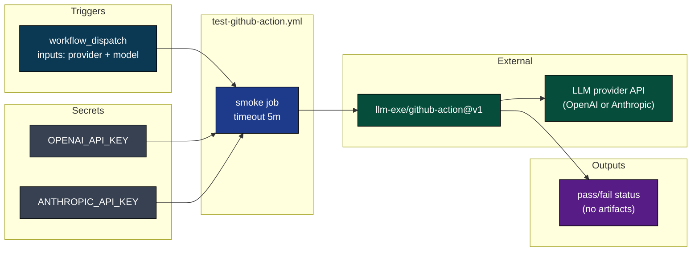
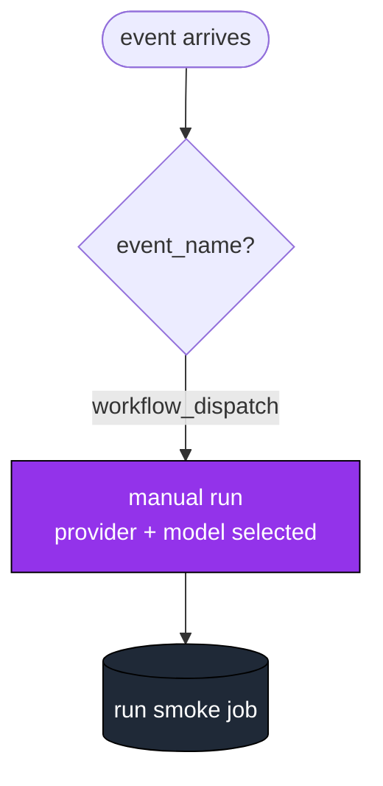
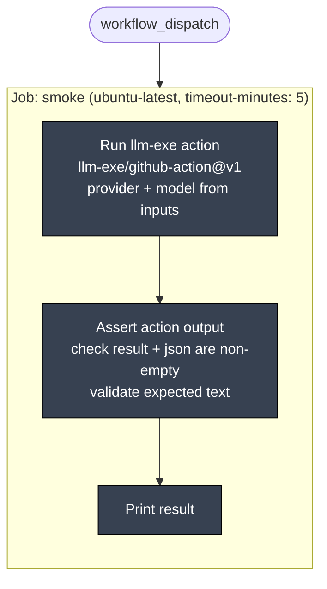
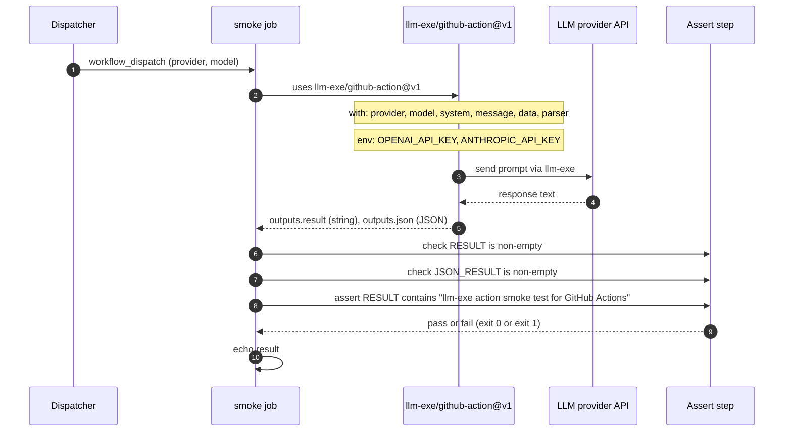
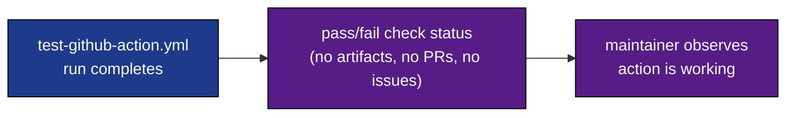
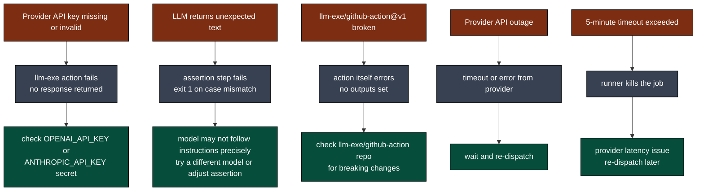
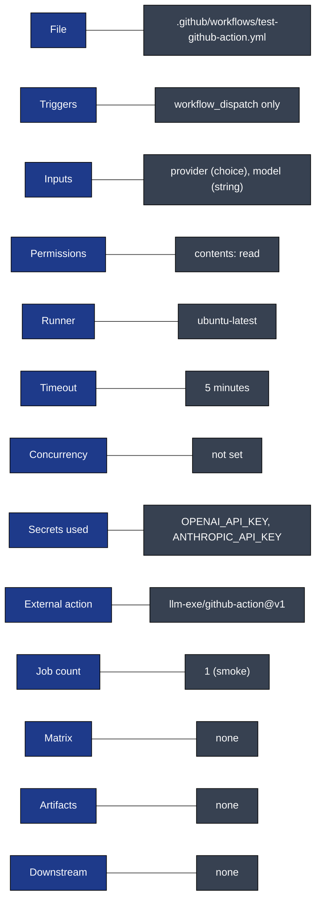

# Test GitHub Action: Visual Deep Dive

Concentrated diagrams for [.github/workflows/test-github-action.yml](../workflows/test-github-action.yml). Companion to [WORKFLOW_ARCHITECTURE.md](WORKFLOW_ARCHITECTURE.md).

This workflow smoke-tests the external [llm-exe/github-action](https://github.com/llm-exe/github-action) by running a single LLM call and asserting the output. It is dispatch-only and intentionally minimal. Minimum prose. Maximum diagrams.

## Navigate

- [1. The whole picture](#1-the-whole-picture)
- [2. Triggers](#2-triggers)
- [3. The one-job DAG](#3-the-one-job-dag)
- [4. Step-by-step lifecycle](#4-step-by-step-lifecycle)
- [5. Output cascade](#5-output-cascade)
- [6. Failure modes](#6-failure-modes)
- [7. Quick reference card](#7-quick-reference-card)

---

## 1. The whole picture

How [test-github-action.yml](../workflows/test-github-action.yml) fits into the repo.

This workflow is standalone. It does not trigger any downstream workflows, does not produce artifacts, and does not interact with GitHub issues or PRs.

[Back to top](#navigate)

---

## 2. Triggers

One entry point. No cron, no PR events.

| Input | Type | Required | Default | Options |
|-------|------|----------|---------|---------|
| `provider` | choice | yes | `openai.chat.v1` | `openai.chat.v1`, `anthropic.chat.v1` |
| `model` | string | yes | `gpt-4o-mini` | any model string the chosen provider supports |

Source: [.github/workflows/test-github-action.yml](../workflows/test-github-action.yml) lines 3-16.

[Back to top](#navigate)

---

## 3. The one-job DAG

Single linear job. No matrix, no gates.

Permissions are read-only: `contents: read`. This job calls an external LLM API through the GitHub Action and checks the response. No writes to the repo.

[Back to top](#navigate)

---

## 4. Step-by-step lifecycle

One run from dispatch to assertion.

The action receives a Handlebars-templated message (`"Return exactly this text and nothing else: llm-exe action smoke test for {{name}}"`) with data `{"name": "GitHub Actions"}`. The assertion checks the response contains the expected rendered string.

Source: [.github/workflows/test-github-action.yml](../workflows/test-github-action.yml) lines 24-64.

[Back to top](#navigate)

---

## 5. Output cascade

What this workflow produces and who eats it.

This is a pure verification workflow. It produces no artifacts, files no issues, and triggers no downstream workflows. Its only output is the job's pass/fail status, which tells the maintainer whether the external `llm-exe/github-action` is functioning correctly with the selected provider and model.

[Back to top](#navigate)

---

## 6. Failure modes

Where this workflow can break and what falls out.

[Back to top](#navigate)

---

## 7. Quick reference card

Direct links:

- Workflow file: [.github/workflows/test-github-action.yml](../workflows/test-github-action.yml)
- External action: [llm-exe/github-action](https://github.com/llm-exe/github-action)
- Full architecture doc: [WORKFLOW_ARCHITECTURE.md](WORKFLOW_ARCHITECTURE.md)

[Back to top](#navigate)
