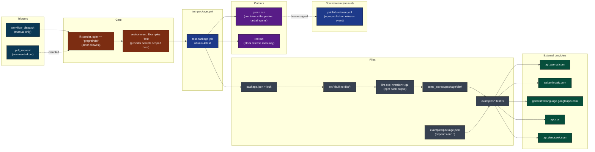
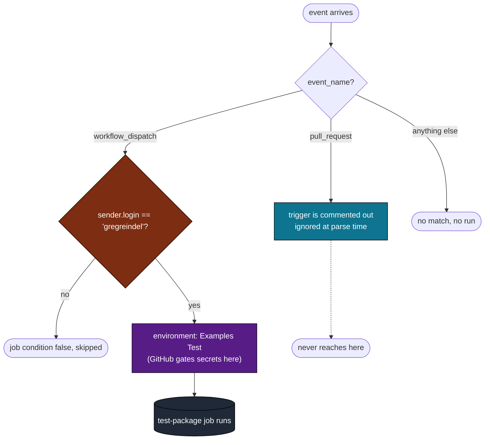
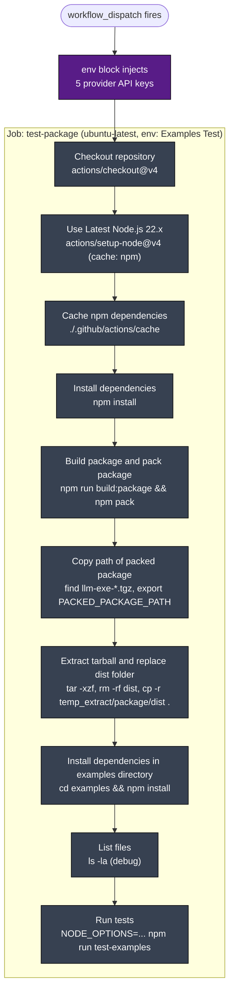
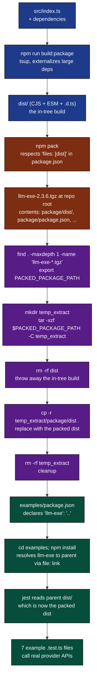
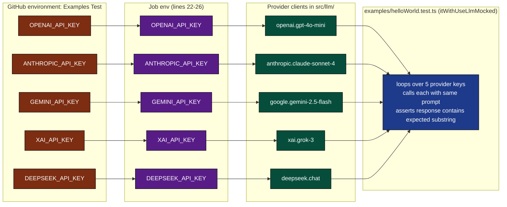
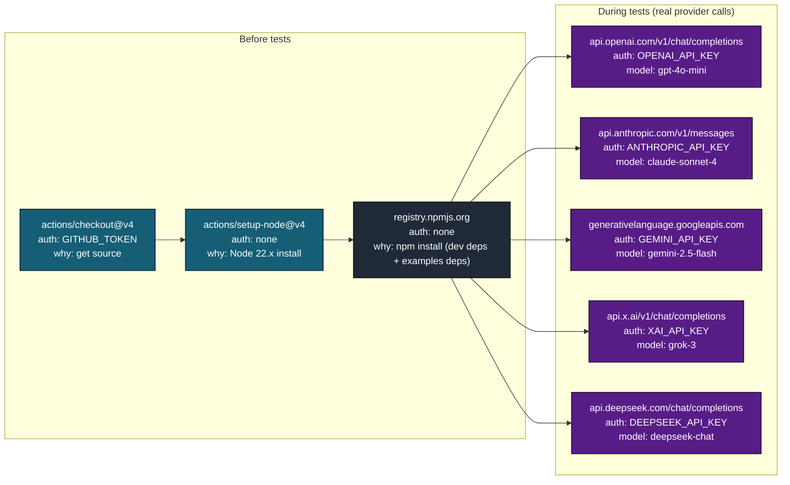
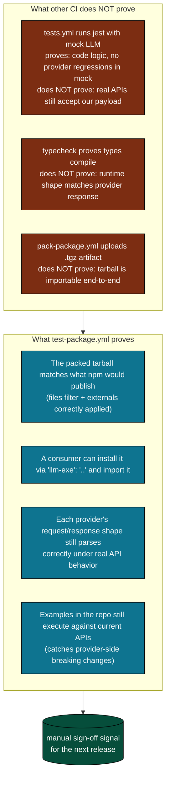
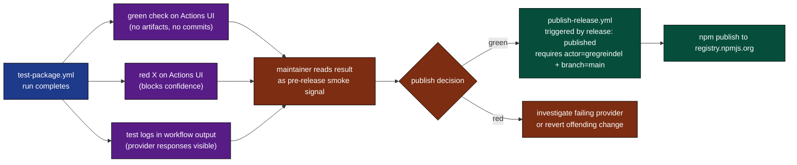
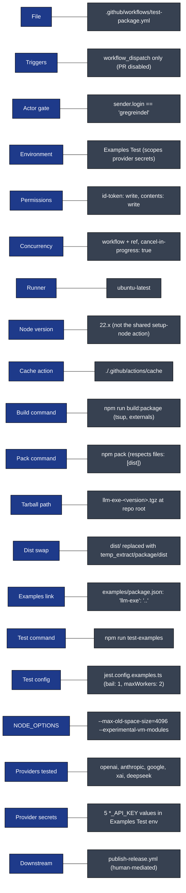

# test-package: Visual Deep Dive

Concentrated diagrams for [.github/workflows/test-package.yml](../workflows/test-package.yml). This is the only workflow that exercises a packed `.tgz` against real provider APIs. Companion to [WORKFLOW_ARCHITECTURE.md](WORKFLOW_ARCHITECTURE.md).

Minimum prose. Maximum diagrams.

## Navigate

- [1. The whole picture](#1-the-whole-picture)
- [2. Triggers and the actor allowlist](#2-triggers-and-the-actor-allowlist)
- [3. The one-job DAG](#3-the-one-job-dag)
- [4. Step-by-step lifecycle](#4-step-by-step-lifecycle)
- [5. The build, pack, extract, replace, test pipeline](#5-the-build-pack-extract-replace-test-pipeline)
- [6. The provider key matrix](#6-the-provider-key-matrix)
- [7. External calls](#7-external-calls)
- [8. Why this workflow exists](#8-why-this-workflow-exists)
- [9. Output cascade](#9-output-cascade)
- [10. Failure modes](#10-failure-modes)
- [11. Quick reference card](#11-quick-reference-card)

---

## 1. The whole picture

How [test-package.yml](../workflows/test-package.yml) sits in the release path.



[Back to top](#navigate)

---

## 2. Triggers and the actor allowlist

One trigger, two gates. The PR trigger is commented out on purpose.



The job-level `if` expression is a defense-in-depth allowlist:

```
if: ${{ !(github.event.pull_request.base.ref == 'development' && github.event.pull_request.head.ref == 'bump-version-branch')
        || (github.event_name == 'workflow_dispatch' && github.event.sender.login == 'gregreindel') }}
```

In practice, since only `workflow_dispatch` is active, the condition that matters is the right-hand clause: actor must be `gregreindel`. The left-hand clause is a leftover for the disabled PR path.

The `environment: Examples Test` declaration is the real lock. Provider secrets only exist inside that environment. A fork PR or a different actor cannot read them even if the trigger fired.

Source: [.github/workflows/test-package.yml](../workflows/test-package.yml) lines 3-7 (triggers), 19-20 (environment + actor gate).

[Back to top](#navigate)

---

## 3. The one-job DAG

One job, eight steps, linear.



Concurrency group is `${{ github.workflow }}-${{ github.ref }}` with `cancel-in-progress: true`. A second dispatch on the same ref cancels the first.

Permissions: `id-token: write`, `contents: write`. The `id-token` is for OIDC if needed by future steps; nothing in the current workflow consumes it.

[Back to top](#navigate)

---

## 4. Step-by-step lifecycle

One run from dispatch to test results, with every file movement.

```mermaid
sequenceDiagram
    autonumber
    participant U as Maintainer
    participant E as Event
    participant J as test-package job
    participant N as Node 22 + npm
    participant B as tsup build
    participant P as npm pack
    participant FS as Filesystem
    participant EX as examples/ workspace
    participant LLM as 5 provider APIs

    U->>E: workflow_dispatch (actor=gregreindel)
    E->>J: gate check (actor + environment)
    J->>FS: checkout repo at ref
    J->>N: setup-node@v4 (22.x, cache: npm)
    J->>N: ./.github/actions/cache (warm ~/.npm + node_modules)
    J->>N: npm install (dev deps for build)
    J->>B: npm run build:package (tsup, external deps)
    B-->>FS: dist/index.js, dist/index.mjs, dist/index.d.ts
    J->>P: npm pack
    P-->>FS: llm-exe-2.3.6.tgz at repo root
    J->>FS: find . -maxdepth 1 -name 'llm-exe-*.tgz'
    FS-->>J: PACKED_PACKAGE_PATH env var
    J->>FS: mkdir temp_extract; tar -xzf into it
    J->>FS: rm -rf dist
    J->>FS: cp -r temp_extract/package/dist .
    J->>FS: rm -rf temp_extract
    Note over FS: dist/ now mirrors what npm would install
    J->>EX: cd examples; npm install
    EX-->>FS: examples/node_modules/llm-exe -> .. (file: link)
    J->>FS: ls -la (debug snapshot)
    J->>N: export NODE_OPTIONS, npm run test-examples
    N->>EX: jest with examples roots
    EX->>LLM: 5 providers via env-keyed clients
    LLM-->>EX: real model responses
    EX-->>J: pass / fail
    J-->>U: workflow run status
```

Source: [.github/workflows/test-package.yml](../workflows/test-package.yml) lines 27-71.

[Back to top](#navigate)

---

## 5. The build, pack, extract, replace, test pipeline

The non-obvious dance is steps 5 through 7. It exists to make the test consume the *packed* artifact, not the *source* tree.



Why the swap matters: `examples/` consumes `llm-exe` via a file dependency (`"llm-exe": ".."`). Without the swap, jest would import from the in-tree `dist/` which could contain anything the build emitted, including files that npm's `files: [dist]` filter would exclude. After the swap, the imported `dist/` is byte-identical to what an end user gets via `npm install llm-exe`.

The packed contents differ from the source tree because:

- `files: ["dist"]` in [package.json](../../package.json) line 31-33 restricts publish to `dist/`
- `build:package` externalizes `jsonschema`, `json-schema-to-ts`, `exponential-backoff`, and the AWS/Smithy modules (see line 46) so they resolve from a consumer's `node_modules`, not bundled in

[Back to top](#navigate)

---

## 6. The provider key matrix

Five secrets, five providers, one job. All injected at the job level via `env:`.



The shape of the test loop in [examples/helloWorld.test.ts](../../examples/helloWorld.test.ts):

```
itWithUseLlmMocked(
  "handle this simple instruction",
  [
    "anthropic.claude-sonnet-4",
    "openai.gpt-4o-mini",
    "google.gemini-2.5-flash",
    "xai.grok-3",
    "deepseek.chat",
  ],
  async (config) => { ... }
);
```

Each provider gets its own jest test case. If a key is missing or revoked, only that one provider's case fails.

[Back to top](#navigate)

---

## 7. External calls

Five real LLM providers, one identity per provider, one shared workflow run.



This is the only workflow in the repo that contacts real provider APIs. Every other workflow either:

- uses the `openai.chat-mock.v1` mock LLM (tests.yml), or
- talks to Anthropic via Claude Code OAuth, not the llm-exe provider clients (agent-run.yml)

[Back to top](#navigate)

---

## 8. Why this workflow exists

The integration gap that this workflow closes.



The cost meter is real money: every dispatch consumes paid tokens across all five providers. That is why it is gated to `workflow_dispatch` plus actor allowlist, not automated.

[Back to top](#navigate)

---

## 9. Output cascade

What this workflow produces and what consumes the signal.



There is no automated wire from `test-package.yml` to `publish-release.yml`. The cascade is human-mediated: a maintainer dispatches this workflow, reads the result, and decides whether to cut a release. The shared actor allowlist (`gregreindel`) on both workflows means only one person can do either side.

[Back to top](#navigate)

---

## 10. Failure modes

Where things break, what happens, what to do.

```mermaid
flowchart TB
    classDef fail fill:#7c2d12,color:#fff,stroke:#000
    classDef effect fill:#374151,color:#fff,stroke:#000
    classDef fix fill:#064e3b,color:#fff,stroke:#000

    F1["Non-allowlisted actor dispatches"]:::fail
    F1 --> F1E["job-level if evaluates false\njob shows as skipped"]:::effect
    F1E --> F1X["expected, no action\nadd login to allowlist if needed"]:::fix

    F2["Environment secret missing\n(e.g. XAI_API_KEY rotated and not re-added)"]:::fail
    F2 --> F2E["env var empty at runtime\nthat provider's test case fails\n(other 4 still run)"]:::effect
    F2X["re-add secret in Examples Test environment"]:::fix
    F2E --> F2X

    F3["npm install fails\n(registry hiccup or lock drift)"]:::fail
    F3 --> F3E["job halts before pack\nno tarball produced"]:::effect
    F3X["retry, or fix package-lock"]:::fix
    F3E --> F3X

    F4["build:package emits broken dist"]:::fail
    F4 --> F4E["npm pack succeeds but tarball imports fail\nexamples error at require time"]:::effect
    F4X["fix tsup config, externals, or src/"]:::fix
    F4E --> F4X

    F5["Provider API breaking change\n(response shape, error code, model deprecated)"]:::fail
    F5 --> F5E["that provider's example test fails\ncatches real-world regression"]:::effect
    F5X["update src/llm/&lt;provider&gt;/ client\nor the example test"]:::fix
    F5E --> F5X

    F6["Provider outage / 5xx"]:::fail
    F6 --> F6E["test fails with network error\nnot a code bug"]:::effect
    F6X["wait, re-dispatch later"]:::fix
    F6E --> F6X

    F7["Rate limit hit during run"]:::fail
    F7 --> F7E["429 from provider\ntest fails for that one case"]:::effect
    F7X["jest.config.examples.ts has maxWorkers: 2\nand bail: 1 to limit blast radius\nre-dispatch after cooldown"]:::fix
    F7E --> F7X

    F8["Second dispatch fired on same ref"]:::fail
    F8 --> F8E["concurrency group cancels first run\n(cancel-in-progress: true)"]:::effect
    F8X["intentional, prevents cost double-up"]:::fix
    F8E --> F8X

    F9["Token budget concern\n(every run costs real money on 5 providers)"]:::fail
    F9 --> F9E["each dispatch burns paid credits"]:::effect
    F9X["actor allowlist + manual trigger\nare the rate limiter"]:::fix
    F9E --> F9X
```



Note that `bail: 1` in [jest.config.examples.ts](../../jest.config.examples.ts) means the suite stops at the first failure. Combined with `maxWorkers: 2`, this caps the worst case at a few extra provider calls before the run aborts.

[Back to top](#navigate)

---

## 11. Quick reference card



Direct links:

- Workflow file: [.github/workflows/test-package.yml](../workflows/test-package.yml)
- Cache action: [.github/actions/cache/action.yml](../actions/cache/action.yml)
- Setup-node action: [.github/actions/setup-node/action.yml](../actions/setup-node/action.yml) (note: this workflow does NOT use the shared action, it pins 22.x directly)
- Release workflow: [.github/workflows/publish-release.yml](../workflows/publish-release.yml)
- Examples package: [examples/package.json](../../examples/package.json)
- Jest examples config: [jest.config.examples.ts](../../jest.config.examples.ts)
- Build script: see `build:package` in [package.json](../../package.json) line 46
- Full architecture doc: [WORKFLOW_ARCHITECTURE.md](WORKFLOW_ARCHITECTURE.md)

[Back to top](#navigate)
