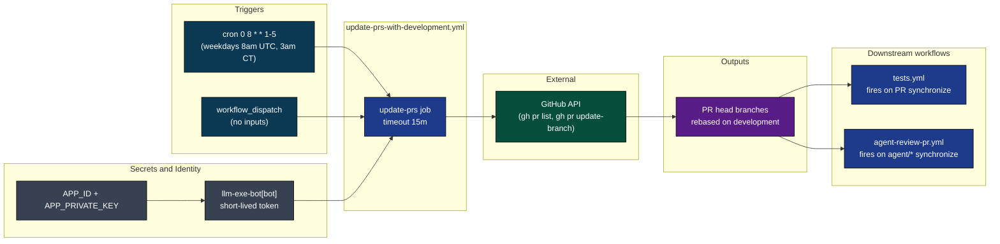
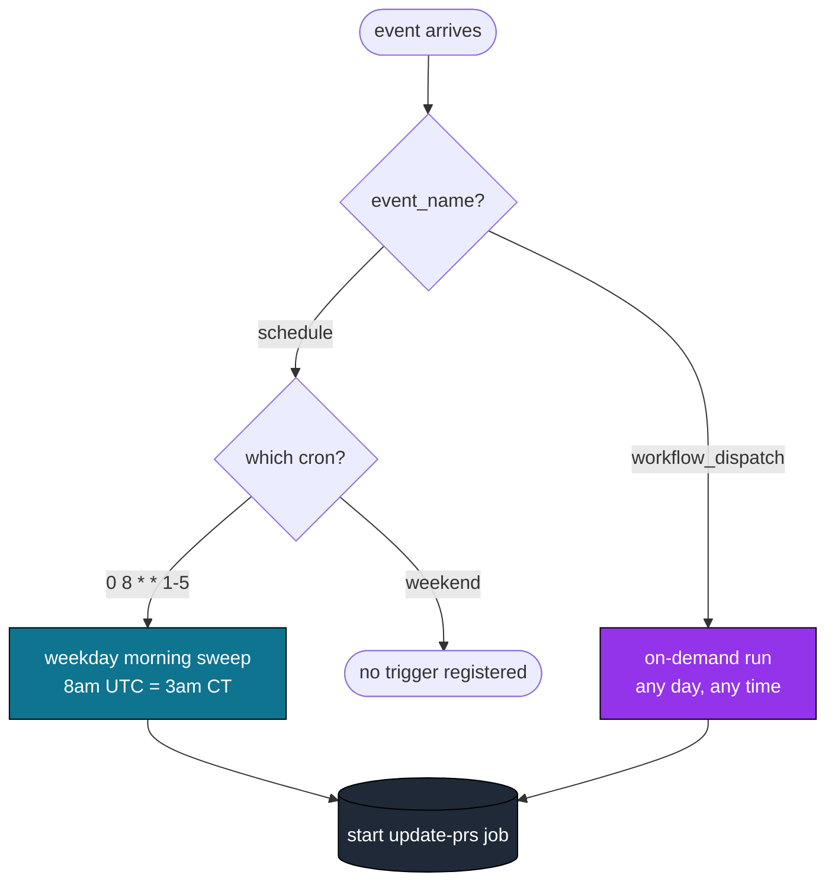
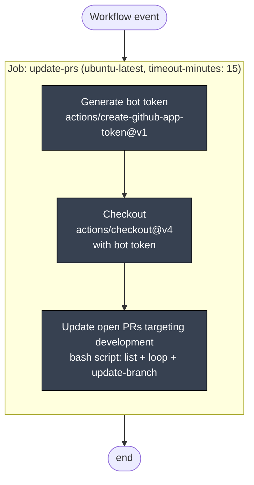
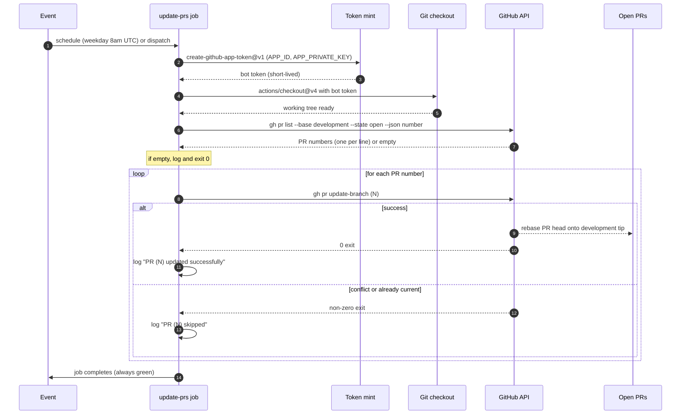
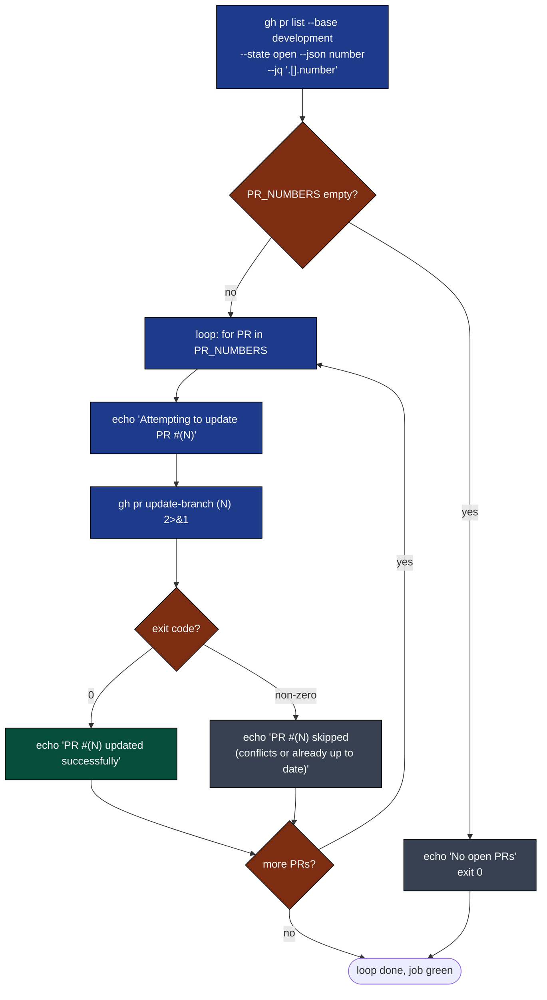
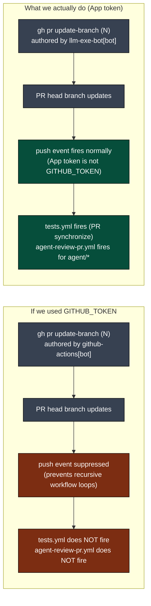
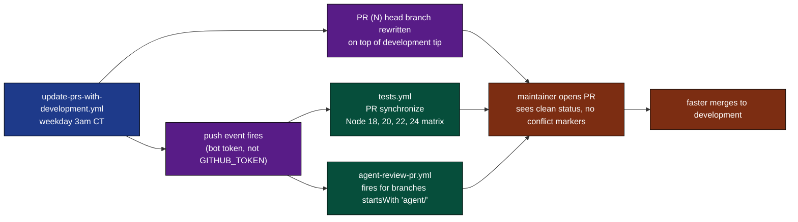
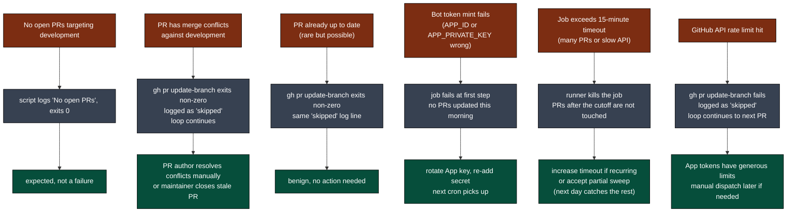
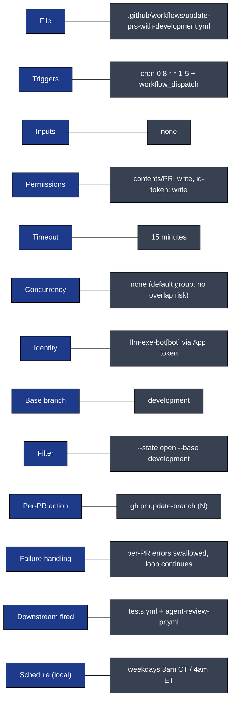

# update-prs-with-development: Visual Deep Dive

Concentrated diagrams for [.github/workflows/update-prs-with-development.yml](../workflows/update-prs-with-development.yml). Companion to [WORKFLOW_ARCHITECTURE.md](WORKFLOW_ARCHITECTURE.md).

This workflow is intentionally simple. One job, one loop, weekday mornings. Its purpose is to keep open PRs from rotting against `development` by rebasing them daily before the maintainer wakes up.

## Navigate

- [1. The whole picture](#1-the-whole-picture)
- [2. Triggers (weekday cron and dispatch)](#2-triggers-weekday-cron-and-dispatch)
- [3. The one-job DAG](#3-the-one-job-dag)
- [4. Step-by-step lifecycle](#4-step-by-step-lifecycle)
- [5. The PR update loop](#5-the-pr-update-loop)
- [6. Why bot token vs default token](#6-why-bot-token-vs-default-token)
- [7. Output cascade](#7-output-cascade)
- [8. Failure modes](#8-failure-modes)
- [9. Quick reference card](#9-quick-reference-card)

---

## 1. The whole picture

How [update-prs-with-development.yml](../workflows/update-prs-with-development.yml) fits in.

[Back to top](#navigate)

---

## 2. Triggers (weekday cron and dispatch)

Two entry points. Neither carries inputs. The cron is the load-bearing one.

Why weekdays only: the maintainer reviews on weekdays. Weekend rebases would land on quiet branches and waste CI minutes. The 3am CT timing means PRs are fresh by the time the maintainer opens their laptop.

Source: [.github/workflows/update-prs-with-development.yml](../workflows/update-prs-with-development.yml) lines 3-6.

[Back to top](#navigate)

---

## 3. The one-job DAG

There is one job. No gates. No matrix. No dependencies.

Permissions granted to this single job:

| Scope | Level | Why |
|-------|-------|-----|
| `contents` | write | `gh pr update-branch` rewrites the PR head branch |
| `pull-requests` | write | required by `gh pr update-branch` API |
| `id-token` | write | OIDC token minting for the app credential |

Source: [.github/workflows/update-prs-with-development.yml](../workflows/update-prs-with-development.yml) lines 8-16.

[Back to top](#navigate)

---

## 4. Step-by-step lifecycle

One run from event to completion.

Source: [.github/workflows/update-prs-with-development.yml](../workflows/update-prs-with-development.yml) lines 18-49.

[Back to top](#navigate)

---

## 5. The PR update loop

The core logic is fifteen lines of bash. Here it is as a flowchart.

Two important properties:

1. **No early exit on failure.** A failed `update-branch` does not halt the loop. The `if` wrapper swallows the non-zero exit so the remaining PRs still get a shot. A single conflicting PR cannot block the sweep.
2. **No distinction between conflict and no-op.** "Already up to date" and "merge conflict" both produce non-zero exits and the same log line. The maintainer reads the logs only when something feels off; otherwise green is green.

Source: [.github/workflows/update-prs-with-development.yml](../workflows/update-prs-with-development.yml) lines 34-49.

[Back to top](#navigate)

---

## 6. Why bot token vs default token

This is the only design choice in the workflow worth defending.

GitHub deliberately suppresses workflow triggers when actions are taken with the built-in `GITHUB_TOKEN`. This prevents infinite loops where workflow A pushes, which fires workflow B, which pushes, and so on. The trade-off is that legitimate cross-workflow chains break too. Using a GitHub App token sidesteps the suppression: the token is owned by an identity (`llm-exe-bot[bot]`) that GitHub treats as a real user. Push events fire, CI runs on the rebased commits, and stale-looking checks get refreshed.

This is the entire reason the workflow mints an App token instead of using the ambient `GITHUB_TOKEN`. The bot identity is not cosmetic; it is mechanically required for the downstream cascade.

Source: [.github/workflows/update-prs-with-development.yml](../workflows/update-prs-with-development.yml) lines 19-24, 33.

[Back to top](#navigate)

---

## 7. Output cascade

What rebasing produces and who eats it.

The cascade is what makes this workflow valuable. Without it, the maintainer arrives in the morning to find PRs marked "out-of-date with base" and has to manually click "Update branch" on each. With it, the work is done and CI has already revalidated the result. The maintainer sees a green PR ready to merge.

[Back to top](#navigate)

---

## 8. Failure modes

Where things can break and what happens.

The script is deliberately tolerant. The only failure that produces a red job is a token mint failure or a timeout. Per-PR failures are absorbed by design, which means a red workflow in this file is always a real infrastructure problem, never a stale PR.

[Back to top](#navigate)

---

## 9. Quick reference card

Direct links:

- Workflow file: [.github/workflows/update-prs-with-development.yml](../workflows/update-prs-with-development.yml)
- Downstream consumers: [tests.yml](../workflows/tests.yml), [agent-review-pr.yml](../workflows/agent-review-pr.yml)
- Full architecture doc: [WORKFLOW_ARCHITECTURE.md](WORKFLOW_ARCHITECTURE.md)
- Sibling deep dive: [AGENT_RUN_DEEP_DIVE.md](AGENT_RUN_DEEP_DIVE.md)

[Back to top](#navigate)
