# vitals: Visual Deep Dive

Concentrated diagrams for [.github/workflows/vitals.yml](../workflows/vitals.yml) and the generator script at [.github/vitals/generate.sh](../vitals/generate.sh). Companion to [WORKFLOW_ARCHITECTURE.md](WORKFLOW_ARCHITECTURE.md) and the template at [AGENT_RUN_DEEP_DIVE.md](AGENT_RUN_DEEP_DIVE.md).

Minimum prose. Maximum diagrams.

## Navigate

- [1. The whole picture](#1-the-whole-picture)
- [2. Triggers](#2-triggers)
- [3. The one-job DAG](#3-the-one-job-dag)
- [4. Step-by-step lifecycle](#4-step-by-step-lifecycle)
- [5. Anatomy of AUTOMATION.md](#5-anatomy-of-automationmd)
- [6. Data sources](#6-data-sources)
- [7. Why the badges work](#7-why-the-badges-work)
- [8. Security boundaries](#8-security-boundaries)
- [9. Loop prevention](#9-loop-prevention)
- [10. External calls](#10-external-calls)
- [11. Output cascade](#11-output-cascade)
- [12. State machine](#12-state-machine)
- [13. Failure modes](#13-failure-modes)
- [14. Quick reference card](#14-quick-reference-card)

---

## 1. The whole picture

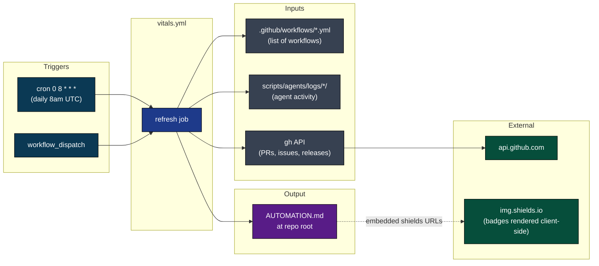

[Back to top](#navigate)

---

## 2. Triggers

```mermaid
flowchart TB
    classDef trig fill:#0b3954,color:#fff,stroke:#000
    classDef chk fill:#7c2d12,color:#fff,stroke:#000
    classDef ok fill:#064e3b,color:#fff,stroke:#000

    e([event])
    e --> q{event_name?}
    q -->|schedule (daily 8am UTC)| s[scheduled refresh]:::trig
    q -->|workflow_dispatch| d[manual dispatch]:::trig

    s --> a{actor != llm-exe-bot[bot]?}
    a -->|yes| go1[(proceed)]:::ok
    a -->|no| sk[(skip)]:::chk

    d --> go2[(proceed, always)]:::ok
```

No `push`, no `pull_request`, no `workflow_run`. The daily cron is the only trigger that fires automatically, in the same early-morning UTC window used by `agent-run`, `coder-run`, and `update-prs-with-development`. Manual dispatch is always available for an immediate refresh.

[Back to top](#navigate)

---

## 3. The one-job DAG

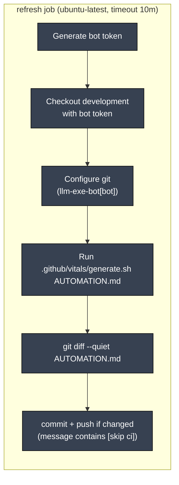

Concurrency group is `vitals` with `cancel-in-progress: true`. If the daily cron and a manual dispatch overlap, the dispatch wins.

[Back to top](#navigate)

---

## 4. Step-by-step lifecycle

```mermaid
sequenceDiagram
    autonumber
    participant E as Event (cron or dispatch)
    participant J as refresh job
    participant T as Token mint
    participant G as Git
    participant Gen as generate.sh
    participant GH as gh CLI
    participant API as api.github.com
    participant Out as AUTOMATION.md

    E->>J: dispatch / schedule
    J->>T: create-github-app-token@v1
    T-->>J: bot token (short-lived)
    J->>G: checkout development with bot token
    J->>G: git config llm-exe-bot[bot]
    J->>Gen: bash .github/vitals/generate.sh AUTOMATION.md
    Gen->>GH: gh repo view (resolve owner/repo)
    Gen->>GH: gh pr list (open bot PRs, stale &gt; 72h)
    Gen->>GH: gh issue list (open count, needs-discussion, breaking)
    Gen->>GH: gh release list --limit 1
    Gen->>GH: gh pr list base main head development
    GH->>API: REST calls
    API-->>GH: JSON responses
    Gen->>Gen: walk scripts/agents/logs/*/ for activity counts
    Gen->>Out: write template + workflow table + activity + health + release + links
    J->>G: git diff --quiet AUTOMATION.md
    Note over J: if no diff, exit early with notice
    J->>G: git add + commit "chore: refresh automation vitals [skip ci]"
    J->>G: git push origin development (with rebase-retry on failure)
```

[Back to top](#navigate)

---

## 5. Anatomy of AUTOMATION.md

The generator emits the file in five sections, in this order, every time.

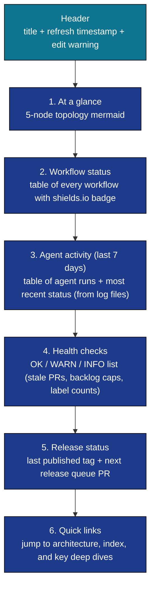

[Back to top](#navigate)

---

## 6. Data sources

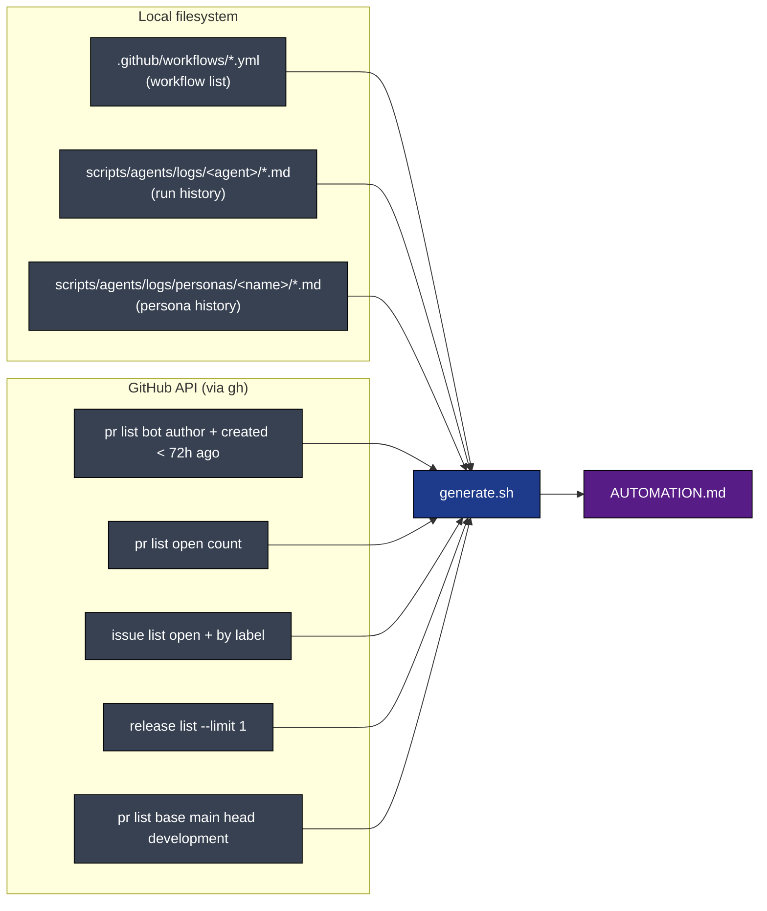

Every `gh` call is wrapped with a fallback so transient errors degrade gracefully instead of crashing the script.

[Back to top](#navigate)

---

## 7. Why the badges work

The workflow status table uses [shields.io](https://shields.io) badge URLs. The benefit is the rendered status stays correct between vitals runs.

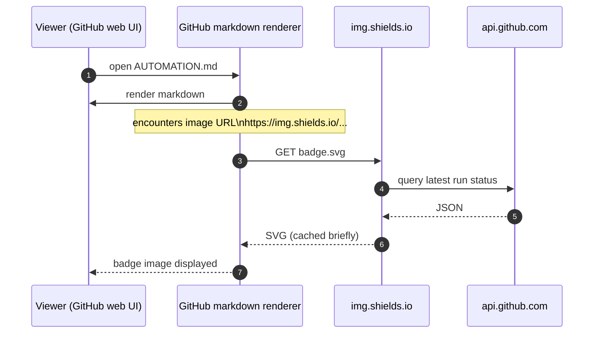

So the table itself is static text but the badges show fresh status on every view, without re-running the workflow.

[Back to top](#navigate)

---

## 8. Security boundaries

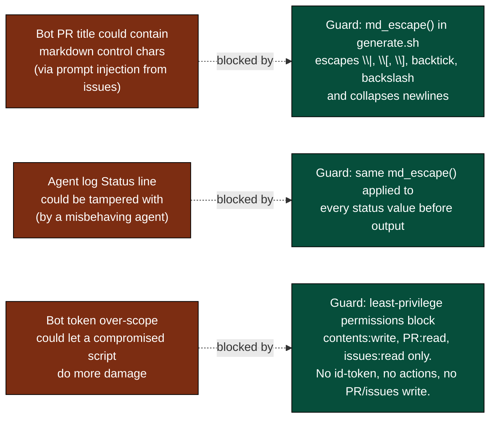

The generator is the rendering boundary. Untrusted strings (bot PR titles, release names, agent status values) all flow through `md_escape` before they reach `AUTOMATION.md`. The bot's permissions in the workflow match exactly what `gh` and `git push` need, and nothing more.

[Back to top](#navigate)

---

## 9. Loop prevention

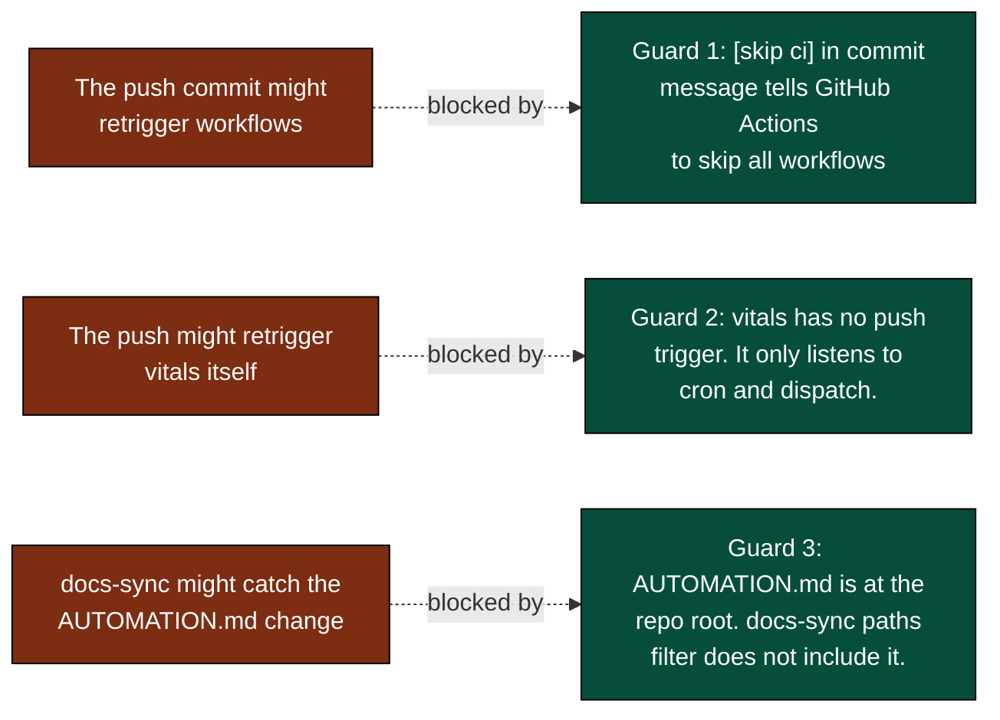

[Back to top](#navigate)

---

## 10. External calls

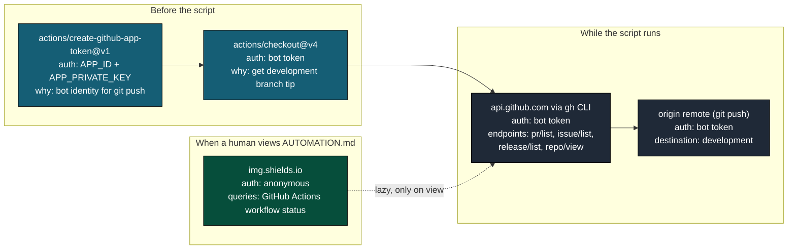

[Back to top](#navigate)

---

## 11. Output cascade

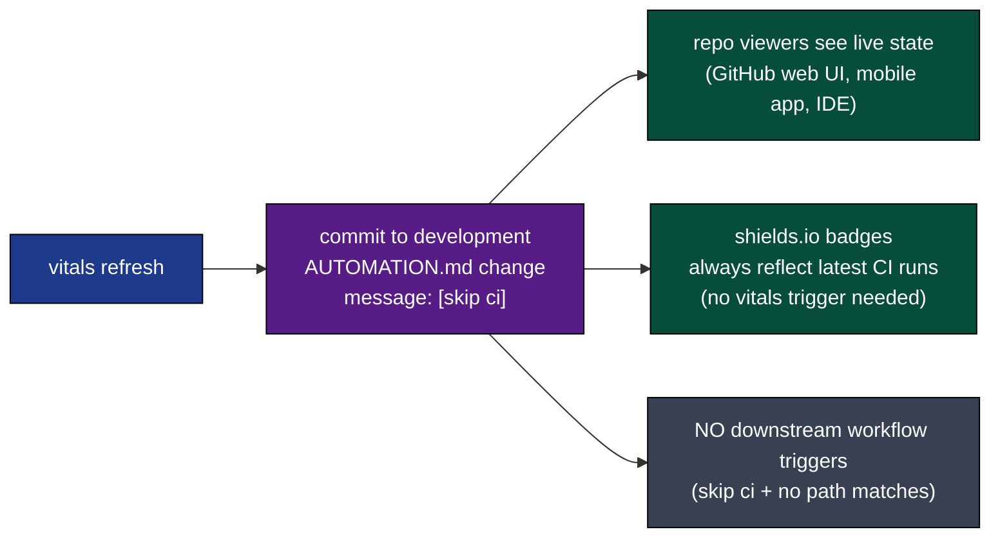

[Back to top](#navigate)

---

## 12. State machine

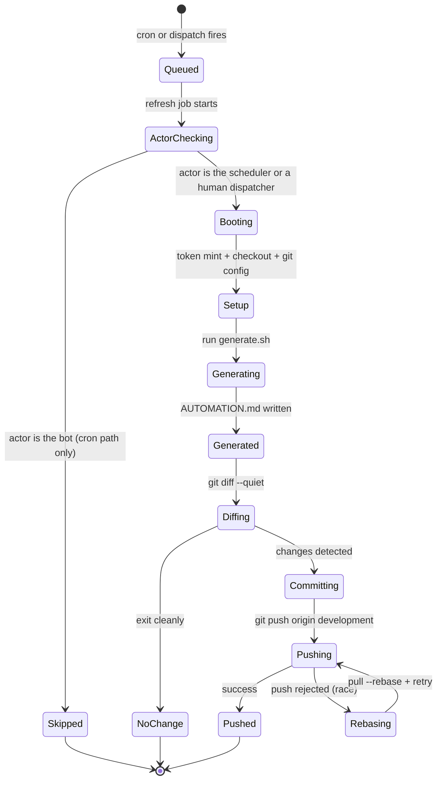

[Back to top](#navigate)

---

## 13. Failure modes

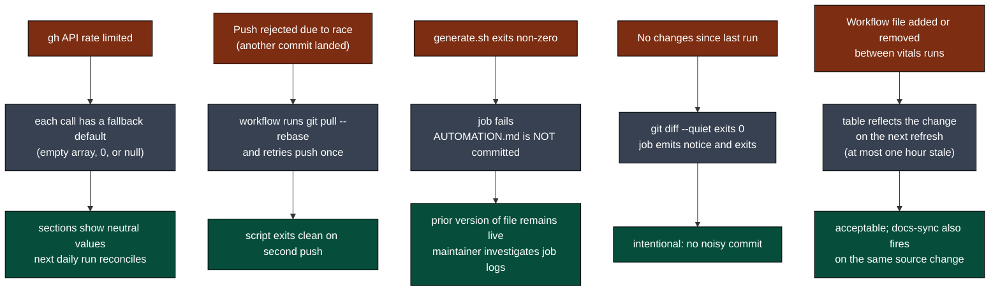

[Back to top](#navigate)

---

## 14. Quick reference card

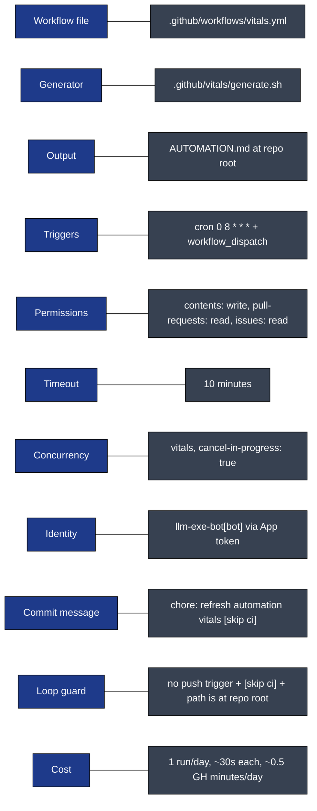

Direct links:

- Workflow file: [.github/workflows/vitals.yml](../workflows/vitals.yml)
- Generator script: [.github/vitals/generate.sh](../vitals/generate.sh)
- Live output: [AUTOMATION.md](../../AUTOMATION.md)
- Companion docs: [WORKFLOWS_INDEX.md](WORKFLOWS_INDEX.md), [WORKFLOW_ARCHITECTURE.md](WORKFLOW_ARCHITECTURE.md), [DOCS_SYNC_DEEP_DIVE.md](DOCS_SYNC_DEEP_DIVE.md)

[Back to top](#navigate)
