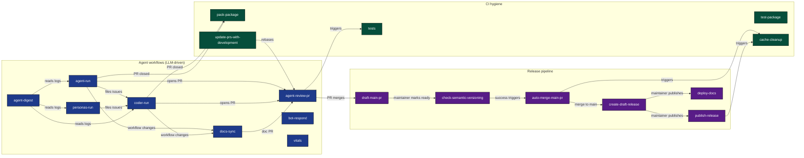
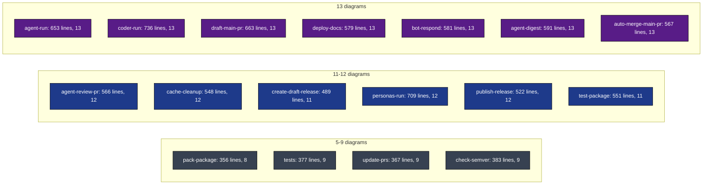

# Workflow Deep Dives Index

One deep-dive document per workflow. Pick any tile to jump in.

Companion docs:
- [WORKFLOW_ARCHITECTURE.md](WORKFLOW_ARCHITECTURE.md) - the macro view, all 16 workflows in one document
- [.github/workflows/](../workflows/) - the actual workflow YAML files

## Map of the territory

---

## Agent workflows

| Workflow | Triggers | Purpose | Deep dive |
|----------|----------|---------|-----------|
| [agent-run.yml](../workflows/agent-run.yml) | 3 crons + dispatch | Task agents (docs, tester, scout) on a schedule | [AGENT_RUN_DEEP_DIVE.md](AGENT_RUN_DEEP_DIVE.md) |
| [coder-run.yml](../workflows/coder-run.yml) | cron + dispatch | Fans the coder out across up to 5 unclaimed issues in a matrix | [CODER_RUN_DEEP_DIVE.md](CODER_RUN_DEEP_DIVE.md) |
| [personas-run.yml](../workflows/personas-run.yml) | Sunday cron + dispatch | Persona agents (beginner, harsh-critic, speed-runner, enterprise) plus curator | [PERSONAS_RUN_DEEP_DIVE.md](PERSONAS_RUN_DEEP_DIVE.md) |
| [agent-review-pr.yml](../workflows/agent-review-pr.yml) | PR opened/synchronize on development | Tests (Node matrix) + reviewer agent + decide job: approve, request changes, or close | [AGENT_REVIEW_PR_DEEP_DIVE.md](AGENT_REVIEW_PR_DEEP_DIVE.md) |
| [agent-digest.yml](../workflows/agent-digest.yml) | Monday cron + dispatch | Weekly HTML email digest sent via Microsoft Graph | [AGENT_DIGEST_DEEP_DIVE.md](AGENT_DIGEST_DEEP_DIVE.md) |
| [bot-respond.yml](../workflows/bot-respond.yml) | issue_comment mentioning @llm-exe-bot | Conversational responder; can revise PR branches on explicit ask | [BOT_RESPOND_DEEP_DIVE.md](BOT_RESPOND_DEEP_DIVE.md) |
| [docs-sync.yml](../workflows/docs-sync.yml) | push to development on workflow/script/action changes + dispatch | Keeps the workflow deep-dive docs in sync with their source files | [DOCS_SYNC_DEEP_DIVE.md](DOCS_SYNC_DEEP_DIVE.md) |
| [vitals.yml](../workflows/vitals.yml) | daily cron + dispatch | Regenerates [AUTOMATION.md](../../AUTOMATION.md), the live dashboard at the repo root | [VITALS_DEEP_DIVE.md](VITALS_DEEP_DIVE.md) |

## Release pipeline

| Workflow | Triggers | Purpose | Deep dive |
|----------|----------|---------|-----------|
| [draft-main-pr.yml](../workflows/draft-main-pr.yml) | PR closed to development + release published | Maintains the development to main draft PR; auto-bumps patch version | [DRAFT_MAIN_PR_DEEP_DIVE.md](DRAFT_MAIN_PR_DEEP_DIVE.md) |
| [check-semantic-versioning.yml](../workflows/check-semantic-versioning.yml) | PR on main | Blocks PR if package.json version is not greater than latest tag | [CHECK_SEMVER_DEEP_DIVE.md](CHECK_SEMVER_DEEP_DIVE.md) |
| [auto-merge-main-pr.yml](../workflows/auto-merge-main-pr.yml) | workflow_run on semver-check + PR events | Waits for checks, merges development to main with --admin | [AUTO_MERGE_MAIN_PR_DEEP_DIVE.md](AUTO_MERGE_MAIN_PR_DEEP_DIVE.md) |
| [create-draft-release.yml](../workflows/create-draft-release.yml) | PR merged to main + dispatch | Wipes existing drafts and creates a fresh draft release with cleaned notes | [CREATE_DRAFT_RELEASE_DEEP_DIVE.md](CREATE_DRAFT_RELEASE_DEEP_DIVE.md) |
| [publish-release.yml](../workflows/publish-release.yml) | release published + dispatch | npm publish (beta or main based on version string); failure rolls release back to draft | [PUBLISH_RELEASE_DEEP_DIVE.md](PUBLISH_RELEASE_DEEP_DIVE.md) |
| [deploy-docs.yml](../workflows/deploy-docs.yml) | release published + dispatch | Builds VitePress docs, ships to S3, rotates CloudFront OriginPath, invalidates | [DEPLOY_DOCS_DEEP_DIVE.md](DEPLOY_DOCS_DEEP_DIVE.md) |

## CI hygiene

| Workflow | Triggers | Purpose | Deep dive |
|----------|----------|---------|-----------|
| [tests.yml](../workflows/tests.yml) | PR on main or development + dispatch | Jest matrix on Node 18/20/22/24; coverage uploaded on Node 24 | [TESTS_DEEP_DIVE.md](TESTS_DEEP_DIVE.md) |
| [test-package.yml](../workflows/test-package.yml) | Dispatch only (gregreindel) | Runs examples/ against a packed tarball with real provider keys | [TEST_PACKAGE_DEEP_DIVE.md](TEST_PACKAGE_DEEP_DIVE.md) |
| [pack-package.yml](../workflows/pack-package.yml) | PR closed to development + dispatch | Build + npm pack, uploads .tgz artifact (30-day retention) | [PACK_PACKAGE_DEEP_DIVE.md](PACK_PACKAGE_DEEP_DIVE.md) |
| [cache-cleanup.yml](../workflows/cache-cleanup.yml) | PR closed + release published + dispatch | Deletes Actions caches scoped to the closed PR or release ref | [CACHE_CLEANUP_DEEP_DIVE.md](CACHE_CLEANUP_DEEP_DIVE.md) |
| [update-prs-with-development.yml](../workflows/update-prs-with-development.yml) | Weekday cron + dispatch | Rebases every open PR targeting development to keep them current | [UPDATE_PRS_DEEP_DIVE.md](UPDATE_PRS_DEEP_DIVE.md) |

---

## At a glance

Totals: 17 deep dives, 9,238 lines, 194 mermaid diagrams.

## Conventions every deep dive follows

- Top section is "Navigate" with anchor links to every section
- Each section ends with "[Back to top](#navigate)" so you can jump back
- "The whole picture" is always section 1: one flowchart that shows the workflow in context
- "Quick reference card" is always the last section: a key/value lookup of every constant
- Mermaid diagrams use a consistent color palette (blue for jobs, purple for outputs, green for externals, gray for files, dark red for gates/failures)
- No em dashes anywhere
- File paths are clickable markdown links

## How to use this index

| If you want to... | Start here |
|-------------------|-----------|
| Understand one workflow end to end | the deep dive for that workflow |
| Understand how workflows interact | [WORKFLOW_ARCHITECTURE.md](WORKFLOW_ARCHITECTURE.md) |
| Trace a feature from idea to npm | [WORKFLOW_ARCHITECTURE.md sections 11 and 12](WORKFLOW_ARCHITECTURE.md) |
| Replicate this automation in another repo | [WORKFLOW_ARCHITECTURE.md section 13 (Replication Recipe)](WORKFLOW_ARCHITECTURE.md) |
| Triage a failing run | the "Failure modes" section of the relevant deep dive |
| Audit secrets and identities | [WORKFLOW_ARCHITECTURE.md section 5](WORKFLOW_ARCHITECTURE.md) |
