# llm-exe Workflow and Agent Architecture

A complete, reproducible specification of every GitHub Actions workflow, every maintenance agent, every script, every external dependency, and every data path used to operate the llm-exe repository.

This document is the single source of truth. A new engineer with no prior context should be able to rebuild the entire automation surface from this file alone.

---

## Table of Contents

1. [System Overview](#1-system-overview)
2. [Topology Diagram](#2-topology-diagram)
3. [Trigger Matrix](#3-trigger-matrix)
4. [External Dependency Catalog](#4-external-dependency-catalog)
5. [Secrets, Variables, and Identities](#5-secrets-variables-and-identities)
6. [Filesystem Reference Map](#6-filesystem-reference-map)
7. [Agent Runtime Specification](#7-agent-runtime-specification)
8. [Agent Roster (Roles, Scopes, I/O Contracts)](#8-agent-roster-roles-scopes-io-contracts)
9. [Workflow Catalog (one detailed entry per workflow)](#9-workflow-catalog)
10. [End-to-End Data Flows](#10-end-to-end-data-flows)
11. [Release Pipeline](#11-release-pipeline)
12. [Persona to Issue to PR Pipeline](#12-persona-to-issue-to-pr-pipeline)
13. [Replication Recipe](#13-replication-recipe)

---

## 1. System Overview

The repository runs three layers of automation, each with a different cadence and audience.

| Layer | Purpose | Trigger style | Audience |
|-------|---------|---------------|----------|
| Maintenance agents | Self-driving work on docs, tests, code, and provider scouting. Reviewer auto-reviews every agent PR. | Scheduled crons plus manual dispatch | Repository maintainer |
| Release pipeline | Promote work from `development` to `main`, bump versions, draft releases, publish to npm, deploy docs to AWS S3 plus CloudFront. | Pull request events, release events, manual dispatch | End users of the npm package |
| Infrastructure hygiene | Test matrix on PRs, cache cleanup on PR close, weekly email digest, bot mention responder. | PR events, release events, scheduled crons, issue comments | CI health and maintainer awareness |

There are sixteen GitHub Actions workflow files, two reusable composite actions, one shell entry point (`scripts/maintain.sh`), one shared config library (`scripts/agents/config.sh`), nine Markdown prompt files, and a writable `scripts/agents/logs/` directory that the agents both read from and append to across runs.

---

## 2. Topology Diagram

The system is three layers fed by one set of triggers. Pick the layer you care about; the per-workflow detail lives in [section 9](#9-workflow-catalog) and in the [per-workflow deep dives](WORKFLOWS_INDEX.md).

### 2.1. Thirty-second overview

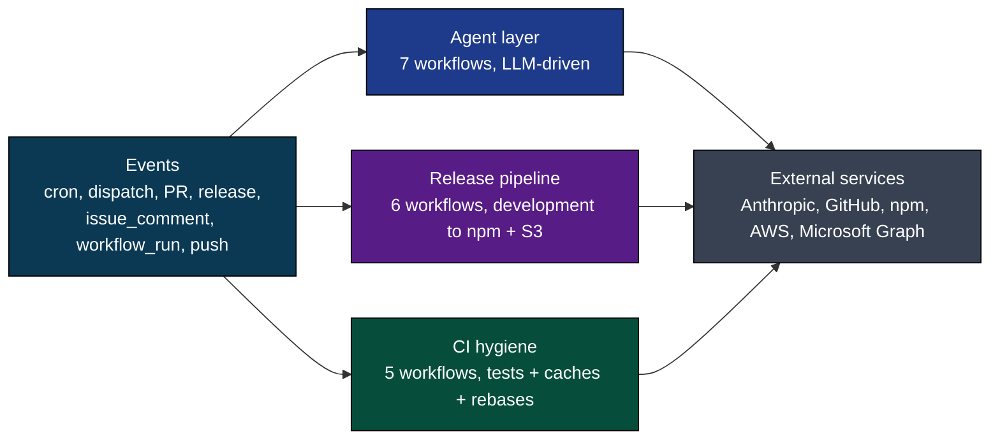

### 2.2. Agent layer

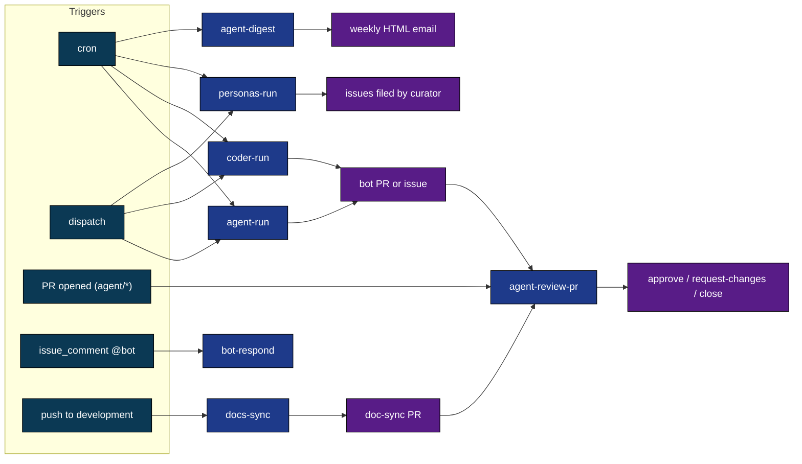

### 2.3. Release pipeline

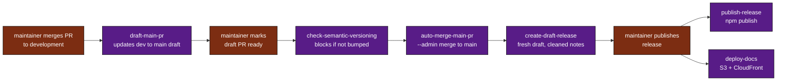

### 2.4. CI hygiene

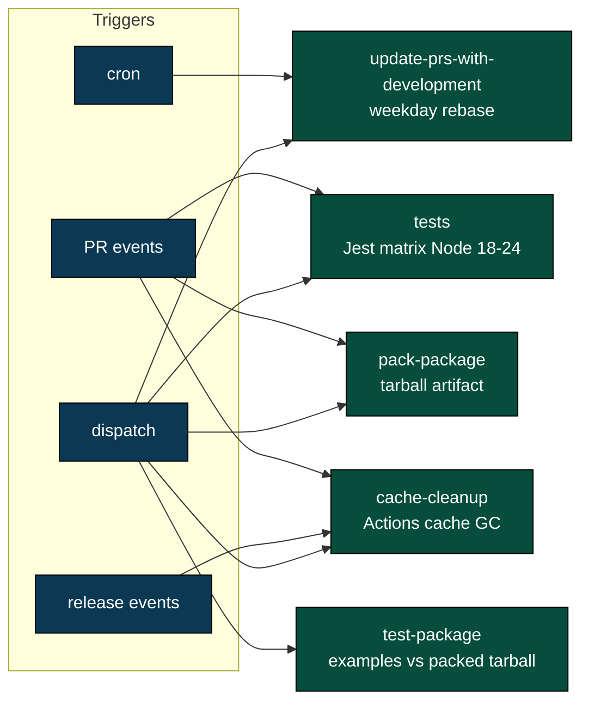

### 2.5. Identity and runtime (shared infrastructure)

```mermaid
flowchart LR
    classDef sec fill:#7c2d12,color:#fff,stroke:#000
    classDef tok fill:#1e3a8a,color:#fff,stroke:#000
    classDef rt fill:#581c87,color:#fff,stroke:#000

    APP[APP_ID + APP_PRIVATE_KEY<br/>repo secrets]:::sec
    MINT[actions/create-github-app-token@v1]:::tok
    BOT[llm-exe-bot[bot] token<br/>short-lived]:::tok
    CCA[anthropics/claude-code-action@v1<br/>opus-4-6 or sonnet-4-6]:::rt
    CFG[scripts/agents/config.sh<br/>shared bash helpers]:::rt
    PROMPT[scripts/agents/prompts/*.md]:::rt
    LOG[scripts/agents/logs/&lt;role&gt;/*.md<br/>committed run ledger]:::rt

    APP --> MINT --> BOT
    BOT --> CCA
    CCA --> CFG --> PROMPT
    CFG --> LOG
    LOG -.reads its own past.-> CCA
```

For the comprehensive node-by-node graph of every edge, see the per-workflow deep dives in [WORKFLOWS_INDEX.md](WORKFLOWS_INDEX.md). Each deep dive has its own "the whole picture" diagram with the full detail for that workflow alone.

---

## 3. Trigger Matrix

Every workflow, every event it accepts, every cron expression, and every job-level filter. Cron times are UTC; CT conversions are noted because they appear in the workflow comments.

| Workflow file | `workflow_dispatch` | Cron (UTC) | PR events | Release events | Other |
|---------------|---------------------|------------|-----------|----------------|-------|
| `agent-run.yml` | yes, with `agent` (choice) and `instructions` (string) inputs | `0 9 * * 1,4` tester, `0 10 * * 2,5` docs, `0 11 * * 1` scout | none | none | none |
| `coder-run.yml` | yes, no inputs | `0 8 * * 1,4` | none | none | none |
| `personas-run.yml` | yes, with `count` choice input (1..4) | `0 6 * * 0` Sunday full sweep | none | none | none |
| `agent-review-pr.yml` | no | none | `opened, synchronize` on `main` or `development`; job-level filter `base_ref == 'development'`; review gated to `opened` only | none | none |
| `agent-digest.yml` | yes, no inputs | `0 11 * * 1` Monday morning | none | none | none |
| `bot-respond.yml` | no | none | none | none | `issue_comment` `created`; filter requires `@llm-exe-bot` mention plus `OWNER`/`MEMBER`/`COLLABORATOR` association and excludes bot self-comments |
| `tests.yml` | yes, no inputs | none | `pull_request` on `main` or `development` | none | bypass when head branch is `bump-version-branch` |
| `test-package.yml` | yes, no inputs | none | none (currently commented out) | none | guarded by `gregreindel` actor check on dispatch |
| `pack-package.yml` | yes, no inputs | none | `pull_request` `closed` on `development` (skips `bump-version-branch`) | none | none |
| `cache-cleanup.yml` | yes, with `branch` optional input | none | `pull_request` `closed` | `published` | none |
| `update-prs-with-development.yml` | yes, no inputs | `0 8 * * 1-5` weekdays | none | none | none |
| `check-semantic-versioning.yml` | no | none | `pull_request` on `main` only | none | none |
| `draft-main-pr.yml` | no | none | `pull_request` `closed` on `development` (skips `bump-version-branch` head) | `published` | none |
| `create-draft-release.yml` | yes, no inputs | none | `pull_request` `closed` on `main` (only when `merged == true`) | none | none |
| `auto-merge-main-pr.yml` | no | none | `pull_request` `ready_for_review` or `synchronize` on `main` | none | `workflow_run` on `Enforce release semantic version` completion |
| `publish-release.yml` | yes, no inputs (requires `gregreindel` actor) | none | none | `published` (must target `main`) | none |
| `deploy-docs.yml` | yes, no inputs (must run from `development` or `main`) | none | none | `published` (must target `main`) | none |

### Concurrency groups

| Workflow | Group expression | `cancel-in-progress` |
|----------|-----------------|----------------------|
| `agent-run.yml` | `agent-${{ github.event.inputs.agent \|\| github.event.schedule }}` | false |
| `auto-merge-main-pr.yml` | `${{ github.workflow }}-${{ github.ref }}` | true |
| `check-semantic-versioning.yml` | `${{ github.workflow }}-${{ github.ref }}` | true |
| `tests.yml` | `${{ github.workflow }}-${{ github.ref }}` | true |
| `test-package.yml` | `${{ github.workflow }}-${{ github.ref }}` | true |
| `docs-sync.yml` | `docs-sync` | false |
| all others | not set | n/a |

Concurrency on `agent-run.yml` is keyed by agent identity (not by ref), so two different agents can run side by side but a tester run cannot collide with another tester run.

---

## 4. External Dependency Catalog

Every system outside this repository that one or more workflows depend on at runtime.

| Dependency | Used by | Authentication | Purpose |
|------------|---------|----------------|---------|
| GitHub API (REST and GraphQL) | every workflow that talks to issues, PRs, releases, caches | Either the workflow-default `GITHUB_TOKEN`, an App-generated `llm-exe-bot[bot]` token, or the dedicated `llm-exe-review-bot[bot]` token | Creating PRs, listing issues, posting comments, reviewing PRs, creating releases, deleting cache entries |
| Anthropic Claude API | `agent-run`, `coder-run`, `personas-run`, `agent-review-pr`, `agent-digest`, `bot-respond` | `CLAUDE_CODE_OAUTH_TOKEN` secret passed to `anthropics/claude-code-action@v1` | Runs the agent. Models used: `claude-opus-4-6` for all task agents, persona runners, curator, reviewer, and bot responder; `claude-sonnet-4-6` for the weekly digest. |
| `anthropics/claude-code-action@v1` Marketplace action | every agent workflow | OAuth token above plus an App-generated GitHub token | The harness that executes Claude with a constrained tool allowlist and a `--max-turns` budget. |
| `actions/create-github-app-token@v1` | every agent workflow plus the release and hygiene workflows that need write access beyond `GITHUB_TOKEN` | `APP_ID`/`APP_PRIVATE_KEY`, or `LLM_EXE_REVIEW_BOT_APP_ID`/`LLM_EXE_REVIEW_BOT_PRIVATE_KEY` for reviews | Mints short-lived GitHub App installation tokens. The main bot authors work and triggers downstream workflows; the review bot posts reviews and approvals. |
| npm registry (`registry.npmjs.org`) | `publish-release.yml` | NPM token configured via npm scripts (`publish-main` and `publish-beta` in `package.json`); OIDC `id-token: write` is requested for provenance | Publishing the `llm-exe` package on every release. |
| AWS S3 | `deploy-docs.yml` | OIDC federation via `aws-actions/configure-aws-credentials@v4`, assuming role from `AWS_ROLE_DEPLOY_ARN`, region from `AWS_REGION`, bucket from `AWS_S3_BUCKET` | Stores versioned docs at `s3://<bucket>/docs/<version>-<timestamp>/`. |
| AWS CloudFront | `deploy-docs.yml` | Same OIDC federation, distribution ID from `AWS_CLOUDFRONT_DISTRIBUTION_ID` | Rotates the `OriginPath` to the new versioned folder and invalidates `/*`. |
| Microsoft Graph (`graph.microsoft.com/v1.0/users/<sender>/sendMail`) | `agent-digest.yml` | Client-credentials OAuth2 flow against `login.microsoftonline.com/<AZURE_TENANT_ID>/oauth2/v2.0/token` with `AZURE_CLIENT_ID`, `AZURE_CLIENT_SECRET`, scope `https://graph.microsoft.com/.default` | Sends the weekly HTML digest to the marketing distribution list. |
| Provider documentation sites | `scout` agent inside `agent-run.yml` | Anonymous HTTPS | Detects new and deprecated LLM models. URLs are hard-coded in `scripts/agents/prompts/scout.md`. |
| Coveralls | `tests.yml` | `coverallsapp/github-action@v1` token resolution | Uploads coverage for the Node 24 matrix leg only. |
| `gh` CLI extension `actions/gh-actions-cache` | `cache-cleanup.yml` | Bot token | Lists and deletes Actions cache entries by ref. |

---

## 5. Secrets, Variables, and Identities

Three identities operate this repository, and they are not interchangeable.

| Identity | Created by | Used for | Why it matters |
|----------|-----------|----------|----------------|
| `github-actions[bot]` (the default `GITHUB_TOKEN`) | GitHub | Read operations, simple writes inside `tests.yml`, `check-semantic-versioning.yml`, `create-draft-release.yml`, `publish-release.yml`, `deploy-docs.yml` | Writes by this identity do not trigger further workflows. That is why agent workflows do not use it. |
| `llm-exe-bot[bot]` (GitHub App installation token) | `actions/create-github-app-token@v1` reading `APP_ID` and `APP_PRIVATE_KEY` | Work-producing agent operations and any release-pipeline write that must trigger another workflow. Configured git author when committing from CI: `llm-exe-bot[bot]` with email `${{ secrets.APP_ID }}+llm-exe-bot[bot]@users.noreply.github.com`. | Writes by this identity DO trigger downstream workflows (for example, a bot PR fires `tests.yml` and `agent-review-pr.yml`). It does not approve its own PRs. |
| `llm-exe-review-bot[bot]` (GitHub App installation token) | `actions/create-github-app-token@v1` reading `LLM_EXE_REVIEW_BOT_APP_ID` and `LLM_EXE_REVIEW_BOT_PRIVATE_KEY` | `agent-review-pr.yml` only: review comments, request-changes, close decisions, and approvals. | Dedicated review identity, separate from the bot that authored the PR, so GitHub accepts approvals on `llm-exe-bot[bot]` PRs. |

### Secret inventory

Stored under repository or organization secrets:

| Secret | Where it is used |
|--------|------------------|
| `APP_ID` | App-token minting in every workflow that needs the bot. |
| `APP_PRIVATE_KEY` | Same. |
| `LLM_EXE_REVIEW_BOT_APP_ID` | App-token minting in `agent-review-pr.yml` for the dedicated review bot. |
| `LLM_EXE_REVIEW_BOT_PRIVATE_KEY` | Same. |
| `CLAUDE_CODE_OAUTH_TOKEN` | Every agent workflow that invokes `anthropics/claude-code-action@v1`. |
| `OPENAI_API_KEY`, `ANTHROPIC_API_KEY`, `GEMINI_API_KEY`, `XAI_API_KEY`, `DEEPSEEK_API_KEY` | `test-package.yml` only, scoped to the `Examples Test` environment. |
| `AZURE_TENANT_ID`, `AZURE_CLIENT_ID`, `AZURE_CLIENT_SECRET` | `agent-digest.yml` token exchange against Microsoft identity. |
| `SMTP_USERNAME` | `agent-digest.yml` Graph mail sender. |
| `MARKETING_EMAILS` | Comma-separated recipient list for the digest. |

### Variables (not secrets)

Stored under repository or organization variables:

| Variable | Where it is used |
|----------|------------------|
| `AWS_ROLE_DEPLOY_ARN`, `AWS_REGION`, `AWS_S3_BUCKET`, `AWS_CLOUDFRONT_DISTRIBUTION_ID` | `deploy-docs.yml` |

### Permission expectations of the GitHub App

Minimum scopes required by `llm-exe-bot[bot]`:

- contents: write
- issues: write
- pull-requests: write
- actions: write (for cache cleanup only)
- id-token: write
- workflows: write (only if any agent edits files under `.github/workflows/`; this is generally avoided)
- metadata: read

Minimum scopes required by `llm-exe-review-bot[bot]`:

- contents: read
- issues: write
- pull-requests: write
- metadata: read

---

## 6. Filesystem Reference Map

The minimal tree, annotated with why each path exists. A replica must reproduce this structure exactly because the agent runtime uses literal path conventions.

```
.
├── .github/
│   ├── actions/
│   │   ├── cache/action.yml              composite action: caches ~/.npm and node_modules keyed on matrix.node-version plus hashFiles('**/package.json')
│   │   └── setup-node/action.yml         composite action: actions/setup-node@v4 pinned to 24.x with registry-url https://registry.npmjs.org
│   ├── workflows/
│   │   ├── agent-run.yml                 task agents (docs, tester, coder, scout) on cron plus dispatch
│   │   ├── coder-run.yml                 fans the coder out across up to 5 unclaimed issues in a matrix
│   │   ├── personas-run.yml              persona agents plus curator (Sunday full sweep, dispatch picks count)
│   │   ├── agent-review-pr.yml           reviewer agent, fires on opened agent/* PRs
│   │   ├── agent-digest.yml              weekly HTML email digest via Microsoft Graph
│   │   ├── bot-respond.yml               replies when a maintainer mentions @llm-exe-bot in a comment
│   │   ├── tests.yml                     jest matrix on Node 18, 20, 22, 24 plus coverage on 24
│   │   ├── test-package.yml              examples/ run against a packed tarball using real provider keys
│   │   ├── pack-package.yml              build plus npm pack on PR close to development; uploads tarball artifact
│   │   ├── cache-cleanup.yml             deletes Actions caches scoped to PR ref, branch ref, tag ref
│   │   ├── update-prs-with-development.yml weekday rebase of every open PR against development
│   │   ├── check-semantic-versioning.yml  blocks PRs to main whose package.json version is not greater than latest v* tag
│   │   ├── draft-main-pr.yml             on PR closed to development or on release published: bumps patch if package.json is behind, creates or updates a draft PR from development to main
│   │   ├── create-draft-release.yml      on PR merged to main: wipes existing drafts and creates a fresh draft release
│   │   ├── auto-merge-main-pr.yml        on Enforce release semantic version success or PR sync: waits for checks, merges development to main with admin merge
│   │   ├── publish-release.yml           on release published from main: npm publish (beta or main script chosen by version string); on failure reverts release to draft and re-attaches a warning banner
│   │   └── deploy-docs.yml               on release published from main or manual dispatch from development or main: builds VitePress docs, ships to S3 versioned folder, rotates CloudFront OriginPath, invalidates /*
│   └── WORKFLOW_ARCHITECTURE.md          this document
├── scripts/
│   ├── maintain.sh                       local entry point; same prompt assembly as CI but runs claude interactively
│   ├── generate-llms-txt.sh              docs helper (out of scope for automation)
│   └── agents/
│       ├── README.md                     maintainer-facing summary of agent system
│       ├── config.sh                     bash library sourced by every agent workflow; defines DEFAULT_BRANCH, DATE_STAMP, AGENT_TIMEOUT, color helpers, create_agent_branch, clock_in, clock_out, recent_logs, run_claude, check_prerequisites
│       ├── prompts/
│       │   ├── docs.md                   docs agent prompt template (uses $BRANCH and $LOG_FILE substitutions)
│       │   ├── tester.md                 tester prompt
│       │   ├── coder.md                  coder prompt
│       │   ├── scout.md                  scout prompt (no $BRANCH; scout files no PRs)
│       │   ├── curator.md                curator prompt
│       │   ├── reviewer.md               reviewer prompt (uses $PR_NUMBER and $LOG_FILE)
│       │   ├── _persona.md               base template for personas (contains $PERSONA marker)
│       │   └── personas/
│       │       ├── beginner.md           personality block, replaces $PERSONA in _persona.md
│       │       ├── harsh-critic.md
│       │       ├── speed-runner.md
│       │       └── enterprise.md
│       └── logs/
│           ├── coder/                    one Markdown ledger per run; filename pattern YYYY-MM-DDThh-mm-ss.md
│           ├── curator/
│           ├── docs/
│           ├── tester/
│           ├── reviewer/
│           └── personas/
│               ├── beginner/
│               ├── harsh-critic/
│               ├── speed-runner/
│               └── enterprise/
├── src/                                  library source (out of scope here; see CLAUDE.md)
├── docs/                                 VitePress source; built and shipped by deploy-docs.yml
├── examples/                             used only by test-package.yml against the packed tarball
└── package.json                          version is the input to the release pipeline; jq reads .version everywhere
```

Filename conventions, enforced by `scripts/agents/config.sh`:

- Branches: `agent/<role>/<YYYY-MM-DD>[-<suffix>]`. The optional suffix is currently used only by the coder, which appends `-issue-<N>`.
- Log files: `scripts/agents/logs/<role>/<YYYY-MM-DDThh-mm-ss>.md` (UTC, generated by `date +%Y-%m-%dT%H-%M-%S`).
- Persona logs: `scripts/agents/logs/personas/<persona>/...` because the runner calls `clock_in "personas/$persona" "n/a"`.

Log files are committed to the repo. This is intentional: every agent reads the last three logs in its directory before starting work so it has continuity across runs.

---

## 7. Agent Runtime Specification

This is the contract every agent workflow follows. Reproducing this exactly is the most important part of the replica.

### 7.1. Lifecycle (one job)

```mermaid
sequenceDiagram
    autonumber
    participant Cron as Cron or Dispatch
    participant Runner as ubuntu-latest runner
    participant App as create-github-app-token
    participant Git as git + checkout
    participant Cfg as scripts/agents/config.sh
    participant Prompt as scripts/agents/prompts/&lt;role&gt;.md
    participant Logs as scripts/agents/logs/&lt;role&gt;/
    participant CCA as anthropics/claude-code-action@v1
    participant Claude as Anthropic API (claude-opus-4-6)
    participant GH as GitHub API

    Cron->>Runner: dispatch event
    Runner->>App: mint installation token (APP_ID, APP_PRIVATE_KEY)
    App-->>Runner: short-lived token for llm-exe-bot[bot]
    Runner->>Git: checkout fetch-depth: 0 using bot token
    Runner->>Runner: git config user.name llm-exe-bot[bot]
    Runner->>Runner: setup-node@v4 node-version 20 cache npm
    Runner->>Runner: npm ci
    Runner->>Cfg: source scripts/agents/config.sh
    Cfg->>Cfg: create_agent_branch "<role>" [suffix]
    Cfg->>Git: checkout development, pull, checkout -b agent/&lt;role&gt;/&lt;date&gt;
    Cfg->>Logs: clock_in writes skeleton log file
    Logs-->>Cfg: returns absolute log path
    Cfg->>Prompt: sed -e 's|$BRANCH|...|g' -e 's|$LOG_FILE|...|g'
    Cfg->>Logs: build_prior_context cat last 3 logs (excluding current)
    Cfg->>Runner: write /tmp/agent-prompt.txt = template + prior context + Time Budget + Maintainer Instructions
    Runner->>CCA: run with --allowedTools "..." --max-turns N --model claude-opus-4-6 (50 default, 80 docs-sync, 30 reviewer)
    CCA->>Claude: streaming inference
    Claude-->>CCA: tool calls (Bash, Read, Write, Edit, etc.)
    CCA->>GH: gh api (issues, PRs, comments) using bot token
    CCA->>Git: writes, commits, push origin agent/&lt;role&gt;/&lt;date&gt;
    CCA->>GH: gh pr create --base development
    CCA->>Logs: write Summary, Files Changed, Next Steps into log file
    Note over Runner: timeout-minutes: 30 (15 for reviewer)
    Runner->>Cfg: clock_out with job.status mapped to exit code
    Cfg->>Logs: stamp Finished UTC and Status completed|interrupted
```

### 7.2. Prompt assembly

Every agent prompt is the concatenation of four pieces, in this order:

1. The Markdown template at `scripts/agents/prompts/<role>.md`, with two textual substitutions applied via `sed`:
   - `$BRANCH` -> the just-created branch (for example `agent/docs/2026-05-14`)
   - `$LOG_FILE` -> the absolute path of the run ledger
   - For the reviewer, `$PR_NUMBER` is also substituted.
   - For personas, `$PERSONA` is replaced by the contents of `prompts/personas/<persona>.md` and the host template is `prompts/_persona.md`.
2. `build_prior_context` output: the last three log files from `scripts/agents/logs/<role>/` (excluding the current one), concatenated under a `## Prior Runs` header. This is what gives the agents continuity.
3. A `## Time Budget` block with the exact UTC start time and the UTC deadline (`+600 seconds` from now). The prompt tells the agent to run `date -u +%H:%M` periodically.
4. (Optional) `## Additional Instructions from Maintainer`, populated from the `instructions` workflow input.

This composite prompt is written to `/tmp/agent-prompt.txt` and the only line passed to `claude-code-action` is:

```
Read the file /tmp/agent-prompt.txt for your full instructions. Follow them exactly.
```

### 7.3. Tool allowlist and model

| Agent | `--allowedTools` | `--max-turns` | Model |
|-------|------------------|---------------|-------|
| docs | `Bash,Read,Write,Edit,Glob,Grep,WebFetch,WebSearch` | 50 | `claude-opus-4-6` |
| tester | same | 50 | `claude-opus-4-6` |
| coder | same | 50 | `claude-opus-4-6` |
| scout | same | 50 | `claude-opus-4-6` |
| personas (each) | same | 40 | `claude-opus-4-6` |
| curator | same | 40 | `claude-opus-4-6` |
| reviewer | `Bash,Read,Glob,Grep,WebFetch` (read-only set) | 30 | `claude-opus-4-6` |
| bot-respond | `Bash,Read,Write,Edit,Glob,Grep,WebFetch,WebSearch` | 30 | `claude-opus-4-6` |
| digest | `Bash,Read,Glob,Grep,Write` | 15 | `claude-sonnet-4-6` |

The reviewer is intentionally read-only at the tool level; it expresses its verdict via the `gh` CLI which is still routed through `Bash`. The digest writes only `/tmp/digest.html` and the subsequent step posts it via Microsoft Graph.

### 7.4. Backlog gate

`agent-run.yml`, `coder-run.yml`, and `personas-run.yml` all share the same gate job that runs first:

- Caps: `MAX_BOT_PRS=20`, `MAX_ISSUES=40`.
- Counts: `gh pr list --state open --author "app/llm-exe-bot" --limit 200 --json number -q 'length'` and `gh issue list --state open --limit 200 --json number -q 'length'`.
- If either is over its cap, the gate emits a workflow warning and sets `proceed=false`. Downstream jobs check `needs.gate.outputs.proceed == 'true'`.
- `workflow_dispatch` bypasses the gate. Cron does not.

This prevents the bots from drowning the maintainer when the queue is already deep.

### 7.5. Branch creation contract (`create_agent_branch`)

```
git checkout development
git pull origin development
git checkout -b agent/<role>/<DATE_STAMP>[-<suffix>]
```

Three properties matter:

- The branch is always cut from a freshly pulled `development`.
- The branch name encodes role and date; the coder additionally encodes the issue number so its matrix can run side by side without collisions.
- The function silences stdout (`&>/dev/null`) so the branch name itself is the only thing on stdout. Callers capture it with `branch=$(create_agent_branch "$agent")`.

### 7.6. Clock-in / clock-out contract

`clock_in <agent> <branch>` writes a skeleton log file with this shape:

```
# <agent> agent - <ISO>
- **Branch**: <branch>
- **Started**: <UTC ISO>
- **Finished**: -
- **Status**: running
## Summary
_Pending - agent will fill this in._
## Files Changed
_Pending - agent will fill this in._
## Next Steps
_Pending - agent will fill this in._
```

`clock_out <log_file> <exit_code>` rewrites the `Finished` line and flips `Status: running` to `completed` (exit 0) or `interrupted` (non-zero). The clock-out step uses `if: always()` so an agent crash still stamps a finish time.

### 7.7. Exit code semantics

| Exit code | Source | Meaning | Effect |
|-----------|--------|---------|--------|
| 0 | Job succeeded | Agent completed within budget. | Status `completed` in the log. |
| any non-zero | Anthropic action failure, timeout, or hook error | Agent was interrupted. | Status `interrupted` in the log; the next run reads this log under Prior Runs and decides whether to resume. |

---

## 8. Agent Roster (Roles, Scopes, I/O Contracts)

Each agent has a sharp scope. Crossing it is a review failure.

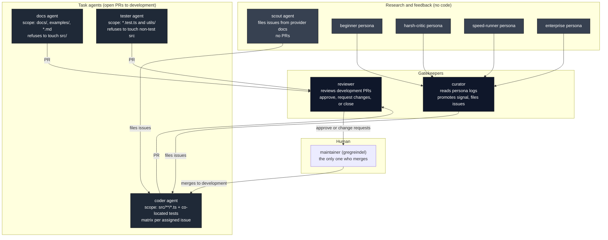

### 8.1. Per-agent contract

| Agent | Trigger source | Reads | Writes | Outputs |
|-------|----------------|-------|--------|---------|
| docs | `agent-run.yml` cron `0 10 * * 2,5` or dispatch | CLAUDE.md, src/index.ts, src/**, docs/**, examples/** | docs/**, *.md, examples/**, log file | One PR titled `docs: update documentation to match current API` against `development`. Files issues with label `bug` if it spots source bugs. |
| tester | `agent-run.yml` cron `0 9 * * 1,4` or dispatch | `npm test` coverage, src/**, existing *.test.ts | new and modified *.test.ts, log file | One PR titled `test: improve test coverage`. May file `bug` issues for findings (and `breaking` if the bug is public-API-shaped). |
| coder | `coder-run.yml` cron `0 8 * * 1,4` or dispatch; one job per unclaimed issue, matrix max 5, `max-parallel: 1` | The assigned issue body, src/**, *.test.ts, CLAUDE.md known issues | src/**/*.ts, *.test.ts, log file | One PR per issue titled `fix: …` or `feat: …`, body includes `Fixes #N`. Posts a plan comment on the issue before coding. |
| scout | `agent-run.yml` cron `0 11 * * 1` or dispatch | src/llm/**, provider documentation URLs, `/tmp/all-issues.json` | Issues only; comments on existing issues when duplicate detected | Zero or more issues with labels `enhancement`, `bug`, `needs-discussion`, or `breaking`. Tags `@gregreindel` for breaking or imminent deprecations. |
| beginner / harsh-critic / speed-runner / enterprise | `personas-run.yml` (random subset by dispatch, all four on cron Sunday) | CLAUDE.md, README.md, docs/, examples/ | log file only | A persona log file with categorized findings (`genuine-bug`, `confusing`, `rough-edge`, `suggestion`). |
| curator | `personas-run.yml` final job (waits for persona matrix) or local `maintain.sh curator` | All persona logs, `/tmp/all-issues.json`, CLAUDE.md | Issues plus comments on existing issues; updates own log | Triaged issues with labels `bug`, `documentation`, `enhancement`, `testing`. |
| reviewer | `agent-review-pr.yml` on `opened` PRs targeting `development` | The PR diff, the PR description, CLAUDE.md | A single `gh pr review` call (approve, request-changes, or close) plus own log | Verdict on the PR. Does not push commits. |
| bot-respond | `bot-respond.yml` on issue or PR comment mentioning `@llm-exe-bot` from OWNER/MEMBER/COLLABORATOR | The comment body and any referenced PR diff | Comments on the issue or PR; if asked to fix, commits and pushes to the existing PR branch (never creates a new PR) | A reply comment; optionally code commits on the existing branch. |
| digest | `agent-digest.yml` Monday cron | Last 7 days of issues, last 20 PRs, recent agent logs, last 3 releases | `/tmp/digest.html` only | HTML body posted via Microsoft Graph to `MARKETING_EMAILS`. |

---

## 9. Workflow Catalog

One detailed entry per file. Each entry includes the inputs, the gate logic, the steps, the outputs, and the side effects. A second-pass replica can copy these exactly.

### 9.1. `agent-run.yml` - Task agents on a schedule

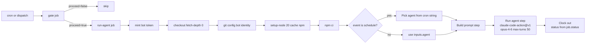

| Field | Value |
|-------|-------|
| Triggers | `workflow_dispatch` with `agent` choice in `docs|tester|coder|scout` and free-form `instructions` string; cron `0 9 * * 1,4` (tester), `0 10 * * 2,5` (docs), `0 11 * * 1` (scout). The coder is NOT scheduled here; it has its own workflow. |
| Concurrency | `agent-${{ inputs.agent || schedule }}`, `cancel-in-progress: false` |
| Permissions | `contents: write`, `pull-requests: write`, `issues: write`, `id-token: write` |
| Timeout | 30 minutes |
| Gate | Same backlog gate described in 7.4. Dispatch bypasses; cron honors. |
| Prompt input | `agent` selects the prompt file; `instructions` is appended verbatim as `## Additional Instructions from Maintainer` and is the only knob a maintainer has to redirect a scheduled run. |
| Output | A new branch `agent/<role>/<date>`, a log file in `scripts/agents/logs/<role>/`, optionally one PR against `development` (docs, tester), optionally one or more issues (scout, or any agent that spots an out-of-scope bug). |
| Downstream triggers | The bot PR fires `tests.yml` and `agent-review-pr.yml`. The bot identity is what makes that possible; the default `GITHUB_TOKEN` would not. |

Cron-to-agent mapping is hard-coded in the `Pick agent for scheduled runs` step:

```
"0 9 * * 1,4"   -> tester    (Mon, Thu)
"0 10 * * 2,5"  -> docs      (Tue, Fri)
"0 11 * * 1"    -> scout     (Mon)
```

### 9.2. `coder-run.yml` - Coder fan-out across open issues

Three jobs: `gate`, `find-issues`, `run-coder` (matrix).

| Field | Value |
|-------|-------|
| Triggers | `workflow_dispatch` (no inputs) and cron `0 8 * * 1,4` |
| Permissions | `contents: write`, `pull-requests: write`, `issues: write`, `id-token: write` |
| Timeout | 30 minutes per matrix leg |

`find-issues` job filters using `gh issue list ... --json number,labels` plus `jq`. The selection rule, in plain English:

1. Candidate issues are those with at least one label in `{bug, enhancement, agent-ok}` and no label in `{breaking, needs-discussion, on-hold}`.
2. Compute a `claimed` set by scanning open bot PRs for `closes #N`, `fixes #N`, or `resolves #N` (case-insensitive) in title or body.
3. Subtract `claimed` from candidates.
4. Cap at 5 issues.

The result is fed to the `run-coder` matrix as `matrix.issue`. The matrix is `max-parallel: 1` so PRs are produced serially and do not collide on branch creation.

Each matrix leg appends an extra block to the prompt:

```
## Assigned Issue
You MUST work on issue #<N>. Do not pick a different issue. Read it with:
gh issue view <N>
```

### 9.3. `personas-run.yml` - Personas plus curator

Four jobs: `gate`, `pick-personas`, `run-persona` (matrix), `run-curator`.

| Field | Value |
|-------|-------|
| Triggers | `workflow_dispatch` with `count` choice (`1|2|3|4`, default `2`); cron `0 6 * * 0` (Sunday) |
| Selection | `pick-personas` shuffles `beginner harsh-critic speed-runner enterprise` and takes `count` of them. Output is a JSON array consumed by the matrix. |
| Persona matrix | `max-parallel: 1`, 20-minute timeout per leg, opus-4-6, 40 turns. Each persona writes only its own log file; it does not commit code. |
| Curator job | Depends on `gate` and `run-persona`. Runs even if some persona matrix legs failed, as long as the matrix was not cancelled: `if: always() && needs.gate.outputs.proceed == 'true' && needs.run-persona.result != 'cancelled'`. The curator reads `scripts/agents/logs/personas/*/` and files GitHub issues. |
| Output | Persona log files committed to `scripts/agents/logs/personas/<persona>/`, one curator log in `scripts/agents/logs/curator/`, and zero or more GitHub issues (with deduplication against `/tmp/all-issues.json`). |

### 9.4. `agent-review-pr.yml` - Reviewer

Three jobs: `tests`, `review`, `decide`. Tests and review run in parallel; decide waits for both.

| Field | Value |
|-------|-------|
| Triggers | `pull_request` `opened` and `synchronize` on `main` or `development` |
| Job filters | `tests`: `base_ref == 'development'` (runs on both opened and synchronize). `review`: `base_ref == 'development' && action == 'opened'` (review only on initial open). `decide`: `always() && base_ref == 'development'` (waits for both). |
| Tests job | Node 18/20/22/24 matrix, mirrors `tests.yml`. Timeout 20m. Runs on opened AND synchronize so re-pushes re-test. |
| Review job | Auth via `llm-exe-review-bot[bot]` App token. `allowed_bots: "llm-exe-bot[bot]"`. Tools: `Bash,Read,Glob,Grep,WebFetch` (read-only). Verdict written to `/tmp/review-verdict.txt` and exposed as job output. Timeout 15m, 30 max-turns. |
| Decide job | Reads review verdict and tests result. Approves only when `verdict == approve AND tests == success`. Uses the review bot token for `--approve` and the regular bot App token only for `gh pr ready`. Only promotes draft to ready for `agent/*` branches. Timeout 5m. |
| Prompt substitutions | `$PR_NUMBER`, `$LOG_FILE`, `$PR_CONTEXT` (bot agent vs human contributor, computed from head_ref prefix). |
| Output | Exactly one of: `gh pr review --approve` (with optional `gh pr ready`), `gh pr review --request-changes`, `gh pr close`. Plus a log file in `scripts/agents/logs/reviewer/`. |

### 9.5. `agent-digest.yml` - Weekly HTML email

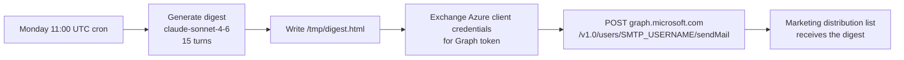

Sources the agent must consult:

```
gh issue list --state all --since "$(date -u -d '7 days ago' +%Y-%m-%dT%H:%M:%SZ)" --limit 50
gh pr list --state all --limit 20
scripts/agents/logs/*/  for the past week
gh release list --limit 3
```

Sections the digest must contain, in order:

- **What shipped** (merged PRs, releases cut)
- **Open PRs** (waiting for review)
- **Issues filed** (new bugs, enhancements, breaking)
- **Agent activity** (per-agent recap from logs)
- **Needs attention** (urgent, blocked, stale)

Body must be HTML fragment (no `<html>` / `<body>` tags) and must be the only thing in `/tmp/digest.html`. The `Send digest email` step JSON-encodes the file via `jq -Rs .`, builds a `toRecipients` array from a comma-separated `MARKETING_EMAILS` secret, and posts to Microsoft Graph with subject `llm-exe weekly digest - <Mon DD>`.

### 9.6. `bot-respond.yml` - Mention responder

| Field | Value |
|-------|-------|
| Trigger | `issue_comment` `created` |
| Filter | Comment body contains `@llm-exe-bot`, comment author is not the bot itself, and author association is `OWNER`, `MEMBER`, or `COLLABORATOR`. Public users cannot summon the bot. |
| Timeout | 20 minutes |
| Tools | Full write set (`Bash,Read,Write,Edit,Glob,Grep,WebFetch,WebSearch`); 30 turns; opus-4-6 |
| Rules baked into the prompt | Two modes: read-only Q-and-A or write-mode revision. Write mode is allowed only on explicit ask. Must check out the existing PR branch with `gh pr checkout <N>`, must push to that branch, must NOT create new PRs or branches, must NOT add `Co-Authored-By` lines, must run `npm test` and `npm run typecheck` before committing. |

### 9.7. `tests.yml` - Jest matrix on PRs

| Field | Value |
|-------|-------|
| Trigger | `pull_request` on `main` or `development`, plus dispatch |
| Bypass | Skip when head ref is `bump-version-branch` (the version-bump PR is auto-generated and intentionally trivial) |
| Matrix | Node 18, 20, 22, 24 |
| Steps | `actions/checkout@v4` -> `actions/setup-node@v4` with `cache: npm` -> reusable cache action -> `npm install` -> `npm run test` -> coverage upload on Node 24 only |

Note: this workflow does not use the App token. It only needs reads.

### 9.8. `test-package.yml` - Real-provider examples test

| Field | Value |
|-------|-------|
| Trigger | `workflow_dispatch` only (PR trigger commented out); dispatch must be authored by `gregreindel` |
| Environment | `Examples Test` |
| Provider keys exposed | OpenAI, Anthropic, Gemini, xAI, DeepSeek (all real keys) |
| Flow | Build package, `npm pack`, extract the tarball into `temp_extract/`, replace `dist/` with the packed `dist/`, then `cd examples && npm install`, then `npm run test-examples` with `NODE_OPTIONS=--max-old-space-size=4096 --experimental-vm-modules`. |

This is the only place real provider keys are used. It exists so the maintainer can prove that a packed artifact actually runs end to end before publishing.

### 9.9. `pack-package.yml` - Build artifact on dev close

| Field | Value |
|-------|-------|
| Trigger | `pull_request` `closed` to `development`, plus dispatch |
| Bypass | Skip the `bump-version-branch` head |
| Output | `actions/upload-artifact@v4` with name `package`, contents `llm-exe-*.tgz`, retention 30 days |

### 9.10. `cache-cleanup.yml` - Actions cache GC

| Field | Value |
|-------|-------|
| Triggers | `pull_request` `closed`, `release` `published`, dispatch with optional `branch` input |
| Auth | App token (cache deletion needs write to Actions) |
| Behavior | Resolves three refs: `pr_ref` (`refs/pull/<N>/merge` on PR events), `branch_ref` (head ref on PR, target commitish on release, input or current ref on dispatch), and `tag_ref` (`refs/tags/<tag>` on release). For each non-empty ref it lists caches with `gh actions-cache list -B <ref> -L 100`, deduplicates keys, and deletes them. The `development` branch is explicitly skipped. |

### 9.11. `update-prs-with-development.yml` - Weekday rebase nudger

| Field | Value |
|-------|-------|
| Trigger | Cron `0 8 * * 1-5` (weekdays) and dispatch |
| Action | For every open PR targeting `development`, call `gh pr update-branch <N>`. Failures (conflicts or already-up-to-date) are silently skipped. |
| Output | Open PRs are kept in lockstep with `development`, so when a developer (or another agent) comes back to a stale PR, they do not face an avalanche of merge conflicts. |

### 9.12. `check-semantic-versioning.yml` - Block stale PRs into main

| Field | Value |
|-------|-------|
| Trigger | `pull_request` on `main` only |
| Check | `package.json .version` must be strictly greater than the latest `^v\d+\.\d+\.\d+$` tag. Compares by converting `X.Y.Z` to `X*1_000_000 + Y*1_000 + Z`. |
| Failure | Exit 1, which blocks the merge until the version is bumped (the `draft-main-pr.yml` workflow handles the bump automatically). |
| Success contract | Emits a success check that other workflows consume by `workflow_run` (`auto-merge-main-pr.yml` listens). |

### 9.13. `draft-main-pr.yml` - Maintains the development -> main PR

This is the most procedural workflow in the repo. It runs on every PR closed to `development` (except the version-bump PR) and on every release published.

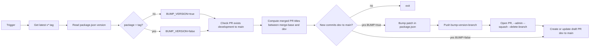

Outputs:

- Always: a fresh or updated draft PR titled `Draft PR for release version v<X.Y.Z>` whose body lists all merged PRs from the dev<->main merge-base to `development`.
- Sometimes: a self-merged `bump-version-branch -> development` PR that bumps `package.json` patch by 1.

PR body truncation: capped at 65000 characters.

### 9.14. `create-draft-release.yml` - Maintains the draft release

| Field | Value |
|-------|-------|
| Trigger | `pull_request` `closed` to `main` (`merged == true`) and dispatch |
| Behavior | Lists every release with `draft == true` and deletes each one via `gh api -X DELETE`. Then reads `package.json .version`, formats `vMAJOR.MINOR.PATCH`, creates a draft release with `generate_release_notes: true`, then cleans the auto-generated body by removing lines matching `chore: bump version`, `Draft PR for release`, `Bump Version on PR to Main` (case-insensitive) and stripping ` by @user in ` attributions. The cleaned body is PATCHed back onto the release. |

### 9.15. `auto-merge-main-pr.yml` - Auto-merge gate

| Field | Value |
|-------|-------|
| Triggers | `workflow_run` on `Enforce release semantic version` completion; `pull_request` `ready_for_review` or `synchronize` on `main` |
| Run filter | `workflow_run` must be `success` and head branch must be `development`; or any pull_request event. |
| Steps | Resolves the open PR with base `main` head `development` that is NOT draft; polls every 30 seconds up to 10 times for non-`auto-merge` checks to settle; if any FAILURE among them, exits 1; otherwise `gh pr merge <N> --merge --admin --repo <owner>/<repo>`. |
| Identity | App token. |

### 9.16. `publish-release.yml` - npm publish on release

| Field | Value |
|-------|-------|
| Triggers | `release` `published` and dispatch |
| Pre-checks | Release must target `main`; dispatch actor must equal `gregreindel`. |
| Build | `npm install` then `npm run build:package`. |
| Publish step | Reads `package.json .version`; if it contains the literal substring `beta`, runs `npm run publish-beta`; otherwise `npm run publish-main`. |
| Failure rollback | `if: failure() && github.event_name == 'release'` patches the release back to `draft: true` and prepends a warning banner with the failed workflow URL. |

### 9.17. `deploy-docs.yml` - VitePress to S3 plus CloudFront

| Field | Value |
|-------|-------|
| Triggers | `release` `published` (must target `main`) and dispatch (must run from `development` or `main`) |
| Auth | OIDC -> assume `vars.AWS_ROLE_DEPLOY_ARN` in `vars.AWS_REGION` |
| Versioning | `PACKAGE_ID = <package.json version>-<unix-timestamp>`; injected into `docs/.env` as `VITE_PACKAGE_ID` so the built site knows its own identifier. |
| Build | `npm run docs:update-providers && npm run docs:build`. Output at `docs/.vitepress/dist`. |
| Ship | Copy to `s3://<bucket>/docs/<PACKAGE_ID>/`. Pull current CloudFront distribution config, set `.Origins.Items[0].OriginPath = "/docs/<PACKAGE_ID>"`, update with the captured ETag, invalidate `/*`. |

---

## 10. End-to-End Data Flows

### 10.1. The agent run object model (one run)

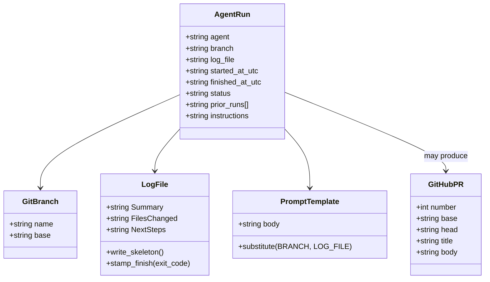

### 10.2. Persona -> Issue -> Coder -> PR -> Reviewer -> Maintainer

This is the canonical full circuit through the system.

```mermaid
sequenceDiagram
    autonumber
    participant Cron as personas-run cron (Sunday 06:00 UTC)
    participant Beg as beginner persona
    participant Crit as harsh-critic persona
    participant Spd as speed-runner persona
    participant Ent as enterprise persona
    participant Cur as curator
    participant GH as GitHub Issues
    participant Crn as coder-run cron (Mon/Thu 08:00 UTC)
    participant Cdr as coder agent
    participant CR as bot PR
    participant Tests as tests.yml
    participant Rev as reviewer agent
    participant Maint as maintainer

    Cron->>Beg: launch
    Cron->>Crit: launch
    Cron->>Spd: launch
    Cron->>Ent: launch
    Beg->>Beg: write log file with findings
    Crit->>Crit: write log file
    Spd->>Spd: write log file
    Ent->>Ent: write log file
    Cron->>Cur: run after persona matrix
    Cur->>Cur: read all persona logs
    Cur->>GH: gh issue create with dedup against /tmp/all-issues.json
    Crn->>Cdr: select up to 5 unclaimed issues
    Cdr->>GH: gh issue view N
    Cdr->>GH: post plan comment on issue N
    Cdr->>Cdr: implement fix + tests
    Cdr->>Cdr: npm test, typecheck, lint
    Cdr->>CR: gh pr create --base development title fix: ... body Fixes #N
    CR->>Tests: triggers tests.yml matrix (Node 18, 20, 22, 24)
    CR->>Rev: triggers agent-review-pr.yml on opened
    Rev->>Rev: read PR diff, CLAUDE.md, conventions
    Rev->>GH: gh pr review --approve OR --request-changes OR gh pr close
    Maint->>GH: merges PR to development
    Note over Maint, GH: triggers draft-main-pr and pack-package; agent-digest will mention it on Monday
```

### 10.3. Log feedback loop

Every agent reads the last three logs of its role before writing the new one. Logs are committed to the repo because they must persist across runs.

```mermaid
flowchart LR
    A[scripts/agents/logs/coder/2026-05-10.md] -->|cat| P[/tmp/agent-prompt.txt]
    B[scripts/agents/logs/coder/2026-05-11.md] -->|cat| P
    C[scripts/agents/logs/coder/2026-05-13.md] -->|cat| P
    P --> R[Claude reads under ## Prior Runs]
    R --> N[New file: scripts/agents/logs/coder/2026-05-14.md]
    N -->|next run| L[becomes input to next run's prior context]
```

---

## 11. Release Pipeline

The release pipeline is six workflows in a linear chain with a few human gates. Read it as six stages.

### 11.1. Happy path

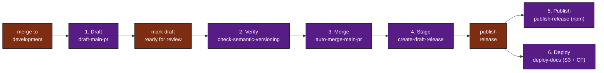

### 11.2. Stages, in plain text

| Stage | Trigger | What it does | What can fail it |
|-------|---------|--------------|------------------|
| 1. Draft | PR closed to `development` OR release published | Patch-bumps `package.json` if behind; creates or updates the draft PR from `development` to `main`. | No new commits to draft over, body exceeds 65000 chars. |
| 2. Verify | PR on `main` | Blocks if `package.json .version` is not strictly greater than the latest `v*` tag. | Version not bumped. |
| 3. Merge | `workflow_run` on stage 2 success, or PR sync on `main` | Polls non-`auto-merge` checks (up to 10 x 30s), then `gh pr merge --admin`. | Any non-`auto-merge` check fails. |
| 4. Stage | PR merged to `main` | Wipes existing drafts, creates a fresh draft release with cleaned auto-notes. | Empty draft list is OK; PATCH failure logs a warning only. |
| 5. Publish | release published, target `main` | `npm publish` (beta or main script chosen by version string). Provenance via OIDC. | Wrong branch, wrong actor (only `gregreindel`), npm error. |
| 6. Deploy | release published, target `main` | Builds VitePress docs, ships to S3, rotates CloudFront OriginPath, invalidates `/*`. | Branch guard, OIDC denied, stale ETag on CloudFront. |

### 11.3. Failure paths

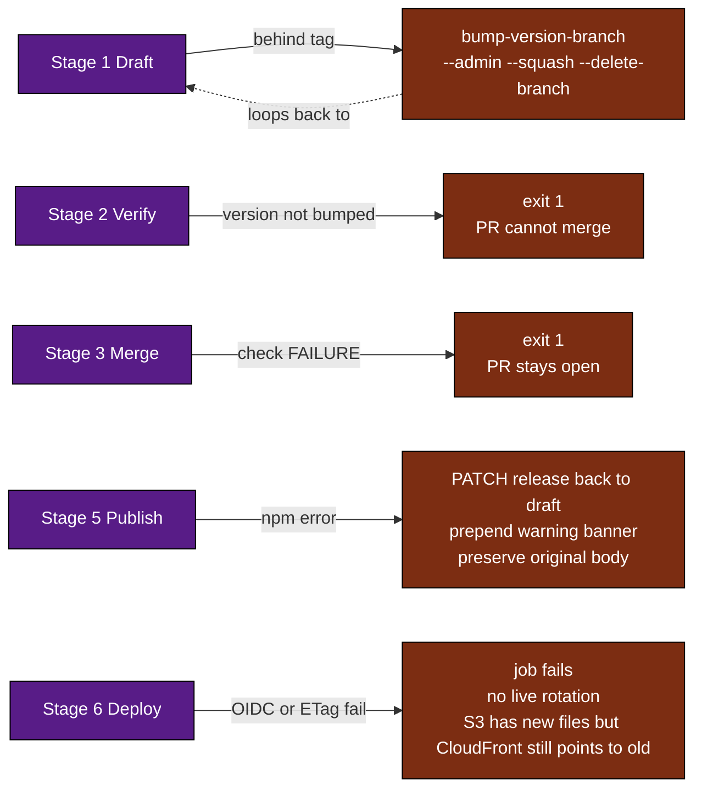

Version increment rules, summarized from `draft-main-pr.yml` and `check-semantic-versioning.yml`:

1. `package.json .version` is the source of truth.
2. `draft-main-pr.yml` patch-bumps automatically when commits accumulate on `development` without a corresponding version bump.
3. The maintainer manually edits `package.json` to bump minor or major (semver decision lives with the human, never the agents).
4. `check-semantic-versioning.yml` blocks any PR into `main` whose `package.json` is not strictly ahead of the latest tag.

---

## 12. Persona to Issue to PR Pipeline

This is a zoom-in on the highest-leverage agent loop in the repo: turning fresh-user friction into shipped fixes.

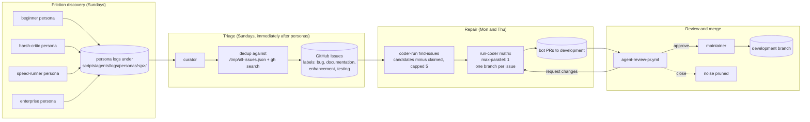

Distinctive design points worth replicating:

- The curator never edits code; only the coder does. This separation makes the curator a cheap, high-judgment filter (40 turns of sonnet-grade reasoning) and the coder a focused, code-only worker.
- The coder cannot pick its own issue when running scheduled; the workflow file picks for it via `find-issues`. This eliminates a class of "agent wandered off" failures.
- `agent-ok` is a maintainer-controlled label that whitelists an issue for the coder even if its other labels are ambiguous.
- The dedup procedure in the curator and scout prompts (search `/tmp/all-issues.json` AND `gh search issues`, "when in doubt, comment, don't create") is non-negotiable and the agents are told to log their searches so duplicates are auditable.

---

## 13. Replication Recipe

If you wanted to clone this system into a different repository, here is the exact sequence. Each step is concrete and assumes you start from an empty repository.

### 13.1. One-time setup

1. **Create a GitHub App** for the repo (or org). Permissions: contents:write, pull-requests:write, issues:write, actions:write, id-token:write, metadata:read. Install on the target repository. Save the App ID and download the private key PEM.
2. **Store secrets** at repo level: `APP_ID`, `APP_PRIVATE_KEY`, `CLAUDE_CODE_OAUTH_TOKEN`. If you want the digest, also `AZURE_TENANT_ID`, `AZURE_CLIENT_ID`, `AZURE_CLIENT_SECRET`, `SMTP_USERNAME`, `MARKETING_EMAILS`. If you want `test-package.yml`, also the per-provider API keys.
3. **Store variables** if you want docs deploy: `AWS_ROLE_DEPLOY_ARN`, `AWS_REGION`, `AWS_S3_BUCKET`, `AWS_CLOUDFRONT_DISTRIBUTION_ID`.
4. **Pick two branches**: `development` (default) and `main`. Protect `main` so only the auto-merge workflow can write.
5. **Set the default branch to `development`** in repo settings.

### 13.2. Scaffold the files

Create the directory tree shown in Section 6. The key invariants:

- `scripts/agents/config.sh` must be executable (`chmod +x`).
- `scripts/agents/logs/<role>/` directories should be committed even when empty (use `.gitkeep`) so the agents have somewhere to write on the first run.
- Prompt files must use the literal substitution markers `$BRANCH`, `$LOG_FILE`, `$PR_NUMBER`, and `$PERSONA` so the `sed` step in each workflow can replace them.

### 13.3. Author the prompts

Each prompt has the same shape:

1. **Persona statement.** One paragraph that establishes the agent's voice and stakes ("You are the test agent..." / "You are the gatekeeper...").
2. **Scope block.** Explicit yes/no boundaries with directory globs. Agents that cross scope get their PRs closed by the reviewer.
3. **Pacing.** "A few items per run. You will run again." This prevents agents from spending the entire time budget on one task.
4. **Numbered steps.** End to end, every command spelled out. Include the `gh` commands verbatim so the agent does not invent flags.
5. **Output rules.** What to put in the PR title, what to put in the body, what label to apply, and which milestone to attach.
6. **Run Log section.** The agent must rewrite the Summary, Files Changed, and Next Steps in `$LOG_FILE`. This is the only required write outside the scope.

For task agents that open PRs, always end with:

```
git push -u origin $BRANCH
gh pr create --base development --title '...' --body '...'
```

### 13.4. Configure cron cadences thoughtfully

Stagger crons so no two agents fight for the same backlog gate window. The current cadence:

| Day (UTC) | 06:00 | 08:00 | 09:00 | 10:00 | 11:00 |
|-----------|-------|-------|-------|-------|-------|
| Sunday | personas + curator | | | | |
| Monday | | coder, update-prs | tester | | scout, digest |
| Tuesday | | update-prs | | docs | |
| Wednesday | | update-prs | | | |
| Thursday | | coder, update-prs | tester | | |
| Friday | | update-prs | | docs | |

### 13.5. Wire the action

In every agent workflow, the call looks like this (use as a literal template):

```yaml
- name: Run agent
  uses: anthropics/claude-code-action@v1
  with:
    claude_code_oauth_token: ${{ secrets.CLAUDE_CODE_OAUTH_TOKEN }}
    github_token: ${{ steps.bot-token.outputs.token }}
    display_report: "false"
    prompt: |
      Read the file /tmp/agent-prompt.txt for your full instructions. Follow them exactly.
    claude_args: |
      --allowedTools "<comma-separated tool list>"
      --max-turns <int>
      --model claude-opus-4-6
```

For the reviewer, pass the dedicated review-bot token as `github_token` and also pass `allowed_bots: "<your-work-bot>[bot]"` so the action does not refuse to operate on bot-authored PRs.

### 13.6. Bake in the backlog gate

Every long-running agent workflow should share this gate job. The cap numbers (20 bot PRs, 40 open issues) are tunable but the structure should not change:

```yaml
gate:
  runs-on: ubuntu-latest
  outputs:
    proceed: ${{ steps.check.outputs.proceed }}
  steps:
    - uses: actions/create-github-app-token@v1
      id: bot-token
      with:
        app-id: ${{ secrets.APP_ID }}
        private-key: ${{ secrets.APP_PRIVATE_KEY }}
    - id: check
      env:
        GH_TOKEN: ${{ steps.bot-token.outputs.token }}
      run: |
        if [ "${{ github.event_name }}" = "workflow_dispatch" ]; then
          echo "proceed=true" >> "$GITHUB_OUTPUT"; exit 0
        fi
        bot_prs=$(gh pr list --repo ${{ github.repository }} --state open --author "app/<your-bot>" --limit 200 --json number -q 'length')
        issues=$(gh issue list --repo ${{ github.repository }} --state open --limit 200 --json number -q 'length')
        if [ "$bot_prs" -gt 20 ] || [ "$issues" -gt 40 ]; then
          echo "proceed=false" >> "$GITHUB_OUTPUT"
        else
          echo "proceed=true" >> "$GITHUB_OUTPUT"
        fi
```

### 13.7. Test the system end to end

Order of manual verifications, from cheapest to most invasive:

1. Run `./scripts/maintain.sh docs` locally. Confirm a branch and log file are created.
2. From the Actions tab, dispatch `agent-run.yml` with `agent: docs` and short `instructions`. Confirm a PR is opened by the bot.
3. Confirm `agent-review-pr.yml` fires automatically on that PR.
4. Merge the PR. Confirm `draft-main-pr.yml` updates the development to main draft.
5. Dispatch `personas-run.yml` with `count: 1`. Confirm one persona log appears, then the curator runs.
6. Wait for the next Monday digest, or dispatch it manually. Confirm the email arrives.

### 13.8. Operating the system

| Operation | How |
|-----------|-----|
| Pause a single agent | Comment out its cron line in `agent-run.yml` (or `coder-run.yml` / `personas-run.yml`) and push to `development`. Manual dispatch still works. |
| Pause all agents | Lower the backlog caps to 0 in the gate job. Cron runs will skip; dispatch will still work for testing. |
| Replay a failed run | Dispatch the workflow with the same inputs. The agent will read its previous log under Prior Runs and decide whether to retry. |
| Investigate a misbehaving agent | Read its latest log under `scripts/agents/logs/<role>/`. Cross-reference with the Actions run logs. |
| Update an agent's instructions permanently | Edit the prompt file under `scripts/agents/prompts/`. Changes take effect on the next scheduled or dispatched run. |
| Temporarily redirect a scheduled run | Use the `instructions` input on the next dispatch; it is appended verbatim as `## Additional Instructions from Maintainer` and overrides nothing but adds priority. |

---

## Appendix A: Variable substitution glossary

| Marker | Replaced by | Used in |
|--------|-------------|---------|
| `$BRANCH` | The branch created by `create_agent_branch` (e.g. `agent/coder/2026-05-14-issue-42`) | All task agent prompts (`docs`, `tester`, `coder`, `curator`) |
| `$LOG_FILE` | Absolute path to the run log (e.g. `scripts/agents/logs/coder/2026-05-14T11-15-48.md`) | All agent prompts |
| `$PR_NUMBER` | The PR number being reviewed | `reviewer.md` |
| `$PERSONA` | Verbatim contents of `prompts/personas/<persona>.md` | `_persona.md` only |

The substitution is a literal `sed` replace, not a templating engine. Do not put characters that conflict with `sed`'s delimiter in the values; the workflows use `|` as the delimiter for that reason.

## Appendix B: Reusable composite actions

`.github/actions/setup-node/action.yml`:
```yaml
name: "Setup Node.js environment"
description: "Setup Node.js environment"
runs:
  using: "composite"
  steps:
    - uses: actions/setup-node@v4
      with:
        node-version: 24.x
        registry-url: 'https://registry.npmjs.org'
```

`.github/actions/cache/action.yml`:
```yaml
name: 'Cache npm dependencies and node modules'
description: 'Cache npm dependencies and node modules'
runs:
  using: 'composite'
  steps:
    - uses: actions/cache@v4
      with:
        path: ~/.npm
        key: ${{ runner.os }}-node-${{ matrix.node-version }}-${{ hashFiles('**/package.json') }}
        restore-keys: |
          ${{ runner.os }}-node-${{ matrix.node-version }}-
    - uses: actions/cache@v4
      with:
        path: node_modules
        key: ${{ runner.os }}-nodeModules-${{ matrix.node-version }}-${{ hashFiles('**/package.json') }}
        restore-keys: |
          ${{ runner.os }}-nodeModules-${{ matrix.node-version }}-
```

Note: `cache/action.yml` references `matrix.node-version`. It only makes sense when used inside a matrixed job (like `tests.yml`). Calling it from a non-matrix job results in an empty matrix variable and a cache key the runner accepts but that will not hit on subsequent runs.

## Appendix C: Why these choices

A handful of design decisions are easy to miss and expensive to relearn.

1. **Bot identity over default token.** The default `GITHUB_TOKEN` cannot trigger other workflows. The agent loop depends on the bot's PR firing `tests.yml` and `agent-review-pr.yml`. Without the App-minted token, the chain breaks silently.
2. **`max-parallel: 1` on coder matrix.** Branch creation in `create_agent_branch` is not concurrency-safe: it checks out `development`, pulls, then creates a new branch. Two coder legs in parallel would race on the working tree. Serializing the matrix is cheaper than restructuring the helper.
3. **Logs committed to the repo.** They are the only durable cross-run memory. Workflow artifacts expire; a committed log survives a year later and is part of the prompt context for the next run.
4. **Backlog gate as a hard cap.** Without it, a stuck reviewer or a flood of persona findings can compound into hundreds of open bot artifacts. The gate makes the system self-quieting.
5. **Reviewer tool allowlist excludes Write and Edit.** The reviewer expresses verdicts through `gh` over Bash and nothing else. Removing `Write` and `Edit` makes it physically impossible for the reviewer to scope-creep into rewriting the PR it is supposed to evaluate.
6. **Curator does not read source code.** The curator's prompt explicitly forbids investigating source; it operates only on persona log files plus the issue list. This keeps the curator cheap and prevents it from inventing findings the personas did not actually hit.
7. **Personas write only log files; they do not file issues.** This is a separation-of-powers move. The curator gets a normalized, deduplicated view; the personas get to be candid (including wrong) without polluting the issue tracker.

End of document.
