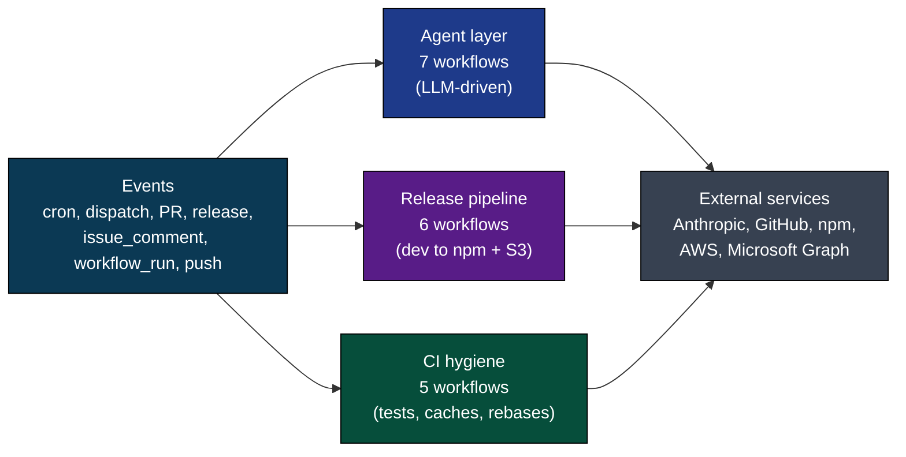

# Automation Vitals

**Live state of the llm-exe automation system**

[Workflow source](.github/workflows/vitals.yml) ·
[Generator](.github/vitals/generate.sh) ·
[Deep dive](.github/docs/VITALS_DEEP_DIVE.md) ·
[Architecture](.github/docs/WORKFLOW_ARCHITECTURE.md) ·
[All workflows](.github/docs/WORKFLOWS_INDEX.md)

> [!NOTE]
> **Sample preview.** This file is committed in its initial state so reviewers can see the layout. The first scheduled or dispatched run of [.github/workflows/vitals.yml](.github/workflows/vitals.yml) replaces it with live values from `gh` and the committed agent logs.

> [!IMPORTANT]
> Do not edit this file manually. Changes are overwritten on the next vitals run. See [.github/docs/VITALS_DEEP_DIVE.md](.github/docs/VITALS_DEEP_DIVE.md) for the full design.

---

## At a glance

---

## Workflow status

<strong>All 19 workflows on the development branch</strong> (click to collapse)

> [!NOTE]
> Newly added workflows (`vitals`, `docs-sync`) show `NOT FOUND` from shields.io until this branch merges to `development` and their first run completes. Existing workflows render their real status.

| Workflow | Status |
|----------|--------|
| [agent-digest](.github/workflows/agent-digest.yml) |  |
| [agent-review-pr](.github/workflows/agent-review-pr.yml) |  |
| [agent-run](.github/workflows/agent-run.yml) |  |
| [auto-merge-main-pr](.github/workflows/auto-merge-main-pr.yml) |  |
| [bot-respond](.github/workflows/bot-respond.yml) |  |
| [cache-cleanup](.github/workflows/cache-cleanup.yml) |  |
| [check-semantic-versioning](.github/workflows/check-semantic-versioning.yml) |  |
| [coder-run](.github/workflows/coder-run.yml) |  |
| [create-draft-release](.github/workflows/create-draft-release.yml) |  |
| [deploy-docs](.github/workflows/deploy-docs.yml) |  |
| [docs-sync](.github/workflows/docs-sync.yml) |  |
| [draft-main-pr](.github/workflows/draft-main-pr.yml) |  |
| [pack-package](.github/workflows/pack-package.yml) |  |
| [personas-run](.github/workflows/personas-run.yml) |  |
| [publish-release](.github/workflows/publish-release.yml) |  |
| [test-package](.github/workflows/test-package.yml) |  |
| [tests](.github/workflows/tests.yml) |  |
| [update-prs-with-development](.github/workflows/update-prs-with-development.yml) |  |
| [vitals](.github/workflows/vitals.yml) |  |

---

## Agent activity (last 7 days)

<strong>Run counts and last status per agent</strong>

| Agent | Runs | Most recent status |
|-------|------|--------------------|
| coder | (pending first run) | (pending first run) |
| curator | (pending first run) | (pending first run) |
| docs | (pending first run) | (pending first run) |
| docs-sync | (pending first run) | (pending first run) |
| personas/beginner | (pending first run) | (pending first run) |
| personas/enterprise | (pending first run) | (pending first run) |
| personas/harsh-critic | (pending first run) | (pending first run) |
| personas/speed-runner | (pending first run) | (pending first run) |
| reviewer | (pending first run) | (pending first run) |
| tester | (pending first run) | (pending first run) |

---

## Health checks

> [!TIP]
> Live health checks will populate on the first vitals run. The script wraps every `gh` call with a fallback so transient API failures degrade to neutral values rather than crashing.

- (pending first run) Awaiting first execution of the vitals generator.

---

## Release status

| Field | Value |
|-------|-------|
| **Latest published** | (pending first run) |
| **Next release queue** | (pending first run) |

---

### Quick links

[Workflow index](.github/docs/WORKFLOWS_INDEX.md) ·
[Architecture](.github/docs/WORKFLOW_ARCHITECTURE.md) ·
[Agent runtime](.github/docs/AGENT_RUN_DEEP_DIVE.md) ·
[Docs-sync](.github/docs/DOCS_SYNC_DEEP_DIVE.md) ·
[Vitals](.github/docs/VITALS_DEEP_DIVE.md)

